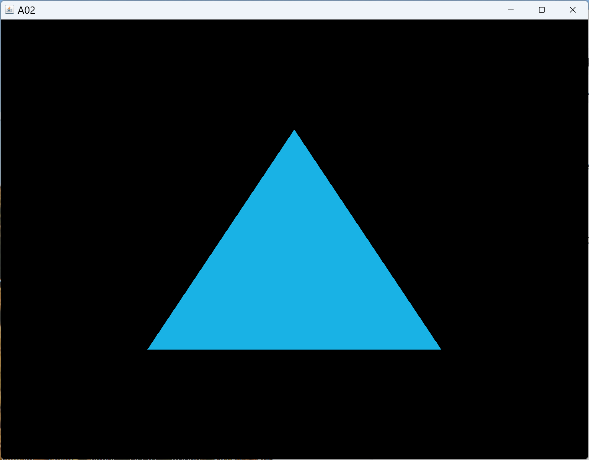
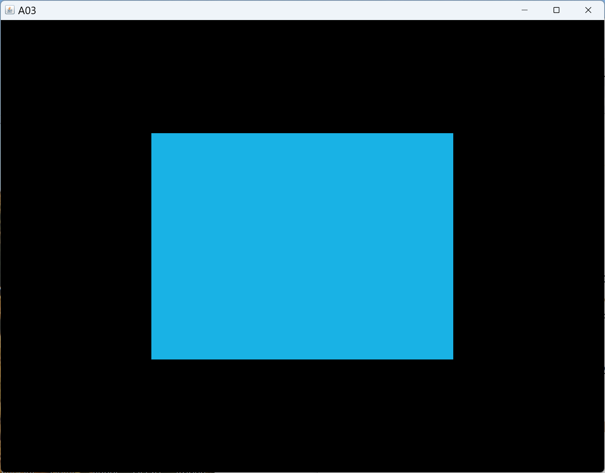
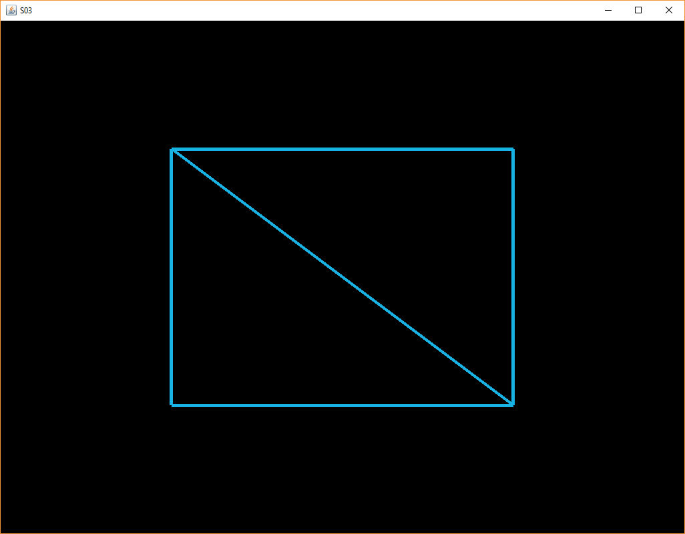

[main menu](../README.md)

# Chapter 2. Rendering triangles

You will need to install JOGL before you can do any practical work. Appendix A 'Installing JOGL' describes how to do this.

This chapter is composed of three main sections:

1. [Creating a drawing surface](ch2_1.md)
2. [Drawing a triangle](ch2_2.md)
3. [Element Buffer Objects](ch2_3.md)

Section 2.1 is specific to Java and requires some knowledge of how to build an interface using the Java Swing classes. If you have not used these before, it would be useful to work through [Oracle's Java tutorial on Swing](https://docs.oracle.com/javase/tutorial/uiswing/index.html). The aim of thios section is to make sure JOGL is linking correctly and that a drawing surface can be created. The result is a window displaying a black rectangle!!

   
  <strong>Figure 2.1.</strong> A single triangle.

[This is a comment that will be hidden.]: # 

Section 2.2 focuses on how to draw a single 2D triangle on the drawing surface created in Section 2.1. The aim is to first use a simple triangle to understand all the 'housekeeping' that comes with writing an OpenGL program, i.e. transferring data from the CPU to the GPU and instructing the GPU to use that data. We will move on to 3D shapes in a later chapter. Initially, the focus will be on using a single colour for the triangle (Figure 2.1). Later we will look at multiple colours. We will refer to this process as 'rendering' the triangle and call the method that does the rendering 'render', accordingly. In later chapters, the term will have more meaning when we look at how to shade the surface of a triangle with respect to its relative position to a light source (or light sources) in 3D space. For now, we will ignore light sources and just fill in the triangle with a single colour.

  &nbsp; 
  <strong>Figure 2.2.</strong> (a) Two triangles; (b) The edges of two triangles.

Section 2.3 introduces Element Buffer Objects, which make it easier to manipulate and render multiple triangles. Figure 2.2 shows two triangles used to make a rectangle. The program in Section 2.3 could easily be adapted to draw many triangles. In later chapters, we will build on this idea to render complex 3D scenes.

# notes (leave for now)

- A01.java - open an empty window
- A02.java - draw a 2D triangle using vertex list 
- A03.java - draw two 2D triangles using indices to the vertex list 

[main menu](../README.md)
