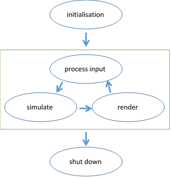

[back](ch2.md) | [main menu](../README.md)
 
## 2.1 Creating a drawing surface

The aim of this starting program is to run through the Java Swing code needed to open a window and create a drawing surface. Program Listings 2.1-2.3 (A01.java) open a window and attach an OpenGL canvas and event listener. Nothing is drawn on the canvas area at this stage (Figure 2.4). However, this program can be used to check that you have set up the relevant system programming environment paths for JOGL (see Appendix A) and thus the program compiles and runs. We'll use this program to explain some of the housekeeping associated with setting up a window - this code will appear in many of your future programs. (Note: the download files - A01.java and A01_GLEventListener.java - have some extra explanatory comments in the code.)

<p align="center">
  <br>
  <strong>Figure 2.4.</strong> A blank screen
</p>

---

###  2.1.1 Importing Java packages

First, a number of packages need to be imported (see Program Listing 2.1). These give access to the OpenGL API and also the standard Java routines for creating a window and detecting events on that window (e.g. the window closing event, triggered, for example, in Microsoft Windows by clicking on the cross at the right end of the window title bar). If you don't know how to use Java AWT and Java Swing, then you will need to do some background reading, as I will be focussing on the OpenGL aspects. For now, you can just reuse the same code in each of your programs.

```java
import java.awt.BorderLayout;
import java.awt.Dimension;
import java.awt.event.WindowAdapter;
import java.awt.event.WindowEvent;
import javax.swing.JFrame;
import com.jogamp.opengl.GLAutoDrawable;
import com.jogamp.opengl.GLCapabilities;
import com.jogamp.opengl.GLProfile;
import com.jogamp.opengl.GLEventListener;
import com.jogamp.opengl.awt.GLCanvas;
import com.jogamp.opengl.util.FPSAnimator;

public class A01 extends JFrame {
  // ...
}
```

**Program Listing 2.1:** Part of [A01.java](/ch2/A01.java): Importing packages


I have separately listed individual classes in the import statements. An alternative is to use `java.awt.*` and `java.awt.event.*` and `com.jogamp.opengl.*` and `com.jogamp.opengl.util.*` and so on. The use of the wildcard `.*` will mean that the compiler will then decide which classes need to be imported based on the rest of the program code in this file.

To create the window, we use Java Swing's `JFrame` class. The main class `A01` extends the `JFrame` class, so the code to create the frame is inherited when the constructor is called (see Program Listing 2.2).

```java
public class A01 extends JFrame {
  private static final int WIDTH = 1024;
  private static final int HEIGHT = 768;
  private static final Dimension dimension = new Dimension(WIDTH, HEIGHT);
  
  private GLCanvas canvas;
  private A01_GLEventListener glEventListener;
  
  private final FPSAnimator animator;
  
  public static void main(String[] args) {
    A01 f = new A01("A01");
    f.getContentPane().setPreferredSize(dimension);
    f.pack();
    f.setVisible(true);
  }
  
  public A01(String textForTitleBar) {
    // ...
  }
```

**Program Listing 2.2:** Part of [A01.java](/ch2/A01.java): Creating a Frame

A number of private attributes are declared in the `A01` class. One static attribute is the dimensions of the window that will be created. One is the `canvas` which will be drawn on. A third, `animator`, will be used to create a display loop, i.e. a loop that is executed n times per second to display whatever needs to be drawn (see more detail later). `glEventListener` will be explained later. The main entry point to the class creates an instance of the `A01` class (i.e. a frame), sets its size, uses `pack` to make sure that all the contents of the frame are at or above their preferred sizes, and then makes the frame visible.

 The `A01` constructor is given in Program Listing 2.3. This sets certain parameters and adds widgets and listeners to the frame (i.e. the window). Line 2 sets the text displayed in the title bar using the superclass. The rest of the code is explained in the following sections.

```java
public A01(String textForTitleBar) {                     // line 1
  super(textForTitleBar);                                // line 2
  GLCapabilities glcapabilities                          // line 3
    = new GLCapabilities(GLProfile.get(GLProfile.GL3));  // line 4
  canvas = new GLCanvas(glcapabilities);                 // line 5
  glEventListener = new A01_GLEventListener();           // line 6
  canvas.addGLEventListener(glEventListener);            // line 7
  getContentPane().add(canvas, BorderLayout.CENTER);     // line 8
  addWindowListener(new WindowAdapter() {                // line 9
    public void windowClosing(WindowEvent e) {           // line 10
      animator.stop();                                   // line 11
      remove(canvas);                                    // line 12
      dispose();                                         // line 13
      System.exit(0);                                    // line 14
    }                                                    // line 15
  });                                                    // line 16
  animator = new FPSAnimator(canvas, 60);                // line 17
  animator.start();                                      // line 18
}                                                        // line 19
```

**Program Listing 2.3:** The A01 constructor

---

### 2.1.2 A drawing surface

Lines 3 and 4 of Program Listing 2.3 specify the capabilities of the OpenGL rendering context (*). We're initialising these with the OpenGL 3.x profile. Table 2.1 gives details of the different profiles. OpenGL continues to evolve, with new versions adding functionality and even deprecating functionality. New functionality may only be available on certain hardware, and it must be possible to continue to use existing hardware. Thus, a programmer must be given control over which version of OpenGL to use. This is done using `GLProfile`.

| OpenGL versions |   |
| --------------- | - |
| 1.0-1.5 | Fixed function pipeline |
| 2.0-2.1 | Support for programmable shaders</td>
| 3.0 | Adopts deprecation model (fixed function deprecated), but retains backward compatibility |
| 3.x | Fixed function pipeline and associated functions removed (but can be accessed using a compatibility context) |
| 4.x | Geometry and tessellation shaders |
| ES 1.x | Fixed-function version (stripped down) |
| ES 2.x | Programmable shader version |
| ES 3.x | Geometry and tessellation shaders |
          
**Table 2.1.** OpenGL versions - see [relation to JOGL](http://jogamp.org/jogl/doc/Overview-OpenGL-Evolution-And-JOGL.html). (ES = embedded systems)

(* From the [JOGL site: class GLContext](http://jogamp.org/deployment/jogamp-next/javadoc/jogl/javadoc/): "In order to perform OpenGL rendering, a context must be 'made current' on the current thread. OpenGL rendering semantics specify that only one context may be current on the current thread at any given time, and also that a given context may be current on only one thread at any given time. Because components can be added to and removed from the component hierarchy at any time, it is possible that the underlying OpenGL context may need to be destroyed and recreated multiple times over the lifetime of a given component. This process is handled by the implementation, and the GLContext abstraction provides a stable object which clients can use to refer to a given context.")

Line 5 in Program Listing 2.3 creates the `GLCanvas` on which all OpenGL drawing will occur, and this is added to the centre of the frame on line 8 - we'll come back to lines 6 and 7 in a short while.
  
(Note: A `GLCanvas` is an implementation of the interface `GLAutoDrawable` which is a subinterface of `GLDrawable`, which is the abstraction of the OpenGL rendering target. The `GLDrawable` or `GLAutoDrawable` maintains the rendering context. In other words, the GLCanvas, which is the implementation, maintains the context. If a `GLAutoDrawable` is used, the context is automatically created. We'll use a `GLAutoDrawable` in our programs - see `A01_GLEventListener.java` in the next section).

### Summarising:

1. Choose GL Profile
2. Configure `GLCapabilities`
3. Create `GLCanvas` (implementation of `GLAutoDrawable`), which automatically creates the OpenGL context
4. Add the `GLCanvas` to the `JFrame` (i.e. the window).

---

### 2.1.3 GLEventListener

Lines 6 and 7 are important lines:

```java
glEventListener = new A01_GLEventListener();
canvas.addGLEventListener(glEventListener);
```

These lines create a new instance of the class `A01_GLEventListener` and add it to the canvas. Practically, this means that the canvas will respond to four particular GL events. The four events that it will respond to are (i) to initialise the OpenGL context; (ii) to do something when the window is resized by the user; (iii) to display the result of some OpenGL commands on the canvas - the display event can be triggered in a number of ways - see Section 2.1.5; (iv) to dispose of any memory that has been used whilst dealing with OpenGL on the GPU. Further details about the class `A01_GLEventListener` are given on Section 2.1.7.

Program Listing 2.3 is repeated here for convenience.

```java
public A01(String textForTitleBar) {                     // line 1
  super(textForTitleBar);                                // line 2
  GLCapabilities glcapabilities                          // line 3
    = new GLCapabilities(GLProfile.get(GLProfile.GL3));  // line 4
  canvas = new GLCanvas(glcapabilities);                 // line 5
  glEventListener = new A01_GLEventListener();           // line 6
  canvas.addGLEventListener(glEventListener);            // line 7
  getContentPane().add(canvas, BorderLayout.CENTER);     // line 8
  addWindowListener(new WindowAdapter() {                // line 9
    public void windowClosing(WindowEvent e) {           // line 10
      animator.stop();                                   // line 11
      remove(canvas);                                    // line 12
      dispose();                                         // line 13
      System.exit(0);                                    // line 14
    }                                                    // line 15
  });                                                    // line 16
  animator = new FPSAnimator(canvas, 60);                // line 17
  animator.start();                                      // line 18
}                                                        // line 19
```

**Program Listing 2.3:** The A01 constructor

---

### 2.1.4 A window listener

Lines 9-16 of Program Listing 2.3 add a window listener to the frame using an [anonymous inner class](http://docs.oracle.com/javase/tutorial/java/javaOO/innerclasses.html). Suffice to say, this handles the closing of the window when, in, for example, Microsoft Windows, the user selects the cross at the right of the title bar for a window. Some clean-up operations are also carried out. We'll skip over the details of this code, and accept it as 'boilerplate' code.

---

### 2.1.5 Animation

Lines 17 and 18 in Program Listing 2.3 create a JOGL `FPSAnimator` instance and attach it to the canvas. The parameters specify that the canvas should redraw at 60 frames per second (i.e. a display method is called 60 times per second). (Here, I use the word 'frame' to signify one scene render in an animation loop and this should not be confused with the use of the `Frame` for the window.) The `FPSAnimator` is part of the package `com.jogamp.opengl.util.*` which is why it is imported at the start of the program (in Program Listing 2.1).

---

### 2.1.6 A rendering loop

At this point we are now ready to write the rendering code for the program. Figure 2.5 summarises the render loop for a real-time rendering process. The alternative is offline rendering where the rendering of a single image is typically initiated by a user interaction and can take seconds, minutes, hours or even days. For real-time rendering, input from the user, the simulation update process and the rendering of the data to create an image must all finish within the allotted time. So, if an `FPSAnimator` is set at 60 frames per second, then the update and render must take less than approximately 17ms. It is this fight against time that leads to research into techniques to simulate and render efficiently.

<p align="center">
  <br>
  <strong>Figure 2.5.</strong> Summary of rendering loop
</p>

In Figure 2.5, 'process input' deals with user input, e.g. mouse or keyboard presses in the interface, perhaps to change the position of the virtual camera that is being used to view the 3D world. 'Simulate' means that the 3D world is updated in some way. This could be one of many things, or even multiple things at the same time, such as changing the value of a simple variable, updating object geometry, checking for collisions between objects applying physics, etc. Finally, 'render' draws the objects, producing an on-screen image for the particular camera viewpoint.

---

### 2.1.7 Rendering a blank screen!!   

Program Listing 2.4 gives the details of `A01_GLEventListener.java`. Four of its methods must be included - `init`, `reshape`, `display` and `dispose` - because it implements the `GLEventListener` interface, which specifies that these methods must be provided. The constructor for the class is empty - we don't need it for anything at this stage. It is there because I chose to implement the `GLEventListener` interface as a separate class, `A01_GLEventListener`. An alternative would have been for the class `A01` to implement `GLEventListener`, with the methods `init`, `reshape`, `display` and `dispose` defined in `A01.java`. However, I felt that it was better to put the code for handling GL events into a separate class to reduce the clutter of code in `A01.java`. Thus, we have a constructor that does nothing in `A01_GLEventListener`.

Method `init` is used, as its name suggests, to set up certain attributes in the OpenGL context. The parameter `drawable` is automatically supplied by the system when `init` is called, which automatically happens when the `GLEventListener` is created. We thus use it to set up the data structures we will require for the OpenGL work and also to set up relevant OpenGL attributes. The following line is used to get the OpenGL object from `drawable`:

`GL3 gl = drawable.getGL().getGL3();`

I have indicated here that I want an OpenGL3 version of this, which is addressed using the variable `gl`. The following lines are unnecessary in most programs:

```java
System.err.println("Chosen GLCapabilities: " + drawable.getChosenGLCapabilities());
System.err.println("INIT GL IS: " + gl.getClass().getName());
System.err.println("GL_VENDOR: " + gl.glGetString(GL.GL_VENDOR));
System.err.println("GL_RENDERER: " + gl.glGetString(GL.GL_RENDERER));
System.err.println("GL_VERSION: " + gl.glGetString(GL.GL_VERSION));
```

I have included them here so that you will see some of the capabilities of the system that you are running on. These lines can be omitted from your subsequent programs.
  
The following uses the OpenGL command `glClearColor(r,g,b,alpha)` to set the OpenGL attribute that controls what colour (note that the US version 'color' is used in the command) the canvas area is when it is cleared. Here it is set to black (where each of red, green and blue is in the range 0.0 to 1.0):

```java
gl.glClearColor(0.0f, 0.0f, 0.0f, 1.0f);
```

The last parameter is usually set to 1.0f (where the f signifies that it is a float value, not a double – be careful in Java, as it is very picky about supplying the right type as a parameter for many of the JOGL methods). Note: In C, the command would just be `glClearColor(red,green,blue,alpha)`. In Java, it is `gl.glClearColor(red,green,blue,alpha)`, because of the way that JOGL is implemented to fit in with Java's ethos. This can cause some confusion when you read online programs, which are inevitably written in C.

The following lines relate to something called the z buffer which is used when rendering objects that have depth, i.e. are at different distances away from the camera:

```java
gl.glClearDepth(1.0f);
gl.glEnable(GL.GL_DEPTH_TEST);
gl.glDepthFunc(GL.GL_LESS);
```

In brief, the z buffer is used for hidden surface removal, where one surface should appear in front of another surface, or part of a surface in the case of intersecting surfaces. We will deal with the z buffer in detail in a later chapter.
  
The `reshape` function and the `dispose` function are both left empty at this stage. The `reshape` function is automatically called by the system in response to the user resizing the window (which produces a window reshape event). The code added to this method can be used to preserve the aspect ratio of the displayed image. In our example, it is just used to make the viewport the same size as the canvas (i.e the display area). The `dispose` function is called when the `GLEventListener` instance is deleted and can be used to clean up the memory used on the GPU - we'll see this used in later programs.
  
The `display` function is where we draw something. This function will be automatically called whenever the window needs redrawing as the result of a user event or an animation loop, such as the one using `FPSAnimator` in Program Listing 2.3. Again, the OpenGL object is automatically retrieved by the system. This is then passed to the `render` method. There is no good reason for having a separate render method at this stage. The code in it could just as easily be inside the `display` method. However, it will be useful to have it separate in later more complex programs, so I have separated it here.</p>
  
The `render` method does two things: it clears the screen to the clear colour we set up in the `init` method (in this case black: 0.0,0.0,0.0), and it also clears the depth buffer (i.e. the z buffer which will be used for hidden surface removal in later programs).

```java
import com.jogamp.opengl.*;
import com.jogamp.opengl.util.*;
import com.jogamp.opengl.util.awt.*;

public class A01_GLEventListener implements GLEventListener {

  public A01_GLEventListener() {
  }

  public void init(GLAutoDrawable drawable) {
    GL3 gl = drawable.getGL().getGL3();
    System.err.println("Chosen GLCapabilities: "
      + drawable.getChosenGLCapabilities());
    System.err.println("INIT GL IS: " + gl.getClass().getName());
    System.err.println("GL_VENDOR: " + gl.glGetString(GL.GL_VENDOR));
    System.err.println("GL_RENDERER: " + gl.glGetString(GL.GL_RENDERER));
    System.err.println("GL_VERSION: " + gl.glGetString(GL.GL_VERSION));
    gl.glClearColor(0.0f, 0.0f, 0.0f, 1.0f);
    gl.glClearDepth(1.0f);
    gl.glEnable(GL.GL_DEPTH_TEST);
    gl.glDepthFunc(GL.GL_LESS);
  }

  public void reshape(GLAutoDrawable drawable, int x, int y, 
                      int width, int height) {
    GL3 gl = drawable.getGL().getGL3();
    gl.glViewport(x, y, width, height);
  }

  public void display(GLAutoDrawable drawable) {
    GL3 gl = drawable.getGL().getGL3();
    render(gl);
  }

  public void dispose(GLAutoDrawable drawable) {
  }

  public void render(GL3 gl) {
    gl.glClear(GL.GL_COLOR_BUFFER_BIT | GL.GL_DEPTH_BUFFER_BIT);
  }

}
```

**Program Listing 2.4:** [A01_GLEventListener.java](/ch2/A01_GLEventListener.java)

If you have followed the instructions in [Appendix A](appendixA.md) you should have installed JOGL correctly. If so, you can now run the first program to display a blank screen using the following (where prompt may indicate which folder you are in, e.g. C:\COM3503):

Windows: 

`prompt>javac A02.java`

`prompt>java A02`

Mac: 

`prompt%javac A02.java`

`prompt%java A02`

Sections 2.2 and 2.3 will be more interesting than just displaying a blank screen!! 

In future sections, I'll assume you will be running the programs without explicitly saying to run them.

---

## MCQs (written by Google Gemini)

What is the answer?

- [a][a1]
- [b][a1]
- [c][a1]

[a1]: <mcq_solutions.md#a1> 

What is the answer?

- a [:arrow_forward:](mcq_solutions.md#a1)
- b [:arrow_forward:](#a12)
- c [:arrow_forward:](#a13)


What is the answer?

<details>
<summary>a</summary>
correct
</details>

<details>
<summary>b</summary>
incorrect
</details>

<details>
<summary>c</summary>
incorrect
</details>

---

<p>Which interface is typically implemented in JOGL to handle the rendering and resizing of an OpenGL canvas?</p>

<details>
  <summary>a) java.awt.event.ActionListener</summary>
  <p><strong>Incorrect:</strong> <code>java.awt.event.ActionListener</code> is used for handling action events, such as button clicks, and is not directly related to OpenGL rendering or canvas resizing in JOGL.</p>
</details>

<details>
  <summary>b) javax.swing.event.ChangeListener</summary>
  <p><strong>Incorrect:</strong> <code>javax.swing.event.ChangeListener</code> is used for handling changes in the state of a component (like a slider or a spinner) and is not the appropriate interface for JOGL rendering and resizing events.</p>
</details>

<details>
  <summary>c) com.jogamp.opengl.GLEventListener</summary>
  <p><strong>Correct:</strong> <code>com.jogamp.opengl.GLEventListener</code> is the correct interface. The GLEventListener interface in JOGL defines the methods that are called to initialize OpenGL, render frames, handle changes in the display size, and release resources. Implementing this interface is fundamental to creating any JOGL-based graphics application.</p>
</details>

<details>
  <summary>d) java.lang.Runnable</summary>
  <p><strong>Incorrect:</strong> <code>java.lang.Runnable</code> is used for creating threads and executing code concurrently. While JOGL operations might be performed on a separate thread, <code>Runnable</code> itself does not provide the specific event handling for OpenGL rendering and resizing that <code>GLEventListener</code> does.</p>
</details>

---

<p>What is the function of a GLDrawable in JOGL?</p>

<details>
<summary>a) It represents a graphical user interface component like a button or slider</summary>
<p><strong>Incorrect:</strong> While JOGL applications often integrate with GUI components, the <code>GLDrawable</code> itself is not a GUI component like a button or slider. Its role is specific to OpenGL rendering.</p>
</details>

<details>
<summary>b) It encapsulates the drawing surface and the OpenGL rendering context</summary>
<p><strong>Correct:</strong> A <code>GLDrawable</code> is a crucial abstraction in JOGL. It ties together the platform-specific windowing system's drawing area with the OpenGL state and functionalities needed to render graphics onto that area. Think of it as the canvas on which you paint with OpenGL.</p>
</details>

<details>
<summary>c) It manages the loading and unloading of 3D model files</summary>
<p><strong>Incorrect:</strong> The <code>GLDrawable</code>'s primary function is related to the rendering surface and context, not the loading or unloading of 3D model files. Those operations are typically handled by other libraries or custom code.</p>
</details>

<details>
<summary>d) It provides utility methods for mathematical calculations in 3D graphics</summary>
<p><strong>Incorrect:</strong> While mathematical calculations are fundamental to 3D graphics, the <code>GLDrawable</code>'s role is not to provide utility methods for them. Other classes or libraries handle vector and matrix operations, transformations, etc.</p>
</details>

---

## Exercises

- The constants `WIDTH` and `HEIGHT` in program Listing 2.2 can be used to alter the initial size of the window. Try changing the two values here and recompiling and running the program.</li>
- Alter the background colour of the screen. (Hint: consider `glClearColor()` in `init()`.) [Solution](solutions/ch2_1_e2.txt)

[back](ch2.md) | [main menu](../README.md)

---


## Solutions

<a name="a11"></a> a is the answer

<a name="a12"></a> b is not the answer

<a name="a13"></a> c is not the answer


## Mermaid

Here is a simple flow chart:


    

## STL

```stl
solid cube_corner
  facet normal 0.0 -1.0 0.0
    outer loop
      vertex 0.0 0.0 0.0
      vertex 1.0 0.0 0.0
      vertex 0.0 0.0 1.0
    endloop
  endfacet
  facet normal 0.0 0.0 -1.0
    outer loop
      vertex 0.0 0.0 0.0
      vertex 0.0 1.0 0.0
      vertex 1.0 0.0 0.0
    endloop
  endfacet
  facet normal -1.0 0.0 0.0
    outer loop
      vertex 0.0 0.0 0.0
      vertex 0.0 0.0 1.0
      vertex 0.0 1.0 0.0
    endloop
  endfacet
  facet normal 0.577 0.577 0.577
    outer loop
      vertex 1.0 0.0 0.0
      vertex 0.0 1.0 0.0
      vertex 0.0 0.0 1.0
    endloop
  endfacet
endsolid
```

```stl

```
