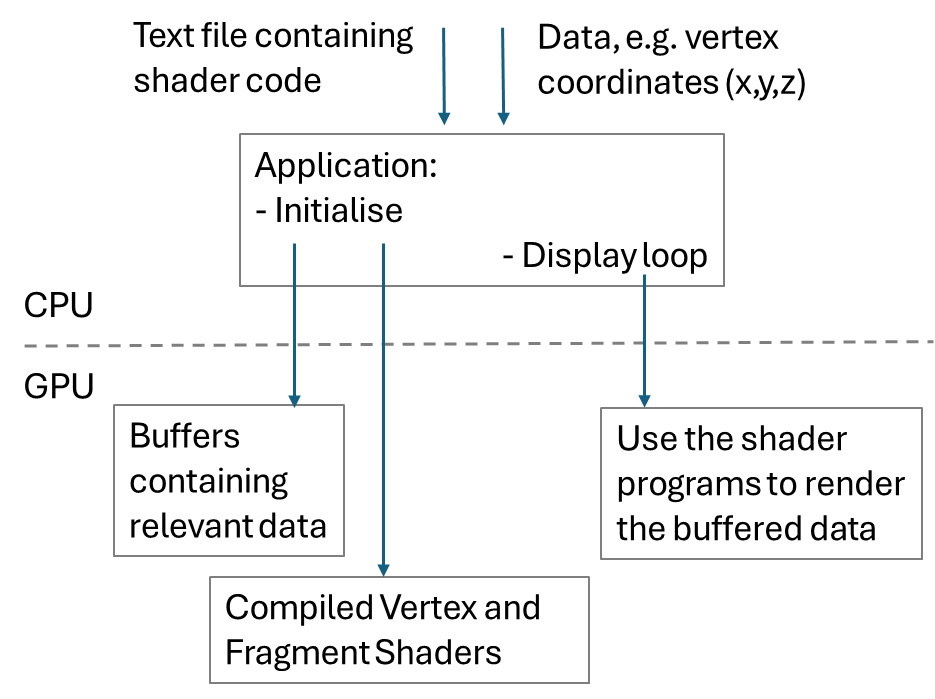
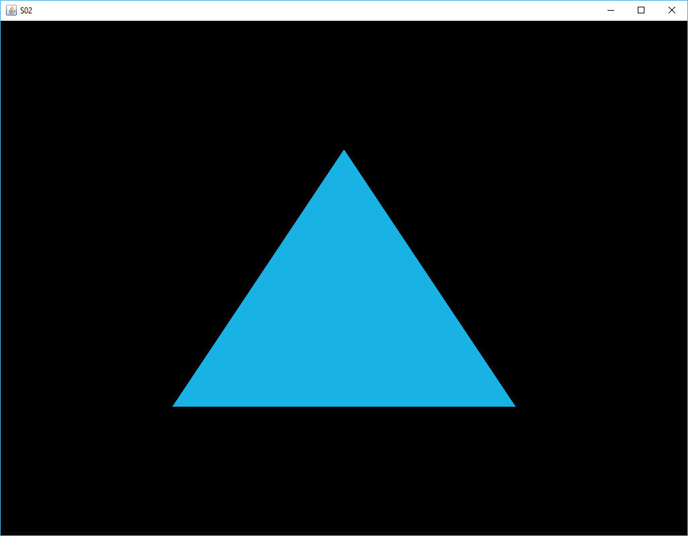
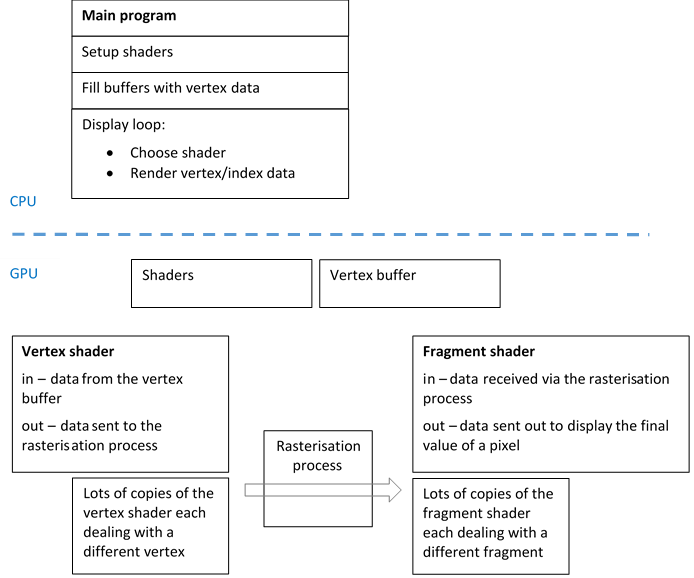

[back](ch2.md) | [main menu](../README.md)

## 2.2 Drawing a triangle

Program: [A02.java](/ch2_initial)

I've based the following explanation on the learnopengl.com site: [Joey's Hello Triangle example](https://learnopengl.com/Getting-started/Hello-Triangle). My explanation is terser, although it is still quite long. Perseverance is key here and will pay off in later programs. 

For detailed line-by-line explanation of the code, you may wish to refer to Joey's site. His work is in C and OpenGL, whereas we are using JOGL. Some of the JOGL methods have different parameters to their C cousins, and, of course, Java does not have pointers, which some of his C examples depend on. The [JOGL documentation](https://jogamp.org/deployment/webstart/javadoc/jogl/javadoc/) is useful in explaining the parameters used in the JOGL methods and should help you to understand the differences to the C code used in Joey's work.

---

### 2.2.1 Drawing a triangle involves setting up buffers and shaders

In modern OpenGL, drawing a triangle is more detailed than you might expect, as there is a lot of work to be done in setting up buffers and shaders as part of the programmable pipeline. Figure 2.6 illustrates what has to be done. The vertex and fragment shaders and the triangle data can be supplied in text files and loaded into the main program on the CPU, or (in these initial programs) they can be hard-coded into the program. The shaders then have to be transferred to the GPU where they will execute. The data for the triangle also has to be transferred to the GPU, where it is stored in memory (buffers). These are typically one-off initialisation activities. Then, the CPU-based display loop can start and use the shader programs on the GPU to render the data stored in the GPU buffers. As the data and the program are both on the GPU, this is quick.

<p align="center">
  <br>
  <strong>Figure 2.6.</strong> Setting up buffers and shaders
</p>

The full program is long and contains a lot of details that need explaining, so I have split this into a series of pieces: Program Listings 2.5-2.8 and 2.10. Understanding this initial program in detail will be beneficial as we move onto further programs. 

---

### 2.2.2 Organisation

Program Listing 2.5 is similar to Program Listing 2.4 (in Section 2.1). The main difference is the call to initialise(gl) in method init() and some housekeeping in method dispose() to clean up memory on the GPU. There are also extra import statements since we will need some of Java's more esoteric classes to deal with transfer of data to the GPU - the GPU is very precise about data format. 

There are four sections at the end of Program listing 2.5 that indicate where the code from Program Listings 2.6-2.8 and 2.10 goes. The first section is the 'scene', by which I mean the methods to initialise the scene and to render it - the method render() will be given here. The second section, 'data', is where the triangle data will be declared. The third section, 'buffers', is where the buffers are set up on the GPU and filled with data. The fourth section, 'shaders', is for setting up the vertex and fragment shaders on the GPU. One of the reasons for using these different labelled sections is that it hints at the structure of later, more complex programs, where some of the sections will become separate classes, e.g. the data section. For now, we'll keep everything in the one class so that it is easier to see what is happening 'as a whole'. 

```java
import java.nio.*;
import com.jogamp.common.nio.*;
import com.jogamp.opengl.*;
import com.jogamp.opengl.util.*;
import com.jogamp.opengl.util.awt.*;
import com.jogamp.opengl.util.glsl.*;

public class A02_GLEventListener implements GLEventListener {

  public A02_GLEventListener() {
  }

  public void init(GLAutoDrawable drawable) {   
    GL3 gl = drawable.getGL().getGL3();
    gl.glClearColor(0.0f, 0.0f, 0.0f, 1.0f); 
    gl.glClearDepth(1.0f);
    gl.glEnable(GL.GL_DEPTH_TEST);
    gl.glDepthFunc(GL.GL_LESS);
    initialise(gl);
  }

  public void reshape(GLAutoDrawable drawable, int x, int y, int width, int height) {
  }

  public void display(GLAutoDrawable drawable) {
    GL3 gl = drawable.getGL().getGL3();
    render(gl);
  }

  public void dispose(GLAutoDrawable drawable) {
    GL3 gl = drawable.getGL().getGL3();
    gl.glDeleteBuffers(1, vertexBufferId, 0);
  }


  // ***************************************************
  /* THE SCENE */


  // ***************************************************
  /* THE DATA */


  // ***************************************************
  /* THE BUFFERS */


  // ***************************************************
  /* THE SHADER */

}
```

**Program listing 2.5:** [A02_GLEventListener.java](/ch2_initial/A02_GLEventListener.java)

---

### 2.2.3 The data section

Let's start with the data section. Program Listing 2.6 gives the vertex data for a single triangle, defined as a list of nine floats, which are the (x,y,z) coordinates for each of three vertices, as shown in Figure 2.7. At this stage, our triangle has no depth (into the screen) and so all the z values are 0. 

Default 'normalised device coordinates' lie in the range (-1,-1) to (1,1) (irrespective of the pixel resolution of the canvas area on the screen). In our initial examples, the x and y coordinates use this range. At this stage, we have not set up a 'viewing pipeline' involving a camera in a 3D world, so the values given become the values used when drawing on our screen. In later examples, the world coordinates could take any values and will be transformed to normalised device coordinates as part of the viewing pipeline. Also, in later examples, other data (e.g. 'normals') will be stored for vertices and a separate data structure will be used to describe how to join the vertex data together to make a mesh of triangles. We'll also look at the viewing pipeline in more detail and the difference between world, normalised device and screen coordinates.

<p align="center">
  <br>
  <strong>Figure 2.7.</strong> Vertex coordinates
</p>

The vertices are listed in anticlockwise order (also called counterclockwise order). They could just as easily be listed in clockwise order, but the usual default is anticlockwise. In later chapters, when we look at 3D objects, it will be important to consider this in more detail, since we use it to determine which face of a triangle is the outside face when triangles are formed into a 3D shape. This will be considered when we look at 'back face culling'.

```java
// ***************************************************
/* THE DATA
  */
  
// one triangle
private float[] vertices = {
  -0.5f, -0.5f, 0.0f,  // Bottom Left
   0.5f, -0.5f, 0.0f,  // Bottom Right
   0.0f,  0.5f, 0.0f   // Top middle
};
```

**Program listing 2.6:** The data - a single triangle

---

### 2.2.4 Buffers

Program listing 2.7 sets up the buffers on the GPU. For this we need to consider a Vertex Buffer Object (VBO) and a Vertex Array Object (VAO).

The VBO enables us to manage a list of vertices in one transfer between the CPU and the GPU. In general, sending data from the CPU to the GPU is slow so we want to package data into big chunks rather than suffer the overhead of sending it in small chunks.

For a VBO, the following are required: an ID so it can be referred to from the CPU; the buffer type, `GL_ARRAY_BUFFER`; and a method that can copy the data to the GPU memory, `glBufferData`. The layout of the data in the array also needs to be described using `glVertexAttribPointer`. In our example, Program Listing 2.7 code between the lines labeled **********, only position attributes for a vertex are used. In later examples, other attributes will also be described.

To facilitate program flexibility, the VBO calls are wrapped in a VAO. This is so that one call to use the VAO can be used during a render loop - more on this later. In later examples, multiple attributes may be required for a vertex. The code between the lines labeled ********** would get longer and more complicated. Thus, by doing all of this once and wrapping it in a VAO, later parts of the program, i.e. the render loop, can use the VAO which automatically includes all the wrapped information.

After the `fillBuffers()` method is finished, the vertex position data has been transferred to the GPU and the ID of the VAO can be used when the data needs to be rendered.


```java
// ***************************************************
/* THE BUFFERS
  */

private int[] vertexBufferId = new int[1];
private int[] vertexArrayId = new int[1];
  
private void fillBuffers(GL3 gl) { 
  gl.glGenVertexArrays(1, vertexArrayId, 0);
  gl.glBindVertexArray(vertexArrayId[0]);
  
  // **********
  gl.glGenBuffers(1, vertexBufferId, 0);
  gl.glBindBuffer(GL.GL_ARRAY_BUFFER, vertexBufferId[0]);

  FloatBuffer fb = Buffers.newDirectFloatBuffer(vertices);

  gl.glBufferData(GL.GL_ARRAY_BUFFER, Float.BYTES * vertices.length,
                  fb, GL.GL_STATIC_DRAW);
  
  gl.glVertexAttribPointer(0, 3, GL.GL_FLOAT, false, 3*Float.BYTES, 0);
  gl.glEnableVertexAttribArray(0);
  // **********
  
  gl.glBindBuffer(GL.GL_ARRAY_BUFFER, 0);
  gl.glBindVertexArray(0);
}
```

**Program listing 2.7:** Setting up buffers

There are a few Java-centric aspects to the program code that need further explanation. The C versions of `glGenVertexArrays()` and `glGenBuffers()` both return an address in GPU memory for the ID variable. The JOGL equivalents handle this by using an array and storing addresses in the array locations. The first parameter in the methods states how many buffers are required, which is why an array is used, so that multiple addresses can be returned when necessary (the array declarations would need updating if more than one address needed to be returned since their declarations only allow one item, i.e. new int[1];). We only need one buffer for the vertex array object and one buffer for the vertex buffer object, so the first parameter in each case is 1. The variables `vertexBufferId` and `vertexArrayId` are declared as attributes of the class, since they may be required in other methods in the class. 

`glBindVertexArray` does as its name suggests. Subsequent calls make use of the buffer that has been made active. `glBindBuffer` does the same for the VBO.

`glBufferData()` specifies a GL_ARRAY_BUFFER type. Then, the second parameter is the number of vertices (vertices.length) in the data multiplied by the size of a data item, i.e. a float. The third parameter in the JOGL version (which is different to its C cousin) is a java.nio.FloatBuffer. The vertex (x,y,z) data has to be transferred into a variable of this type before it can be passed to `glBufferData()`. The method `Buffers.newDirectFloatBuffer()` is used to do this. The fourth parameter specifies how the graphics card should manage the data. GL_STATIC_DRAW means that the data is set only once and used many times. An alternative is GL_DYNAMIC_DRAW for when the data is changed a lot and used a lot - we'll rarely need this. 

`gl.glVertexAttribPointer()` describes the layout of the data (the vertex attributes) to the GPU. The first parameter is the location of this vertex attribute in the vertex shader - see later. The next parameter is the size of the attribute, here 3 values, i.e. a vec3 in the vertex shader. The data type is a GL_FLOAT. The next argument deals with normalisation of the data. Here it is false, as this is not needed. The fifth argument is called the stride. This is the space between consecutive vertex values, i.e. 3 floats. The sixth parameter is the offset in the array where the data begins. Finally, `glEnableVertexAttribArray` gives the vertex attribute location as its argument, i.e. 0. 

For more complex vertex data with multiple vertex attributes, e.g. position, colour, etc, multiple calls to `glVertexAttribPointer()` will be required to describe how to access the data stored in the single array that contains all the values, e.g. how many values for an attribute and what the stride is between sets of values. For lots of objects, each with lots of vertices with multiple attributes, this would be a lot of calls. That is why VAOs are so useful.

`glBindVertexArray(0)` effectively unbinds the VAO so that any other VAO calls don't accidentally modify this VAO. In practice, this line is unnecessary since working with another VAO would require a call to `glBindVertexArray`. Indeed, in my experiments on a Mac, leaving this line in will cause a warning.

Now that we have the data set up on the GPU and have described its layout, we can move on to the shaders that will make use of the data.

---

### 2.2.5 The shaders

Program Listings 2.8 and 2.9 give the vertex and fragment shaders, respectively. These are hard-coded as Strings in Program Listing 2.10. In later programs, we'll load them from text files.


```glsl
#version 330 core
layout (location = 0) in vec3 position;

void main() {
  gl_Position = vec4(position.x, position.y, position.z, 1.0f);
}
```

**Program listing 2.8:** A vertex shader

```glsl
#version 330 core

out vec4 fragColor;

void main() {
  fragColor = vec4(0.1f, 0.7f, 0.9f, 1.0f);
}
```

**Program listing 2.9:** A fragment shader


Shaders are written in the C-like language GLSL. In this chapter, I'll briefly describe the shader code so that it is possible for you to follow the code. I'll say more about shaders in the next chapter. 

The first line of a shader gives the version of openGL we are using: 3.3x. The next few lines of a shader give the in and out variables. 

For a vertex shader, the input is a vertex position in location 0. This corresponds to attribute 0 which was set up in `fillBuffers()` in the previous section. Subsequent variables might be colour, etc, which would have their own consecutive layout locations and type - see later programs.

The vertex shader in this example uses the in-built variable `gl_Position`. This will be passed out to the rest of the pipeline. We'll see in later examples that explicit 'out' variables can also be declared. These out variables will exactly correspond to 'in' variables in the fragment shader.

For the vertex buffer data, each vertex is handled by a separate copy of the vertex shader running in parallel. The GPU takes care of all the housekeeping and collects together sets of three vertices forming a triangle for the next stage in the pipeline. A triangle is rasterised, i.e. converted into fragments, where a fragment corresponds to a pixel on the screen. The rasterisation process bilinearly interpolates the `gl_Position` variables for each vertex to give a specific screen position for each fragment. Each of the fragments is passed to a separate copy of the fragment shader, with all copies running in parallel.

In this example of a fragment shader, there are no 'in' variables. This fragment shader sets the 'out' variable to a cyan colour. The GPU again handles all the housekeeping and collects all the fragment outputs, one per pixel and outputs the colour of each pixel on the screen. The result is a cyan triangle. One thing to note is that the colour is hard-coded into the fragment shader, so all pixels have the same colour. This is clearly not very flexible and we'll see how this is improved in later examples. 

Later programs will add more code to the vertex and fragment shaders, but the same general pipeline is followed.

Program Listing 2.10 sets up the shaders for use on the GPU. To make use of the shaders, they must be compiled to the GPU, which is described in the next section.


```java
// ***************************************************
/* THE SHADER
  */

private String vertexShaderSource = 
  "#version 330 core\n" +
  "\n" +
  "layout (location = 0) in vec3 position;\n" +
  "\n" +
  "void main() {\n" +
  "  gl_Position = vec4(position.x, position.y, position.z, 1.0f);\n" +
  "}";

private String fragmentShaderSource = 
  "#version 330 core\n" +
  "\n" +
  "out vec4 fragColor;\n" +
  "\n" +
  "void main() {\n" +
  "  fragColor = vec4(0.1f, 0.7f, 0.9f, 1.0f);\n" +
  "}";

private int shaderProgram;

private void initialiseShader(GL3 gl) { //...
}

private int compileAndLink(GL3 gl) { //...
}
```

**Program listing 2.10:** Setting up the shaders

---

### 2.2.6 Compiling and linking the shader

In Program Listing 2.11, method `initialiseShader()` displays the strings for the shader sources - in later programs we'll use this method to load the shader sources from text files. The variable `shaderProgram` is declared as an attribute of the class so that it can be referred to in other methods of the class. The method `compileAndLink()` makes use of JOGL helper classes. Rather than go into the details, we'll treat Program Listing 2.11 as 'boilerplate' code and use it as is in the next few examples. 

In later examples, we'll use multiple shaders so we will develop a class to handle shaders.

```java
// ***************************************************
/* THE SHADER
  */

private String vertexShaderSource = //...

private String fragmentShaderSource = //...

private int shaderProgram;

private void initialiseShader(GL3 gl) {
  System.out.println(vertexShaderSource);
  System.out.println(fragmentShaderSource);
}

private int compileAndLink(GL3 gl) {
  String[][] sources = new String[1][1];
  sources[0] = new String[]{ vertexShaderSource };
  ShaderCode vertexShaderCode = new ShaderCode(GL3.GL_VERTEX_SHADER,
                                                sources.length, sources);
  boolean compiled = vertexShaderCode.compile(gl, System.err);
  if (!compiled)
    System.err.println("[error] Unable to compile vertex shader: " + sources);

  sources[0] = new String[]{ fragmentShaderSource };
  ShaderCode fragmentShaderCode = new ShaderCode(GL3.GL_FRAGMENT_SHADER,
                                                  sources.length, sources);
  compiled = fragmentShaderCode.compile(gl, System.err);
  if (!compiled)
    System.err.println("[error] Unable to compile fragment shader: " + sources);

  ShaderProgram program = new ShaderProgram();
  program.init(gl);
  program.add(vertexShaderCode);
  program.add(fragmentShaderCode);
  program.link(gl, System.out);
  if (!program.validateProgram(gl, System.out))
    System.err.println("[error] Unable to link program");

  return program.program();
}
```

**Program listing 2.11:** Compiling the shaders - JOGL provides helper classes to create a shader program

The method compileAndLink() can be done in a number of ways. Program listing 2.12 is an alternative way to achieve it that is similar to [Joey de Vries's example](https://learnopengl.com/Getting-started/Shaders). (There is also some extra code which is concerned with error checking the shaders.) Using JOGL helper classes, Program Listing 2.11 gives easier access to error checking and the code is more compact.

```java
private int alternative_compileAndLink(GL3 gl) {
  int vertexShader = gl.glCreateShader(GL3.GL_VERTEX_SHADER);
  String[] source = new String[]{ vertexShaderSource };
  int[] sLength = new int[1];
  sLength[0] = source[0].length();
  gl.glShaderSource(vertexShader, 1, source, sLength, 0);

  gl.glCompileShader(vertexShader);
  if (shaderError(gl, vertexShader, "Vertex shader")) 
    System.exit(0);

  int fragmentShader = gl.glCreateShader(GL3.GL_FRAGMENT_SHADER);
  source = new String[]{fragmentShaderSource};
  sLength[0] = source[0].length();
  gl.glShaderSource(fragmentShader, 1, source, sLength, 0);
  gl.glCompileShader(fragmentShader);
  if (shaderError(gl, fragmentShader, "Fragment shader")) 
    System.exit(0);

  int shaderProgram = gl.glCreateProgram();
  gl.glAttachShader(shaderProgram, vertexShader);
  gl.glAttachShader(shaderProgram, fragmentShader);
  gl.glLinkProgram(shaderProgram);
  gl.glValidateProgram(shaderProgram);

  gl.glDetachShader(shaderProgram,vertexShader);
  gl.glDetachShader(shaderProgram,fragmentShader);

  return shaderProgram;
}

// ***************************************************
/* ERROR CHECKING for shader compiling and linking.
  */

private boolean shaderError(GL3 gl, int obj, String s) {
  int[] params = new int[1];
  gl.glGetShaderiv(obj, GL3.GL_COMPILE_STATUS, params, 0); 
  boolean error = (params[0] == GL.GL_FALSE);
  if (error) {
    gl.glGetShaderiv(obj, GL3.GL_INFO_LOG_LENGTH, params, 0);
    int logLen = params[0];
    byte[] bytes = new byte[logLen + 1];
    gl.glGetShaderInfoLog(obj, logLen, null, 0, bytes, 0);
    String logMessage = new String(bytes);
    System.out.println("\n***ERROR***");
    System.out.println(s + ": "+logMessage);
  }
  return error;
}
```

**Program listing 2.12:** Alternative version of compile and link for setting up the shaders. This is closer in style to Joey de Vries's example, but we won't use this version.

---

### 2.2.7 Finally, rendering the scene

Program listing 2.13 gives the methods to initialise and render the 'scene', which, so far, is the single triangle, as illustrated in Figure 2.8. 


```java
// ***************************************************
/* THE SCENE
  * Now define all the methods to handle the scene.
  * This will be added to in later examples.
  */

public void initialise(GL3 gl) {
  initialiseShader(gl);
  shaderProgram = compileAndLink(gl);
  fillBuffers(gl);
}

public void render(GL3 gl) {
  gl.glClear(GL.GL_COLOR_BUFFER_BIT | GL.GL_DEPTH_BUFFER_BIT);
  gl.glUseProgram(shaderProgram);
  gl.glBindVertexArray(vertexArrayId[0]);
  gl.glDrawArrays(GL.GL_TRIANGLES, 0, 3); // drawing one triangle
  gl.glBindVertexArray(0);  // this line can be omitted, as there is no need to unbind it every time
}
```

**Program Listing 2.13:** The scene methods - initialisation and rendering

The first method, `initialise()`, uses the methods described above to set up the shaders and buffers. The second method, `render()`, begins by clearing the screen and depth buffers. The particular shader program to use is then set. We can see now why there is an attribute called `shaderProgram`. Multiple shader programs could be created with different vertex and fragment shaders, and different parts of the scene could be rendered with different shaders. Then the relevant vertex data on the GPU is selected. Again, we could store multiple lists of vertex data on the GPU and choose which one we wished to render.

<p align="center">
  <br>
  <strong>Figure 2.8.</strong> A single triangle
</p>

The command `glDrawArrays()` is issued so that the GPU renders the data in the chosen buffer (`vertexArrayId[0]`) with the chosen shader program (`shaderProgram`). The parameters state that a triangle is to be drawn, that the data starts at index position 0 in the buffer and that it is 3 vertices long. For multiple triangles, the literal value 3 would change accordingly, depending on how much vertex data is stored in the buffer and how it is organised. Also, we would query the length of the data in the array rather than use a hard-coded literal value. Finally, we unbind the vertex array (`glBindVertexArray(0)`, although this line can be omitted as there is no need to unbind it every time and it can cause a warning message on Macs). At this point a different vertex array and shader program could be bound and a different set of data displayed. 

---

### 2.2.8 Where are we now?

It is worth summarising where we have reached. Figure 2.6 is repeated here so it is easier to refer to. In the figure, the shaders are shown as being supplied to the program via text files. This is the general case in future programs. For now, these are hard-coded in the program, as shown in Program Listing 2.10 - this also gives the code for compiling the shaders and making them available on the GPU. The data for the triangle is also hard-coded - see Program Listing 2.6. Program Listing 2.13 calls the routines to initialise the shaders and fill the buffers (using the code in Program Listing 2.11) on the GPU with the data for the triangle.

<p align="center">
  <br>
  <strong>Figure 2.6 (repeated).</strong> Setting up buffers and shaders
</p>

---

### 2.2.9 A display loop

The display loop mentioned in Figure 2.6 is achieved using the FPSAnimator in the main program A02, which repeatedly asks for the canvas to be drawn (60 frames per second). When the canvas is redrawn, the A02_GLEventListener is redrawn, which means the A02_GLEventListener.display method (see Program Listing 2.5) is automatically called. This in turn calls the render method in Program Listing 2.13. As previously mentioned, the triangle data in the buffers on the GPU is now rendered using the compiled vertex and fragment shaders on the GPU. As we are not changing the shaders or the data, there is no need to transfer them to the GPU again. Instead, the display loop just keeps telling the GPU to clear the screen and render the data. We need to keep this in mind in future programs. It is relatively slow to transfer data from the CPU to the GPU. It is better to keep data on the GPU and just ask for it to be rendered again.

This same process will be used in all subsequent programs: first, set up shaders and load data buffers; second, use a display loop to render the buffered data using the shaders. Of course the data could be changed in some way between calls to render it. This could be done on the CPU or on the GPU (as illustrated by the arrows in Figure 2.6)- we'll look at this soon. Also, multiple data sets can be buffered on the GPU and rendered with different shaders, which all reside on the GPU. This is something we will look at in detail in later examples.

###  2.2.10 FPSAnimator or Animator?

So far, we have used an `FPSAnimator` which attempts to produce 60 frames per second. On some graphics cards I have seen this only produce approx 30 frames per second. An alternative is to use an `Animator` instead of an `FPSAnimator`. This then offers other methods to control the frame refresh. 

Program Listing 2.14 shows the required changes to make use of an `Animator`. Notice that no target frame rate is initially set. Instead, another parameter needs to be set in the `init` method in the `GLEventListener` class. 

The other line to note is `setUpdateFPSFrames`. This helper method will output the fps values after every 200 frames rendered. 

```java

// A02.java
  
  private final Animator animator;

  // ...
    animator = new Animator(canvas);
    animator.setUpdateFPSFrames(200, System.out);   // useful to see frames per second
    animator.start();
  //...

// A02_GLEventListener.java

  public void init(GLAutoDrawable drawable) {   
    //...
    gl.setSwapInterval(1); 
    // 0 = no sync, disables the vertical synchronization
    // 1 = sync to screen refresh rate
    // >=1 the number of vertical refreshes before a swap buffer occurs

    //...
    
```

**Program Listing 2.14:** Changes to use Animator

An FPSAnimator will suffice for our work.

---

### 2.2.11 A summary of what's happening on the GPU

Figure 2.9 illustrates what is happening on the GPU. The CPU part is similar to what is shown in Figure 2.6. However, more detail is shown in the GPU part. This shows that the vertex and fragment shaders receive and output data. 

<p align="center">
  <br>
  <strong>Figure 2.9.</strong> Multiple copies of the shaders handle the data on the GPU
</p>

The 'in data' of a vertex shader is the data from the vertex buffer. A new copy of the vertex shader is automatically made for each vertex in the vertex buffer (up to the capacity of the GPU). Each copy can execute in parallel with the others. Each vertex shader sends out some data. The GPU keeps track of all the copies and reassociates the data each one creates. For a triangle, it reassociates the relevant three vertices. The rasterisation process fills in the gaps between the vertices so that a solid triangle is created. This process creates a set of fragments, one per pixel on the screen. Relevant data is communicated to the fragment shader, e.g. position of the fragment on the screen and, possibly, the colour of the fragment. Multiple copies of the fragment shader are automatically produced by the GPU, one per fragment. All these execute in parallel. Finally, each fragment shader outputs the final colour of a fragment. The GPU makes sure each value is written to the correct place in screen memory. (At this stage we are not considering the z buffer, which is used to determine if one fragment is in front of another and therefore which fragment should be displayed. It can also be used to determine if the fragment shader is even executed. We'll look at this in a later chapter when we consider collections of triangles that form 3D objects and can thus produce overlapping fragments during shading.)

Figure 2.9 shows the power of the GPU. Lots of copies of the vertex shader and the fragment shader are created and executed in parallel. For a single triangle, only three copies of the vertex shader are created. However, imagine many thousands of vertices. Many thousands of copies of the vertex shader are executed in parallel. Likewise the fragment shaders: the more screen pixels that are covered by a triangle, the more fragment shader copies are created. The numbers of copies that can be made and the amount of parallelism depend only on the particular GPU.

Now test your understanding so far by completing the MCQs and exercises.

---

## MCQs (written in collaboration with Google Gemini)

<p>What is the primary benefit of using Vertex Buffer Objects (VBOs) in JOGL (and OpenGL in general)?</p>

<details>
<summary>a) They automatically generate complex 3D models from simple parameters.</summary>
<p><strong>Incorrect:</strong> VBOs are for storing existing vertex data, not for generating models automatically. Model generation typically involves other algorithms and techniques.</p>
</details>

<details>
<summary>b) They store vertex data in the CPU's main memory for faster access during rendering.</summary>
<p><strong>Incorrect:</strong> The primary benefit of VBOs is precisely the opposite: they store vertex data in the GPU's memory (video RAM), which allows the GPU to access it directly and much faster than if it had to retrieve it from the CPU's main memory.</p>
</details>

<details>
<summary>c) They allow you to upload vertex data to the GPU for more efficient rendering.</summary>
<p><strong>Correct:</strong> VBOs are a fundamental optimization technique in modern OpenGL. By storing vertex data (positions, colors, normals, etc.) directly on the graphics card's memory, the GPU can access this information much faster during the rendering pipeline, leading to significant performance improvements, especially for complex scenes with a large number of vertices.</p>
</details>

<details>
<summary>d) They handle texture loading and management, reducing the need for manual texture binding.</summary>
<p><strong>Incorrect:</strong> VBOs are specifically for vertex data. Texture loading and management are handled by other OpenGL mechanisms, such as texture objects and texture units, which are distinct from VBOs.</p>
</details>

---

<p>When drawing a 2D triangle using Vertex Buffer Objects (VBOs) in JOGL, what is the minimum information typically stored for each vertex in the VBO?</p>

  <details>
    <summary>a) A single index value.</summary>
    <p><strong>Incorrect:</strong> Indices are used for indexed drawing, not the basic vertex data itself.</p>
  </details>
  <details>
    <summary>b) Two coordinate values (x, y).</summary>
    <p><strong>Incorrect:</strong> In 2D, each point is defined by its horizontal and vertical position.</p>
  </details>
  <details>
    <summary>c) Three coordinate values (x, y, z).</summary>
    <p><strong>Incorrect:</strong> While you *can* use 3D coordinates for 2D, the 'z' component would often be zero or constant.</p>
  </details>
  <details>
    <summary>d) Color information (red, green, blue) only.</summary>
    <p><strong>Incorrect:</strong> Color is additional data; you still need position to define the triangle's shape.</p>
  </details>

---

At a minimum, what fundamental data is required to instruct JOGL to draw a visible 2D triangle?

<details>
  <summary>a) The color of each vertex.</summary>
  <p><b>Incorrect.</b> While color is important for visual appearance, a triangle can be drawn with a default color even if no specific vertex colors are provided.</p>
</details>

<details>
  <summary>b) The texture coordinates for each vertex.</summary>
  <p><b>Incorrect.</b> Texture coordinates are only necessary if you intend to apply a texture to the triangle. A basic, untextured triangle can be drawn without them.</p>
</details>

<details>
  <summary>c) The 2D position (x, y coordinates) of its three vertices.</summary>
  <p><b>Correct.</b> To define the shape and location of a 2D triangle, you must provide the x and y coordinates for each of its three corners (vertices).</p>
</details>

<details>
  <summary>d) The normal vector for each vertex.</summary>
  <p><b>Incorrect.</b> Normal vectors are crucial for 3D rendering to determine surface orientation for lighting calculations. They are not required for a basic 2D triangle.</p>
</details>

---

<p>What are the absolute minimum requirements for a functional vertex shader and fragment shader pair in JOGL (OpenGL) to render a basic primitive like a 2D triangle with a solid color?</p>

<details>
  <summary>A) A vertex shader that outputs vertex positions and a fragment shader that outputs a color.</summary>
  <p><b>Correct.</b> The vertex shader must at least transform input vertex positions to clip space (often done implicitly or by a basic transformation), and the fragment shader must output at least one color for each fragment.</p>
</details>

<details>
  <summary>B) A vertex shader that outputs texture coordinates and a fragment shader that samples a texture.</summary>
  <p><b>Incorrect.</b> While texturing is common, it's not the absolute minimum. You can render a solid color without any textures or texture coordinates.</p>
</details>

<details>
  <summary>C) A vertex shader that calculates lighting and a fragment shader that applies the lighting result.</summary>
  <p><b>Incorrect.</b> Lighting calculations are more advanced and not required for the most basic rendering of a solid-colored primitive.</p>
</details>

<details>
  <summary>D) A vertex shader that takes no input attributes and a fragment shader that discards fragments.</summary>
  <p><b>Incorrect.</b> A useful rendering pipeline needs input (at least vertex positions) in the vertex shader and should output a color in the fragment shader to produce visible pixels.</p>
</details>

---

## Exercises

1. Change the colour of the triangle that is drawn. (Hint: edit the fragment shader.) Examples in future chapters will show how this can be done from the CPU application rather that by hard-coding it into the fragment shader. [Solution]
2. Change the program to draw two triangles. (Hints: (i) define a second triangle in the 'data' section by extending the existing array of vertices - add three new vertices to the data array in Program Listing 2.6; (ii) Then, in method render() in the 'scene' section, change the last parameter of gl.glDrawArrays(GL.GL_TRIANGLES, 0, 3); - how many items of data are there?) In the next section, we'll see how the use of Element Buffer Objects makes drawing multiple triangles easier. [Solution]


