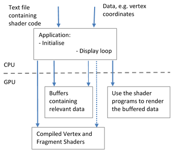
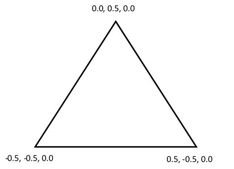
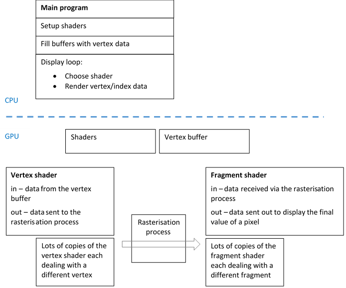

[back](ch2.md) | [main menu](../README.md)

## 2.2 Drawing a triangle

Before, you attempt this section, please read [Joey's Hello Triangle example](https://learnopengl.com/Getting-started/Hello-Triangle). It describes important aspects of the programmable pipeline including shaders and fragments. I will not explain these details. Instead, I'll mainly focus on the JOGL differences, since some of the JOGL methods have different parameters, and, of course, Java does not have pointers, which some of his C examples depend on. (The [JOGL documentation](https://jogamp.org/deployment/webstart/javadoc/jogl/javadoc/) is useful in these circumstances.)

---

### 2.2.1 Drawing a triangle involves setting up buffers and shaders

In modern OpenGL, drawing a triangle is more detailed than you might expect, as there is a lot of work to be done in setting up buffers and shaders as part of the programmable pipeline. Figure 2.6 illustrates what has to be done. The vertex and fragment shaders and the triangle data can be supplied in text files and loaded into the main program on the CPU, or they can be hard-coded into the program. The shaders then have to be transferred to the GPU where they will execute. The data for the triangle also has to be transferred to the GPU, where it is stored in a buffer (or buffers). Then, the CPU-based display loop can start and use the shader programs on the GPU to render the data stored in the buffers.

<p align="center">
  <br>
  <strong>Figure 2.6.</strong> Setting up buffers and shaders
</p>

The full program is long and contains a lot of details that need explaining, so I have split this into a series of pieces: Program Listings 2.5-2.8 and 2.10.

---

### 2.2.2 Organisation

Program Listing 2.5 is similar to Program Listing 2.4 (in Section 2.1). The main difference is the call to initialise(gl) in method init() and some housekeeping in method dispose() to clean up memory on the GPU. There are also extra import statements since we will need some of Java's more esoteric classes to deal with transfer of data to the GPU. There are four sections at the end of Program listing 2.5 that indicate where the code from Program Listings 2.6-2.8 and 2.10 goes. The first section is the 'scene', by which I mean the methods to initialise the scene and to render it - the method render() will be given here. The second section, 'data', is where the triangle data will be declared. The third section, 'buffers', is where the buffers are set up on the GPU and filled with data. The fourth section, 'shaders', is for setting up the vertex and fragment shaders on the GPU. One of the reasons for using these different labelled sections is that it hints at the structure of later, more complex programs, where some of the sections will become separate classes, e.g. the data section. For now, we'll keep everything in the one class so that it is easier to see what is happening 'as a whole'. 

```java
import java.nio.*;
import com.jogamp.common.nio.*;
import com.jogamp.opengl.*;
import com.jogamp.opengl.util.*;
import com.jogamp.opengl.util.awt.*;
import com.jogamp.opengl.util.glsl.*;

public class A02_GLEventListener implements GLEventListener {

  public A02_GLEventListener() {
  }

  public void init(GLAutoDrawable drawable) {   
    GL3 gl = drawable.getGL().getGL3();
    gl.glClearColor(0.0f, 0.0f, 0.0f, 1.0f); 
    gl.glClearDepth(1.0f);
    gl.glEnable(GL.GL_DEPTH_TEST);
    gl.glDepthFunc(GL.GL_LESS);
    initialise(gl);
  }

  public void reshape(GLAutoDrawable drawable, int x, int y, int width, int height) {
  }

  public void display(GLAutoDrawable drawable) {
    GL3 gl = drawable.getGL().getGL3();
    render(gl);
  }

  public void dispose(GLAutoDrawable drawable) {
    GL3 gl = drawable.getGL().getGL3();
    gl.glDeleteBuffers(1, vertexBufferId, 0);
  }


  // ***************************************************
  /* THE SCENE */


  // ***************************************************
  /* THE DATA */


  // ***************************************************
  /* THE BUFFERS */


  // ***************************************************
  /* THE SHADER */

}
```

**Program listing 2.5:** [A02_GLEventListener.java](/ch2/A02_GLEventListener.java)

---

### 2.2.3 The data section

Let's start with the data section. Program Listing 2.6 gives the vertex data for a single triangle, defined as a list of nine floats, which are the (x,y,z) coordinates for each of three vertices, as shown in Figure 2.7. At this stage, our triangle has no depth (into the screen) and so all the z values are 0. Default screen coordinates lie in the range (-1,-1) to (1,1). The x and y coordinates use this range - we are actually specifying world coordinates and these are transformed to screen coordinates. However, at the stage, we have not set up a viewing pipeline, so the values in world coordinates essentially become the values in screen coordinates. In later examples, the world coordinates could take any values. In addition, other data (e.g. 'normals') will be stored for vertices and a separate data structure will be used to describe how to join the vertex data together to make a mesh of triangles. We'll also look at the viewing pipeline in more detail and the difference between world and screen coordinates.

<p align="center">
  <br>
  <strong>Figure 2.7.</strong> Vertex coordinates
</p>

The vertices are listed in anticlockwise order (which can also be called counterclockwise order). They could just as easily be listed in clockwise order, but the usual default is anticlockwise. In later chapters, when we look at 3D objects, it will be important to consider this in more detail, since we use it to determine which face of a triangle is the outside face when triangles are formed into a 3D shape.

```java
// ***************************************************
/* THE DATA
  */
  
// one triangle
private float[] vertices = {
  -0.5f, -0.5f, 0.0f,  // Bottom Left
   0.5f, -0.5f, 0.0f,  // Bottom Right
   0.0f,  0.5f, 0.0f   // Top middle
};
```

**Program listing 2.6:** The data - a single triangle

---

### 2.2.4 Buffers

Program listing 2.7 sets up the buffers on the GPU. I'll focus on the differences to Joey de Vries's example. The C versions of glGenVertexArrays() and glGenBuffers() both return an address in GPU memory. The JOGL equivalents handle this by using an array and storing addresses in the array locations. The first parameter in the methods states how many buffers are required, which is why an array is used, so that multiple addresses can be returned when necessary (the array declarations would need updating if more than one address needed to be returned). We only need one buffer for the vertex array object and one buffer for the vertex buffer object, so the first parameter in each case is 1. The variables vertexBufferId and vertexArrayId are declared as attributes of the class, since they may be required in other methods in the class. The JOGL version of glBufferData() is different to its C cousin. The third parameter in the JOGL version is a java.nio.FloatBuffer. The vertex (x,y,z) data has to be transferred into a variable of this type before it can be passed to glBufferData(). The method Buffers.newDirectFloatBuffer() is used to do this. The rest of the method fillBuffers() should be clear from following Joey de Vries's example. One other thing to note is that gl.glVertexAttribPointer() contains some literal values (i.e. '3'). We'll update this in later examples when the data we are transferring to the GPU becomes more complex. 

```java
// ***************************************************
/* THE BUFFERS
  */

private int[] vertexBufferId = new int[1];
private int[] vertexArrayId = new int[1];
  
private void fillBuffers(GL3 gl) { 
  gl.glGenVertexArrays(1, vertexArrayId, 0);
  gl.glBindVertexArray(vertexArrayId[0]);
  
  gl.glGenBuffers(1, vertexBufferId, 0);
  gl.glBindBuffer(GL.GL_ARRAY_BUFFER, vertexBufferId[0]);

  FloatBuffer fb = Buffers.newDirectFloatBuffer(vertices);

  gl.glBufferData(GL.GL_ARRAY_BUFFER, Float.BYTES * vertices.length,
                  fb, GL.GL_STATIC_DRAW);
  
  gl.glVertexAttribPointer(0, 3, GL.GL_FLOAT, false, 3*Float.BYTES, 0);
  gl.glEnableVertexAttribArray(0);
  
  gl.glBindBuffer(GL.GL_ARRAY_BUFFER, 0);
  gl.glBindVertexArray(0);
}
```

**Program listing 2.7:** Setting up buffers

---

### 2.2.5 The shader

Program Listings 2.x and 2.y give the vertex and fragment shaders, respectively. These are hard-coded as Strings in Program Listing 2.8. In later programs, we'll load them from text files. (One thing to note is that a colour is hard-coded into the fragment shader. This is clearly not very flexible and we'll see how this is improved in later examples.) 

```glsl
#version 330 core
layout (location = 0) in vec3 position;

void main() {
  gl_Position = vec4(position.x, position.y, position.z, 1.0f);
}
```

**Program listing 2.x:** A vertex shader

```glsl
#version 330 core

out vec4 fragColor;

void main() {
  fragColor = vec4(0.1f, 0.7f, 0.9f, 1.0f);
}
```

**Program listing 2.y:** A fragment shader

Program Listing 2.8 sets up and compiles the shaders on the GPU. Method initialiseShader() just displays the strings. The variable shaderProgram is declared as an attribute of the class so that it can be referred to in other methods of the class. In later examples, we'll use multiple shaders so we will develop a class to handle shaders. For now, we'll treat Program Listing 2.8 as 'boilerplate' code and use it as is in the next few examples. 

```java
// ***************************************************
/* THE SHADER
  */

private String vertexShaderSource = 
  "#version 330 core\n" +
  "\n" +
  "layout (location = 0) in vec3 position;\n" +
  "\n" +
  "void main() {\n" +
  "  gl_Position = vec4(position.x, position.y, position.z, 1.0f);\n" +
  "}";

private String fragmentShaderSource = 
  "#version 330 core\n" +
  "\n" +
  "out vec4 fragColor;\n" +
  "\n" +
  "void main() {\n" +
  "  fragColor = vec4(0.1f, 0.7f, 0.9f, 1.0f);\n" +
  "}";

private int shaderProgram;

private void initialiseShader(GL3 gl) {
  System.out.println(vertexShaderSource);
  System.out.println(fragmentShaderSource);
}

private int compileAndLink(GL3 gl) {
  String[][] sources = new String[1][1];
  sources[0] = new String[]{ vertexShaderSource };
  ShaderCode vertexShaderCode = new ShaderCode(GL3.GL_VERTEX_SHADER,
                                                sources.length, sources);
  boolean compiled = vertexShaderCode.compile(gl, System.err);
  if (!compiled)
    System.err.println("[error] Unable to compile vertex shader: " + sources);

  sources[0] = new String[]{ fragmentShaderSource };
  ShaderCode fragmentShaderCode = new ShaderCode(GL3.GL_FRAGMENT_SHADER,
                                                  sources.length, sources);
  compiled = fragmentShaderCode.compile(gl, System.err);
  if (!compiled)
    System.err.println("[error] Unable to compile fragment shader: " + sources);

  ShaderProgram program = new ShaderProgram();
  program.init(gl);
  program.add(vertexShaderCode);
  program.add(fragmentShaderCode);
  program.link(gl, System.out);
  if (!program.validateProgram(gl, System.out))
    System.err.println("[error] Unable to link program");

  return program.program();
}
```

**Program listing 2.8:** Setting up the shaders - JOGL provides helper classes to create a shader program

---

### 2.2.6 Compiling and linking the shader

The method compileAndLink() can be done in a number of ways. Program Listing 2.8 uses JOGL helper classes to achieve it. Program listing 2.9 is an alternative way to achieve it that is similar to Joey de Vries's example. (There is also some extra code which is concerned with error checking the shaders.) Program listing 2.8 gives easier access to error checking and the code is more compact.

```java
private int alternative_compileAndLink(GL3 gl) {
  int vertexShader = gl.glCreateShader(GL3.GL_VERTEX_SHADER);
  String[] source = new String[]{ vertexShaderSource };
  int[] sLength = new int[1];
  sLength[0] = source[0].length();
  gl.glShaderSource(vertexShader, 1, source, sLength, 0);

  gl.glCompileShader(vertexShader);
  if (shaderError(gl, vertexShader, "Vertex shader")) 
    System.exit(0);

  int fragmentShader = gl.glCreateShader(GL3.GL_FRAGMENT_SHADER);
  source = new String[]{fragmentShaderSource};
  sLength[0] = source[0].length();
  gl.glShaderSource(fragmentShader, 1, source, sLength, 0);
  gl.glCompileShader(fragmentShader);
  if (shaderError(gl, fragmentShader, "Fragment shader")) 
    System.exit(0);

  int shaderProgram = gl.glCreateProgram();
  gl.glAttachShader(shaderProgram, vertexShader);
  gl.glAttachShader(shaderProgram, fragmentShader);
  gl.glLinkProgram(shaderProgram);
  gl.glValidateProgram(shaderProgram);

  gl.glDetachShader(shaderProgram,vertexShader);
  gl.glDetachShader(shaderProgram,fragmentShader);

  return shaderProgram;
}

// ***************************************************
/* ERROR CHECKING for shader compiling and linking.
  */

private boolean shaderError(GL3 gl, int obj, String s) {
  int[] params = new int[1];
  gl.glGetShaderiv(obj, GL3.GL_COMPILE_STATUS, params, 0); 
  boolean error = (params[0] == GL.GL_FALSE);
  if (error) {
    gl.glGetShaderiv(obj, GL3.GL_INFO_LOG_LENGTH, params, 0);
    int logLen = params[0];
    byte[] bytes = new byte[logLen + 1];
    gl.glGetShaderInfoLog(obj, logLen, null, 0, bytes, 0);
    String logMessage = new String(bytes);
    System.out.println("\n***ERROR***");
    System.out.println(s + ": "+logMessage);
  }
  return error;
}
```

**Program listing 2.9:** Alternative version of compile and link for setting up the shaders. This is closer in style to Joey de Vries's example, but we won't use this version.

---

### 2.2.7 Finally, rendering the scene

Program listing 2.10 gives the methods to initialise and render the 'scene', which, so far, is the single triangle, as illustrated in Figure 2.8. The first method, initialise(), uses the methods described above to set up the shaders and buffers. The second method, render(), begins by clearing the screen and depth buffers. The particular shader program to use is then set. We can see now why there is an attribute called shaderProgram. Multiple shader programs could be created with different vertex and fragment shaders, and different parts of the scene could be rendered with different shaders. Then the relevant vertex data on the GPU is selected. Again, we could store multiple lists of vertex data on the GPU and choose which one we wished to render.

<p align="center">
  <br>
  <strong>Figure 2.8.</strong> A single triangle
</p>

The command glDrawArrays() is issued so that the GPU renders the data in the chosen buffer (vertexArrayId[0]) with the chosen shader program (shaderProgram). The parameters state that a triangle is to be drawn, that the data starts at index position 0 in the buffer and that it is 3 vertices long. For multiple triangles, the value 3 would change accordingly, depending on how the vertex data is stored in the buffer, e.g. if data is repeated at shared vertices or not - see later examples. Also, we would query the length of the data in the array rather than use a hard-coded literal value. Finally, we unbind the vertex array. At this point a different vertex array and shader program could be bound and a different set of data displayed. 

```java
// ***************************************************
/* THE SCENE
  * Now define all the methods to handle the scene.
  * This will be added to in later examples.
  */

public void initialise(GL3 gl) {
  initialiseShader(gl);
  shaderProgram = compileAndLink(gl);
  fillBuffers(gl);
}

public void render(GL3 gl) {
  gl.glClear(GL.GL_COLOR_BUFFER_BIT | GL.GL_DEPTH_BUFFER_BIT);
  gl.glUseProgram(shaderProgram);
  gl.glBindVertexArray(vertexArrayId[0]);
  gl.glDrawArrays(GL.GL_TRIANGLES, 0, 3); // drawing one triangle
  gl.glBindVertexArray(0);
}
```

**Program Listing 2.10:** The scene methods - initialisation and rendering

---

### 2.2.8 Where are we now?

It is worth summarising where we have reached. Figure 2.6 is repeated here so it is easier to refer to. In the figure, the shaders are shown as being supplied to the program via text files. This is the general case in future programs. For now, these are hard-coded in the program, as shown in Program Listing 2.8 - this also gives the code for compiling the shaders and making them available on the GPU. The data for the triangle is also hard-coded - see Program Listing 2.6. Program Listing 2.10 calls the routines to initialise the shaders and fill the buffers (using the code in Program Listing 2.7) on the GPU with the data for the triangle.

<p align="center">
  <br>
  <strong>Figure 2.6 (repeated).</strong> Setting up buffers and shaders
</p>

---

### 2.2.9 A display loop

The display loop mentioned in Figure 2.6 is achieved using the FPSAnimator in Program Listing 2.3, which repeatedly asks for the canvas to be drawn (60 frames per second). When the canvas is redrawn, the A01_GLEventListener is redrawn, which means the A01_GLEventListener.display method (see Program Listing 2.5) is automatically called. This in turn calls the render method in Program Listing 2.10. As previously mentioned, the triangle data in the buffers on the GPU is now rendered using the compiled vertex and fragment shaders on the GPU. As we are not changing the shaders or the data, there is no need to transfer them to the GPU again. Instead, the display loop just keeps telling the GPU to clear the screen and render the data. We need to keep this in mind in future programs. It is relatively slow to transfer data from the CPU to the GPU. It is better to keep data on the GPU and just ask for it to be rendered again.

This same process will be used in all subsequent programs: first, set up shaders and load data buffers; second, use a display loop to render the buffered data using the shaders. Of course the data could be changed in some way between calls to render it. This could be done on the CPU or on the GPU (as illustrated by the arrows in Figure 2.6)- we'll look at this soon. Also, multiple data sets can be buffered on the GPU and rendered with different shaders, which all reside on the GPU. This is something we will look at in detail in later examples.

---

### 2.2.10 What's happening on the GPU?

We have the overview of what is happening, but how do the shaders use the buffered data on the GPU? Figure 2.9 illustrates this. The CPU part is similar to what is shown in Figure 2.6. However, more detail is shown in the GPU part. This shows that the vertex and fragment shaders receive and output data. 

<p align="center">
  <br>
  <strong>Figure 2.9.</strong> Multiple copies of the shaders handle the data on the GPU
</p>

The 'in data' of a vertex shader is the data from the vertex buffer. A new copy of the vertex shader is automatically made for each vertex in the vertex buffer (up to the capacity of the GPU). Each copy can execute in parallel with the others. Each vertex shader sends out some data. The GPU keeps track of all the copies and reassociates the data each one creates. For a triangle, it reassociates the relevant three vertices. The rasterisation process fills in the gaps between the vertices so that a solid triangle is created. This process creates a set of fragments, one per pixel on the screen. Relevant data is communicated to the fragment shader, e.g. position of the fragment on the screen and, possibly, the colour of the fragment. Multiple copies of the fragment shader are automatically produced by the GPU, one per fragment. All these execute in parallel. Finally, each fragment shader outputs the final colour of a fragment. The GPU makes sure each value is written to the correct place in screen memory. (At this stage we are not considering the z buffer, which is used to determine if one fragment is in front of another and therefore which fragment should be displayed. It can also be used to determine if the fragment shader is even executed. We'll look at this in a later chapter when we consider collections of triangles that form 3D objects and can thus produce overlapping fragments during shading.)

Figure 2.9 shows the power of the GPU. Lots of copies of the vertex shader and the fragment shader are created and executed in parallel. For a single triangle, only three copies of the vertex shader are created. However, imagine many thousands of vertices. Many thousands of copies of the vertex shader are executed in parallel. Likewise the fragment shaders: the more screen pixels that are covered by a triangle, the more fragment shader copies are created. The numbers of copies that can be made and the amount of parallelism depend only on the particular GPU.

Now test your understanding so far by completing the exercises.

---

## Exercises

1. Change the colour of the triangle that is drawn. (Hint: edit the fragment shader - Program Listing 2.8.) Examples in future chapters will show how this can be done from the CPU application rather that by hard-coding it into the fragment shader. [Solution]
2. Change the program to draw two triangles. (Hints: (i) define a second triangle in the 'data' section by extending the existing array of vertices - add three new vertices to the array in Program Listing 2.6; (ii) Then, in method render() in the 'scene' section, change the last parameter of gl.glDrawArrays(GL.GL_TRIANGLES, 0, 3); - how many items of data are there?) In the next section, we'll see how the use of Element Buffer Objects makes drawing multiple triangles easier. [Solution]


