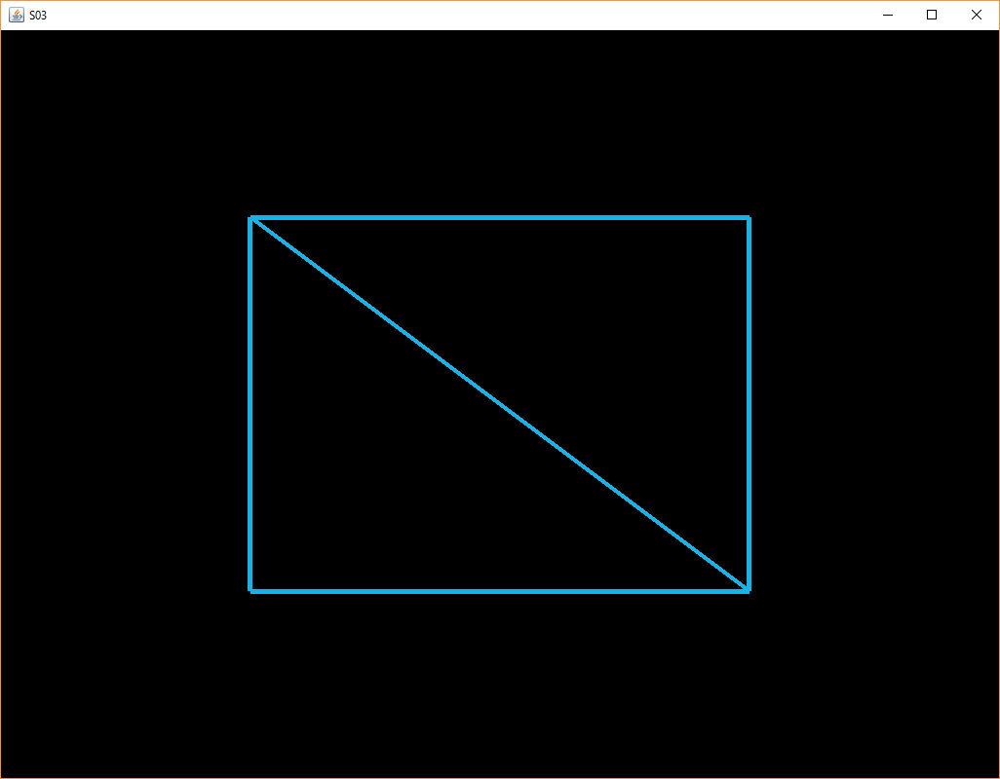

[back](ch2.md) | [main menu](../README.md)

## 2.3 Element Buffer Objects

The previous section looked at how to draw a single triangle. The exercises looked at how to extend this to to draw two triangles. However, this involved repeating data. In this section, Element Buffer Objects (EBOs) are used to draw multiple triangles, without the need to repeat vertex data.

<p align="center">
  <br>
  <strong>Figure 2.10.</strong> Two triangles
</p>

Program A03.java uses EBOs to render two triangles, to produce a rectangle, as illustrated in Figure 2.10. (Figure 2.12 shows the edges of the triangles.) The changes to the programs in Section 2.2 are mainly confined to the data section and the methods fillBuffers() and render(). Program Listing 2.11 gives the data section and Program Listing 2.12 gives the fillBuffers() method.

---

### 2.3.1 The data

```java
// ***************************************************
/* THE DATA
  */

// Two triangles to make a rectangle.
  
private float[] vertices = {      // x,y,z,
    -0.5f,  0.5f, 0.0f,           // Top Left 
    -0.5f, -0.5f, 0.0f,           // Bottom Left
     0.5f, -0.5f, 0.0f,           // Bottom Right
     0.5f,  0.5f, 0.0f,           // Top Right
};  

private int[] indices = {         // Note that we start from 0
    0, 1, 2,                      // First Triangle
    0, 2, 3                       // Second Triangle
};
```

**Program listing 2.11:** The data

In Program Listing 2.11, we can see that four vertices are listed to describe two triangles. The array indices describes how to make use of the vertices to create the two triangles.  This kind of structure is more efficient than just using lists of vertices to describe triangles amd having to repeat vertices multiple times. This indexed structure is similar to the one used in an .obj file format. We'll be using such an indexed structure in all subsequent examples. 

---

### 2.3.2 The element buffer object (EBO)

Program Listing 2.12 introduces a new kind of buffer, the element buffer object (elementBufferId), to store the indices that describe the triangles - you might like to plot the triangles on a piece of paper to check your understanding. Otherwise, the method fillBuffers() is similar to the one in Section 2.2. Some variables have also been introduced to replace literal values: stride, numVertexFloats and offset.

```java
// ***************************************************
/* THE BUFFERS
  */

private int[] vertexBufferId = new int[1];
private int[] vertexArrayId = new int[1];
private int[] elementBufferId = new int[1];                          /* new */

private void fillBuffers(GL3 gl) { 
  gl.glGenVertexArrays(1, vertexArrayId, 0);
  gl.glBindVertexArray(vertexArrayId[0]);
  
  gl.glGenBuffers(1, vertexBufferId, 0);
  gl.glBindBuffer(GL.GL_ARRAY_BUFFER, vertexBufferId[0]);

  FloatBuffer fb = Buffers.newDirectFloatBuffer(vertices);

  gl.glBufferData(GL.GL_ARRAY_BUFFER, Float.BYTES * vertices.length,
                  fb, GL.GL_STATIC_DRAW);

  int stride = 3;                                                   /* new */
  int numVertexFloats = 3;                                          /* new */
  int offset = 0;                                                   /* new */
  gl.glVertexAttribPointer(0, numVertexFloats, GL.GL_FLOAT, false,  /* changed to */
                            stride*Float.BYTES, offset);             /* use variables */
  gl.glEnableVertexAttribArray(0);
  
  gl.glGenBuffers(1, elementBufferId, 0);                           /* new */                     
  IntBuffer ib = Buffers.newDirectIntBuffer(indices);               /* new */
  gl.glBindBuffer(GL.GL_ELEMENT_ARRAY_BUFFER, elementBufferId[0]);  /* new */
  gl.glBufferData(GL.GL_ELEMENT_ARRAY_BUFFER,                       /* new */
                  Integer.BYTES * indices.length, ib, GL.GL_STATIC_DRAW);
  
  gl.glBindVertexArray(0);
}
```

**Program listing 2.12:** Setting up the buffers with the addition of EBOs

The changes from the program in Section 2.2 are highlighted as 'new'. The main lines to focus on are the lines that set up the index buffer. This is, however, similar to the previous program. An EBO ID is set up. The triangle index data is stored in an IntBuffer (which is required for JOGL), the EBO is bound and the data is copied into it. The buffer target is GL_ELEMENT_ARRAY_BUFFER. The other parameters give the size od the data, the data and, as before, GL_STATIC_DRAW means we ant to set the data only once and then use it many times (i.e. keep using it in the subsequent render loop). 

We can also move the four lines concerning the EBO to before the call to glVertexAttribPointer. It would still work the same. Also the last line call to glBindVertexArray(0) is not necessary as any subsequent VAO would start with a call to glBindVertexArray so this 'open' VAO wouldn't be accidentally modified.

Program Listing 2.12 has successfully set up the buffers on the GPU and described how the data is organised and a VAO is used to wrap all this. In the next section, the triangle can be repeatedly drawn by using the VAO using its ID: vertexArrayId.

---

### 2.3.3 Rendering

Program listing 2.13 shows the changes necessary to the render() method to use EBOs. The render method from Section 2.2 is shown in Program Listing 2.14 for comparison purposes - only one line is different. glDrawElements is now used instead of glDrawArrays. This indicates that an index list is being used to decide how to access the vertex list.

```java
// ***************************************************
/* THE SCENE
  * Now define all the methods to handle the scene.
  */

public void initialise(GL3 gl) {
  initialiseShader(gl);
  shaderProgram = compileAndLink(gl);
  fillBuffers(gl);
}

public void render(GL3 gl) {
  gl.glClear(GL.GL_COLOR_BUFFER_BIT | GL.GL_DEPTH_BUFFER_BIT);
  gl.glUseProgram(shaderProgram);
  gl.glBindVertexArray(vertexArrayId[0]);
  gl.glDrawElements(GL.GL_TRIANGLES, indices.length, GL.GL_UNSIGNED_INT, 0);   /* new */
  gl.glBindVertexArray(0);  
}
```

**Program listing 2.13:** Using EBOs for rendering

```java
public void render(GL3 gl) {
  gl.glClear(GL.GL_COLOR_BUFFER_BIT | GL.GL_DEPTH_BUFFER_BIT);
  gl.glUseProgram(shaderProgram);
  gl.glBindVertexArray(vertexArrayId[0]);
  gl.glDrawArrays(GL.GL_TRIANGLES, 0, 3);                        /* drawing one triangle */
  gl.glBindVertexArray(0);
}
```

**Program listing 2.14:** The render method from Section 2.2 - compare this with Program Listing 2.13. The only change is the method used to draw the data.

The code we have looked at will be similar in all subsequent programs, even with more vertices. More attributes will be added, but this will just require a change to the fillBuffers() method where vertex attributes are configured.

---

### 2.3.4 What's happening on the GPU?

<p align="center">
  <br>
  <strong>Figure 2.11.</strong> Multiple copies of the shaders handle the data on the GPU
</p>

Figure 2.11 is an updated version of Figure 2.9 from section 2.2. It shows that we now have an EBO on the GPU that stores the index data. The vertex data is bound to this index data - see Program Listing 2.13. The GPU makes use of this information to decide how many copies of the vertex shader to make as it deals with the data in its buffers.

---

## MCQs (written by Google Gemini)

<p>1. What is the primary benefit of using an Element Buffer Object (EBO) in JOGL (OpenGL) when rendering indexed geometry, such as a 2D triangle that is part of a larger mesh?</p>

<details>
  <summary>a) To store and manage uniform variables that are shared across all vertices.</summary>
  <p><b>Incorrect.</b> Uniform variables are for data that is constant across the entire draw call, and their storage is separate from vertex data indexing.</p>
</details>

<details>
  <summary>b) To reduce the amount of vertex data that needs to be sent to the GPU by reusing vertex information.</summary>
  <p><b>Correct.</b> EBOs allow you to specify indices that point to vertices already stored in Vertex Buffer Objects (VBOs), avoiding redundant storage of shared vertex data.</p>
</details>

<details>
  <summary>c) To define the color of individual vertices, allowing for more complex color gradients across the geometry.</summary>
  <p><b>Incorrect.</b> Vertex colors are typically stored as attributes within a VBO, not in a separate EBO.</p>
</details>

<details>
  <summary>d) To perform calculations on the vertex data directly on the GPU before the vertex shader stage.</summary>
  <p><b>Incorrect.</b> Calculations on vertex data are the primary responsibility of the vertex shader. EBOs simply define the order in which these vertices are processed.</p>
</details>

---

<p>2. What do the indices stored in an Element Buffer Object (EBO) directly refer to when rendering indexed geometry in JOGL (OpenGL)?</p>

<details>
  <summary>a) The memory addresses of the textures to be applied to the geometry.</summary>
  <p><b>Incorrect.</b> Texture information and their memory locations are managed separately from vertex indexing.</p>
</details>

<details>
  <summary>b) The specific attributes (like position, color, etc.) of individual vertices.</summary>
  <p><b>Incorrect.</b> While indices indirectly relate to vertex attributes, they directly point to entire vertices as defined in the Vertex Buffer Object (VBO).</p>
</details>

<details>
  <summary>c) The starting and ending points of lines used to draw the wireframe of the geometry.</summary>
  <p><b>Incorrect.</b> While indices can be used to define lines, their primary purpose in indexed rendering is to define the vertices that make up polygons (like triangles).</p>
</details>

<details>
  <summary>d) The sequential order of vertices in the associated Vertex Buffer Object (VBO) that should be used to form primitives (like triangles).</summary>
  <p><b>Correct.</b> The indices in the EBO tell OpenGL which vertices from the VBO should be connected and in what order to form the triangles (or other primitives) for rendering.</p>
</details>

---

<p>3. When rendering a single 2D triangle that covers a significant portion of the screen using JOGL (OpenGL) with VBOs, EBOs, and a standard rendering pipeline, approximately how many times will the vertex shader and the fragment shader be executed on the GPU for this single triangle?</p>

<details>
  <summary>a) Vertex Shader: 3 times (once for each vertex); Fragment Shader: 3 times (once for each vertex).</summary>
  <p><b>Incorrect.</b> The vertex shader executes once per vertex. However, the fragment shader executes for each pixel (or sub-pixel sample) covered by the rasterized triangle, which can be thousands or millions depending on screen resolution.</p>
</details>

<details>
  <summary>b) Vertex Shader: Thousands or millions of times (once for each pixel); Fragment Shader: Thousands or millions of times (once for each pixel).</summary>
  <p><b>Incorrect.</b> The vertex shader operates on the vertices of the triangle, so it executes a small, fixed number of times. The fragment shader operates on the rasterized fragments (pixels).</p>
</details>

<details>
  <summary>c) Vertex Shader: 3 times (once for each vertex); Fragment Shader: Thousands or millions of times (depending on the screen area covered by the triangle).</summary>
  <p><b>Correct.</b> The vertex shader will be invoked once for each of the three vertices defining the triangle. The rasterizer will then determine which pixels on the screen are covered by this triangle, and the fragment shader will be executed for each of these fragments to determine their final color.</p>
</details>

<details>
  <summary>d) Vertex Shader: Once (for the entire triangle); Fragment Shader: Once (for the entire triangle).</summary>
  <p><b>Incorrect.</b> The vertex shader needs to process each vertex to determine its position in screen space, and the fragment shader needs to process each pixel covered by the triangle.</p>
</details>

---

<p>4. When rendering a single 2D triangle covering a significant portion of the screen using JOGL (OpenGL) on a modern GPU with substantial physical memory, is it theoretically possible for a billion distinct copies of the *fragment shader* portion of the active shader program to execute in parallel, each processing a different fragment of the triangle?</p>

<details>
  <summary>a) Yes, modern GPUs have virtually unlimited parallel processing capabilities and can handle billions of fragment shader instances simultaneously without significant memory constraints.</summary>
  <p><b>Incorrect.</b> While GPUs are highly parallel, their resources, including processing units and memory bandwidth, are finite. A billion concurrent fragment shader executions for a single triangle, while conceptually parallel, would likely exceed hardware limits.</p>
</details>

<details>
  <summary>b) No, the number of parallel fragment shader executions is fundamentally limited by the number of processing cores (or similar parallel units) available on the GPU and the memory bandwidth to feed them data.</summary>
  <p><b>Correct.</b> The massive parallelism of GPUs comes from having many processing units working concurrently. However, this parallelism is bounded by the physical hardware resources. While a large triangle might generate millions of fragments, a billion concurrent executions would likely surpass the GPU's capacity.</p>
</details>

<details>
  <summary>c) Yes, as long as the total size of the compiled shader program is small enough to fit within the GPU's cache memory, the number of parallel executions is only limited by the operating system's thread management.</summary>
  <p><b>Incorrect.</b> The operating system's thread management is less directly involved in the fine-grained parallelism of fragment shader execution. The GPU's internal architecture and the number of its processing units are the primary limiting factors.</p>
</details>

<details>
  <summary>d) No, the OpenGL driver imposes an artificial limit on the number of parallel shader invocations to ensure stability across different hardware.</summary>
  <p><b>Incorrect.</b> While drivers play a crucial role, the limits are primarily dictated by the underlying GPU hardware architecture, not an arbitrary software restriction imposed across all GPUs.</p>
</details>


---

## Exercises

1. Instead of filling the triangle that is drawn, a 'wireframe' of it can be drawn by configuring OpenGL to draw lines for the edges of triangles instead of filling the triangles (Figure 2.12). This is done inside method init(), where other OpenGL attributes are also similarly configured, e.g. setting the background clear colour.  
The C version for achieving this is: glPolygonMode(GL_FRONT_AND_BACK, GL_LINE). The equivalent JOGL version of this is gl.glPolygonMode(GL.GL_FRONT_AND_BACK, GL3.GL_LINE); Add this to the method init() to see the effect on drawing the triangle.  
(Note: some OpenGL attributes can be referred to in JOGL using GL.XYZ. This applies to attributes that have been available in all previous versions of OpenGL. However, some require a specific OpenGL profile to be used, e.g. GL3.GL_LINE. In most cases, you can resort to just using GL3.XYZ for all of them, unless you are using a later OpenGL 4.x profile.)  
(Note: The default drawing mode (C version) is glPolygonMode(GL_FRONT_AND_BACK, GL_FILL).)

<p align="center">
  <br>
  <strong>Figure 2.12.</strong> Two wireframe triangles
</p>

2. Change the program to draw three triangles. [Solution.] (Hint: it might be easier to see what is happening if you draw the outlines of the triangles, as in Figure 2.12.) (We'll look at how to change the colour of the triangles in the next chapter.)
3. (Advanced): Look through the solutions for exercises 2 and 3 in Joey's triangle tutorial. You do not have to implement these in Java and JOGL. We'll look at similar examples in later chapters.

