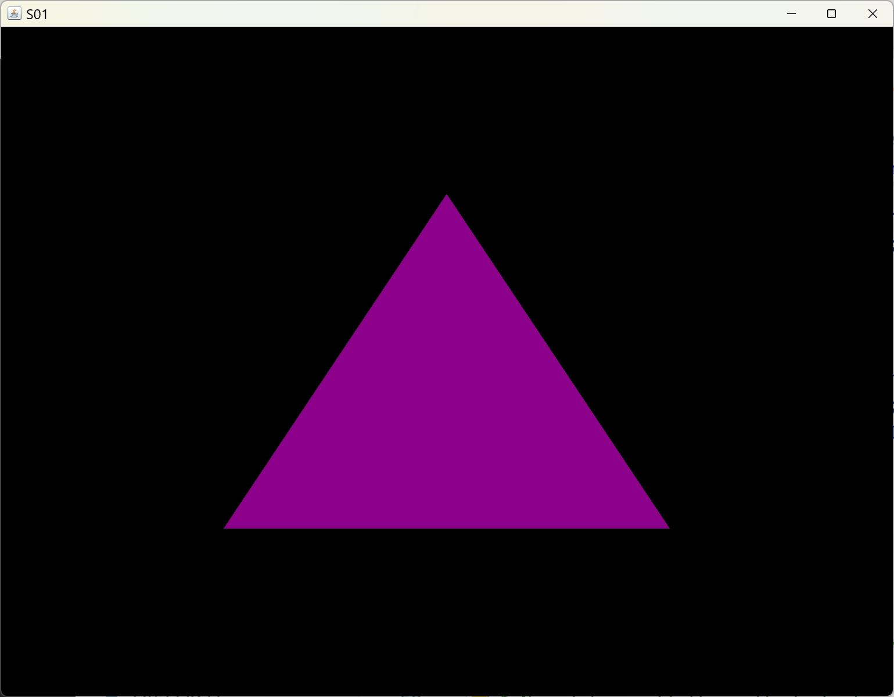
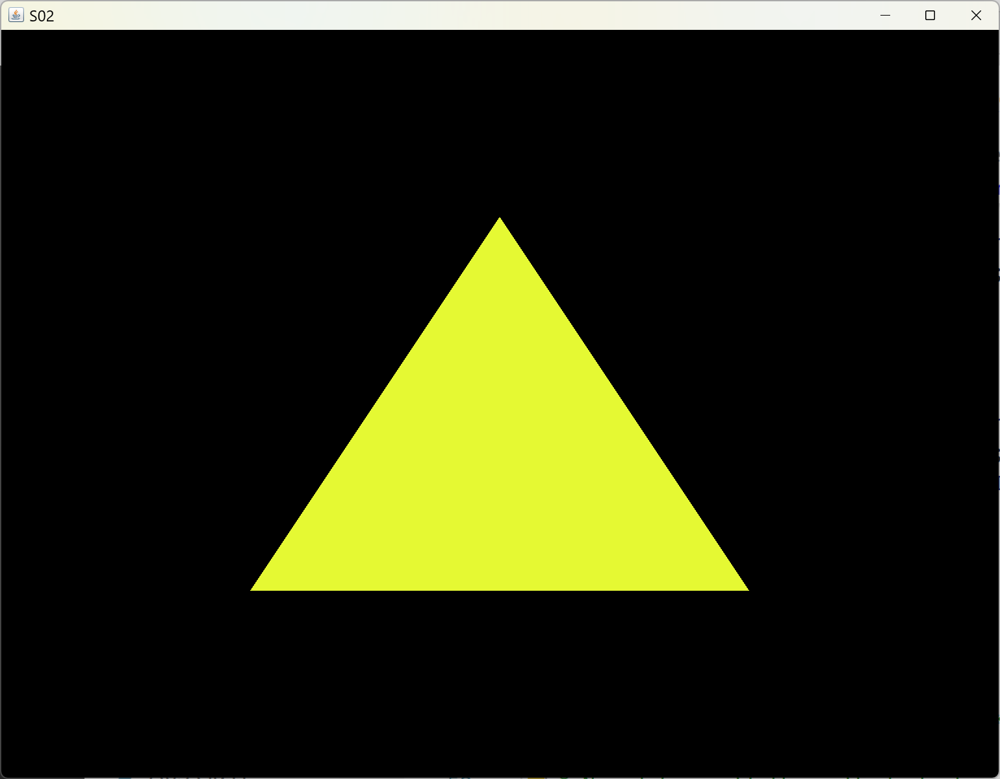
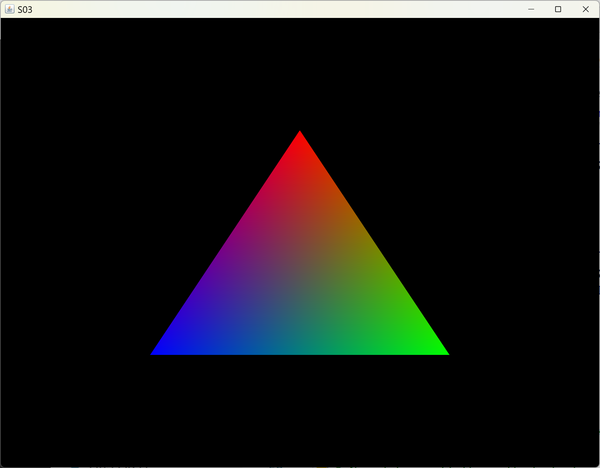

[main menu](../README.md)

# Chapter 3. Shaders

This chapter will look at shaders in more detail, including how to directly transfer data to the vertex and fragment shaders from the CPU - examples in previous sections have hard-coded data into the shaders as literal values (as well as making use of the vertex data from the vertex buffer on the GPU). Chapter 6 will extend this when we cover lighting.

This chapter is composed of three main sections:

1. [The basics of shaders](ch3_1.md)
2. [Dynamically changing the VBO data](ch3_2.md)
3. [A Shader class](ch3_3.md)

Section 3.1 deals with directly transferring data from the CPU to a GPU shader. For example, we might wish to change the colour of a triangle under the control of a program running on the CPU or alter the positions of the vertices of the triangle being drawn. 

Section 3.2 focuses on how to dynamically alter some of the vertex data stored on the GPU from the CPU program display loop before it is used by the shaders. We could alter some of the vertex data on the CPU and then send all the vertex data from the CPU to the GPU for each frame that is drawn in the display loop. However, this could be very costly, depending on the number of vertices. Instead, the program running on the CPU can transfer the data once to buffers on the GPU and then, as part of the display loop, manipulate individual vertex data that is already stored in the buffers (or buffers) on the GPU before rendering it using the shaders.

Section 3.3 separates out the shader code into a separate class. This simplifies the main program listing since the same shader class can be used in each subsequent program. In later sections, we'll revisit the shader class as the complexity of programs increases and we need multiple different shaders for our programs.

Figure 3.0 shows the output of the 5 programs used in Sections 3.1 to 3.3.

  .... 
  <strong>Figure 3.0.</strong> Output from programs S01, S02, S03, S04, S05.

[main menu](../README.md)
