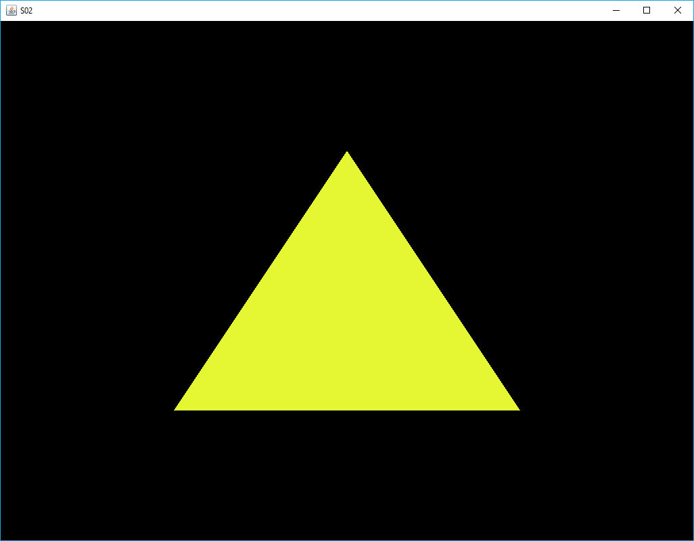
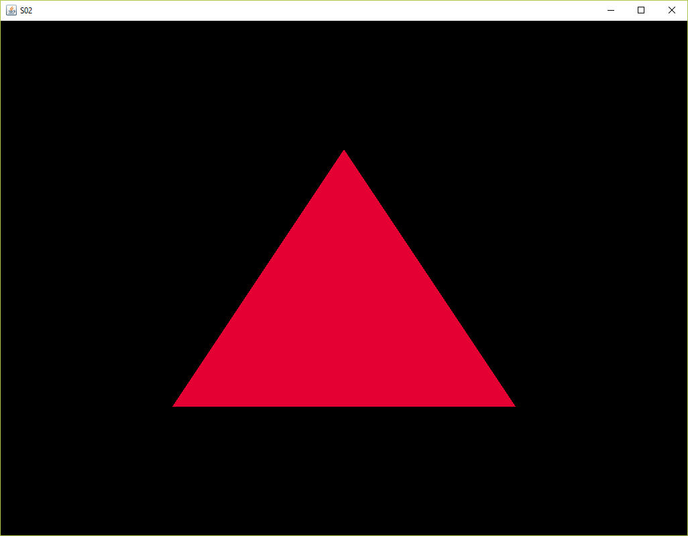
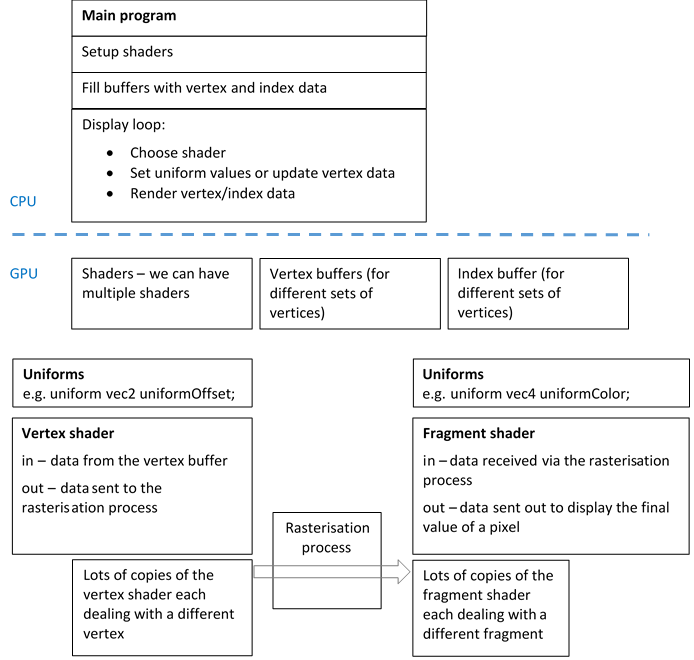

[back](ch3.md) | [main menu](../README.md)
 
## 3.1 The basics of shaders

This section builds on the initial discussion of shaders in the last chapter and discusses the kinds of data we can transfer from the CPU to the GPU and between shaders on the GPU. 

### 3.1.1 The ins and outs (attributes) of shaders

This program is similar to the programs we looked at in Chapter 2, as illustrated in Program Listing 3.1. We're still including everything to do with OpenGL in one class and we're still using an EBO, but only one triangle is used (Figure 3.1). However, now we're ready to 'get under the hood' and explain ìn more detail what is happening with regards shaders on the GPU.

```java
  import java.nio.*;
  import com.jogamp.common.nio.*;
  import com.jogamp.opengl.*;
  import com.jogamp.opengl.util.*;
  import com.jogamp.opengl.util.awt.*;
  import com.jogamp.opengl.util.glsl.*;
  
  public class S01_GLEventListener implements GLEventListener {
  
  public S01_GLEventListener() {
  }
  
  // ***************************************************
  /*
    * METHODS DEFINED BY GLEventListener
    */
  
  public void init(GLAutoDrawable drawable) {
  }
  
  public void reshape(GLAutoDrawable drawable, int x, int y, int width, int height) {
  }
  
  public void display(GLAutoDrawable drawable) {
  }
  
  public void dispose(GLAutoDrawable drawable) {
  }
  
  // *************************************************** 
  /* THE SCENE */
  
  // ***************************************************
  /* THE DATA */
  
  // ***************************************************
  /* THE BUFFERS */
  
  // ***************************************************
  /* THE SHADER */
  
  }
```

**Program Listing 3.1:** S01_GLEventListener.java

Program Listing 3.2 shows the shaders we will consider. These are stored as String variables. Later we will see how to load these from text files, which will produce a more flexible process since these can then be edited in any text editor.

```java
// ***************************************************
/* THE SHADER
  */

private String vertexShaderSource = 
  "#version 330 core\n" +
  "\n" +
  "layout (location = 0) in vec3 position;\n" +
  "\n" +
  "out vec4 aColor;\n" +       // colour is passed to rasterisation process
  "\n" +
  "void main() {\n" +
  "  gl_Position = vec4(position.x, position.y, position.z, 1.0);\n" +
  "  aColor = vec4(0.55f, 0.0f, 0.55f, 1.0f);\n" +     // vertex colour is set here
                                                        // - a shade of magenta
  "}";

private String fragmentShaderSource = 
  "#version 330 core\n" +
  "\n" +
  "out vec4 fragColor;\n" +
  "\n" +
  "in vec4 aColor;\n" +        // colour received from rasterisation process
  "\n" +
  "void main() {\n" +
  "  fragColor = aColor;\n" +  // output colour for fragment set to input colour
  "}";
```

**Program Listing 3.2a:** The shaders as listed in the program code

```glsl
#version 330 core

layout (location = 0) in vec3 position;
out vec4 aColor;

void main() {
  gl_Position = vec4(position.x, position.y, position.z, 1.0);
  aColor = vec4(0.55f, 0.0f, 0.55f, 1.0f);
}
```

**Program Listing 3.2b:** The vertex shader

```glsl
#version 330 core

out vec4 fragColor;
in vec4 aColor;

void main() {
  fragColor = aColor;
}
```

**Program Listing 3.2c:** The fragment shader

The GPU pipeline takes the sequence of vertices which describe triangles, manipulates each vertex with a separate instance of the vertex shader (all running in parallel, subject to available resources), then rasterises groups of three vertices making up a triangle to produce the set of fragments for a triangle. Rasterisation means that the values at the vertices of the triangle are bilinearly interpolated over the triangle to produce values for each fragment. For example, the vertex positions are bilinearly interpolated to produce the screen positions for each fragment.

In previous programs, the colour of a fragment was set to a specific (red, green, blue, alpha) value in the fragment shader. Since the same fragment shader was run for each fragment a triangle was rasterised into, every pixel in the triangle was the same colour. In Program Listing 3.2, the colour is instead set in the vertex shader and declared as an out variable with a matching in variable in the fragment shader. As an out variable, it is subject to the GPU's rasterisation process. In this case, since every vertex is set to the same colour, the rasterisation process will produce the same colour for each fragment!! We need a way to set each vertex to a different colour.

Consider the shader attributes in Program Listing 3.2. The keyword in indicates that data (attributes) is being transferred into a vertex shader or a fragment shader. The keyword out indicates that data (attributes) is being transferred to the next stage in the GPU's pipeline. The line #version 330 core indicates that the default core GLSL (GL Shading Language) version 3.30 is being used. 

In GLSL, the preferred method of defining the location of vertex attributes on the GPU is using layout(location = x). Thus the following line states that the vertex shader is expecting the vertex position to be defined in location 0: 

```glsl
layout (location = 0) in vec3 position
```

Any variable name could have been chosen. I used position since it indicates what the variable contains. I'll use the same name for this in every program. Within the body of the vertex shader, the variable glPosition (of type vec4) is set to a value. This is one of a small number of pre-defined variables on the GPU. This value must be set in the vertex shader and it is then automatically sent on to the next stage of the GPU pipeline. We do not have to state that it is an 'out' variable.

The vertex colour is also set in the vertex shader. The variable aColor (which I shall use in all subsequent programs) is used to store this: 

```glsl
gl_Position = vec4(position.x, position.y, position.z, 1.0);
aColor = vec4(0.55f, 0.0f, 0.55f, 1.0f);
```

We explicitly state that we want this value (attribute) to be passed on to the next stage in the GPU pipeline by using the keyword out (out vec4 aColor;) when we declare the variable in the vertex shader. 

The rasterisation stage then takes the positions and colours of three vertices (the GPU automatically handles the association using the index buffer) and creates the fragments of the triangle they define. Since the colour that is set in the vertex shader is a specific literal value and every vertex is set to the same colour value, then the rasterisation process will interpolate three vertices with the same colour value and thus each fragment will be the same colour. However, as we shall soon see, there is a way to set different colour values for each vertex.

In the fragment shader, the keyword 'in' states that a colour is input to the fragment shader. Important: the variable name, aColor is the same as the variable name declared as an 'out' variable in the vertex shader. The keyword 'out' indicates that the fragment shader produces an output colour. In this example, the body of the fragment shader simply sets the output attribute to the value of the input attribute.

It is worth noting at this stage that the main program running on the CPU is sending the following data to the GPU:

```java
private float[] vertices = {
  -0.5f, -0.5f, 0.0f,  // Bottom Left
   0.5f, -0.5f, 0.0f,  // Bottom Right
   0.0f,  0.5f, 0.0f   // Top middle
};

private int[] indices = {
  0, 1, 2
};
```

Only vertex position data is being sent. We could also send other data to the GPU, e.g. colours for each of the vertices. These are per-vertex attributes, which we'll look at later. First, we'll look at how to use 'uniforms'.

---

## MCQs (written by Google Gemini)

---

### 3.1.2 Uniforms

Uniforms can be used to pass data from the CPU application to the shaders on the GPU. A uniform can be accessed by either the vertex or fragment shader in the shader program object. The same uniform constant is available to every instance of the vertex and fragment shaders launched by a render call (e.g. glDrawElements()). Uniforms can be changed before subsequent render calls. Figures 3.2 shows what can be done by changing the value of a uniform representing the triangle colour before each call to render the triangle.

<p align="center">
  &nbsp;<br>
  <strong>Figure 3.2</strong> (a) A yellow triangle (b) A red triangle
</p>

Figure 3.4 illustrates the idea of uniforms on the GPU. For purposes of illustration, the figure associates them closely to either vertex or fragment shader. The important thing to note, however, is that there is only one copy of a uniform. For example, every copy of a vertex shader executing in parallel would share the same uniform. In theory, the uniform variable should be declared with the same name in both the vertex and fragment shader and can be accessed by any copy of either. In practice, I've just declared it in the shader it is being used in. 

<p align="center">
  <br>
  <strong>Figure 3.4???</strong> Multiple copies of the shaders handle the data on the GPU
</p>

In S02_GLEventListener.java, a uniform is declared in the fragment shader (see Program Listing 3.3). This variable, uniformColor, is declared as a vec4 meaning it has 4 floating point values. The first three are the colour and the fourth is the alpha channel. Setting the alpha channel to a value of 1 means the pixel is opaque and will overwrite what is already on the screen. Other values can be used for blending purposes, if the right openGL settings are engaged. We'll use an alpha of 1.

```java
private String fragmentShaderSource = 
  "#version 330 core\n" +
  "\n" +
  "out vec4 fragColor;\n" +
  "\n" +
  "uniform vec4 uniformColor;\n" +    // *** colour received from main application
  "\n" +
  "void main() {\n" +
  "  fragColor = uniformColor;\n" + 
  "}";
```

**Program Listing 3.3:** A uniform is declared in the fragment shader

The main application now needs to be changed to send a value to the uniform used by the fragment shader. Program Listing 3.4 shows the necessary changes.

The uniform declared in the fragment shader is accessed using glGetUniformLocation() with the shaderProgram and the name of the uniform supplied as parameters. The method glUniform4f can then be used to set the new values of the uniform, by supplying the 4 float values required, as indicated by the name of the method and because uniformColor was declared as a vec4 in the fragment shader. (Other versions can be used to set different numbers of values, e.g. glUniform3f, depending on how a variable has been declared.) The list of vertices is then drawn as in previous programs. 

```java
public void render(GL3 gl) {
  gl.glClear(GL.GL_COLOR_BUFFER_BIT | GL.GL_DEPTH_BUFFER_BIT);

  double elapsedTime = getSeconds() - startTime;

  gl.glUseProgram(shaderProgram);

  float redValue = 0.9f;                                                              // new
  float greenValue = (float)Math.sin(elapsedTime*5);                                  // new
  float blueValue = 0.2f;                                                             // new
  int vertexColourLocation = gl.glGetUniformLocation(shaderProgram, "uniformColor");  // new
  gl.glUniform4f(vertexColourLocation, redValue, greenValue, blueValue, 1.0f);        // new

  gl.glBindVertexArray(vertexArrayId[0]);
  gl.glDrawElements(GL.GL_TRIANGLES, indices.length, GL.GL_UNSIGNED_INT, 0);
  gl.glBindVertexArray(0);
}
```

**Program Listing 3.4:** The render method is updated to set the uniform in the fragment shader

In this example, rather than send the same colour value every time the triangle is rendered (60 times a second), the green value is changed every time the render method is called by using the system time (see Program Listings 3.4 and 3.5). As shown in Program Listing 3.5, the class attribute startTime is initialised when the init() method is called. Thereafter, as in Program Listing 3.4, this is used as the base value to get the amount of elapsed time. 

```java
  // ...

  public void init(GLAutoDrawable drawable) {   
    //...rest of method...
    startTime = getSeconds();
  }
  
  private double startTime;
  
  private double getSeconds() {
    return System.currentTimeMillis()/1000.0;
  }

  // ...
```

**Program Listing 3.5:** Methods to get the system time

Uniforms are one way to directly pass information to shaders. The second way is via buffers, as we have done with the vertex positions in all the programs so far. This is more flexible, since more data can be added to these buffers. This is called per-vertex attributes, which we'll look at in the next section.

---

## MCQs (written by Google Gemini)

---

## Exercises

1. Experiment with changing each component of the colour using the system time, i.e. redValue, greenValue and blueValue in method render() in S02_GLEventListener.java.
2. Add a uniform to the vertex shader that takes a vec2 value (an x and a y value) and then use this to move the triangle over time. (Hints: Create some variables in the render() method, e.g. dx and dy, and set the values using the elapsedTime variable - this is similar to redValue, greenValue and blueValue. You'll then need a different version of glUniform* to set the the values for the vec2 uniform you created in the vertex shader - a vec2 is 2 floating point values. Simple addition can be done in the vertex shader by adding the vec2 uniform values (v.x and v.y) to the vertex position, e.g. position.x+v.x and position.y+v.y) 

### 3.1.3 More attributes

In the last section, we looked at using a uniform to change the fragment colour. However, this changed the colour of every fragment. Instead, we'd like to be able to give each vertex a different colour, then the rasterisation process will produce a different colour for each fragment as it bilinearly interpolates the vertex colour values across the triangle (Figure 3.5). We can do this by adding extra attributes to the vertex data. 

Program Listing 3.6 shows the changes to the vertex data structure. Three extra attributes are added to each vertex. These are the red, green and blue values of the colour at a vertex, each in the range 0.0..1.0. I've also introduced three class attributes that describe the vertex data and which are used when dealing with the buffers. The vertexStride variable states how big each set of attributes for a vertex is, in this case 6 floats. The vertexXYZFloats is 3 and the vertexColorFloats is 3.


```java
private float[] vertices = {
  -0.5f, -0.5f, 0.0f, 0.0f, 0.0f, 1.0f, // Bottom Left, blue (r=0, g=0, b=1)
   0.5f, -0.5f, 0.0f, 0.0f, 1.0f, 0.0f, // Bottom Right, green
   0.0f,  0.5f, 0.0f, 1.0f, 0.0f, 0.0f  // Top middle, red
};

private int vertexStride = 6;
private int vertexXYZFloats = 3;
private int vertexColourFloats = 3;

private int[] indices = {
  0, 1, 2
};
```

**Program Listing 3.6:** Changes to the vertex data structure

The shaders are given in Program Listing 3.7. The vertex shader is changed to receive the colour value of a vertex in attribute location 1. Thus it will expect the main application to send it a colour value for each vertex in the same way that we have been sending a position value for each vertex using the relevant data buffer. That colour per vertex is then sent through the GPU's rasterization process to the fragment shader. However, since the colour at each vertex is different, the fragments of the triangle will all be different colours (based on bilinearly interpolating the values at the vertices).

```java
private String vertexShaderSource = 
  "#version 330 core\n" +
  "\n" +
  "layout (location = 0) in vec3 position;\n" +
  "layout (location = 1) in vec3 color;\n" +
  "out vec3 aColor;\n" +
  "\n" +
  "void main() {\n" +
  "  gl_Position = vec4(position, 1.0);\n" +
  "  aColor = color;\n" +
  "}";

private String fragmentShaderSource = 
  "#version 330 core\n" +
  "in vec3 aColor;\n" +
  "out vec4 fragColor;\n" +
  "\n" +
  "void main() {\n" +
  "  fragColor = vec4(aColor, 1.0f);\n" +
  "}";
```

The GPU buffers must be filled with the vertex attribute data. Program Listing 3.8 shows the relevant method. The key part is highlighted. 

The first part is the same as previous programs and describes how the vertex position data is transferred to attribute location 0 in the vertex shader. The class variables declared in Program Listing 3.6 are used. The stride variable states how big each set of attributes for a vertex is, in this case 6 floats, as stored in the class attribute vertexStride (see Program Listing 3.6). The numXYZFloats is 3. The xyz position data is stored at offset 0 in the vertices data, i.e. it is the first 3 floats in each set of 6 floats for a vertex.

The second part describes how the colour dat is transferred to attribute location 1 in the vertex shader. The numColorFloats is 3. The offset is changed to 3*Float.BYTES when describing the colour data, since this data comes after the 3 floats, i.e. it is the second set of 3 floats in each set of 6 floats for a vertex. The colour data is transferred to attribute location 1 in the vertex shader. 

```java
private void fillBuffers(GL3 gl) {
    gl.glGenVertexArrays(1, vertexArrayId, 0);
    gl.glBindVertexArray(vertexArrayId[0]);
    gl.glGenBuffers(1, vertexBufferId, 0);
    gl.glBindBuffer(GL.GL_ARRAY_BUFFER, vertexBufferId[0]);
    FloatBuffer fb = Buffers.newDirectFloatBuffer(vertices);
    
    gl.glBufferData(GL.GL_ARRAY_BUFFER, Float.BYTES * vertices.length,
                    fb, GL.GL_STATIC_DRAW);
    
    int stride = vertexStride;                                       // ***
    int numXYZFloats = vertexXYZFloats;                              // ***
    int offset = 0;                                                  // ***
    gl.glVertexAttribPointer(0, numXYZFloats, GL.GL_FLOAT, false,    // ***
                              stride*Float.BYTES, offset);           // ***
    gl.glEnableVertexAttribArray(0);                                 // ***
  
    int numColorFloats = vertexColourFloats;                         // ***
    offset = numXYZFloats*Float.BYTES;                               // ***
    gl.glVertexAttribPointer(1, numColorFloats, GL.GL_FLOAT, false,  // ***
                              stride*Float.BYTES, offset);           // ***
    gl.glEnableVertexAttribArray(1);                                 // ***
  
    gl.glGenBuffers(1, elementBufferId, 0);
    IntBuffer ib = Buffers.newDirectIntBuffer(indices);
    gl.glBindBuffer(GL.GL_ELEMENT_ARRAY_BUFFER, elementBufferId[0]);
    gl.glBufferData(GL.GL_ELEMENT_ARRAY_BUFFER, Integer.BYTES * indices.length,
                    ib, GL.GL_STATIC_DRAW);
    gl.glBindVertexArray(0);
  }
  ```

**Program Listing 3.8:** Changes to fillBuffers()  

Program Listing 3.9 gives the render method. This is unchanged from previous programs. All the work has been done in the fillBuffers method to set up the description of how to transfer data to the GPU. Note how indices.length is used. We can thus easily change the number of vertices and triangles in the data structure and the main render method would continue to work. 

```java
public void render(GL3 gl) {
  gl.glClear(GL.GL_COLOR_BUFFER_BIT | GL.GL_DEPTH_BUFFER_BIT);

  gl.glUseProgram(shaderProgram);

  gl.glBindVertexArray(vertexArrayId[0]);
  gl.glDrawElements(GL.GL_TRIANGLES, indices.length, GL.GL_UNSIGNED_INT, 0);
  gl.glBindVertexArray(0);
}
```

**Program Listing 3.9:** render()

---

## MCQs (written by Google Gemini)

---

## Exercises

1. Experiment with changing the position and colour values in the data structure and then running the program to see the effects. Try to predict the effect before running the program. For example, if you change the colours for specific vertices, what happens? If you change the x,y,z positions of particular vertices, what happens?   IDEA: give pictures of specific triangles to achieve?