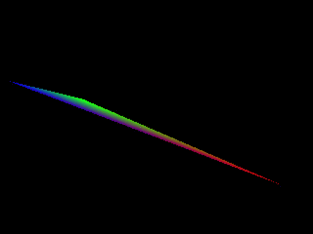

## 3.2 Dynamically changing the VBO data

This example shows how to change the data for a vertex whilst the program is running. This could be done by (i) changing the vertex data for one or more vertices on the CPU and then sending all the vertex data to the GPU for each iteration of the display loop, or (ii) sending all the vertex data once and then 'reaching over' to the GPU and altering the data for some (or all) of the vertices on the GPU during the display loop. The second option means that we don't have to keep sending all the data (although we still have to send the changed data). Figure 3.6 illustrates the results of changing all the vertex positions over time. A similar approach could be used to change a subset of a collection of vertices. (We'll see in later chapters that we instead use matrices to manipulate, i.e. transform, collections of vertices for 3D objects.)

<p align="center">
  <br>
  <strong>Figure 3.6???</strong> A changing triangle
</p>

Program Listing 3.10 gives a method to change the xyz position value of a single vertex and a method to change the colour value of a single vertex. The first method uses the index of the vertex in the list multiplied by the stride to access the specific vertex in the list of vertex data. The second method uses a modified version that takes into account that the colour values come after the xyz position values in the set of values for a single vertex. Thus vertexXYZFloats = 3 (the number of floats in the xyz position data) is required. The render method is updated accordingly to make use of the method to change the values (see Program Listing 3.11). 

The two methods in Program Listing 3.10 are very similar and both rely on particular class attributes. It would be possible to rewrite them to improve on efficiency, readability and maintainability. For example, the parameters of the second method could be r, g and b, rather than x, y and z to improve readability/understandability. However, I have written them in this way to make the similarities of the two methods clear to focus on what is happening when accessing the data on the GPU. 

Note: In previous versions of fillbuffers(), glBufferData() has been using GL.GL_STATIC_DRAW when setting up the buffer for the vertex data. Now that the data is changing with every call to render, this is changed to GL.GL_DYNAMIC_DRAW. (There is some argument as to whether or not it is necessary to change GL.GL_STATIC_DRAW to GL.GL_DYNAMIC_DRAW as modern hardware/drivers can automatically manage this.) 

```java
private void replaceVBO_XYZ(GL3 gl, int index, float x, float y, float z) {
  float[] aVertex = {x,y,z};
  gl.glBindBuffer(GL.GL_ARRAY_BUFFER, vertexBufferId[0]);
  FloatBuffer fb = Buffers.newDirectFloatBuffer(aVertex);
  gl.glBufferSubData(GL.GL_ARRAY_BUFFER, 
                      Float.BYTES * index * vertexStride, 
                      Float.BYTES * aVertex.length, fb);
  gl.glBindBuffer(GL.GL_ARRAY_BUFFER, 0);
}

private void replaceVBO_RGB(GL3 gl, int index, float x, float y, float z) {
  float[] aVertex = {x,y,z};
  gl.glBindBuffer(GL.GL_ARRAY_BUFFER, vertexBufferId[0]);
  FloatBuffer fb = Buffers.newDirectFloatBuffer(aVertex);
  gl.glBufferSubData(GL.GL_ARRAY_BUFFER, 
                      Float.BYTES * (index * vertexStride + vertexXYZFloats), // *** difference
                      Float.BYTES * aVertex.length, fb);
  gl.glBindBuffer(GL.GL_ARRAY_BUFFER, 0);
}
```

**Program Listing 3.10:** Changing the xyz position and colour values of a single vertex in the relevant GPU buffer

Program Listing 3.11 makes use of the methods from Program Listing 3.10 to alter all three vertices of a triangle during the display loop. The XYZ position of each vertex is altered by making use of the elapsedTime variable. Variations of sin and cos are used to alter each vertex differently (so as to keep values in the range 0 to 1).

Note: there is no error checking in Program Listing 3.10, so the calling method in Program Listing 3.11 must supply a valid vertex index (i.e. 0, 1 or 2, in this case) or the program will crash.


```java
public void render(GL3 gl) {
  gl.glClear(GL.GL_COLOR_BUFFER_BIT | GL.GL_DEPTH_BUFFER_BIT);
  double elapsedTime = getSeconds() - startTime;
  replaceVBO_XYZ(gl, 0, (float)Math.sin(elapsedTime), (float)Math.cos(elapsedTime), 0);
  replaceVBO_XYZ(gl, 1, (float)Math.sin(elapsedTime)*0.5f,
                        (float)Math.cos(elapsedTime)*0.5f, 0);
  replaceVBO_XYZ(gl, 2, (float)Math.cos(elapsedTime*0.5),
                        (float)Math.sin(elapsedTime*0.5), 0);
  gl.glUseProgram(shaderProgram);
  gl.glBindVertexArray(vertexArrayId[0]);
  gl.glDrawElements(GL.GL_TRIANGLES, indices.length, GL.GL_UNSIGNED_INT, 0);
  gl.glBindVertexArray(0);   // can be omitted
}
```

**Program Listing 3.11:** render()

---

## MCQs (written by Google Gemini)

---

## Exercises

1. Experiment with changing the rgb colour values of the vertices, in addition to the xyz values. (Hint: This can be done by calling replaceVBO_RGB.)

