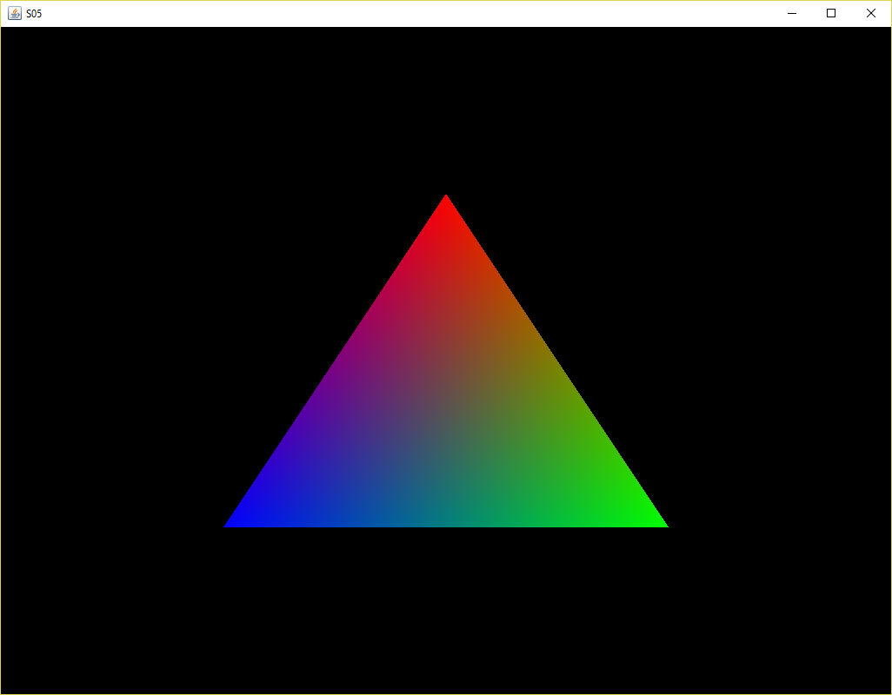

[back](ch3.md) | [main menu](../README.md)

## 3.3 A Shader class

Program: [S05.java](/ch3_shaders)

In all the previous programs, the code to set up the shaders has remained unchanged, even if the source for the vertex and fragment shaders has changed. It makes sense to separate the shader code out into a separate class and load the shaders from file. The new class is Shader.java (see Program listing 3.12 for part of this). The majority of the code in Program Listing 3.12 is the same as previous examples, namely method compileAndLink(). The constructor loads the source code from the relevant text files. There are also some extra methods in Shader.java which can be used to set particular uniform values in the shaders. 

```java
import java.io.IOException;
import java.nio.file.Files;
import java.nio.file.Paths;
import java.nio.charset.Charset;
import com.jogamp.opengl.*;
import com.jogamp.opengl.util.glsl.*;  

public class Shader {

  private static final boolean DISPLAY_SHADERS = false;

  private int ID;
  private String vertexShaderSource;
  private String fragmentShaderSource;

  /* The constructor */
  public Shader(GL3 gl, String vertexPath, String fragmentPath) {
    try {
      vertexShaderSource = new String(Files.readAllBytes(Paths.get(vertexPath)), 
                                      Charset.defaultCharset());
      fragmentShaderSource = new String(Files.readAllBytes(Paths.get(fragmentPath)), 
                                        Charset.defaultCharset());
    }
    catch (IOException e) {
      e.printStackTrace();
    }
    if (DISPLAY_SHADERS) display();
    ID = compileAndLink(gl);
  }

  public int getID() {
    return ID;
  }

  public void use(GL3 gl) {
    gl.glUseProgram(ID);
  }

  public void setInt(GL3 gl, String name, int value) {
    int location = gl.glGetUniformLocation(ID, name);
    gl.glUniform1i(location, value);
  }

  public void setFloat(GL3 gl, String name, float value) {
    int location = gl.glGetUniformLocation(ID, name);
    gl.glUniform1f(location, value);
  }

  public void setFloat(GL3 gl, String name, float f1, float f2) {
    int location = gl.glGetUniformLocation(ID, name);
    gl.glUniform2f(location, f1, f2);
  }

  public void setFloat(GL3 gl, String name, float f1, float f2, float f3) {
    int location = gl.glGetUniformLocation(ID, name);
    gl.glUniform3f(location, f1, f2, f3);
  }

  public void setFloat(GL3 gl, String name, float f1, float f2, float f3, float f4) {
    int location = gl.glGetUniformLocation(ID, name);
    gl.glUniform4f(location, f1, f2, f3, f4);
  }

  private void display() {
    System.out.println("***Vertex shader***");
    System.out.println(vertexShaderSource);
    System.out.println("\n***Fragment shader***");
    System.out.println(fragmentShaderSource);
  }

  private int compileAndLink(GL3 gl) {
    String[][] sources = new String[1][1];
    sources[0] = new String[]{ vertexShaderSource };
    ShaderCode vertexShaderCode = new ShaderCode(GL3.GL_VERTEX_SHADER, sources.length, sources);
    boolean compiled = vertexShaderCode.compile(gl, System.err);
    if (!compiled)
      System.err.println("[error] Unable to compile vertex shader: " + sources);
    sources[0] = new String[]{ fragmentShaderSource };
    ShaderCode fragmentShaderCode = new ShaderCode(GL3.GL_FRAGMENT_SHADER, sources.length, sources);
    compiled = fragmentShaderCode.compile(gl, System.err);
    if (!compiled)
      System.err.println("[error] Unable to compile fragment shader: " + sources);
    ShaderProgram program = new ShaderProgram();
    program.init(gl);
    program.add(vertexShaderCode);
    program.add(fragmentShaderCode);
    program.link(gl, System.out);
    if (!program.validateProgram(gl, System.out))
      System.err.println("[error] Unable to link program");
    return program.program();
  }

}
```

**Program listing 3.12:** Shader.java

S05_GLEventListener.java (Program Listing 3.13 for some of this) makes use of the Shader class. A private variable called shader of type Shader is declared as an attribute of the class and an instance of this is created in method initialise(), which also loads the text files vs_S05.txt and fs_S05.txt (Program Listings 3.14 and 3.15, respectively) which are the vertex and fragment shader source code, respectively. Method render() can then use the shader variable with the call shader.use(gl). The output of S05 is shown in Figure 3.5.

```java
/* THE SCENE */
  
public void initialise(GL3 gl) {
  shader = new Shader(gl, "vs_S05.txt", "fs_S05.txt");
  fillBuffers(gl);
}

public void render(GL3 gl) {
  gl.glClear(GL.GL_COLOR_BUFFER_BIT | GL.GL_DEPTH_BUFFER_BIT);

  shader.use(gl);

  gl.glBindVertexArray(vertexArrayId[0]);
  gl.glDrawElements(GL.GL_TRIANGLES, indices.length, GL.GL_UNSIGNED_INT, 0);
  gl.glBindVertexArray(0);
}
```

**Program listing 3.13:** Part of S05_GLEventListener.java

<p align="center">
  <br>
  <strong>Figure 3.5.</strong> A triangle
</p>

```glsl
#version 330 core
  
layout (location = 0) in vec3 position;
layout (location = 1) in vec3 color;
out vec3 aColor;

void main() {
  gl_Position = vec4(position.x, position.y, position.z, 1.0);
  aColor = color;
}
```

**Program listing 3.14:** Vertex shader vs_S05.txt

```glsl
 #version 330 core
  
in vec3 aColor;
out vec4 fragColor;

void main() {
  fragColor = vec4(aColor, 1.0f);
}
```

**Program listing 3.15:** Fragment shader fs_S05.txt

---

## MCQs (written in collaboration with Google Gemini)

<p>1. What is the primary purpose of the Shader.java class introduced in the provided text?</p>

<details>
<summary>a) It simplifies the process of compiling and linking shader code from string variables.</summary>
<p><b>Incorrect.</b> While the class does contain the compileAndLink() method, its main purpose is to encapsulate the entire shader setup process, including loading from files and providing utility methods for use, not just compiling from strings.</p>
</details>

<details>
<summary>b) It allows for the loading and management of multiple textures within a single program.</summary>
<p><b>Incorrect.</b> The text explicitly states that a separate TextureLibrary class is used for loading and managing multiple textures, not the Shader class.</p>
</details>

<details>
<summary>c) It provides a convenient way to encapsulate shader-related code, load shaders from files, and provide utility methods for setting uniform values.</summary>
<p><b>Correct.</b> The text explains that the class separates shader code into its own class to make the process more flexible, loads shader source from text files, and includes methods like setInt() and setFloat() to make setting uniform values easier.</p>
</details>

<details>
<summary>d) It is an OpenGL built-in class for handling all shader operations.</summary>
<p><b>Incorrect.</b> The Shader.java class is a custom-written Java class, as indicated by the import statements and the provided source code, not a part of the standard OpenGL or JOGL libraries.</p>
</details>

<p>2. In the Shader.java class, what does the use(GL3 gl) method achieve?</p>

<details>
<summary>a) It binds a specific Vertex Array Object (VAO) for drawing.</summary>
<p><b>Incorrect.</b> A separate call to gl.glBindVertexArray() is used for binding a VAO. The shader.use(gl) method activates the shader program on the GPU.</p>
</details>

<details>
<summary>b) It loads the source code for the vertex and fragment shaders from disk.</summary>
<p><b>Incorrect.</b> This action is handled by the Shader class's constructor, which reads the shader files from the specified paths.</p>
</details>

<details>
<summary>c) It compiles and links the vertex and fragment shaders into a single program.</summary>
<p><b>Incorrect.</b> This is the function of the compileAndLink() method, which is called by the constructor after the shader source is loaded.</p>
</details>

<details>
<summary>d) It makes the compiled shader program the active one for all subsequent rendering commands.</summary>
<p><b>Correct.</b> The shader.use(gl) method is a wrapper for gl.glUseProgram(ID), which tells the GPU to use this specific shader program for drawing operations until a new program is used.</p>
</details>

<p>3. What is the correct way to set a vec4 uniform variable named triangleColor in a shader using the methods provided in the Shader.java class?</p>

<details>
<summary>a) shader.setFloat(gl, triangleColor, red, green, blue, alpha);</summary>
<p><b>Correct.</b> The setFloat method is overloaded to accept different numbers of floats. The text explicitly provides an example of a setFloat method that takes four float values, which is the correct way to set a vec4 uniform.</p>
</details>

<details>
<summary>b) shader.setInt(gl, triangleColor, r, g, b, a);</summary>
<p><b>Incorrect.</b> The setInt method is specifically for integer uniforms, and it only takes a single integer value as an argument, not four floats.</p>
</details>

<details>
<summary>c) shader.setFloat(gl, triangleColor, 4);</summary>
<p><b>Incorrect.</b> This method only takes a single float value. To set a vec4, you need to pass four separate float values representing the red, green, blue, and alpha channels.</p>
</details>

<details>
<summary>d) shader.use(gl, triangleColor, r, g, b, a);</summary>
<p><b>Incorrect.</b> The use() method only takes a GL3 object and is used to activate the shader program as a whole, not to set individual uniform values.</p>
</details>

---

## Exercises

1. Adjust the vertex shader (vs_S05.txt in Program Listing 3.14) so that the triangle is drawn upside down. (Hint: This can be done by manipulating the position values in the vertex shader when assigning them to gl_Position rather than by editing the data section of the main program.) [Solution]

2. Specify a horizontal offset via a uniform and move the triangle to the right side of the screen in the vertex shader using this offset value. (Hint: add some constant offset values in the vertex shader or declare a uniform and fill in the values by linking to this in the render method.) [Solution]

[back](ch3.md) | [main menu](../README.md)