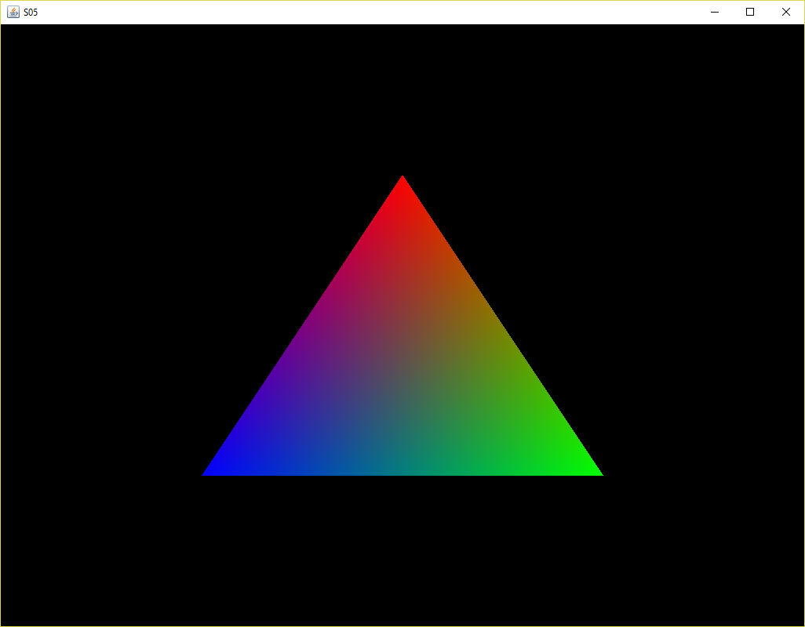

## 3.3 A Shader class

In all the previous programs, the code to set up the shaders has remained unchanged, even if the source for the vertex and fragment shaders has changed. It makes sense to separate the shader code out into a separate class and load the shaders from file. The new class is Shader.java (see Program listing 3.12 for part of this). The majority of the code in Program Listing 3.12 is the same as previous examples, namely method compileAndLink(). The constructor loads the source code from the relevant text files. There are also some extra methods in Shader.java which can be used to set particular uniform values in the shaders. 

```java
import java.io.IOException;
import java.nio.file.Files;
import java.nio.file.Paths;
import java.nio.charset.Charset;
import com.jogamp.opengl.*;
import com.jogamp.opengl.util.glsl.*;  

public class Shader {

  private static final boolean DISPLAY_SHADERS = false;

  private int ID;
  private String vertexShaderSource;
  private String fragmentShaderSource;

  /* The constructor */
  public Shader(GL3 gl, String vertexPath, String fragmentPath) {
    try {
      vertexShaderSource = new String(Files.readAllBytes(Paths.get(vertexPath)), 
                                      Charset.defaultCharset());
      fragmentShaderSource = new String(Files.readAllBytes(Paths.get(fragmentPath)), 
                                        Charset.defaultCharset());
    }
    catch (IOException e) {
      e.printStackTrace();
    }
    if (DISPLAY_SHADERS) display();
    ID = compileAndLink(gl);
  }

  public int getID() {
    return ID;
  }

  public void use(GL3 gl) {
    gl.glUseProgram(ID);
  }

  public void setInt(GL3 gl, String name, int value) {
    int location = gl.glGetUniformLocation(ID, name);
    gl.glUniform1i(location, value);
  }

  public void setFloat(GL3 gl, String name, float value) {
    int location = gl.glGetUniformLocation(ID, name);
    gl.glUniform1f(location, value);
  }

  public void setFloat(GL3 gl, String name, float f1, float f2) {
    int location = gl.glGetUniformLocation(ID, name);
    gl.glUniform2f(location, f1, f2);
  }

  public void setFloat(GL3 gl, String name, float f1, float f2, float f3) {
    int location = gl.glGetUniformLocation(ID, name);
    gl.glUniform3f(location, f1, f2, f3);
  }

  public void setFloat(GL3 gl, String name, float f1, float f2, float f3, float f4) {
    int location = gl.glGetUniformLocation(ID, name);
    gl.glUniform4f(location, f1, f2, f3, f4);
  }

  private void display() {
    System.out.println("***Vertex shader***");
    System.out.println(vertexShaderSource);
    System.out.println("\n***Fragment shader***");
    System.out.println(fragmentShaderSource);
  }

  private int compileAndLink(GL3 gl) {
    String[][] sources = new String[1][1];
    sources[0] = new String[]{ vertexShaderSource };
    ShaderCode vertexShaderCode = new ShaderCode(GL3.GL_VERTEX_SHADER, sources.length, sources);
    boolean compiled = vertexShaderCode.compile(gl, System.err);
    if (!compiled)
      System.err.println("[error] Unable to compile vertex shader: " + sources);
    sources[0] = new String[]{ fragmentShaderSource };
    ShaderCode fragmentShaderCode = new ShaderCode(GL3.GL_FRAGMENT_SHADER, sources.length, sources);
    compiled = fragmentShaderCode.compile(gl, System.err);
    if (!compiled)
      System.err.println("[error] Unable to compile fragment shader: " + sources);
    ShaderProgram program = new ShaderProgram();
    program.init(gl);
    program.add(vertexShaderCode);
    program.add(fragmentShaderCode);
    program.link(gl, System.out);
    if (!program.validateProgram(gl, System.out))
      System.err.println("[error] Unable to link program");
    return program.program();
  }

}
```

**Program listing 3.12:** Shader.java

S05_GLEventListener.java (Program Listing 3.13 for some of this) makes use of the Shader class. A private variable called shader of type Shader is declared as an attribute of the class and an instance of this is created in method initialise(), which also loads the text files vs_S05.txt and fs_S05.txt (Program Listings 3.14 and 3.15, respectively) which are the vertex and fragment shader source code, respectively. Method render() can then use the shader variable with the call shader.use(gl). The output of S05 is shown in Figure 3.7.

```java
/* THE SCENE */
  
public void initialise(GL3 gl) {
  shader = new Shader(gl, "vs_S05.txt", "fs_S05.txt");
  fillBuffers(gl);
}

public void render(GL3 gl) {
  gl.glClear(GL.GL_COLOR_BUFFER_BIT | GL.GL_DEPTH_BUFFER_BIT);

  shader.use(gl);

  gl.glBindVertexArray(vertexArrayId[0]);
  gl.glDrawElements(GL.GL_TRIANGLES, indices.length, GL.GL_UNSIGNED_INT, 0);
  gl.glBindVertexArray(0);
}
```

**Program listing 3.13:** Part of S05_GLEventListener.java

<p align="center">
  <br>
  <strong>Figure 3.7.</strong> A triangle
</p>

```glsl
#version 330 core
  
layout (location = 0) in vec3 position;
layout (location = 1) in vec3 color;
out vec3 aColor;

void main() {
  gl_Position = vec4(position.x, position.y, position.z, 1.0);
  aColor = color;
}
```

**Program listing 3.14:** Vertex shader vs_S05.txt

```glsl
 #version 330 core
  
in vec3 aColor;
out vec4 fragColor;

void main() {
  fragColor = vec4(aColor, 1.0f);
}
```

**Program listing 3.15:** Fragment shader fs_S05.txt

## Exercises

1. Adjust the vertex shader (vs_S05.txt in Program Listing 3.14) so that the triangle is drawn upside down. (Hint: This can be done by manipulating the position values in the vertex shader when assigning them to gl_Position rather than by editing the data section of the main program.) [Solution]

2. Specify a horizontal offset via a uniform and move the triangle to the right side of the screen in the vertex shader using this offset value. (Hint: add some constant offset values in the vertex shader or declare a uniform and fill in the values by linking to this in the render method.) [Solution]

