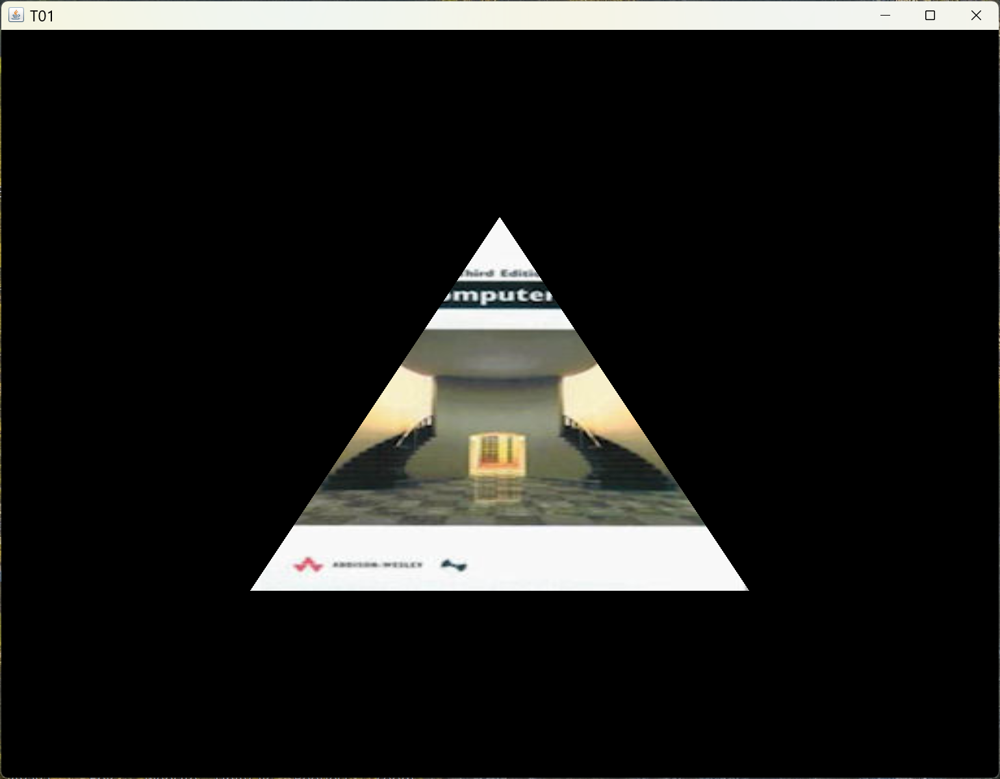
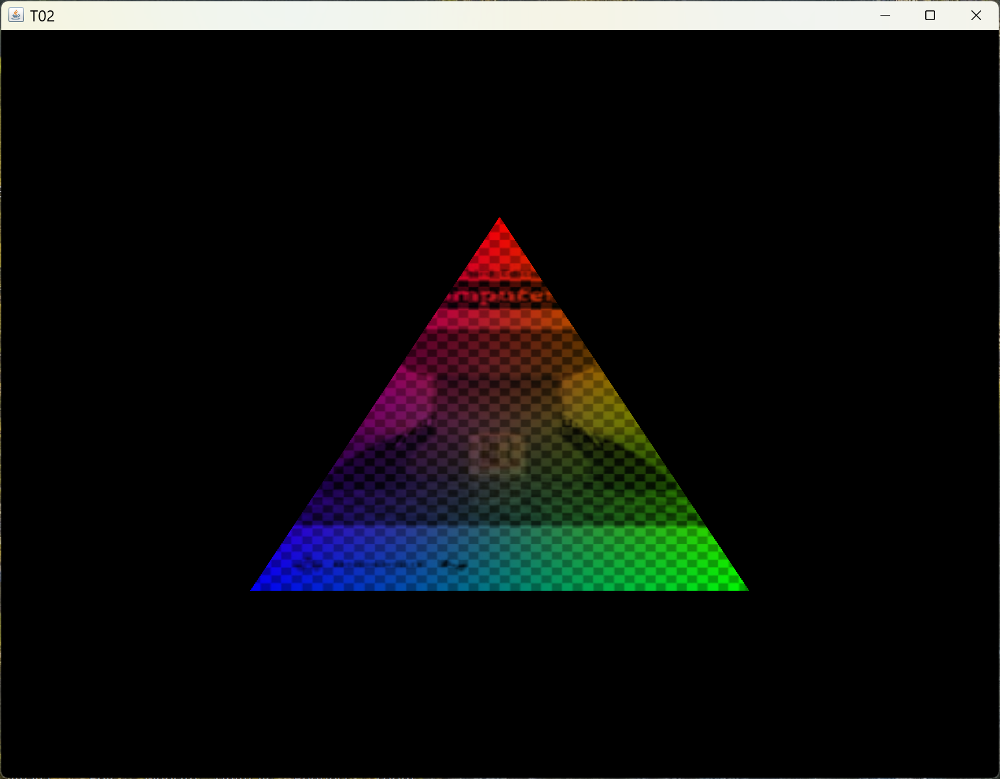
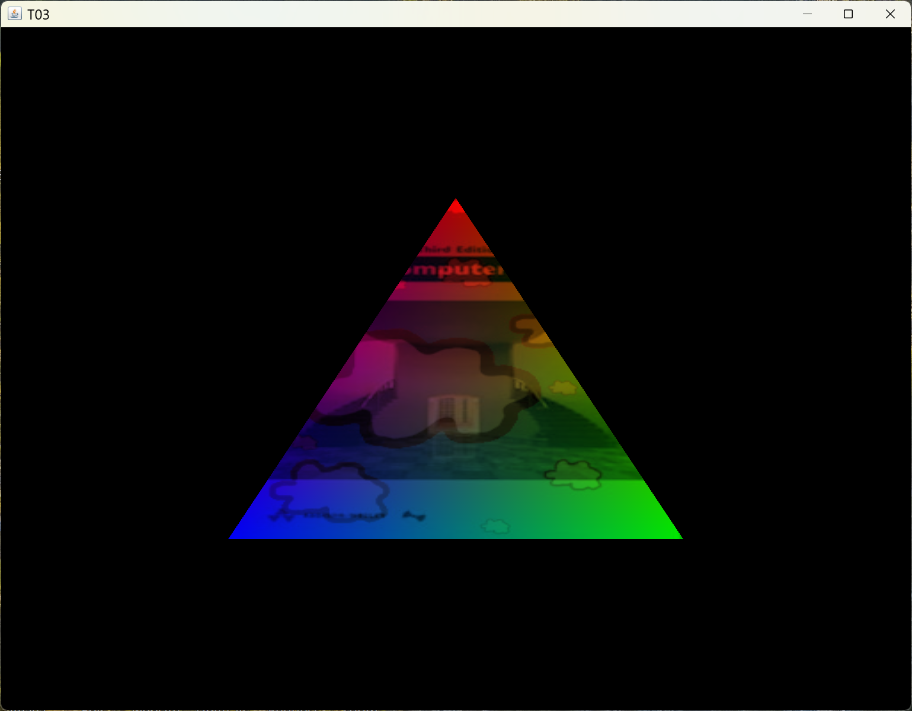
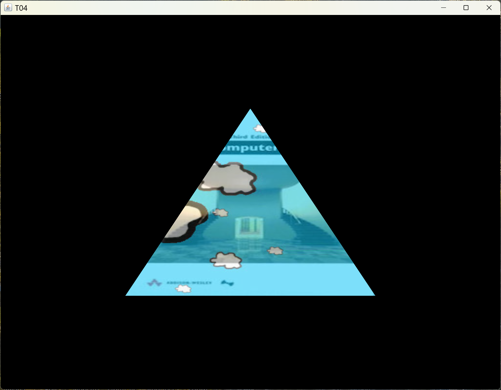
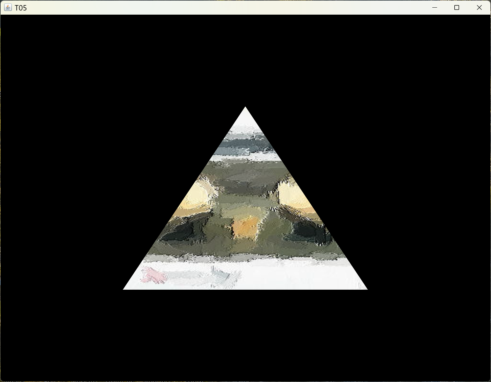

[main menu](../README.md)

# Chapter 4. Textures

This Chapter follows [Joey de Vries's tutorial section on Textures](https://learnopengl.com/Getting-started/Textures). Please read this before continuing. I will assume you have read it when describing the changes for JOGL.

A 'texture' is stored in a bitmap file (e.g. a jpg image) and can be used to colour a set of polygons. We'll look at the theory of this in lectures. In this tutorial, we'll look at the practicalities. I'll follow Joey's tutorial as I describe how to make the changes necessary for JOGL.

This chapter is composed of three main sections:

1. [The basics of using textures](ch4_1.md)
2. [Texture Units](ch4_2.md)
3. [Dynamic textures and changing textures](ch4_3.md)

Section 4.1 describes what a texture coordinate is, makes use of a TextureLibrary class, and shows how to use this to texture a triangle.

Section 4.2 demonstrates the use of multiple textures. Efficiency issues are also discussed.

Section 4.3 shows that a texture can be dynamically altered during a display loop or switched to a completely different texture.

Figure 4.0 shows the output of the 5 programs used in Section 4.1 to 4.3.

  .... 
  <strong>Figure 4.0.</strong> Output from programs T01, T02, T03, T04, T05.

[main menu](../README.md)