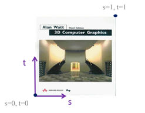
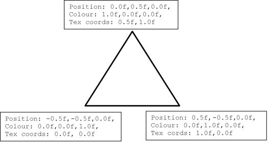

[back](ch4.md) | [main menu](../README.md)
 
## 4.1 The basics of using textures

We'll continue to use a single triangle for our examples. In later Chapters we'll move to 3D objects composed of multiple triangles. For now, however, a simple data item makes examples and explanation easier.

---

### 4.1.1 Texture coordinates

Program: [T01.java](/ch4_textures)

This first program loads a picture called 'wattBook.jpg' (Figure 4.1) and uses this to colour a single triangle (Figure 4.2). Figure 4.3 describes the data for each vertex, which matches the data in Program Listing 4.1.

<p align="center">
  <br>
  <strong>Figure 4.1.</strong> Filename 'wattBook.jpg' with overlaid texture coordinate system.
</p>

<p align="center">
  <br>
  <strong>Figure 4.2.</strong> Output from T01.java..
</p>

<p align="center">
  <br>
  <strong>Figure 4.3.</strong> The data for a triangle: vertex position (x,y,z), vertex colour (r,g,b), texture coordinates (s,t).
</p>

```java
private float[] vertices = { 
    // position (3 floats), colour (3 floats), tex cords (2 floats)
    0.0f,  0.5f, 0.0f,  1.0f, 0.0f, 0.0f,  0.5f, 1.0f,
    0.5f, -0.5f, 0.0f,  0.0f, 1.0f, 0.0f,  1.0f, 0.0f,
    -0.5f, -0.5f, 0.0f,  0.0f, 0.0f, 1.0f,  0.0f, 0.0f
};

private int vertexStride = 8;
private int vertexXYZFloats = 3;
private int vertexColourFloats = 3;
private int vertexTexFloats = 2;

private int[] indices = {
    0, 1, 2
};
```

**Program Listing 4.1:** The data for the triangle. Each vertex has three attributes: vertex position (x,y,z), vertex colour (r,g,b), texture coordinates (s,t). In total, 8 floats are required per vertex. All the data is stored in a single array.

Program Listing 4.1 shows that each vertex now has three attributes, made up of 8 floats. The last two values for each vertex are the texture coordinates s and t, each in the range 0.0 to 1.0 inclusive. From Figure 4.3, you should be able to work out what is happening. Vertex 1 has texture coordinates 0.5, 1.0, which correspond to the top middle of the texture in Figure 4.1 - a texture has coordinates in the range [0, 1]. Vertex 2 has texture coordinates 1.0, 0.0, which corresponds to the bottom right of the texture image. Vertex 3 has texture coordinates 0.0, 0.0, which corresponds to the bottom left of the texture image. The texture coordinate values at the vertices are interpolated over the triangle surface during the rasterization process on the GPU (which occurs after the vertex shader and before the fragment shader). Using the fragment shader, each fragment that is produced then looks up the relevant coordinates in the texture image to retrieve the colour stored there - we call this sampling the texture (see Section 4.1.3).

An extra class variable, vertexTexFloats, has been introduced to describe that the texture coordinates are two floats. This variable is used in fillBuffers(). I'll leave you to look at the code - the main thing to note is that each vertex now has a position, a colour and texture coordinates, and the 'stride' and offset in the list of data have to be calculated accordingly, as illustrated in Joey's tutorial. It is worth noting that for our examples, the vertex attributes are interleaved (ABCABCABC). Thus, stride needs to step over consecutive sets of vertex attributes (ABC - in our examples this is 8 floats). For a data structure that is organised as AAABBBCCC (i.e. all positions, then all colours, then all texture coordinates) the process would be different.

## Exercises

1. Experiment with changing the texture coordinates for the vertices in Program Listing 4.1 (in T01GLEventListener.java). For example, for vertex 1, change the texture coordinates from 0.5f, 1.0f to 0.9f, 0.7f. Then change them to 1.2f, 2.4f. Explain what is happening.

---

### 4.1.2 Loading and creating textures

Program T01_GLEventListener.java uses a JOGL class called Texture for storing a texture and a method called loadTexture to load the texture. Both jpg and png files are supported. Program Listing 4.2 shows the relevant code. 

```java
private Texture texture;

public Texture loadTexture(GL3 gl3, String filename) {
  Texture t = null; 
  try {
    File f = new File(filename);
    t = (Texture)TextureIO.newTexture(f, true);
    t.bind(gl3);
    t.setTexParameteri(gl3, GL3.GL_TEXTURE_MIN_FILTER, GL3.GL_LINEAR);
    t.setTexParameteri(gl3, GL3.GL_TEXTURE_MAG_FILTER, GL3.GL_LINEAR);
    t.setTexParameteri(gl3, GL3.GL_TEXTURE_WRAP_S, GL3.GL_CLAMP_TO_EDGE);
    t.setTexParameteri(gl3, GL3.GL_TEXTURE_WRAP_T, GL3.GL_CLAMP_TO_EDGE); 
  }
  catch(Exception e) {
    System.out.println("Error loading texture " + filename); 
  }
  return t;
}

public void initialise(GL3 gl) {
  shader = new Shader(gl, "assets/shaders/vs_T01.txt", "assets/shaders/fs_T01.txt");
  fillBuffers(gl);
  texture = loadTexture(gl, "assets/textures/wattBook.jpg");
}

public void render(GL3 gl) {
  gl.glClear(GL.GL_COLOR_BUFFER_BIT | GL.GL_DEPTH_BUFFER_BIT);

  shader.use(gl);

  gl.glActiveTexture(GL.GL_TEXTURE0);
  texture.bind(gl);

  gl.glBindVertexArray(vertexArrayId[0]);
  gl.glDrawElements(GL.GL_TRIANGLES, indices.length, GL.GL_UNSIGNED_INT, 0);
  gl.glBindVertexArray(0);
  
}
```

**Program Listing 4.2:** Code to load textures

In Program Listing 4.2, the method loadTexture() can be used to set some of the parameters described in Joey's tutorial. Note in the render method that the texture must be bound before it is used. We'll say more about this later. 


## Exercises

1. In T01_GLEventListener.java, method loadTexture() (Program Listing 4.2), replace:
t.setTexParameteri(gl3, GL3.GL_TEXTURE_WRAP_S, GL3.GL_CLAMP_TO_EDGE);
with:
t.setTexParameteri(gl3, GL3.GL_TEXTURE_WRAP_S, GL3.GL_REPEAT);
Then alter some of the texture coordinates (Program Listing 4.1), e.g. from 0.5f, 1.0f to 0.5f, 2.0f. Run the program and explain what is happening. [Solution]

---

### 4.1.3 The vertex and fragment shaders

Program Listings 4.3 and 4.4 give the vertex and fragment shaders used in program T01. In Program Listing 4.3, the vertex shader is altered to accept the texture coordinates for a vertex (in attribute location 2) and then forward the coordinates to the rasterization process and on to the fragment shader. In Program Listing 4.4, the fragment shader accepts the texture coordinates from the rasterization process using aTexCoord. All that remains is to use the texture coordinates to look up a value in the texture and output a colour for the fragment. But how?

```glsl
#version 330 core

layout (location = 0) in vec3 position;
layout (location = 1) in vec3 color;
layout (location = 2) in vec2 texCoord;

out vec3 aColor;
out vec2 aTexCoord;

void main() {
  gl_Position = vec4(position.x, position.y, position.z, 1.0);
  aColor = color;
  aTexCoord = texCoord;
}
```

**Program Listing 4.3:** The vertex shader: vs_T01.txt


```glsl
#version 330 core
  
in vec3 aColor;
in vec2 aTexCoord;

out vec4 fragColor;

uniform sampler2D first_texture;

void main() {
  // fragColor = vec4(aColor, 1.0f);
  fragColor = vec4(texture(first_texture, aTexCoord).rgb, 1.0f);
  // fragColor = vec4(texture(first_texture, aTexCoord).rgb * aColor, 1.0f);
}
```

**Program Listing 4.4:** The fragment shader: fs_T01.txt

GLSL has a built-in data type for texture objects called a sampler. The postfix states what type of texture it is, in our case a sampler2D, i.e. a 2D texture. The texture is declared as a uniform since the same texture will be used for all instances of this fragment shader, i.e. the texture is the same constant for all the instances. As it is a uniform, we need to pass it a value from the main application, as we have done for uniforms in programs for previous examples. We'll cover how to pass in the texture data in more detail soon.

Within the fragment shader, the GLSL function texture() is used. This samples the colour in the texture (first_texture) using the texture coordinates (aTexCoord) and always returns a vec4 (i.e. an rgba colour), with component values in the range [0, 1].

It is worth briefly commenting on the code in the fragment shader. The texture function returns a value from the texture unit. If the image we stored in this contains only rgb data, we need to be careful how we use this. Thus .rgb is used to access this data. Now consider the last line that is commented out in Program Listing 4.4. We know that aColor is a vec3. Thus the two sets of values can be multiplied together. The output colour (fragColor) from the fragment shader is a vec4. We can construct this by using the result of the previous multiplication as the first three components of the vec4, followed by 1.0f as the fourth component. 


## Exercises

1. The fragment shader in Program Listing 4.4 contains three alternative ways to output a colour. Try uncommenting each line in turn to see what the effect is. [Solution]
2. In the vertex shader (Program Listing 4.3), replace aTexCoord = texCoord;
with aTexCoord = texCoord + vec2(0.5f, -0.3f);
Again, vary the parameters in loadTexture() and explain what is happening. [Solution]

---

### 4.1.4 Binding the texture

Focus on method render() in T01_GLEventListener.java - see Program Listing 4.5.

```java
public void render(GL3 gl) {
  gl.glClear(GL.GL_COLOR_BUFFER_BIT | GL.GL_DEPTH_BUFFER_BIT);

  shader.use(gl);

  gl.glActiveTexture(GL.GL_TEXTURE0);
  texture.bind(gl);

  gl.glBindVertexArray(vertexArrayId[0]);
  gl.glDrawElements(GL.GL_TRIANGLES, indices.length, GL.GL_UNSIGNED_INT, 0);
  gl.glBindVertexArray(0);
}
```

**Program Listing 4.5:** Method render() in T01_GLEventListener.java

Here, we state that GL_TEXTURE0 should be the active texture unit and we bind that to our texture using the method bind which is part of the Texture class. This is similar to binding the relevant vertex array before we draw a set of vertices.

So where was the link between the our Java program and the uniform declared in the fragment shader? There wasn't one. There is an assumption that GL_TEXTURE0 is the default active texture unit and that if a sampler2D is used in the fragment shader (Program Listing 4.4) it automatically refers to this. Thus, the uniform in the fragment shader was not explicitly set from the main program. Some would say this is sloppy programming, since not all drivers for GPUs will make this assumption. It could fail with some GPU drivers. To be safe, the uniform should be explicitly set by adding the following code:

```java
gl.glUniform1i(gl.glGetUniformLocation(shader.getID(), "first_texture"), 0);
```

which is added to the render() method just after shader.use(gl). In fact, I have added a method to the class Shader, so this could instead be written as:

```java
shader.setInt(gl, "first_texture", 0);
```

This code sets the uniform variable first_texture in the fragment shader to refer to texture unit 0. We'll see the use of this in the next section.

### Exercises

1. In T01_GLEventListener.java, method initialise() uses 'wattBook.jpg' as the filename. Try downloading a jpg or png image from the Internet and using this instead. (Alternatively, open 'wattBook.jpg' in a paint tool and make some edits to it. Then use the edited version in your program.) Note, images with x and y dimensions that are both a power of 2 in size, e.g. 256x256, should be used for better performance. 

---

### 4.1.5 A texture library

The above program only deals with one texture. Program Listing 4.6 shows a library that can be used to load and store multiple textures, giving each a name to refer to them by. We'll use this class in subsequent programs.

```java
import java.io.File;
import java.io.FileInputStream;
import java.util.HashMap;
import java.util.Map;

import com.jogamp.opengl.*;
//import com.jogamp.opengl.util.texture.spi.JPEGImage;

import com.jogamp.opengl.util.texture.*;

public class TextureLibrary {
  
  private Map textures;

  public TextureLibrary() {
    textures = new HashMap();
  }

  public void add(GL3 gl, String name, String filename) {
    Texture texture = loadTexture(gl, filename);
    textures.put(name, texture);
  }

  public Texture get(String name) {
    return textures.get(name);
  }

  // no mip-mapping (see next example)
  public Texture loadTexture(GL3 gl3, String filename) {
    Texture t = null; 
    try {
      File f = new File(filename);
      t = (Texture)TextureIO.newTexture(f, true);
      t.bind(gl3);
      t.setTexParameteri(gl3, GL3.GL_TEXTURE_MIN_FILTER, GL3.GL_LINEAR);
      t.setTexParameteri(gl3, GL3.GL_TEXTURE_MAG_FILTER, GL3.GL_LINEAR);
      t.setTexParameteri(gl3, GL3.GL_TEXTURE_WRAP_S, GL3.GL_CLAMP_TO_EDGE);
      t.setTexParameteri(gl3, GL3.GL_TEXTURE_WRAP_T, GL3.GL_CLAMP_TO_EDGE); 
    }
    catch(Exception e) {
      System.out.println("Error loading texture " + filename); 
    }
    return t;
  }

  // mip-mapping is included in the below example
  /*public static Texture loadTexture(GL3 gl3, String filename) {
    Texture t = null; 
    try {
      File f = new File(filename);
      t = (Texture)TextureIO.newTexture(f, true);
      t.bind(gl3);
      t.setTexParameteri(gl3, GL3.GL_TEXTURE_WRAP_S, GL3.GL_CLAMP_TO_EDGE);
      t.setTexParameteri(gl3, GL3.GL_TEXTURE_WRAP_T, GL3.GL_CLAMP_TO_EDGE); 
      t.setTexParameteri(gl3, GL3.GL_TEXTURE_MIN_FILTER, GL3.GL_LINEAR_MIPMAP_LINEAR);
      t.setTexParameteri(gl3, GL3.GL_TEXTURE_MAG_FILTER, GL3.GL_LINEAR);
      gl3.glGenerateMipmap(GL3.GL_TEXTURE_2D);
    }
    catch(Exception e) {
      System.out.println("Error loading texture " + filename); 
    }
    return t;
  }
  */
}
```

**Program Listing 4.6:** TextureLibrary.java

In Program Listing 4.6, the commented out code shows how textures can be setup to use mipmaps (see lectures), which are needed when patterned textures at used at different distances on the display, e.g. a chequerboard pattern on the floor. The line TextureIO.newTexture(File file, boolean mipmap) loads a texture and automatically creates mipmaps if the second parameter is set to true. To make use of those mipmaps GL_TEXTURE_MIN_FILTER needs to be set to GL_LINEAR_MIPMAP_LINEAR. Mipmaps will be covered in detail in lectures.

**Hint:** You should consider the use of the second loadTexture method in your assignment work, so that mipmaps are used.

For the texture library, a Map interface is used to support a key-value approach whereby the texture can be loaded as the value and the key is a name you can invent to refer to the texture. As an example, the following code shows how this could be used for multiple textures. 

```java
...some more code
    
private TextureLibrary textures;
  
  ...some more code
  
  textures = new TextureLibrary();
  textures.add(gl, "wattBook", "assets/textures/wattBook.jpg");
  textures.add(gl, "chequerboard", "assets/textures/chequerboard.jpg");
  textures.add(gl, "cloud", "assets/textures/cloud.jpg");
  
  ...some more code
  
  gl.glActiveTexture(GL.GL_TEXTURE0);
  Texture textureId1 = textures.get("cloud");
  textureId1.bind(gl);
  
  ...some more code
```

We'll see this in use in subsequent programs. 


---

## MCQs (written in collaboration with Google Gemini)

---


## Exercises

1. 


[back](ch4.md) | [main menu](../README.md)