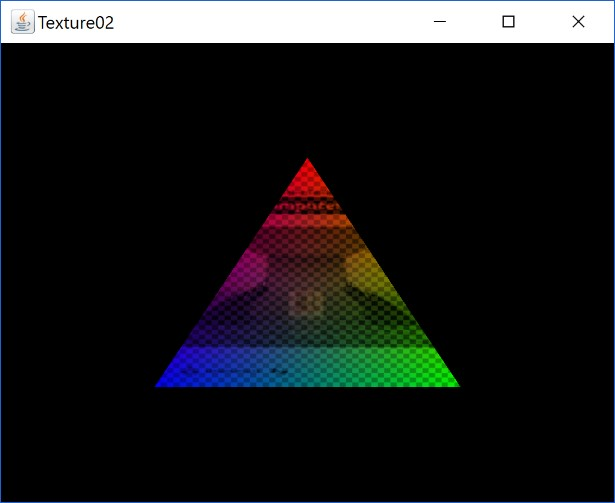
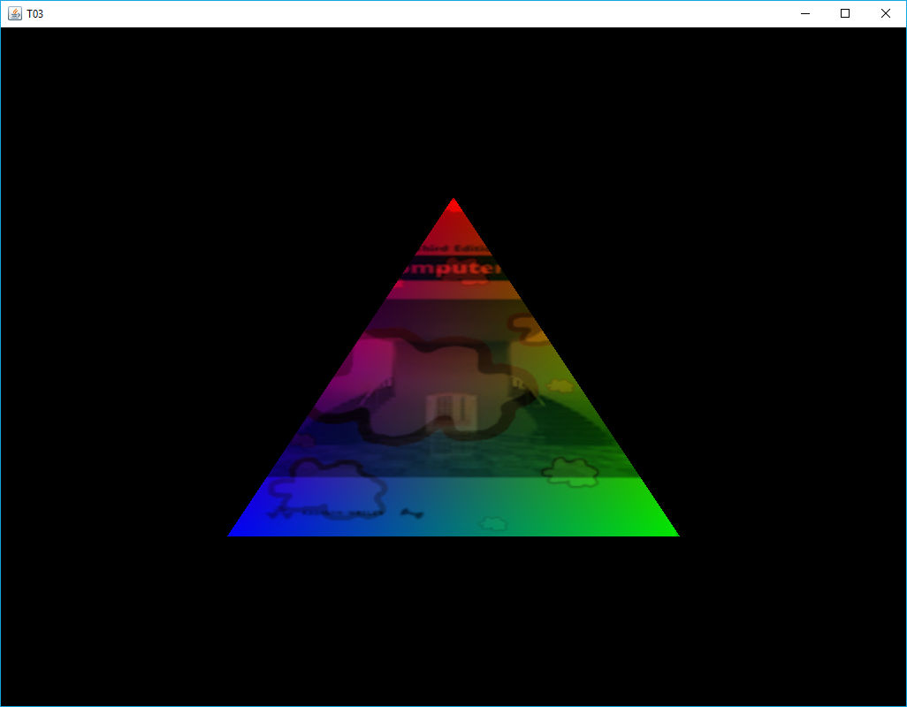

[back](ch4.md) | [main menu](../README.md)
 
## 4.2 Texture units

Program: [T02.java](/ch4_textures)

OpenGL has at least a minimum of 16 texture units: GL_TEXTURE0 to GL_TEXTURE15. Program T02 uses two of these. The output is shown in Figure 4.4. Each vertex is set to a different colour (red, green and blue) and two textures are mixed into this, 'wattBook.jpg' and 'chequerboard.jpg'. Program listing 4.7 gives the initialise() and render() methods in T02_GLEventListener.java.

Two textures are created and stored in variables textureId1 and textureId2, respectively. In render(), these are bound to texture units 0 and 1 (using shader.setInt()), which are associated with variables first_texture and second_texture in the fragment shader, which is shown in Program Listing 4.9. (Program Listing 4.8 shows the vertex shader for completeness.)

One point to note here is that I have chosen the names 'first_texture' and 'second_texture'. I will use these names in all subsequent fragment shaders. Such naming consistency is important for maintenance when we are linking from our Java programs to the shader programs.

<p align="center">
  <br>
  <strong>Figure 4.4:</strong> Output from T02.java.
</p>

```java
private TextureLibrary textures;
  
public void initialise(GL3 gl) {
  shader = new Shader(gl, "assets/shaders/vs_T02.txt", "assets/shaders/fs_T02.txt");
  fillBuffers(gl);

  textures = new TextureLibrary();
  textures.add(gl, "wattBook", "assets/textures/wattBook.jpg");
  textures.add(gl, "chequerboard", "assets/textures/chequerboard.jpg");
}

public void render(GL3 gl) {
  gl.glClear(GL.GL_COLOR_BUFFER_BIT | GL.GL_DEPTH_BUFFER_BIT);

  shader.use(gl);
  shader.setInt(gl, "first_texture", 0);  // use GL_TEXTURE0 texture unit
  shader.setInt(gl, "second_texture", 1); // use GL_TEXTURE1 texture unit

  // bind the texture files to the texture units
  gl.glActiveTexture(GL.GL_TEXTURE0);
  Texture textureId1 = textures.get("wattBook");
  textureId1.bind(gl);
  gl.glActiveTexture(GL.GL_TEXTURE1);
  Texture textureId2 = textures.get("chequerboard");
  textureId2.bind(gl);

  gl.glBindVertexArray(vertexArrayId[0]);
  gl.glDrawElements(GL.GL_TRIANGLES, indices.length, GL.GL_UNSIGNED_INT, 0);
  gl.glBindVertexArray(0);
  
  // good practice to set everything back to defaults once configured.
  gl.glActiveTexture(GL.GL_TEXTURE0);
}
```

**Program listing 4.7:** Methods initialise() and render() in T02_GLEventListener.java 

```glsl
#version 330 core
  
layout (location = 0) in vec3 position;
layout (location = 1) in vec3 color;
layout (location = 2) in vec2 texCoord;

out vec3 aColor;
out vec2 aTexCoord;

void main() {
  gl_Position = vec4(position.x, position.y, position.z, 1.0);
  aColor = color;
  aTexCoord = texCoord;
}
```

**Program listing 4.8:** Vertex shader: vs_T02.txt 

```glsl
#version 330 core
  
in vec3 aColor;
in vec2 aTexCoord;

out vec4 fragColor;

uniform sampler2D first_texture;
uniform sampler2D second_texture;

void main() {
  // fragColor = vec4(aColor, 1.0f);
  // fragColor = vec4(texture(first_texture, aTexCoord).rgb, 1.0f);
  // fragColor = vec4(texture(first_texture, aTexCoord).rgb * aColor, 1.0f);
  // fragColor = vec4(texture(second_texture, aTexCoord).rgb * aColor, 1.0f);
  
  fragColor = vec4(mix(texture(first_texture, aTexCoord),
                       texture(second_texture, aTexCoord), 0.3f).rgb
                   * aColor, 1.0f);
}
```

**Program listing 4.9:** Fragment shader: fs_T02.txt 

In the fragment shader in Program listing 4.9, the two textures are combined using the GLSL function called mix (see http://docs.gl/sl4/mix), which takes two colours and a floating point value as parameters. The first colour comes from first_texture and the second colour comes from second_texture. A value of 0.3 returns a mixture of 70% of the first colour and 30% of the second colour. The rgb part of the result of the mix function is then multiplied by the input colour of the fragment (which was output by the rasterization stage which interpolated values from the vertices of the respective triangle). 

## Exercises

1. Try some of the other commented out lines in the fragment shader. Predict the effect each time before you run the program.
2. Add a uniform variable that varies the amount of mix over time. [Solution]
3. Add a third texture and use multiple calls of mix to blend the three textures. [Solution]

---

### 4.2.1 Texture binding and efficiency 

Program: [T03.java](/ch4_textures)

Note: this approach may fail if the drivers for your graphics card do not support it. As an example, I have seen it fail on a Macbook Air. If it fails, then you will have to place the calls back in the render method(), as in T02_GLEventListener.

This program is nearly identical to T02.java. The only change is shown in Program listing 4.10. The calls to make a texture unit active and to bind a particular texture to the texture unit are done in the method initialise() after loading the textures from file. Method render() now only assigns the name of the relevant uniform in the fragment shader to each texture unit. This is more efficient than continually rebinding the texture units. The result is shown in Figure 4.5.

We could load a collection of textures in this way and store them in a library of textures associated with texture units. Then in the main render loop, we would just assign which texture unit we wished a particular uniform sampler2D to refer to. Of course, if we have more textures than texture units, then we will need to do some rebinding and switching of active textures in the render loop. However, we shouldn't need more than 16 textures in the examples for the exercise sheets.

<p align="center">
  <br>
  <strong>Figure 4.5:</strong> Output from T03.java.
</p>

```java
private TextureLibrary textures;
  
public void initialise(GL3 gl) {
  shader = new Shader(gl, "assets/shaders/vs_T03.txt", "assets/shaders/fs_T03.txt");
  fillBuffers(gl);
  
  textures = new TextureLibrary();
  textures.add(gl, "wattBook", "assets/textures/wattBook.jpg");
  textures.add(gl, "chequerboard", "assets/textures/chequerboard.jpg");
  textures.add(gl, "cloud", "assets/textures/cloud.jpg");

  // bind the three textures to the first three texture units
  gl.glActiveTexture(GL.GL_TEXTURE0);
  Texture tid = textures.get("wattBook");
  tid.bind(gl);
  gl.glActiveTexture(GL.GL_TEXTURE1);
  tid = textures.get("chequerboard");
  tid.bind(gl);
  gl.glActiveTexture(GL.GL_TEXTURE2);
  tid = textures.get("cloud");
  tid.bind(gl);
}

public void render(GL3 gl) {
  gl.glClear(GL.GL_COLOR_BUFFER_BIT | GL.GL_DEPTH_BUFFER_BIT);

  shader.use(gl);
  shader.setInt(gl, "first_texture", 0);  // choose a texture  unit
  shader.setInt(gl, "second_texture", 2); // choose a texture  unit

  gl.glBindVertexArray(vertexArrayId[0]);
  gl.glDrawElements(GL.GL_TRIANGLES, indices.length, GL.GL_UNSIGNED_INT, 0);
  gl.glBindVertexArray(0);
}
```

**Program listing 4.10:** Methods initialise() and render() in Texture03_GLEventListener.java 

There are other efficiencies that could be considered in our programs. For example, it is relatively slow to get the location of a uniform from the GPU. Instead, the locations of uniforms could be queried in the initialise method and stored in global variables. Then, in the render method they would only need setting to particular values. Also, if a uniform does not change from one render call to the next, there is no need to keep resetting its value. The uniform will retain its value once set in the shader program - it is deemed to be active until the shader program is relinked. We'll not worry about these extra efficiencies and just use the methods we have written in the Shader class to set the values of named uniforms from within the render loop. This makes the code clearer whilst we are learning about OpenGL.

---

## MCQs (written in collaboration with Google Gemini)

<p>1. In program T02.java, what is the key difference between the purpose of gl.glActiveTexture() and textureId1.bind(gl)?</p>

<details>
<summary>a) gl.glActiveTexture() links the texture to the shader, while textureId1.bind(gl) selects the texture unit.</summary>
<p><b>Incorrect.</b> The roles are reversed. gl.glActiveTexture() is used to select the texture unit, and texture.bind() links a specific texture object to the currently active texture unit.</p>
</details>

<details>
<summary>b) gl.glActiveTexture() selects a specific texture unit to work with, while textureId1.bind(gl) links a specific texture object to that active texture unit.</p>
<p><b>Correct.</b> The gl.glActiveTexture() call makes a texture unit (e.g., GL_TEXTURE0) active, and the subsequent texture.bind() call then associates a texture with that unit.</p>
</details>

<details>
<summary>c) gl.glActiveTexture() is used in the fragment shader, while textureId1.bind(gl) is used in the main Java application.</p>
<p><b>Incorrect.</b> Both of these functions are part of the Java application (the CPU side), which sends commands to the GPU. The fragment shader is written in GLSL and uses the sampler2D uniform to access textures.</p>
</details>

<details>
<summary>d) gl.glActiveTexture() prepares the texture data, while textureId1.bind(gl) passes the data to the uniform.</p>
<p><b>Incorrect.</b> The texture data is prepared by the TextureLibrary.add() method. Passing the data to the uniform is done by shader.setInt(), which links the texture unit's index (e.g., 0) to the uniform variable in the shader.</p>
</details>

<p>2. According to Program Listing 4.9, what is the effect of the mix() function with the parameters provided?</p>

<details>
<summary>a) It blends the two textures, taking 70% of first_texture and 30% of second_texture.</p>
<p><b>Correct.</b> The mix() function takes a floating-point value between 0.0 and 1.0. The text states that a value of 0.3 "returns a mixture of 70% of the first colour and 30% of the second colour."</p>
</details>

<details>
<summary>b) It mixes the first_texture with the fragment's interpolated color, taking 30% of each.</p>
<p><b>Incorrect.</b> The mix() function blends the two textures together. The result of this mix is then multiplied by the interpolated color aColor, as shown in the last line of the fragment shader.</p>
</details>

<details>
<summary>c) It blends the two textures, taking 30% of first_texture and 70% of second_texture.</p>
<p><b>Incorrect.</b> The mix() function's third parameter determines the weight of the second texture. A value of 0.3 means a 30% contribution from the second texture and a 70% contribution from the first.</p>
</details>

<details>
<summary>d) It interpolates the colors of the two textures across the surface of the triangle.</p>
<p><b>Incorrect.</b> The GPU's rasterization process interpolates the texture coordinates across the triangle, not the colors of the textures themselves. The mix() function then blends the colors sampled from the two textures at those specific interpolated coordinates.</p>
</details>

---


## Exercises

1. 

[back](ch4.md) | [main menu](../README.md)