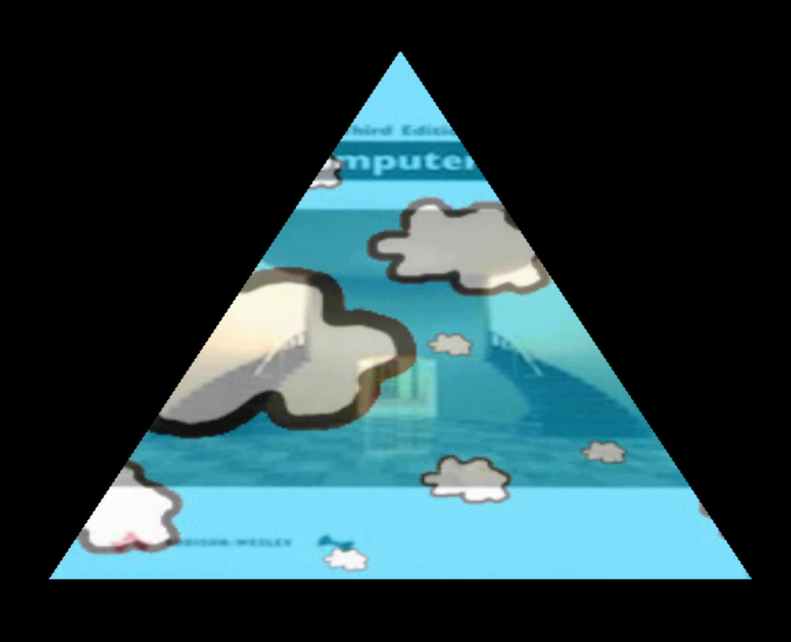
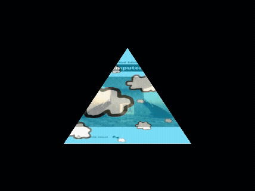

[back](ch4.md) | [main menu](../README.md)
 
## 4.3 Advanced texture examples

### 4.3.1 Dynamic textures

Program: [T04.java](/ch4_textures)

Two textures are used in this program. One texture is static, whilst the other texture continually scrolls over the top of the other texture (see Figures 4.6 and 4.7).

This program uses a uniform in the vertex shader to vary the texture coordinates over time for one of the textures. Program listing 4.11 gives the render() method. Program listings 4.12 and 4.13 give the vertex and fragment shaders, respectively.

<p align="center">
  <br>
  <strong>Figure 4.6:</strong> Output from T04.java.
</p>

<p align="center">
  <br>
  <strong>Figure 4.7:</strong> Moving clouds.
</p>


```java
public void render(GL3 gl) {
  gl.glClear(GL.GL_COLOR_BUFFER_BIT | GL.GL_DEPTH_BUFFER_BIT);

  double elapsedTime = getSeconds() - startTime;

  shader.use(gl);
  
  double t = elapsedTime*0.1;  // *0.1 slows it down a bit
  float offsetX = (float)(t - Math.floor(t));
  float offsetY = 0.0f;
  shader.setFloat(gl, "offset", offsetX, offsetY);
  
  shader.setInt(gl, "first_texture", 0);
  shader.setInt(gl, "second_texture", 1);

  // bind the texture files to the texture units
  gl.glActiveTexture(GL.GL_TEXTURE0);
  Texture textureId1 = textures.get("wattBook");
  textureId1.bind(gl);
  gl.glActiveTexture(GL.GL_TEXTURE1);
  Texture textureId2 = textures.get("cloud");
  textureId2.bind(gl);

  gl.glBindVertexArray(vertexArrayId[0]);
  gl.glDrawElements(GL.GL_TRIANGLES, indices.length, GL.GL_UNSIGNED_INT, 0);
  gl.glBindVertexArray(0);
}
```

**Program listing 4.11:** Method render() in T04_GLEventListener.java 

The uniform called offset in the vertex shader is updated each time render() is called. This value is added to the texCoord to produce movingTexCoord which is then passed to the rasterizer, which interpolates the values from each vertex over a triangle, producing a set of fragments which each have a colour (aColor) and two sets of texture coordinates (aTexCoord and movingTexCoord). aTexCoord is used in the fragment shader to sample first_texture and movingTexCoord is used in the fragment shader to sample second_texture. The results are mixed together using the GLSL mix function.

An alternative solution would place the uniform offset in the fragment shader instead of the vertex shader. The offset would then be added to the interpolated aTexCoord value.

> [!IMPORTANT]
> To get a scrolling animated texture to work, the coordinates supplied need to 'wrap' in the range 0 to 1. This means that if you assign a u or v value greater than 1 to a vertex, the floating point part is used, so, if the u or v value is continually increased (as it is in Program Listings 4.11 and 4.12 to produce the effects in Figures 4.6 and 4.7), the value assigned to a vertex will reach or exceed 1 and then effectively start at 0 again. This can be achieved by using different settings in the loadTexture method in TextureLibrary.java. GL3.GL_TEXTURE_WRAP_S and GL3.GL_TEXTURE_WRAP_T are currently set to GL3.GL_CLAMP_TO_EDGE. Instead, these need to be set to GL3.GL_REPEAT.


```glsl
#version 330 core
  
layout (location = 0) in vec3 position;
layout (location = 1) in vec3 color;
layout (location = 2) in vec2 texCoord;

out vec3 aColor;
out vec2 aTexCoord;
out vec2 movingTexCoord;

uniform vec2 offset;

void main() {
  gl_Position = vec4(position.x, position.y, position.z, 1.0);
  aColor = color;
  aTexCoord = texCoord;
  movingTexCoord = texCoord + offset;
}
```

**Program listing 4.12:** Vertex shader: vs_T04.txt 

```glsl
#version 330 core
  
in vec3 aColor;  // not needed
in vec2 aTexCoord;
in vec2 movingTexCoord;

out vec4 fragColor;

uniform sampler2D first_texture;
uniform sampler2D second_texture;

void main() {
fragColor = vec4(mix(texture(first_texture, aTexCoord),
                      texture(second_texture, movingTexCoord),
                  0.5f).rgb, 1.0f);
}
```

**Program listing 4.13:** Fragment shader: fs_T04.txt 

## Exercises

1. Change the calculation of offset in method render() to see what dynamic effect you can create. (Don't forget to change the settings in the loadTexture method in TextureLibrary.java, as described above.) [Solution](#exercise-solutions)
2. If you are feeling adventurous, find some different textures to use to produce a different dynamic texture effect.

---

### 4.3.2 Changing textures

Program: [T05.java](/ch4_textures)

The final program loads four textures into memory and then displays each of these in turn on the same triangle (Figure 4.8). Program listing 4.14 gives the initialise() and render() methods. Program listings 4.15 and 4.16 give the vertex and fragment shaders, respectively.

Note: This example assumes that your graphics card does not fall foul of the issue mentioned in section 4.2.1. If it does, then you would have to move the binding of the textures to method render().

<p align="center">
  <br>
  <strong>Figure 4.8:</strong> Changing textures.
</p>


```java
private TextureLibrary textures;
  
public void initialise(GL3 gl) {
  shader = new Shader(gl, "vs_T05.txt", "fs_T05.txt");
  fillBuffers(gl);

  textures = new TextureLibrary();
  textures.add(gl, "wattBook0", "assets/textures/paintstrokes/wattBook.jpg");
  textures.add(gl, "wattBook1", "assets/textures/paintstrokes/wattBook1.jpg");
  textures.add(gl, "wattBook2", "assets/textures/paintstrokes/wattBook2.jpg");
  textures.add(gl, "wattBook3", "assets/textures/paintstrokes/wattBook3.jpg");

  gl.glActiveTexture(GL.GL_TEXTURE0);
  Texture tid = textures.get("wattBook0");
  tid.bind(gl);
  gl.glActiveTexture(GL.GL_TEXTURE1);
  tid = textures.get("wattBook1");
  tid.bind(gl);
  gl.glActiveTexture(GL.GL_TEXTURE2);
  tid = textures.get("wattBook2");
  tid.bind(gl);
  gl.glActiveTexture(GL.GL_TEXTURE3);
  tid = textures.get("wattBook3");
  tid.bind(gl);

  startTime = getSeconds();
}

public void render(GL3 gl) {
  gl.glClear(GL.GL_COLOR_BUFFER_BIT | GL.GL_DEPTH_BUFFER_BIT);

  double elapsedTime = getSeconds() - startTime;
  int currentTexture = (int) Math.floor(2 * (1 + Math.sin(elapsedTime + Math.toRadians(270))));
  shader.use(gl);
  shader.setInt(gl, "first_texture", currentTexture);

  gl.glBindVertexArray(vertexArrayId[0]);
  gl.glDrawElements(GL.GL_TRIANGLES, indices.length, GL.GL_UNSIGNED_INT, 0);
  gl.glBindVertexArray(0);
}
```

**Program listing 4.14:** Methods initialise() and render() in T05_GLEventListener.java 

```glsl
#version 330 core
  
layout (location = 0) in vec3 position;
layout (location = 1) in vec3 color;
layout (location = 2) in vec2 texCoord;

out vec3 ourColor;
out vec2 ourTexCoord;

void main() {
  gl_Position = vec4(position.x, position.y, position.z, 1.0);
  ourColor = color;
  ourTexCoord = texCoord;
}
```

**Program listing 4.15:** Vertex shader: vs_T05.txt

```glsl
#version 330 core
  
in vec3 aColor;
in vec2 aTexCoord;

out vec4 fragColor;

uniform sampler2D first_texture;

void main() {
  // fragColor = vec4(aColor, 1.0f);
  fragColor = vec4(texture(first_texture, aTexCoord).rgb, 1.0f);
  // fragColor = vec4(texture(first_texture, aTexCoord).rgb * aColor, 1.0f);
}
```
**Program listing 4.16:** Fragment shader: fs_T05.txt

---

## Exercises

1. Find some textures that show different expressions on a cartoon face and use these in Program Listing 4.14. 

---

## MCQs (written in collaboration with Google Gemini)

<p>1. In the T04.java program, what is the primary purpose of the offset uniform variable?</p>

<details>
<summary>a) To change the position of the entire triangle on the screen.</summary>
<p><b>Incorrect.</b> The offset uniform is added to the texture coordinates, not the vertex positions, so it affects the texture's placement, not the triangle's geometry.</p>
</details>

<details>
<summary>b) To mix the two textures together in the fragment shader.</summary>
<p><b>Incorrect.</b> The mixing of textures is handled by the mix() function in the fragment shader, which uses the texture samples as input, not the offset uniform.</p>
</details>

<details>
<summary>c) To make one of the textures scroll over time by modifying its texture coordinates.</summary>
<p><b>Correct.</b> The text explains that the offset uniform is added to texCoord in the vertex shader to produce movingTexCoord, which causes the texture to scroll.</p>
</details>

<details>
<summary>d) To change the color of the vertices over time.</summary>
<p><b>Incorrect.</b> The offset uniform is a vec2 used for texture coordinates, not a vec3 or vec4 for color values.</p>
</details>
<br>

---

<p>2. According to the text, which setting is required to make the animated texture in T04.java appear to scroll continuously and seamlessly?</p>

<details>
<summary>a) GL3.GL_CLAMP_TO_EDGE</summary>
<p><b>Incorrect.</b> The text states that GL_CLAMP_TO_EDGE is the default and that it must be changed for the scrolling effect to work correctly, as it would prevent the coordinates from wrapping.</p>
</details>

<details>
<summary>b) GL3.GL_REPEAT</summary>
<p><b>Correct.</b> The 'IMPORTANT Note' section explicitly states that GL_TEXTURE_WRAP_S and GL_TEXTURE_WRAP_T need to be set to GL_REPEAT so that the texture coordinates 'wrap' and the texture tiles seamlessly.</p>
</details>

<details>
<summary>c) GL3.GL_MIRRORED_REPEAT</summary>
<p><b>Incorrect.</b> While this is a texture wrap mode, the text specifically mentions GL_REPEAT as the solution for the scrolling effect.</p>
</details>

<details>
<summary>d) The uniform offset must be a constant value.</summary>
<p><b>Incorrect.</b> For the texture to scroll, the offset must be a continuously changing value, not a constant.</p>
</details>
<br>

---

<p>3. In the T05.java program, how is the active texture displayed on the triangle changed?</p>

<details>
<summary>a) The initialise() method is called repeatedly to bind different textures to the same texture unit.</summary>
<p><b>Incorrect.</b> The initialise() method is only called once. All textures are loaded and bound to different texture units at the beginning of the program.</p>
</details>

<details>
<summary>b) The shader.setInt() method is used to change which texture unit the first_texture uniform refers to.</summary>
<p><b>Correct.</b> The render() method calculates currentTexture and uses shader.setInt(gl, first_texture, currentTexture) to switch the uniform's active texture unit, effectively changing the displayed texture.</p>
</details>

<details>
<summary>c) The fragment shader uses a GLSL if-else statement to select a texture based on elapsedTime.</summary>
<p><b>Incorrect.</b> The decision of which texture to display is made on the CPU in the render() method, and the result is passed to the shader via a uniform.</p>
</details>

<details>
<summary>d) The gl.glActiveTexture() command is used in the render() method to rebind a new texture each frame.</summary>
<p><b>Incorrect.</b> The text states that the binding of textures happens in initialise() and that the render() method is made more efficient by not having to rebind textures every frame.</p>
</details>

---

[Solution](#exercise-solutions)

## Exercise solutions

1. Change the calculation of offset in method render() to see what dynamic effect you can create. (Don't forget to change the settings in the loadTexture method in TextureLibrary.java, as described above.)

A bit of fun:

```java
  public void render(GL3 gl) {
    gl.glClear(GL.GL_COLOR_BUFFER_BIT | GL.GL_DEPTH_BUFFER_BIT);
	
    double elapsedTime = getSeconds() - startTime;
  
    shader.use(gl);
    
    double t = elapsedTime*0.1;  // *0.1 slows it down a bit
    float offsetX = (float)(t - Math.floor(t));
    float offsetY = (float)(Math.sin(elapsedTime)*0.1);
    shader.setFloat(gl, "offset1", offsetX, offsetY);
    offsetX = (float)Math.sin((t - Math.floor(t))*1.5708);
    offsetY = (float)(Math.sin(elapsedTime*1.1)*0.2);
    shader.setFloat(gl, "offset2", offsetX, offsetY);
    float temp = (float)Math.sin((t - Math.floor(t))*1.5708);
    offsetX = temp*temp;
    offsetY = (float)(Math.sin(elapsedTime*0.9)*0.05);
    shader.setFloat(gl, "offset3", offsetX, offsetY);
    
    shader.setInt(gl, "first_texture", 0);
    shader.setInt(gl, "second_texture", 1);

    // rest of code
  }
```
  
The vertex shader:

These are not the best variable names!!

```glsl
#version 330 core

layout (location = 0) in vec3 position;
layout (location = 1) in vec3 color;
layout (location = 2) in vec2 texCoord;

out vec3 aColor;
out vec2 aTexCoord;
out vec2 movingTexCoord1, movingTexCoord2, movingTexCoord3;

uniform vec2 offset1, offset2, offset3;

void main() {
  gl_Position = vec4(position.x, position.y, position.z, 1.0);
  aColor = color;
  aTexCoord = texCoord;
  movingTexCoord1 = texCoord + offset1;
  movingTexCoord2 = texCoord + offset2;
  movingTexCoord3 = texCoord + offset3;
}
```

The fragment shader:

```glsl
#version 330 core

in vec3 aColor;  // not needed
in vec2 aTexCoord;
in vec2 movingTexCoord1, movingTexCoord2, movingTexCoord3;

out vec4 fragColor;

uniform sampler2D first_texture;
uniform sampler2D second_texture;

void main() {
  vec4 temp = mix(texture(first_texture, aTexCoord),
                  texture(second_texture, movingTexCoord1),
                  0.5f);
  temp = mix(temp, texture(second_texture, movingTexCoord2), 0.3f);
  temp = mix(temp, texture(second_texture, movingTexCoord3), 0.1f);
  fragColor = vec4(temp.rgb, 1.0f);
}
```

[back](ch4.md) | [main menu](../README.md)