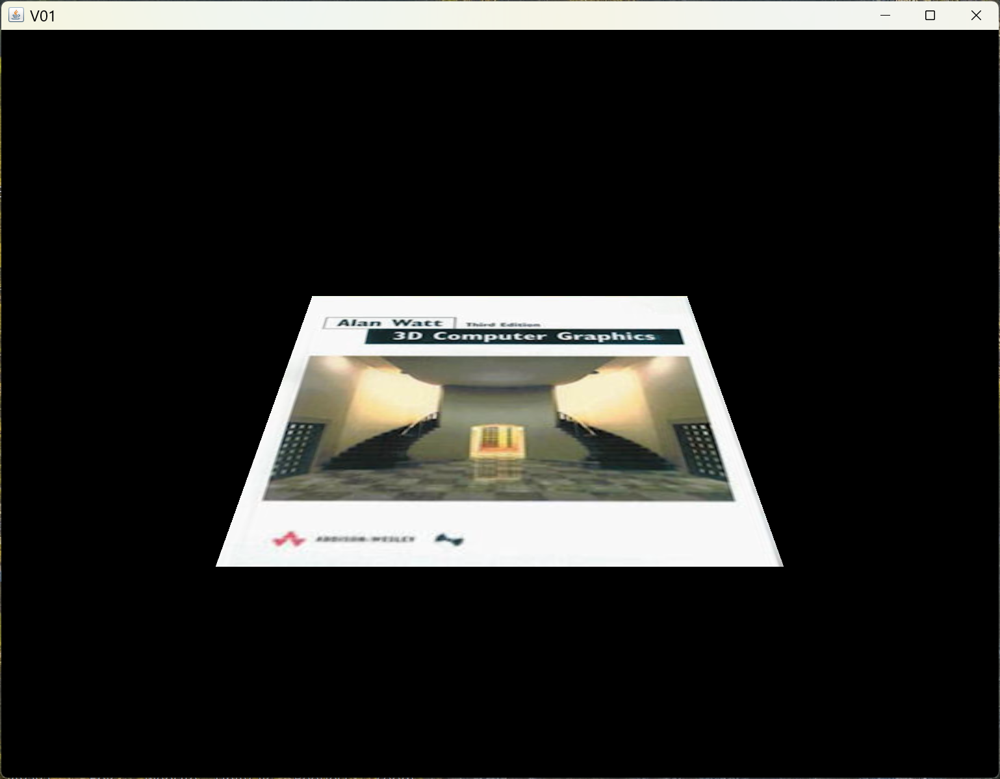
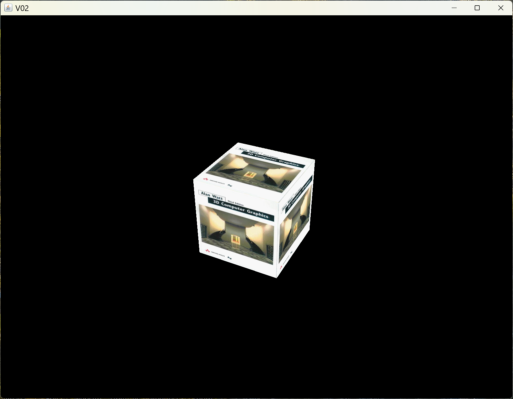
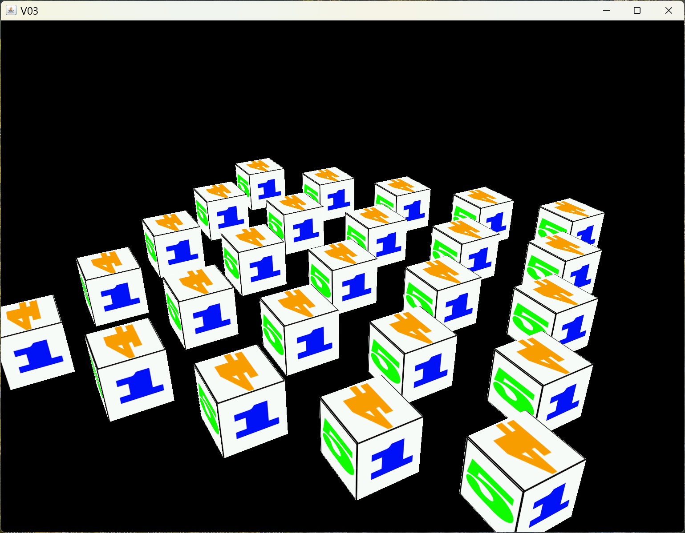
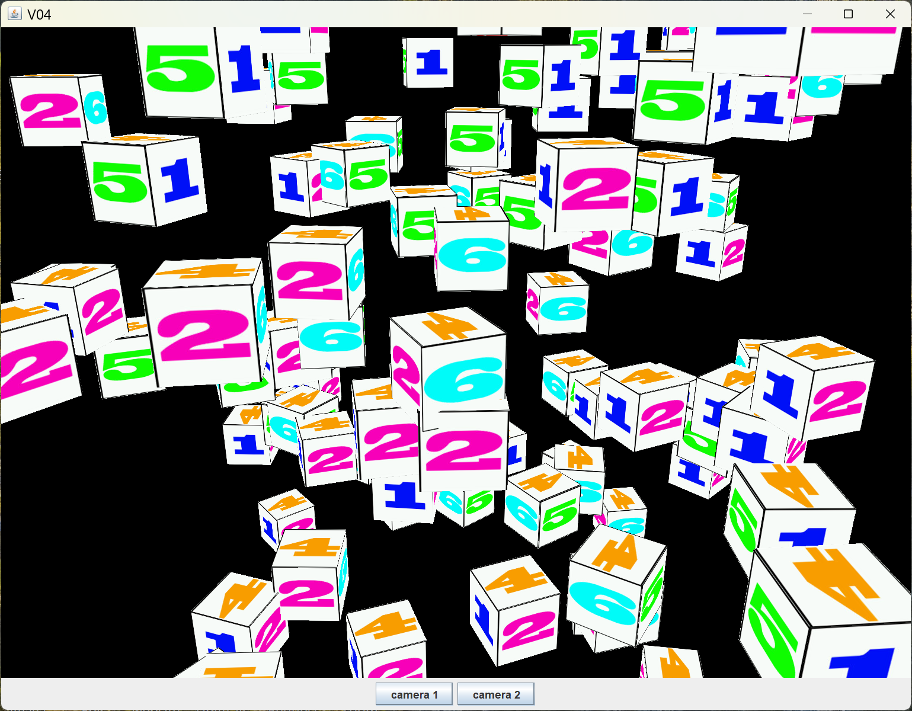
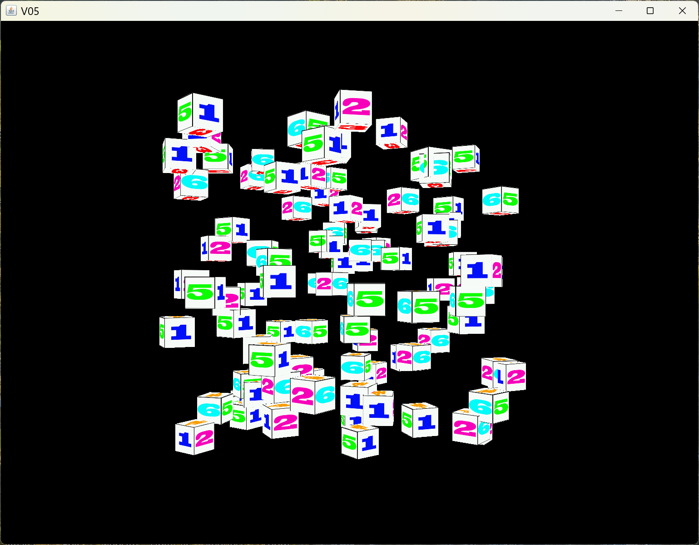

[main menu](../README.md)

# Chapter 5. Transformations, Coordinate systems and a camera

Read through Joey de Vries's tutorial sections on [Transformations](https://learnopengl.com/Getting-started/Transformations), [Coordinate Systems](https://learnopengl.com/Getting-started/Coordinate-Systems) and [Camera](https://learnopengl.com/Getting-started/Camera) before continuing. I will assume you have read these when describing the changes for JOGL.

This chapter is composed of four main sections:

1. [A maths library](ch5_1.md)
2. [Coordinate systems](ch5_2.md)
3. [A Camera](ch5_3.md)
4. [Extra: Multiple Cameras](ch5_4.md)

Section 5.1 concentrates on the creation of a maths library. When dealing with 3D objects, a range of different data structures and methods are required, e.g. for representing vertices of objects and for transforming a vertex from one location to another. Joey uses C++ and makes makes use of the glm maths library. There have been some efforts at producing a Java version of this: try searching for Java and glm and you'll find a few examples on github. For example, JOML appears to be used in a number of universities. However, this is more than we need. I have created a simple maths library that covers some of what glm includes and will suffice for what we need.

Section 5.2 looks at the different coordinate systems used in the viewing pipeline, moving from 3D object coordinates to 2D screen display coordinates.

Section 5.3 describes the creation of a camera which can be controlled using the mouse and keyboard. The camera can be used to rotate around a scene or zoom in and out of it.

Section 5.4 shows how to create multiple cameras. This section and can be skipped since it will not feature in any future programs.

Figure 5.0 shows the output of the 6 programs used in Sections 5.1 to 5.4.

  ..... 
  <strong>Figure 5.0.</strong> Output from programs in this chapter.

## Further thoughts

So far, I have kept code and related data structures close together (in a glEventListener) so that it is easier to focus when studying it. Longer term, we need a better data structure to store information in. We also need to consider lighting and shading of objects.

Lighting and shading: So far, the scenes we have created do not have lights in them, nor do the objects consider those lights and shade the surfaces accordingly. Chapter 6 will look at lighting and shading.

Multiple different objects: So far, we have considered a single object type in each example, e.g. a triangle in previous chapters or a 3D cube in this chapter. We have not mixed different kinds of object, e.g. multiple cubes and spheres, etc. Chapters 6 and 7 will consider this. Chapter 6 will introduce a mesh class, which will be used to represent and render different kinds of objects, e.g. cube, sphere, etc. Chapter 7 will extend this and introduce a range of classes to control the increasing complexity of our programs.

[main menu](../README.md)