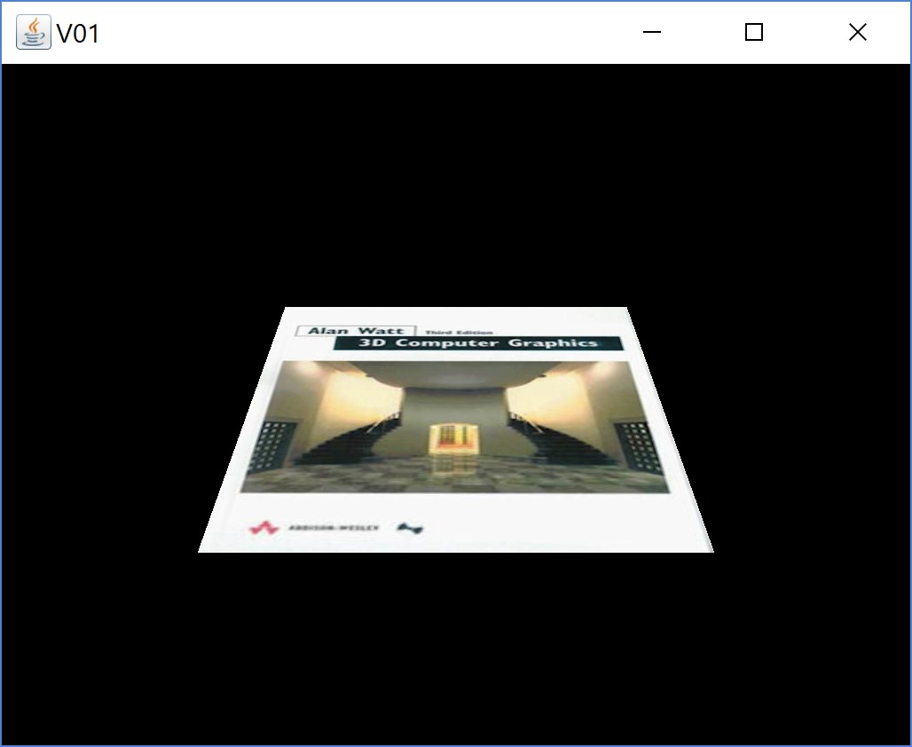
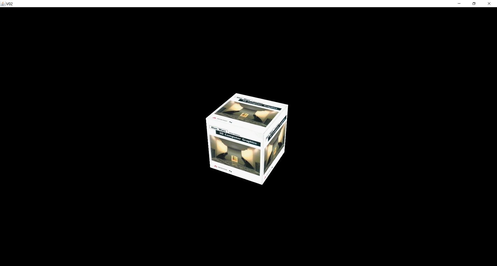
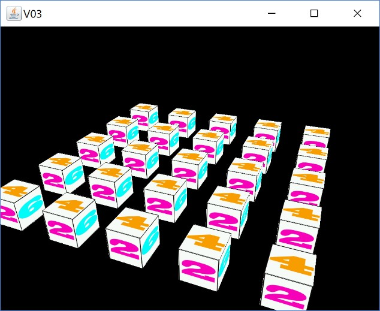
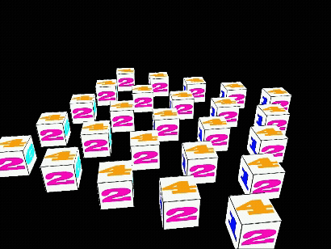
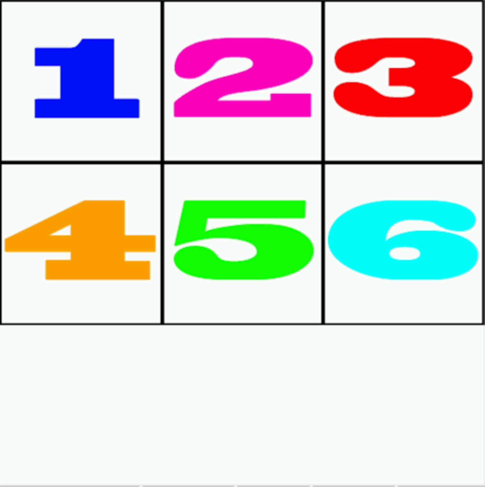
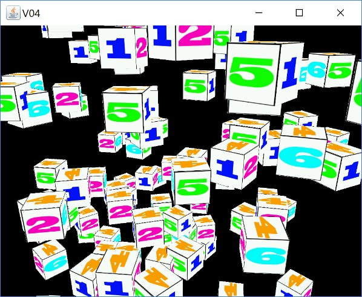

[back](ch5.md) | [main menu](../README.md)
 
## 5.2 Coordinate systems

Please read through Joey's tutorial on Coordinate Systems before proceeding. This covers the different coordinate systems used in the viewing pipeline.

We are now going to look at how to transform an object's vertices from their local 3D coordinate system to 2D screen display space. Multiple objects are positioned in a 3D world coordinate space. Individual vertices have an x,y,z coordinate. These must be transformed from 3D world space into the 3D coordinate space of a camera that is looking at them. From here, the vertices are then converted from camera space (also called view space) into 3D screen space, before eventually being displayed in 2D screen display space. Groups of three vertices that form a triangle remain 'connected' in the early stages of this process until they are bilinearly interpolated to produce a collection of individual fragments that represent the triangle for display on the screen. Each fragment has a 3D screen x,y,z coordinate that can be used for such things as hidden surface removal. To move from 3D object space to 3D screen space, a model view projection matrix is used. Each of these stages will be explored in more detail in the following subsections.

We'll start with an object composed of two triangles, followed by an example involving a cube, and then a collection of cubes.

<p align="center">
  <br>
  <strong>Figure 5.1.</strong> Two triangles shown in perspective, texture mapped with the front cover of Watt's book.
</p>

---

### 5.2.1 A two-triangle object

Program: [V01.java](/ch5_t_cs_c/ch5_coord_systems)

Program Listing 5.2 gives the data structure and Program Listing 5.3 gives the render method. Two triangles are drawn, and texture mapped with the front cover of Watt's book, as shown in Figure 5.1. The two triangles have been rotated away from the viewer and are thus seen in perspective. We'll now examine Program Listing 5.3 in more detail. 

```java
// ***************************************************
/* THE DATA
  */
// anticlockwise/counterclockwise ordering

private float[] vertices = {      
  // position (x,y,z), colour (r,g,b),    tex coords (s,t)
  -0.5f,  0.5f, 0.0f,  1.0f, 0.0f, 0.0f,  0.0f, 1.0f,  // top left
  -0.5f, -0.5f, 0.0f,  0.0f, 1.0f, 0.0f,  0.0f, 0.0f,  // bottom left
    0.5f, -0.5f, 0.0f,  0.0f, 0.0f, 1.0f,  1.0f, 0.0f,  // bottom right
    0.5f,  0.5f, 0.0f,  1.0f, 1.0f, 1.0f,  1.0f, 1.0f   // top right
};

private int vertexStride = 8;        // 8 floats per vertex
private int vertexXYZFloats = 3;     // 3 floats for the position
private int vertexColourFloats = 3;  // 3 flopats for the colour
private int vertexTexFloats = 2;     // 2 floats for the texture coordinates

private int[] indices = {            // Note that we start from 0
  0, 1, 2,                           // Triangle 1 is made up of vertices 0, 1 and 2
                                     // in anticlockwise ordering
  0, 2, 3                            // Triangle 2 is made up of vertices 0, 2 and 3 
                                     // in anticlockwise ordering
};
```

**Program listing 5.2:** The data

```java
public void render(GL3 gl) {
  gl.glClear(GL.GL_COLOR_BUFFER_BIT | GL.GL_DEPTH_BUFFER_BIT);

  double elapsedTime = getSeconds()-startTime;
  
  Mat4 projectionMatrix = Mat4Transform.perspective(45, aspect);
  
  float zposition = 2f;
  //float zposition = 2f+(float)(Math.sin(Math.toRadians(elapsedTime*50)));
  Vec3 position = new Vec3(0,0,zposition);
  Mat4 viewMatrix = Mat4Transform.lookAt(position, new Vec3(0,0,0), new Vec3(0,1,0));
  
  float angle = -55f;
  //float angle = (float)(-115*Math.sin(Math.toRadians(elapsedTime*50)));
  Mat4 modelMatrix = Mat4Transform.rotateAroundX(angle);
  
  Mat4 mvpMatrix = Mat4.multiply(viewMatrix, modelMatrix);
  mvpMatrix = Mat4.multiply(projectionMatrix, mvpMatrix);
  
  shader.use(gl);
  shader.setFloatArray(gl, "model", modelMatrix.toFloatArrayForGLSL());
  shader.setFloatArray(gl, "view", viewMatrix.toFloatArrayForGLSL());
  shader.setFloatArray(gl, "projection", projectionMatrix.toFloatArrayForGLSL());
  shader.setFloatArray(gl, "mvpMatrix", mvpMatrix.toFloatArrayForGLSL());
  
  gl.glActiveTexture(GL.GL_TEXTURE0);
  Texture textureId1 = textures.get("wattBook");
  textureId1.bind(gl);

  gl.glBindVertexArray(vertexArrayId[0]);
  gl.glDrawElements(GL.GL_TRIANGLES, indices.length, GL.GL_UNSIGNED_INT, 0);
  gl.glBindVertexArray(0);
}
```

**Program listing 5.3:** The render() method. (The two commented out lines are for experimentation in the exercises below.)

Consider Program Listing 5.3. A projection matrix is created using the static method Mat4Transform.perspective(). The static method Mat4Transform.lookat(from, to, up) is then used to create the view matrix. This takes three parameters: the camera position, the target that the camera is looking at, and a nominal up vector for the world; in this example the camera is at position (0,0,2), looking at the world origin, with an initial up vector (0,1,0). The [Gram-Schmidt process](https://en.wikipedia.org/wiki/Gram%E2%80%93Schmidt_process]) (as described in lectures) is used to create a coordinate frame for the view (i.e. the camera).

An angle of –55 degrees is chosen to rotate the two triangles around the x axis, which will rotate the top away from the viewer. The static method Mat4Transform.rotateAroundX() is used to set up the required model transformation matrix.

In the next step, the model view projection matrix is calculated. Important: remember that the matrices precede the vertices they are transforming. Thus they are in the order projection, view, model, so that the model matrix is the first applied to a vertex.

Each of modelMatrix, viewMatrix, projectionMatrix and mvpMatrix is then passed to the vertex shader using separate uniforms. In order to do this a 4x4 matrix must first be converted into an array of floats. The method Mat4.toFloatArrayForGLSL() is used to do this. It converts the row-column ordered matrix into a column-row ordered matrix stored in an array of floats which is what is required in the data type used in the vertex shader. A new method has also been added to the Shader class to set the relevant uniform in the vertex shader.

I have passed all four matrices to the shader in this example to demonstrate that we can (i) pass the model, view and projection matrices separately to the shader, or (ii) compose them into a model-view-projection matrix on the CPU and then pass this to the shader, or (iii) do both. We could also pass the individual matrices and compose them into a model-view-projection matrix on the GPU - this is what Joey does in his tutorial. The problem with composing the model-view-projection matrix in the vertex shader is that the same calculation is then repeated for each vertex in an object. However, this may be necessary for some programs, depending on what is required. In future programs, we'll only pass the model matrix and the model-view-projection matrix. The reasons for this will be explained later.

The next thing to look at is the vertex shader, which is given in Program Listing 5.4. Most of this should be familiar to you. The new uniforms are declared as type mat4, e.g. uniform mat4 mvpMatrix, which contains the model view projection matrix sent from the main program. This is used to multiply the position of a vertex to convert it into 3D screen space (or clip space as it is also known). The commented out lines show that the model-view-projection matrix could instead be calculated in the vertex shader.

```glsl
#version 330 core
  
layout (location = 0) in vec3 position;
layout (location = 1) in vec3 color;
layout (location = 2) in vec2 texCoord;

out vec3 aColor;
out vec2 aTexCoord;

uniform mat4 model;
uniform mat4 view;
uniform mat4 projection;
uniform mat4 mvpMatrix;

void main() {
  //mat4 mvpMatrix2 = projection * view * model;
  //gl_Position = mvpMatrix2 * vec4(position, 1.0);
  
  gl_Position = mvpMatrix * vec4(position, 1.0);
  
  aColor = color;
  aTexCoord = texCoord;
}
```

**Program listing 5.4:** vs_V01.txt

Each instance of the vertex shader does the same thing on different vertices. All the vertices are sent to the next stage of the pipeline, where they are connected back together to make triangles and are then rasterised to produce a set of fragments which are handled by the fragment shader. The fragment shader does not need to change from our previous programs. It just works out the colour of a fragment using the relevant texture coordinate. The colour attribute that we have used in the triangle data structure is ignored (so could be deleted from the examples).

We now have a working 3D world.

## Exercises

1. Uncomment each of the lines in the render method (Program Listing 5.3) (corresponding to zposition and angle) and see what effect they each have.
2. In the render method, experiment with each of the rotate methods available in Mat4Transform for the model matrix, i.e. Mat4Transform.rotateAroundX(float angle), Mat4Transform.rotateAroundY(float angle), Mat4Transform.rotateAroundZ(float angle).

---

## 5.2.2 A cube object

Program: [V02.java](/ch5_t_cs_c/ch5_coord_systems)

Program listing 5.5 gives the data. This may look slightly daunting, but it is just an extension of the data for two triangles, with two triangles on each face of the cube. (The colour data is actually superfluous, as we are not currently using it. However, it could be used in the fragment shader, so is left for now.) Each face of the cube has texture coordinates in the range 0.0,0.0 to 1.0,1.0, so the Watt book cover is mapped to each face of the cube, as illustrated in Figure 5.2.

<p align="center">
  <br>
  <strong>Figure 5.2.</strong> The front cover of Watt's book is mapped onto each face of a cube.
</p>

```java
// ***************************************************
/* THE DATA
  */
// anticlockwise/counterclockwise ordering

private float[] vertices = new float[] {  // x,y,z, colour, s,t
  -0.5f, -0.5f, -0.5f,  1.0f, 0.0f, 0.0f,  0.0f, 0.0f,  // 0
  -0.5f, -0.5f,  0.5f,  1.0f, 0.0f, 0.0f,  1.0f, 0.0f,  // 1
  -0.5f,  0.5f, -0.5f,  1.0f, 0.0f, 0.0f,  0.0f, 1.0f,  // 2
  -0.5f,  0.5f,  0.5f,  1.0f, 0.0f, 0.0f,  1.0f, 1.0f,  // 3
    0.5f, -0.5f, -0.5f,  1.0f, 0.0f, 0.0f,  1.0f, 0.0f,  // 4
    0.5f, -0.5f,  0.5f,  1.0f, 0.0f, 0.0f,  0.0f, 0.0f,  // 5
    0.5f,  0.5f, -0.5f,  1.0f, 0.0f, 0.0f,  1.0f, 1.0f,  // 6
    0.5f,  0.5f,  0.5f,  1.0f, 0.0f, 0.0f,  0.0f, 1.0f,  // 7

  -0.5f, -0.5f, -0.5f,  0.0f, 1.0f, 0.0f,  1.0f, 0.0f,  // 8
  -0.5f, -0.5f,  0.5f,  0.0f, 1.0f, 0.0f,  0.0f, 0.0f,  // 9
  -0.5f,  0.5f, -0.5f,  0.0f, 1.0f, 0.0f,  1.0f, 1.0f,  // 10
  -0.5f,  0.5f,  0.5f,  0.0f, 1.0f, 0.0f,  0.0f, 1.0f,  // 11
    0.5f, -0.5f, -0.5f,  0.0f, 1.0f, 0.0f,  0.0f, 0.0f,  // 12
    0.5f, -0.5f,  0.5f,  0.0f, 1.0f, 0.0f,  1.0f, 0.0f,  // 13
    0.5f,  0.5f, -0.5f,  0.0f, 1.0f, 0.0f,  0.0f, 1.0f,  // 14
    0.5f,  0.5f,  0.5f,  0.0f, 1.0f, 0.0f,  1.0f, 1.0f,  // 15

  -0.5f, -0.5f, -0.5f,  0.0f, 0.0f, 1.0f,  0.0f, 0.0f,  // 16
  -0.5f, -0.5f,  0.5f,  0.0f, 0.0f, 1.0f,  0.0f, 1.0f,  // 17
  -0.5f,  0.5f, -0.5f,  0.0f, 0.0f, 1.0f,  0.0f, 1.0f,  // 18
  -0.5f,  0.5f,  0.5f,  0.0f, 0.0f, 1.0f,  0.0f, 0.0f,  // 19
    0.5f, -0.5f, -0.5f,  0.0f, 0.0f, 1.0f,  1.0f, 0.0f,  // 20
    0.5f, -0.5f,  0.5f,  0.0f, 0.0f, 1.0f,  1.0f, 1.0f,  // 21
    0.5f,  0.5f, -0.5f,  0.0f, 0.0f, 1.0f,  1.0f, 1.0f,  // 22
    0.5f,  0.5f,  0.5f,  0.0f, 0.0f, 1.0f,  1.0f, 0.0f   // 23
  };

private int[] indices =  new int[] {
  0,1,3, // x -ve 
  3,2,0, // x -ve
  4,6,7, // x +ve
  7,5,4, // x +ve
  9,13,15, // z +ve
  15,11,9, // z +ve
  8,10,14, // z -ve
  14,12,8, // z -ve
  16,20,21, // y -ve
  21,17,16, // y -ve
  23,22,18, // y +ve
  18,19,23  // y +ve
};
  
private int vertexStride = 8;
private int vertexXYZFloats = 3;
private int vertexColourFloats = 3;
private int vertexTexFloats = 2;
```

**Program listing 5.5:** The data for a cube

```java
public void render(GL3 gl) {
  gl.glClear(GL.GL_COLOR_BUFFER_BIT | GL.GL_DEPTH_BUFFER_BIT);

  Mat4 projectionMatrix = Mat4Transform.perspective(45, aspect);
  Mat4 viewMatrix = getViewMatrix();
  Mat4 modelMatrix = getModelMatrix();
  Mat4 mvpMatrix = Mat4.multiply(projectionMatrix, Mat4.multiply(viewMatrix, modelMatrix));
  
  shader.use(gl);
  shader.setFloatArray(gl, "model", modelMatrix.toFloatArrayForGLSL());
  shader.setFloatArray(gl, "view", viewMatrix.toFloatArrayForGLSL());
  shader.setFloatArray(gl, "projection", projectionMatrix.toFloatArrayForGLSL());
  shader.setFloatArray(gl, "mvpMatrix", mvpMatrix.toFloatArrayForGLSL());
  
  gl.glActiveTexture(GL.GL_TEXTURE0);
  Texture textureId1 = textures.get("wattBook");
  textureId1.bind(gl);

  gl.glBindVertexArray(vertexArrayId[0]);
  gl.glDrawElements(GL.GL_TRIANGLES, indices.length, GL.GL_UNSIGNED_INT, 0);
  gl.glBindVertexArray(0);
}

private Mat4 getModelMatrix() {
  double elapsedTime = getSeconds()-startTime;
  //float angle = -55;
  //float angle = (float)(-115*Math.sin(Math.toRadians(elapsedTime*50)));
  Mat4 modelMatrix = new Mat4(1);
  //modelMatrix = Mat4.multiply(Mat4Transform.rotateAroundY(angle), modelMatrix);
  //modelMatrix = Mat4.multiply(Mat4Transform.rotateAroundX(angle), modelMatrix);
  return modelMatrix;
}

private Mat4 getViewMatrix() {
  double elapsedTime = getSeconds()-startTime;
  float xposition = 2;
  float yposition = 3;
  float zposition = 4;
  //float xposition = 3.0f*(float)(Math.sin(Math.toRadians(elapsedTime*50)));
  //float zposition = 3.0f*(float)(Math.cos(Math.toRadians(elapsedTime*50)));
  Mat4 viewMatrix = Mat4Transform.lookAt(new Vec3(xposition,yposition,zposition), 
                                          new Vec3(0,0,0), new Vec3(0,1,0));
  return viewMatrix;
}
```

**Program listing 5.6:** Rendering the cube.

Program listing 5.6 gives the render method and accompanying methods, used to prevent the render method becoming cluttered. getModelMatrix() returns the model transform matrix. Here, it simply returns the identity matrix. getViewMatrix() sets the camera at position (2,3,4), looking at the origin (0,0,0), with a nominal up vector of (0,1,0).

We are still passing four matrices to the shader in this example, even though we don't need to (as discussed above). 

## Exercises

1.Start by experimenting with the commented out lines in getViewMatrix(). These will rotate the camera position around the world y axis, so that the camera is always looking at the world origin. With only a single object centred at the world origin on screen, this can instead (confusingly) look like the object is rotating, rather than the camera rotating.
2. Set the view position back to the fixed values of 2,3,4 before changing getModelMatrix(). Now comment out some of the lines in getModelMatrix(). Try to guess the effect before running the program.

Joey's tutorial on coordinate systems discusses the z buffer. (We'll also discuss it in lectures.) We have already enabled the depth test in the initialise method, so we don't get the problematic depth effect he describes.

---

### 4.2.3 A collection of cubes

Program: [V03.java](/ch5_t_cs_c/ch5_coord_systems)

Program listing 5.7 uses a nested for loop to draw a grid of cubes, as illustrated in Figure 5.3. Figure 5.4 shows the texture used in Figure 5.3. The texture coordinates used in the cube data structure have been changed so that each face uses a part of the texture. You should examine this data structure in V03_GLEventListener.java.

<p align="center">
  .<br>
  <strong>Figure 5.3.</strong> (a) A grid of cubes; (b) Rotating the cubes.
</p>

<p align="center">
  <br>
  <strong>Figure 5.4.</strong> The texture used for Figure 5.3.
</p>


```java
public void render(GL3 gl) {
  gl.glClear(GL.GL_COLOR_BUFFER_BIT | GL.GL_DEPTH_BUFFER_BIT);

  Mat4 projectionMatrix = Mat4Transform.perspective(45, aspect);
  Mat4 viewMatrix = getViewMatrix();
  
  shader.use(gl);
  shader.setFloatArray(gl, "view", viewMatrix.toFloatArrayForGLSL());
  shader.setFloatArray(gl, "projection", projectionMatrix.toFloatArrayForGLSL());
  
  gl.glActiveTexture(GL.GL_TEXTURE0);
  Texture textureId1 = textures.get("cube");
  textureId1.bind(gl);

  for (int i=-2; i<3; ++i) {
    for (int j=-2; j<3; ++j) {
      Mat4 modelMatrix = getModelMatrix(2f*i, 2f*j);
      Mat4 mvpMatrix = Mat4.multiply(projectionMatrix, Mat4.multiply(viewMatrix, modelMatrix));

      shader.setFloatArray(gl, "model", modelMatrix.toFloatArrayForGLSL());
      shader.setFloatArray(gl, "mvpMatrix", mvpMatrix.toFloatArrayForGLSL());

      gl.glBindVertexArray(vertexArrayId[0]);
      gl.glDrawElements(GL.GL_TRIANGLES, indices.length, GL.GL_UNSIGNED_INT, 0);
      gl.glBindVertexArray(0);
    }
  }
}
  
private Mat4 getModelMatrix(float i, float j) {
  double elapsedTime = getSeconds()-startTime;
  float angle = (float)(elapsedTime*50);
  Mat4 modelMatrix = new Mat4(1);    
  //modelMatrix = Mat4.multiply(modelMatrix, Mat4Transform.rotateAroundY(angle));
  modelMatrix = Mat4.multiply(modelMatrix, Mat4Transform.translate(i, 0, j));
  //modelMatrix = Mat4.multiply(modelMatrix, Mat4Transform.rotateAroundX(angle));
  modelMatrix = Mat4.multiply(modelMatrix, Mat4Transform.rotateAroundY(angle));
  return modelMatrix;
}

private Mat4 getViewMatrix() {
  double elapsedTime = getSeconds()-startTime;
  Vec3 pos = new Vec3(4,6,10);
  Mat4 viewMatrix = Mat4Transform.lookAt(pos, new Vec3(0,0,0), new Vec3(0,1,0));
  return viewMatrix;
}
```

**Program listing 5.7:** Rendering a 5x5 grid of cubes

## Exercises

In each of these exercises, try to guess what happens before you make the changes.

1. What happens if you reverse the order of the two lines:
    model = Mat4.multiply(model, Mat4Transform.translate(i, 0, j));
    model = Mat4.multiply(model, Mat4Transform.rotateAroundY(angle));
2. What happens if you add an extra line, so that the transforms become:
    model = Mat4.multiply(model, Mat4Transform.rotateAroundY(angle));
    model = Mat4.multiply(model, Mat4Transform.translate(i, 0, j));
    model = Mat4.multiply(model, Mat4Transform.rotateAroundX(angle));
3. Try using different transformations on different cubes. You'll need to use an if test, e.g. if (i%3 == 0) would select cubes 0, 3, 6, 9, etc. [Solution]

---

### 4.2.4 More cubes

Program: [V04.java](/ch5_t_cs_c/ch5_coord_systems)

This example shows 100 randomly positioned cubes. Program listing 5.8 gives the render method for this program. Figure 5.5 shows the output. This program is similar to V03.java, with one main difference. The cubes are positioned at random positions, rather than as part of a regular grid. The same random positions have to be generated every time the scene is rendered. This is done using a global array of random numbers created once when the program is run. Program listings 5.9 and 5.10 give further details.

<p align="center">
  .<br>
  <strong>Figure 5.5.</strong> (a) 100 randomly positioned cubes; (b) Rotating the cubes.
</p>


```java
public void render(GL3 gl) {
  gl.glClear(GL.GL_COLOR_BUFFER_BIT | GL.GL_DEPTH_BUFFER_BIT);

  Mat4 projectionMatrix = Mat4Transform.perspective(45, aspect);
  Mat4 viewMatrix = getViewMatrix();
  
  shader.use(gl);
  shader.setFloatArray(gl, "view", viewMatrix.toFloatArrayForGLSL());
  shader.setFloatArray(gl, "projection", projectionMatrix.toFloatArrayForGLSL());
  
  gl.glActiveTexture(GL.GL_TEXTURE0);
  Texture textureId1 = textures.get("cube");
  textureId1.bind(gl);

  for (int i=0; i<100; ++i) {
    Mat4 modelMatrix = getModelMatrix(i);
    Mat4 mvpMatrix = Mat4.multiply(projectionMatrix, Mat4.multiply(viewMatrix, modelMatrix));
      
    shader.setFloatArray(gl, "model", modelMatrix.toFloatArrayForGLSL());
    shader.setFloatArray(gl, "mvpMatrix", mvpMatrix.toFloatArrayForGLSL());
    
    gl.glBindVertexArray(vertexArrayId[0]);
    gl.glDrawElements(GL.GL_TRIANGLES, indices.length, GL.GL_UNSIGNED_INT, 0);
    gl.glBindVertexArray(0);
  }
}
```

**Program listing 5.8:** The render method.

```java
private Mat4 getModelMatrix(int i) {
  double elapsedTime = getSeconds()-startTime;
  Mat4 modelMatrix = new Mat4(1);    
  float yAngle = (float)(elapsedTime*100*randoms[(i+637)%NUM_RANDOMS]);
  float multiplier = 12.0f;
  float x = multiplier*randoms[i%NUM_RANDOMS] - multiplier*0.5f;
  float y = multiplier*randoms[(i+137)%NUM_RANDOMS] - multiplier*0.5f;
  float z = multiplier*randoms[(i+563)%NUM_RANDOMS] - multiplier*0.5f;
  modelMatrix = Mat4.multiply(modelMatrix, Mat4Transform.translate(x,y,z));
  modelMatrix = Mat4.multiply(modelMatrix, Mat4Transform.rotateAroundY(yAngle));
  return modelMatrix;
}

private Mat4 getViewMatrix() {
  double elapsedTime = getSeconds()-startTime;
  float xposition = 4;
  float yposition = 5;
  float zposition = 12;
  Mat4 viewMatrix = Mat4Transform.lookAt(new Vec3(xposition,yposition,zposition), 
                                          new Vec3(0,0,0), new Vec3(0,1,0));
  return viewMatrix;
}
```

**Program listing 5.9:** Helper methods for the render method.

```java
// ***************************************************
/* An array of random numbers
  */ 

private int NUM_RANDOMS = 1000;
private float[] randoms;

private void createRandomNumbers() {
  randoms = new float[NUM_RANDOMS];
  for (int i=0; i<NUM_RANDOMS; ++i) {
    randoms[i] = (float)Math.random();
  }
}

public void initialise(GL3 gl) {
  //...
  createRandomNumbers();
}
```

**Program listing 5.10:** An array of random numbers.

Program listing 5.9 gives the helper methods for method render(). The method getModelMatrix() makes use of a global array of random numbers (see Program Listing 5.10), so that the same values are used every time the method is called for a particular value of the parameter i. The array of random numbers is initialised once in the method initialise().


---

## MCQs (written in collaboration with Google Gemini)

<p>1. Based on the provided text, what is the primary purpose of the Mat4Transform.lookAt() method?</p>

<details>
<summary>a) To create the model matrix for a single object.</summary>
<p><b>Incorrect.</b> The model matrix is created using methods like Mat4Transform.rotateAroundX() to transform the object itself.</p>
</details>

<details>
<summary>b) To define the camera's position and orientation in the 3D world, creating the view matrix.</summary>
<p><b>Correct.</b> The text states that Mat4Transform.lookAt(from, to, up) is used to create the view matrix by specifying the camera's position (from), where it's looking (to), and the up vector.</p>
</details>

<details>
<summary>c) To convert 3D coordinates into 2D screen display space.</summary>
<p><b>Incorrect.</b> This is the purpose of the projection matrix, which is created using Mat4Transform.perspective().</p>
</details>

<details>
<summary>d) To multiply the model, view, and projection matrices together.</summary>
<p><b>Incorrect.</b> The Mat4.multiply() method is used to combine the matrices, while lookAt() is used to create one of the individual matrices.</p>
</details>
<br>

<p>2. The text states that the model, view, and projection matrices must be applied to a vertex in a specific order. Which of the following correctly describes the order in which these transformations are applied to a vertex?</p>
<details>
<summary>a) Model, then View, then Projection.</summary>
<p><b>Correct.</b> The text explains that the matrices are applied in the order of modelMatrix, viewMatrix, and finally projectionMatrix to the vertex, even though the multiplication order in the code is reversed.</p>
</details>

<details>
<summary>b) Projection, then View, then Model.</summary>
<p><b>Incorrect.</b> This is the order in which the matrices are multiplied in the code to form the combined matrix, but it is the reverse of the order in which the transformations are applied to a vertex.</p>
</details>
<details>
<summary>c) View, then Model, then Projection.</summary>
<p><b>Incorrect.</b> This order of matrix application is incorrect and will not produce the desired result of transforming a vertex from object space to screen space.</p>
</details>
<details>
<summary>d) The order of application does not matter as long as all three matrices are used.</summary>
<p><b>Incorrect.</b> The order of matrix multiplication is not commutative, meaning A * B is not the same as B * A. The specific order is crucial for correct vertex transformation.</p>
</details>
<br>

<p>3. According to the text, what is a key disadvantage of composing the model-view-projection matrix on the GPU in the vertex shader, rather than on the CPU in the main program?</p>
<details>
<summary>a) The GPU is not capable of performing matrix multiplication.</summary>
<p><b>Incorrect.</b> The commented-out code in the vertex shader shows that the GPU is fully capable of performing this calculation.</p>
</details>

<details>
<summary>b) The same calculation is repeated for every vertex in the object, which can be inefficient.</summary>
<p><b>Correct.</b> The text states that the problem with composing the matrix on the GPU is that the same calculation is repeated for each vertex, which can be inefficient compared to doing it once on the CPU and then passing the result to the shader.</p>
</details>

<details>
<summary>c) It requires more uniforms to be passed from the CPU to the GPU.</summary>
<p><b>Incorrect.</b> Composing the MVP matrix on the CPU and passing it to the GPU actually requires fewer uniforms (only one) than passing all three matrices separately, as is done in the example.</p>
</details>

<details>
<summary>d) The GPU will not recognize the uniform mat4 data type.</summary>
<p><b>Incorrect.</b> The text and code listings show that mat4 is a valid data type for uniforms in the vertex shader.</p>
</details>

---

## Exercises

1. 

[back](ch5.md) | [main menu](../README.md)