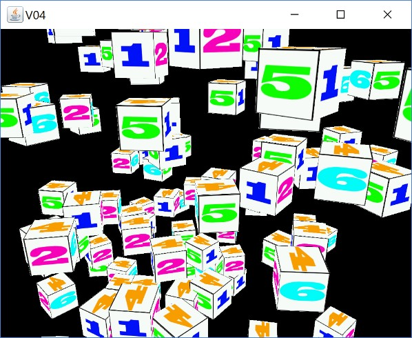

[back](ch5.md) | [main menu](../README.md)
 
## 5.3 A Camera

Resources: V05.java, etc

This program creates a camera that is under mouse and keyboard control. This is similar to the camera described in Joey's tutorial on a Camera. When you run the program, you will be able to fly through the scene of 100 cubes shown in Figure 5.6.

   
  <strong>Figure 5.6:</strong> 100 randomly positioned cubes

   
  <strong>Figure 5.7:</strong> Moving the camera

An instance of the Camera class is created in V05.java. V05.java also contains classes for Keyboard input and Mouse input, each of which can set attributes in the Camera class based on user input. Holding down the left button and moving the mouse will move the direction that the camera is looking in. The A and Z keys can be used to move in and out of the scene in the direction the camera is looking in. The arrow keys can be used to move up, down, left and right.

The Camera instance is passed to the V05_GLEventListener constructor. Thereafter the render method in this class uses the Camera instance to retrieve the current view matrix. The rest of the render method is the same as previous programs.

Take some time to read through Joey's tutorial and look at the new classes that I have created. It is not necessary that you understand the full details to be able to use the Camera class. You can just use it as it is in your programs. We will use it in subsequent Chapters and it can also be used in the assignment (as can any of the program code I have given you in this tutorial).

---

## MCQs (written in collaboration with Google Gemini)

GLSL???

---

## Exercises

1. Something about the maths package?

[back](ch5.md) | [main menu](../README.md)