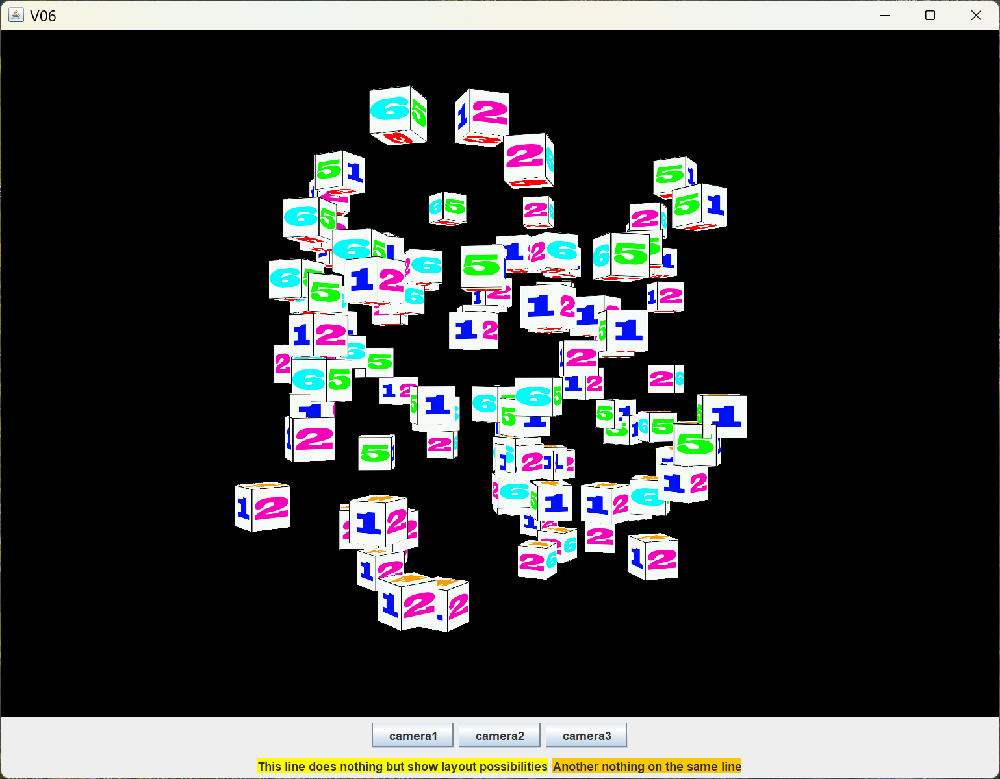

[back](ch5.md) | [main menu](../README.md)
 
## 5.4 Multiple cameras (advanced)

Program: [V06.java](/ch5_t_cs_c/ch5_camera_collection)

This example extends the single camera to a collection of cameras, each of which is under user control. The user interface has buttons to switch between each camera. Figure 5.8 shows the output of the program.

<p align="center">
  <br>
  <strong>Figure 5.8.</strong> A scene with multiple cameras that can be switched between.
</p>

Separate classes are created to handle the collection of cameras: CameraCollection and CameraControl. This has knock-on effects for other classes too. Program Listing 5.14 shows the CameraCollection class. I've included the import statements too. A Map is used to store the list of cameras, which makes use of our Camera class introduced in the previous section. The class is mainly composed of methods to add and get cameras and to set which one is active.

```java
import gmaths.*;

import java.util.HashMap;
import java.util.Map;
import java.util.Collection;

public class CameraCollection {
  
  private Map<String,Camera> cameras;

  private Camera activeCamera;

  public CameraCollection() {
    cameras = new HashMap<String, Camera>();
  }

  public void add(String name, Camera c) {
    cameras.put(name, c);
  }

  public Camera get(String name) {
    return cameras.get(name);
  }

  public void setActiveCamera(Camera c) {
    activeCamera = c;
  }

  public Camera getActiveCamera() {
    return activeCamera;
  }

  public void setAllPerspectiveMatrix(Mat4 p) {
    for (Camera value: cameras.values()) {
      value.setPerspectiveMatrix(p);
    }
  }

  public Collection<Camera> getCameras() {
    return cameras.values();
  }
}
```

**Program Listing 5.14:** CameraCollection.java


Program Listing 5.15 shows the CameraControl class. This class is used to handle all input from the user. Thus the keyboard input and mouse input is moved from the main class (V06) into this control class. Three cameras are set up. Since this class is used to control the cameras, methods are supplied to set and get the active camera which just pass through these calls to the CameraCollection class. If the user resizes the window, this affects the perspective matrix, so the cameras need to be updated to reflect this. The glEventListener class will call updateCameras in this case. Use of a CameraControl class has the advantage of simplifying the main program V06, which is shown in Program Listing 5.16.


```java
public class CameraControl implements ActionListener, MouseMotionListener, KeyListener {
  
  private static final String CAMERA1 = "camera1";
  private static final String CAMERA2 = "camera2";
  private static final String CAMERA3 = "camera3";

  private Point lastpoint;
  private CameraCollection cameras;
  private GLCanvas canvas;

  public CameraControl(GLCanvas canvas) {
    this.canvas = canvas;
    cameras = new CameraCollection();
    Camera camera1 = new Camera(Camera.DEFAULT_POSITION, Camera.DEFAULT_TARGET, Camera.DEFAULT_UP);
    Camera camera2 = new Camera(Camera.DEFAULT_POSITION, Camera.DEFAULT_TARGET, Camera.DEFAULT_UP);
    camera2.setPosition(new Vec3(4f,3f,15f));
    camera2.setTarget(new Vec3(0f,0f,0f));
    Camera camera3 = new Camera(Camera.DEFAULT_POSITION, Camera.DEFAULT_TARGET, Camera.DEFAULT_UP);
    camera3.setPosition(new Vec3(-4f,3f,15f));
    camera3.setTarget(new Vec3(0f,0f,0f));
    cameras.add(CAMERA1, camera1);
    cameras.add(CAMERA2, camera2);
    cameras.add(CAMERA3, camera3);
    cameras.setActiveCamera(cameras.get(CAMERA1));
  }

  public JPanel getPanel() {
    JPanel p = new JPanel();
      JButton b = new JButton(CAMERA1);
      b.addActionListener(this);
      p.add(b);
      b = new JButton(CAMERA2);
      b.addActionListener(this);
      p.add(b);
      b = new JButton(CAMERA3);
      b.addActionListener(this);
      p.add(b);
    return p;
  }

  public CameraCollection getCameraCollection() {
    return cameras;
  }

  public void setActiveCamera(String name) {
    cameras.setActiveCamera(cameras.get(name));
  }

  public Camera getActiveCamera() {
    return cameras.getActiveCamera();
  }

  public void updateCameras(Mat4 p) {
    Collection<Camera> list = cameras.getCameras();
    for (Camera c: list) {
      c.setPerspectiveMatrix(p);
    }
  }

  public void actionPerformed(ActionEvent e) {
    switch (e.getActionCommand()) {
      case CAMERA1:
        setActiveCamera(CAMERA1);
        break;
      case CAMERA2:
        setActiveCamera(CAMERA2);
        break;
      case CAMERA3:
        setActiveCamera(CAMERA3);
        break;
    }
    canvas.requestFocusInWindow();
  }

  /**
   * mouse is used to control camera position
   *
   * @param e  instance of MouseEvent
   */    
  public void mouseDragged(MouseEvent e) {
    Point ms = e.getPoint();
    float sensitivity = 0.001f;
    float dx=(float) (ms.x-lastpoint.x)*sensitivity;
    float dy=(float) (ms.y-lastpoint.y)*sensitivity;
    //System.out.println("dy,dy: "+dx+","+dy);
    // need to include shift key here as used as a modifier with key presses as well
    int mask = MouseEvent.BUTTON1_DOWN_MASK & MouseEvent.SHIFT_DOWN_MASK;
    if (e.getModifiersEx()==MouseEvent.BUTTON1_DOWN_MASK
        || (e.getModifiersEx() & mask) == mask) {
      cameras.getActiveCamera().updateYawPitch(dx, -dy);
    }
    lastpoint = ms;
  }

  /**
   * mouse is used to control camera position
   *
   * @param e  instance of MouseEvent
   */  
  public void mouseMoved(MouseEvent e) {   
    lastpoint = e.getPoint(); 
  }
  
  public void keyTyped(KeyEvent e) {
  }

  public void keyPressed(KeyEvent e) {
    Camera.Movement m = Camera.Movement.NO_MOVEMENT;
    if (e.getModifiersEx() == java.awt.event.InputEvent.SHIFT_DOWN_MASK)
      switch (e.getKeyCode()) {
        case KeyEvent.VK_W: m = Camera.Movement.FAST_FORWARD;  break;
        case KeyEvent.VK_S: m = Camera.Movement.FAST_BACK;  break;
        case KeyEvent.VK_A: m = Camera.Movement.FAST_LEFT;  break;
        case KeyEvent.VK_D: m = Camera.Movement.FAST_RIGHT; break;
        case KeyEvent.VK_Q: m = Camera.Movement.FAST_UP;  break;
        case KeyEvent.VK_E: m = Camera.Movement.FAST_DOWN;  break;
      }
    else
      switch (e.getKeyCode()) {
        case KeyEvent.VK_W: m = Camera.Movement.FORWARD;  break;
        case KeyEvent.VK_S: m = Camera.Movement.BACK;  break;
        case KeyEvent.VK_A: m = Camera.Movement.LEFT;  break;
        case KeyEvent.VK_D: m = Camera.Movement.RIGHT; break;
        case KeyEvent.VK_Q: m = Camera.Movement.UP;  break;
        case KeyEvent.VK_E: m = Camera.Movement.DOWN;  break;
      }
    cameras.getActiveCamera().keyboardInput(m);
  }

  public void keyReleased(KeyEvent e) {
  }

}
```

**Program Listing 5.15:** CameraCollection.java

Program Listing 5.16 shows the relevant part of V06.java. Mouse and keyboard interaction to control the camera is moved to the CameraControl class, so only a new instance of that is created and used here. A collection of buttons to control camera selection is created in the CameraControl class and added to the user interface here using p.add(cameraControl.getPanel()). The cameraControl instance is passed to the glEventListener class where the currently active camera is used in rendering the scene with a call in relevant places to cameraControl.getActiveCamera().


```java

public class V06 extends JFrame {
  
\\...

private V06_GLEventListener glEventListener;
private CameraControl cameraControl;

\\...

public V06(String textForTitleBar) {
  super(textForTitleBar);
  GLCapabilities glcapabilities = new GLCapabilities(GLProfile.get(GLProfile.GL3));
  canvas = new GLCanvas(glcapabilities);
  
  cameraControl = new CameraControl(canvas); 
  
  glEventListener = new V06_GLEventListener(cameraControl);
  canvas.addGLEventListener(glEventListener);
  canvas.addMouseMotionListener(cameraControl);
  canvas.addKeyListener(cameraControl);
  getContentPane().add(canvas, BorderLayout.CENTER);
  
  JPanel p = new JPanel();
  p.setLayout(new BoxLayout(p,BoxLayout.PAGE_AXIS));
    p.add(cameraControl.getPanel()); // first row of UI widgets
    JPanel labels = new JPanel(); // second row of UI widgets
    // ...
    p.add(labels); // second row end
  this.add(p, BorderLayout.SOUTH);

  //...
}
```

**Program Listing 5.16:** Part of V06.java


[back](ch5.md) | [main menu](../README.md)