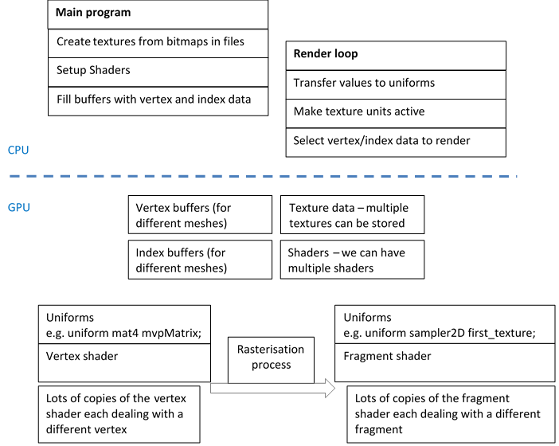

[main menu](../README.md)

# Chapter 6. Lighting

This Chapter follows Joey de Vries's tutorial on Lighting. Please read this before continuing. I will assume you have read it when describing the changes for JOGL.

Figure 6.0 shows the output of the 6 programs used in Sections 6.x to 6.y.

  .... 
  <strong>Figure 6.0.</strong> Output from programs in this chapter.

Figure 6.1 summarises where we are at with regards the complexity of our programs. It shows the data that we have been transferring to the GPU, via vertex and fragment attributes. We have used this structure to render textures on triangles and also to create a camera system. So far, we have drawn a single kind of object in each of our programs, for example, one cube or 100 cubes. Today we will look at shading objects according to the position of a light. We'll also look at using different objects in the same scene.

   
  <strong>Figure 6.1.</strong> Transferring data from CPU to GPU

This chapter is composed of four main sections:

1. [The Phong reflection model](ch6_1.md)
2. [A Mesh class](ch6_2.md)
3. [Adding texture](ch6_3.md)
4. [Extra: posterise](ch6_4.md)

The first section will introduce a light into the scene and describe the implementation of the components of the Phong reflection model in the fragment shader.

The second section introduces a Mesh class for representing objects as a list of vertices and triangles. This will reduce the clutter and complication of the methods in the GLEventListener class.

The third section describes how to use textures on an object and the changes required to an object's fragment shader.

The fourth section looks a specific effect that shows how to use the fragment shader to quantise the number of colours used in the final display of an object. This section is not needed for subsequent chapters.

## Note

In the program examples for this chapter, I've used separate folders as we progress through the programs. It is important to keep the code in separate folders. This is because some of the classes are updated from folder to folder - a version in one folder will not necessarily work in another folder.

Now that the programs are becoming a little more complicated, it is worth compiling all the java classes when you make changes: javac *.java, and then running the specific program, java ProgName. (Java doesn't necessarily recompile a class that has had a minor change if it is not referred to from the main class being compiled. Thus, compiling all classes is safest. An even safer approach is to delete all the class files before compiling: del *.class. This would, of course, be inefficient for a large system. A more professional approach would be to a class dependency tool.)

[main menu](../README.md)