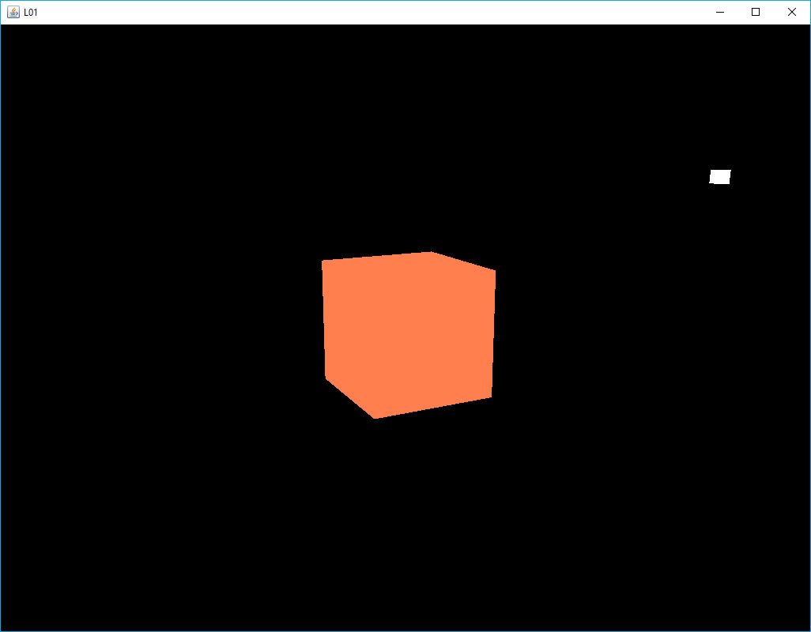
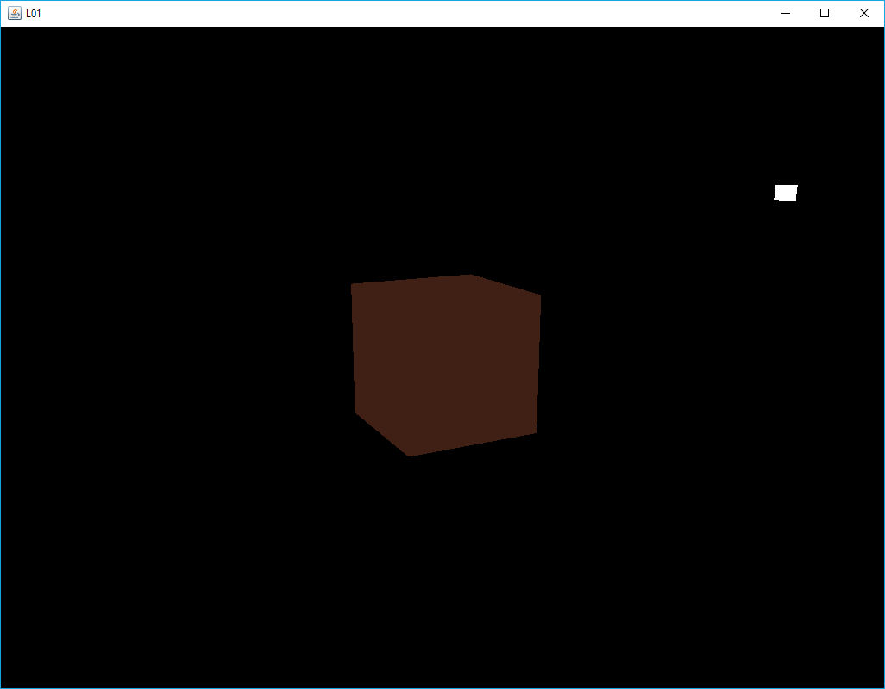
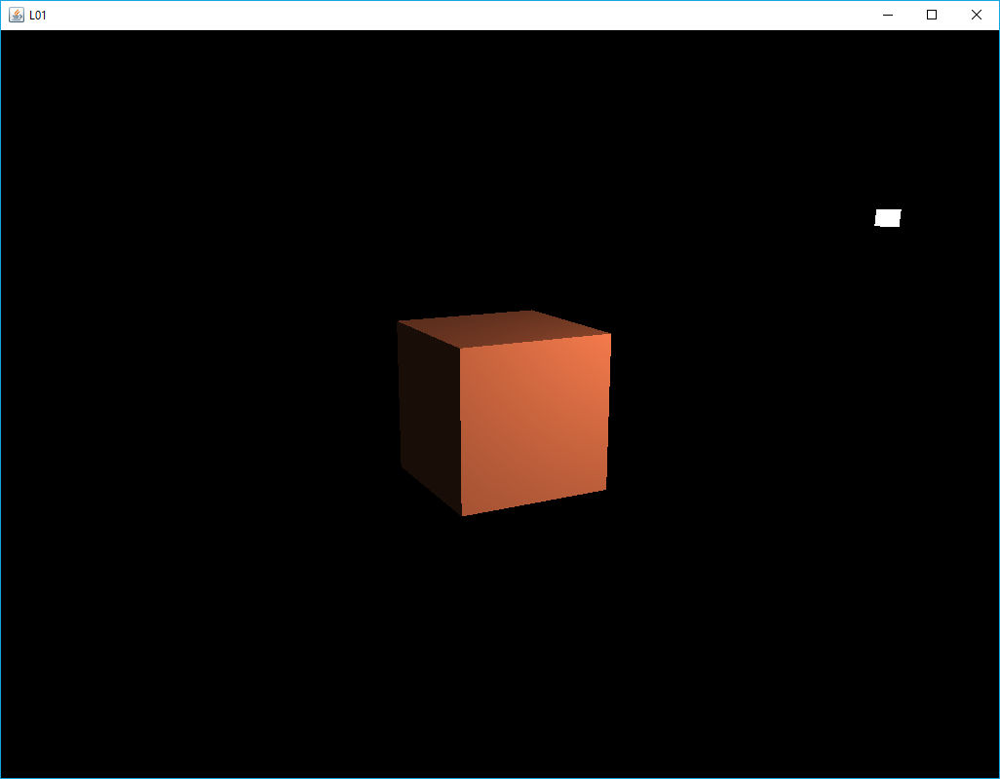

[back](ch5.md) | [main menu](../README.md)
 
## 6.1 The Phong reflection model

Resources: folder 6_1_start

### 6.1.1 A Light

This example makes use of the cube used in previous examples as the object to render. This is composed of 12 triangles and 24 vertices (since each 'corner' vertex is repeated three times, once per surface of the cube, so that each has different normal). Each vertex has an x,y,z position, an x,y,z normal (normalised), and texture coordinates, (s,t). We won't use the texture coordinates in early examples even though we will still transfer them to the GPU as part of the vertex attributes. We'll just ignore them in the shaders - for our early examples, the effects of the light will be clearer on surfaces without texture. Output from L01 is shown in Figure 6.1.

The light is represented as a simplified version of the cube data. We could have added a light to our scene without physically representing the light. However, this makes it difficult to understand where the light is and what effect it should be having on the scene. So, it is represented as an object: a 'simplified cube' is used, which is composed of 12 triangles, but only uses 8 vertices, with x,y,z position attributes. Vertex normals are not required, since we are not shading the light; we are just displaying it. Also, we are not interested in texturing the light, so texture coordinates are not required.

Program L01.java achieves its aim at the expense of some repetitive code, which we'll clear up in later examples. For now, I've again decided to limit the scope of the program code that needs to be focussed on, at the expense of efficiency. Thus two sets of vertex and index data are included in L01_GLEventListener.java, as well as two different fillBuffers() methods.

Separate vertex and fragment shaders are used for the cube object and for the light objects. Program listings 6.1 and 6.2 give the vertex and fragment shaders for the cube object, and Program listings 6.3 and 6.4 give the vertex and fragment shaders for the light object, respectively.

<p align="center">
  <br>
  <strong>Figure 6.1:</strong> Output from 6_1_start\L01.java
</p>

```glsl
#version 330 core
  
layout (location = 0) in vec3 position;
layout (location = 1) in vec3 normal;
layout (location = 2) in vec2 texCoord;

out vec3 aPos;
out vec3 aNormal;

uniform mat4 model;
uniform mat4 view;
uniform mat4 projection;
uniform mat4 mvpMatrix;
uniform mat4 tiModel;

void main() {
  // mat4 mvpMatrix2 = projection * view * model;
  // gl_Position = mvpMatrix2 * vec4(position, 1.0);

  gl_Position = mvpMatrix * vec4(position, 1.0);
  aPos = vec3(model*vec4(position, 1.0f));

  // aNormal = mat3(tiModel) * normal;  

  aNormal = mat3(transpose(inverse(model))) * normal;
}
```
Program listing 6.1: Vertex shader: assets/shaders/vs_cube_01.txt

```glsl
#version 330 core
  
in vec3 aPos;
in vec3 aNormal;

out vec4 fragColor;

uniform vec3 objectColor;
uniform vec3 lightColor;
uniform vec3 lightPos;
uniform vec3 viewPos;

void main() {
  fragColor = vec4(objectColor*lightColor, 1.0f);
}
```

Program listing 6.2: Fragment shader: assets/shaders/fs_cube_01.txt

The vertex shader for the cube (Program listing 6.1) contains a lot of information that we don't need for the first example, but that will be useful in subsequent examples. For example, aPos and aNormal are not used in the fragment shader (Program listing 6.2). Instead, this just computes a colour for the fragment using the uniforms objectColor and lightColor. However, we will update this fragment shader in subsequent examples to make use of aPos and aNormal so as to do shading based on the light's position. For now, every face of the cube will be a single colour. aPos is the position of a fragment in world space (computed by multiplying the vertex position with the model matrix). aNormal is computed by multiplying the vertex normal by the transpose inverse of the model matrix (which is sometimes referred to as the 'normal matrix').

The vertex shader for the light (Program listing 6.3) only needs to calculate the position of a vertex and pass this down the pipeline. The fragment shader (Program listing 6.4) colours the fragment white. Thus the light will appear as a white object. The next example will make changes to the cube's fragment shader.

```glsl
#version 330 core
  
layout (location = 0) in vec3 position;

uniform mat4 mvpMatrix;

void main() {
  gl_Position = mvpMatrix * vec4(position, 1.0);
}
```

Program listing 6.3: Vertex shader: assets/shaders/vs_light_01.txt

```glsl
#version 330 core

out vec4 fragColor;

void main() {
  fragColor = vec4(1.0f);
}
```

Program listing 6.4: Fragment shader: assets/shaders/fs_light_01.txt

---

### 6.1.2 Ambient light

The cube is coloured using ambient light (Figure 6.2). In L01_GLEventListener.initialise(), change the line:

```java
shaderCube = new Shader(gl, "assets/shaders/vs_cube_01.txt", "assets/shaders/fs_cube_01.txt");
```

to

```java
shaderCube = new Shader(gl, "assets/shaders/vs_cube_01.txt", "assets/shaders/fs_cube_01_ambient.txt");
```

The new fragment shader is given in Program listing 6.5. Essentially, all we have done is multiply the result in the fragment shader in Program listing 6.2 by 0.25f.

<p align="center">
  <br>
  <strong>Figure 6.2:</strong> Using the ambient shader
</p>

```glsl
#version 330 core
  
in vec3 aPos;
in vec3 aNormal;

out vec4 fragColor;

uniform vec3 objectColor;
uniform vec3 lightColor;
uniform vec3 lightPos;
uniform vec3 viewPos;

void main() {
  float ambientStrength = 0.25f;
  vec3 ambient = ambientStrength * lightColor;
  vec3 result = ambient * objectColor;
  fragColor = vec4(result, 1.0);
  }
```

Program listing 6.5: Fragment shader: assets/shaders/fs_cube_01_ambient.txt

## Exercise (optional)

1. A uniform could be added to the fragment shader to control the strength of the ambient value. [See below for a solution.]

---

### 6.1.3 Diffuse lighting

In L01_GLEventListener.initialise(), change the line:

```java
shaderCube = new Shader(gl, "assets/shaders/vs_cube_01.txt", "assets/shaders/fs_cube_01.txt");
```

to

```java
shaderCube = new Shader(gl, "assets/shaders/vs_cube_01.txt", "assets/shaders/fs_cube_01_diffuse.txt");
```

The new fragment shader is given in Program listing 6.6. The fragment position in world space (aPos) and the lighting vector between the light's position and the fragment position (lightDir) are used to calculate the diffuse lighting (Figure 6.3).

<p align="center">
  <br>
  <strong>Figure 6.3:</strong> Using the diffuse shader
</p>

```glsl
#version 330 core
  
in vec3 aPos;
in vec3 aNormal;

out vec4 fragColor;

uniform vec3 objectColor;
uniform vec3 lightColor;
uniform vec3 lightPos;
uniform vec3 viewPos;

void main() {
  // ambient
  float ambientStrength = 0.1;
  vec3 ambient = ambientStrength * lightColor;

  // diffuse
  vec3 norm = normalize(aNormal);
  vec3 lightDir = normalize(lightPos - aPos);  
  float diff = max(dot(norm, lightDir), 0.0);
  vec3 diffuse = diff * lightColor;

  vec3 result = (ambient + diffuse) * objectColor;
  fragColor = vec4(result, 1.0);
}
```

Program listing 6.6: Fragment shader: assets/shaders/fs_cube_01_diffuse.txt

## Exercise (optional)

1. A uniform could be added to the fragment shader to control the strength of the diffuse component. [See below for a solution.]

---

### 6.1.4 Specular lighting

In L01_GLEventListener.initialise(), change the line:

```java
shaderCube = new Shader(gl, "assets/shaders/vs_cube_01.txt", "assets/shaders/fs_cube_01.txt");
```

to

```java
shaderCube = new Shader(gl, "assets/shaders/vs_cube_01.txt", "assets/shaders/fs_cube_01_specular.txt");
```

The new fragment shader is given in Program listing 6.7. The vector from the fragment position to the camera view point is calculated. The mirror reflection vector (reflectDir) is calculated from the light direction and the fragment's normal. These terms are then used to calculate the specular term. We have thus calculated all three components of the Phong equation (Figure 6.4) that was covered in lectures.

Figure 6.5 shows the result when the light rotates around the object. The specular highlight appears on top of the cube when the light is on the other side of the cube from the camera position.

<p align="center">
  <br>
  <strong>Figure 6.4:</strong> Using the specular shader with a rotating light source
</p>

```glsl
#version 330 core
  
in vec3 aPos;
in vec3 aNormal;

out vec4 fragColor;

uniform vec3 objectColor;
uniform vec3 lightColor;
uniform vec3 lightPos;
uniform vec3 viewPos;

void main() {
  // ambient
  float ambientStrength = 0.1;
  vec3 ambient = ambientStrength * lightColor;

  // diffuse
  vec3 norm = normalize(aNormal);
  vec3 lightDir = normalize(lightPos - aPos);  
  float diff = max(dot(norm, lightDir), 0.0);
  vec3 diffuse = diff * lightColor;

  // specular
  float specularStrength = 0.5;
  vec3 viewDir = normalize(viewPos - aPos);
  vec3 reflectDir = reflect(-lightDir, norm);  
  float spec = pow(max(dot(viewDir, reflectDir), 0.0), 32);
  vec3 specular = specularStrength * spec * lightColor;  

  vec3 result = (ambient + diffuse + specular) * objectColor;
  fragColor = vec4(result, 1.0);
}
```

Program listing 6.7: Fragment shader: assets/shaders/fs_cube_01_specular.txt

## Exercises

1. Add uniforms to the fragment shader to control the strength of the ambient, diffuse and specular components. [Solution]
2. In Joey's tutorial, he goes on to discuss the Blinn-Phong model in the section on Advanced Lighting. Read through this section of his tutorial and then replace the fragment shader in Program Listing 6.7 with one that uses Blinn-Phong. [Solution] 

---

### 6.1.5 Moving light

Currently the light is static. There is an alternative version of method L01_GLEventListener.getLightModelMatrix() in the file L01_GLEventListener.java which can be used to animate the light's position. Program Listing 6.8 shows this. Uncomment the second version and comment out the first version. Then run L01 again. The output is shown in Figure 6.5. 

<p align="center">
  <br>
  <strong>Figure 6.5:</strong> Rotating the light around the object
</p>

```java
private Vec3 lightPosition = new Vec3(4f,5f,8f);
  
private Mat4 getLightModelMatrix() {
  Mat4 modelMatrix = new Mat4(1);
  modelMatrix = Mat4.multiply(Mat4Transform.scale(0.3f,0.3f,0.3f), modelMatrix);
  modelMatrix = Mat4.multiply(Mat4Transform.translate(lightPosition), modelMatrix);
  return modelMatrix;
}

// Alternative version for moving light
/* private Mat4 getLightModelMatrix() {
  double elapsedTime = getSeconds()-startTime;
  lightPosition.x = 5.0f*(float)(Math.sin(Math.toRadians(elapsedTime*50)));
  lightPosition.y = 3.0f;
  lightPosition.z = 5.0f*(float)(Math.cos(Math.toRadians(elapsedTime*50)));
  Mat4 modelMatrix = new Mat4(1);
  modelMatrix = Mat4.multiply(Mat4Transform.scale(0.3f,0.3f,0.3f), modelMatrix);
  modelMatrix = Mat4.multiply(Mat4Transform.translate(lightPosition), modelMatrix);
  return modelMatrix;
}*/
```

Program listing 6.8: Alternative versions of L01_GLEventListener.getLightModelMatrix() 


## Exercises

1. Alter the light's position by changing the following lines in method L01_GLEventListener.getLightModelMatrix():
```java
lightPosition.x = 5.0f*(float)(Math.sin(Math.toRadians(elapsedTime*50)));
lightPosition.y = 3.0f;
lightPosition.z = 5.0f*(float)(Math.cos(Math.toRadians(elapsedTime*50)));
```

For example, you can change the vertical position by changing the y coordinate, or alter the radius of the circle that is being used by changing the literals 5.0f (i.e. the radius) into something else.

2. Alter the speed of the light by altering the constant used to multiply elapsedTime. [Comments]

---

### 6.1.6 Light colour

If you examine the above program carefully, you will see that the renderCube method sets a lightColor variable in the fragment shader. This is set to (1,1,1):

```java
shader.setFloat(gl, "lightColor", 1f,1f,1f);
```

In the fragment shader, the final calculation for ambient, diffuse and specular is affected by the light colour and separate variables for ambientStrength, diffuseStrength and specularStrength. An alternative would be to create a Light class and add ambient, diffuse and specular Material values to this, and then use these to affect the strength of the ambient, diffuse and specular calculations in shaders, rather than have separate variables for ambientStrength, diffuseStrength and specularStrength. We'll do this soon. 


---

## MCQs (written in collaboration with Google Gemini)

GLSL???

---

## Exercises

1. Something about the maths package?


[back](ch5.md) | [main menu](../README.md)