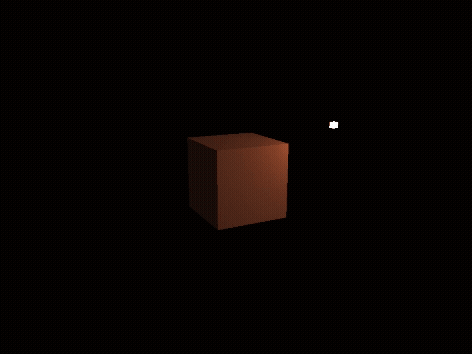

[back](ch6.md) | [main menu](../README.md)
 
## 6.1 The Phong reflection model

### 6.1.1 A Light

Program: [L01.java](/ch6_lighting/ch6_light)

This example makes use of the cube used in previous examples as the object to render. This is composed of 12 triangles and 24 vertices (since each 'corner' vertex is repeated three times, once per surface of the cube, so that each has different normal). Each vertex has an x,y,z position, an x,y,z normal (normalised), and texture coordinates, (s,t). We won't use the texture coordinates in early examples even though we will still transfer them to the GPU as part of the vertex attributes. We'll just ignore them in the shaders - for our early examples, the effects of the light will be clearer on surfaces without texture. Output from L01 is shown in Figure 6.1.

The light is represented as a simplified version of the cube data. We could have added a light to our scene without physically representing the light. However, this makes it difficult to understand where the light is and what effect it should be having on the scene. So, it is represented as an object: a 'simplified cube' is used, which is composed of 12 triangles, but only uses 8 vertices, with x,y,z position attributes. Vertex normals are not required, since we are not shading the light; we are just displaying it. Also, we are not interested in texturing the light, so texture coordinates are not required.

Program L01.java achieves its aim at the expense of some repetitive code, which we'll clear up in later examples. For now, I've again decided to limit the scope of the program code that needs to be focussed on, at the expense of efficiency. Thus two sets of vertex and index data are included in L01_GLEventListener.java, as well as two different fillBuffers() methods.

Separate vertex and fragment shaders are used for the cube object and for the light objects. Program listings 6.1 and 6.2 give the vertex and fragment shaders for the cube object, and Program listings 6.3 and 6.4 give the vertex and fragment shaders for the light object, respectively.

<p align="center">
  <br>
  <strong>Figure 6.1.</strong> Output from 6_1_start\L01.java
</p>

```glsl
#version 330 core
  
layout (location = 0) in vec3 position;
layout (location = 1) in vec3 normal;
layout (location = 2) in vec2 texCoord;

out vec3 aPos;
out vec3 aNormal;

uniform mat4 model;
uniform mat4 view;
uniform mat4 projection;
uniform mat4 mvpMatrix;
uniform mat4 tiModel;

void main() {
  // mat4 mvpMatrix2 = projection * view * model;
  // gl_Position = mvpMatrix2 * vec4(position, 1.0);

  gl_Position = mvpMatrix * vec4(position, 1.0);
  aPos = vec3(model*vec4(position, 1.0f));

  // aNormal = mat3(tiModel) * normal;  

  aNormal = mat3(transpose(inverse(model))) * normal;
}
```
**Program listing 6.1:** Vertex shader: assets/shaders/vs_cube_01.txt

```glsl
#version 330 core
  
in vec3 aPos;
in vec3 aNormal;

out vec4 fragColor;

uniform vec3 objectColor;
uniform vec3 lightColor;
uniform vec3 lightPos;
uniform vec3 viewPos;

void main() {
  fragColor = vec4(objectColor*lightColor, 1.0f);
}
```

**Program listing 6.2:** Fragment shader: assets/shaders/fs_cube_01.txt

The vertex shader for the cube (Program listing 6.1) contains a lot of information that we don't need for the first example, but that will be useful in subsequent examples. For example, aPos and aNormal are not used in the fragment shader (Program listing 6.2). Instead, this just computes a colour for the fragment using the uniforms objectColor and lightColor. However, we will update this fragment shader in subsequent examples to make use of aPos and aNormal so as to do shading based on the light's position. For now, every face of the cube will be a single colour. aPos is the position of a fragment in world space (computed by multiplying the vertex position with the model matrix). aNormal is computed by multiplying the vertex normal by the transpose inverse of the model matrix (which is sometimes referred to as the 'normal matrix').

The vertex shader for the light (Program listing 6.3) only needs to calculate the position of a vertex and pass this down the pipeline. The fragment shader (Program listing 6.4) colours the fragment white. Thus the light will appear as a white object. The next example will make changes to the cube's fragment shader.

```glsl
#version 330 core
  
layout (location = 0) in vec3 position;

uniform mat4 mvpMatrix;

void main() {
  gl_Position = mvpMatrix * vec4(position, 1.0);
}
```

**Program listing 6.3:** Vertex shader: assets/shaders/vs_light_01.txt

```glsl
#version 330 core

out vec4 fragColor;

void main() {
  fragColor = vec4(1.0f);
}
```

**Program listing 6.4:** Fragment shader: assets/shaders/fs_light_01.txt

---

### 6.1.2 Ambient light

The cube is coloured using ambient light (Figure 6.2). In L01_GLEventListener.initialise(), change the line:

```java
shaderCube = new Shader(gl, "assets/shaders/vs_cube_01.txt", "assets/shaders/fs_cube_01.txt");
```

to

```java
shaderCube = new Shader(gl, "assets/shaders/vs_cube_01.txt", "assets/shaders/fs_cube_01_ambient.txt");
```

The new fragment shader is given in Program listing 6.5. Essentially, all we have done is multiply the result in the fragment shader in Program listing 6.2 by 0.25f.

<p align="center">
  <br>
  <strong>Figure 6.2.</strong> Using the ambient shader
</p>

```glsl
#version 330 core
  
in vec3 aPos;
in vec3 aNormal;

out vec4 fragColor;

uniform vec3 objectColor;
uniform vec3 lightColor;
uniform vec3 lightPos;
uniform vec3 viewPos;

void main() {
  float ambientStrength = 0.25f;
  vec3 ambient = ambientStrength * lightColor;
  vec3 result = ambient * objectColor;
  fragColor = vec4(result, 1.0);
  }
```

**Program listing 6.5:** Fragment shader: assets/shaders/fs_cube_01_ambient.txt

## Exercise (optional)

1. A uniform could be added to the fragment shader to control the strength of the ambient value. [See below for a solution.]

---

### 6.1.3 Diffuse lighting

In L01_GLEventListener.initialise(), change the line:

```java
shaderCube = new Shader(gl, "assets/shaders/vs_cube_01.txt", "assets/shaders/fs_cube_01.txt");
```

to

```java
shaderCube = new Shader(gl, "assets/shaders/vs_cube_01.txt", "assets/shaders/fs_cube_01_diffuse.txt");
```

The new fragment shader is given in Program listing 6.6. The fragment position in world space (aPos) and the lighting vector between the light's position and the fragment position (lightDir) are used to calculate the diffuse lighting (Figure 6.3).

<p align="center">
  <br>
  <strong>Figure 6.3.</strong> Using the diffuse shader
</p>

```glsl
#version 330 core
  
in vec3 aPos;
in vec3 aNormal;

out vec4 fragColor;

uniform vec3 objectColor;
uniform vec3 lightColor;
uniform vec3 lightPos;
uniform vec3 viewPos;

void main() {
  // ambient
  float ambientStrength = 0.1;
  vec3 ambient = ambientStrength * lightColor;

  // diffuse
  vec3 norm = normalize(aNormal);
  vec3 lightDir = normalize(lightPos - aPos);  
  float diff = max(dot(norm, lightDir), 0.0);
  vec3 diffuse = diff * lightColor;

  vec3 result = (ambient + diffuse) * objectColor;
  fragColor = vec4(result, 1.0);
}
```

**Program listing 6.6:** Fragment shader: assets/shaders/fs_cube_01_diffuse.txt

## Exercise (optional)

1. A uniform could be added to the fragment shader to control the strength of the diffuse component. [See below for a solution.]

---

### 6.1.4 Specular lighting

In L01_GLEventListener.initialise(), change the line:

```java
shaderCube = new Shader(gl, "assets/shaders/vs_cube_01.txt", "assets/shaders/fs_cube_01.txt");
```

to

```java
shaderCube = new Shader(gl, "assets/shaders/vs_cube_01.txt", "assets/shaders/fs_cube_01_specular.txt");
```

The new fragment shader is given in Program listing 6.7. The vector from the fragment position to the camera view point is calculated. The mirror reflection vector (reflectDir) is calculated from the light direction and the fragment's normal. These terms are then used to calculate the specular term. We have thus calculated all three components of the Phong equation (Figure 6.4) that was covered in lectures.

Figure 6.5 shows the result when the light rotates around the object. The specular highlight appears on top of the cube when the light is on the other side of the cube from the camera position.

<p align="center">
  <br>
  <strong>Figure 6.4.</strong> Using the specular shader with a rotating light source
</p>

```glsl
#version 330 core
  
in vec3 aPos;
in vec3 aNormal;

out vec4 fragColor;

uniform vec3 objectColor;
uniform vec3 lightColor;
uniform vec3 lightPos;
uniform vec3 viewPos;

void main() {
  // ambient
  float ambientStrength = 0.1;
  vec3 ambient = ambientStrength * lightColor;

  // diffuse
  vec3 norm = normalize(aNormal);
  vec3 lightDir = normalize(lightPos - aPos);  
  float diff = max(dot(norm, lightDir), 0.0);
  vec3 diffuse = diff * lightColor;

  // specular
  float specularStrength = 0.5;
  vec3 viewDir = normalize(viewPos - aPos);
  vec3 reflectDir = reflect(-lightDir, norm);  
  float spec = pow(max(dot(viewDir, reflectDir), 0.0), 32);
  vec3 specular = specularStrength * spec * lightColor;  

  vec3 result = (ambient + diffuse + specular) * objectColor;
  fragColor = vec4(result, 1.0);
}
```

**Program listing 6.7:** Fragment shader: assets/shaders/fs_cube_01_specular.txt

## Exercises

1. Add uniforms to the fragment shader to control the strength of the ambient, diffuse and specular components. [Solution](#exercise-solutions)
2. In Joey's tutorial, he goes on to discuss the Blinn-Phong model in the section on Advanced Lighting. Read through this section of his tutorial and then replace the fragment shader in Program Listing 6.7 with one that uses Blinn-Phong. [Solution](#exercise-solutions)

---
## 6.1.5 A moving light

Program: [L02.java](/ch6_lighting/ch6_light)

Currently the light is static. There is an alternative version of method L01_GLEventListener.getLightModelMatrix() in the file L01_GLEventListener.java which can be used to animate the light's position. Program Listing 6.8 shows this. Uncomment the second version and comment out the first version. Then run L01 again. The output is shown in Figure 6.5. 

<p align="center">
  <br>
  <strong>Figure 6.5.</strong> Rotating the light around the object
</p>

```java
public void render(GL3 gl) {
  gl.glClear(GL.GL_COLOR_BUFFER_BIT | GL.GL_DEPTH_BUFFER_BIT);
  Mat4 projectionMatrix = camera.getPerspectiveMatrix();
  Mat4 viewMatrix = camera.getViewMatrix();
  //Mat4 lightModelMatrix = getLightModelMatrix();  // side effect: changes global light position
  Mat4 lightModelMatrix = getMovingLightModelMatrix(); // side effect: changes global light position
  renderLight(gl, shaderLight, lightModelMatrix, viewMatrix, projectionMatrix);
  // renderCube requires global light position
  renderCube(gl, shaderCube, getCubeModelMatrix(), viewMatrix, projectionMatrix);
}

// ...

private Vec3 lightPosition = new Vec3(4f,5f,8f);
  
private Mat4 getLightModelMatrix() {
  Mat4 modelMatrix = new Mat4(1);
  modelMatrix = Mat4.multiply(Mat4Transform.scale(0.3f,0.3f,0.3f), modelMatrix);
  modelMatrix = Mat4.multiply(Mat4Transform.translate(lightPosition), modelMatrix);
  return modelMatrix;
}

// Alternative version for moving light
private Mat4 getMovingLightModelMatrix() {
  double elapsedTime = getSeconds()-startTime;
  lightPosition.x = 5.0f*(float)(Math.sin(Math.toRadians(elapsedTime*50)));
  lightPosition.y = 3.0f;
  lightPosition.z = 5.0f*(float)(Math.cos(Math.toRadians(elapsedTime*50)));
  Mat4 modelMatrix = new Mat4(1);
  modelMatrix = Mat4.multiply(Mat4Transform.scale(0.3f,0.3f,0.3f), modelMatrix);
  modelMatrix = Mat4.multiply(Mat4Transform.translate(lightPosition), modelMatrix);
  return modelMatrix;
}
```

**Program listing 6.8:** Alternative versions of L01_GLEventListener.getLightModelMatrix() 

In the current program, the light is represented as a mesh so that it can be visualised as a physical object. We may wish to add a light that brightens the scene (or part of the scene using a proximity test) but is not a physical object. In this case, we would need a boolean to control the mesh rendering. Another aspect of the light is how it should appear if it is turned off. In this case, we would still see the light (bulb) but it would not be emitting light. In this case, we would need to change the Material of the light, setting the ambient, diffuse and specular terms to very small values or even zero. Each of these is left as an exercise.

## Exercises

1. Experiment with the literals used in the method to get the light's position. Currently the literals 5,3,5 are used. What happens if these are changed to 10,4,5. Try to predict what will happen before you run the program. Also, what happens if the literal value of 50 is changed to smaller or larger values? (The aim of this exercise is to get you to change some values so as to familiarise yourself with the code, as we will be building on this in the next sections. The use of Math.toRadians is to emphasize that the Math.sin function expects its parameter to be given in radians. Essentially, we are using the Math.sin function to deliver a smoothly changing value between -1 and +1.)

```java
lightPosition.x = 5.0f*(float)(Math.sin(Math.toRadians(elapsedTime*50)));
lightPosition.y = 3.0f;
lightPosition.z = 5.0f*(float)(Math.cos(Math.toRadians(elapsedTime*50)));
```

---

### 6.1.6 Light colour

If you examine the above program carefully, you will see that the renderCube method sets a lightColor variable in the fragment shader. This is set to (1,1,1):

```java
shader.setFloat(gl, "lightColor", 1f,1f,1f);
```

In the fragment shader, the final calculation for ambient, diffuse and specular is affected by the light colour and separate variables for ambientStrength, diffuseStrength and specularStrength. An alternative would be to create a Light class and add ambient, diffuse and specular Material values to this, and then use these to affect the strength of the ambient, diffuse and specular calculations in shaders, rather than have separate variables for ambientStrength, diffuseStrength and specularStrength. We'll do this soon. 

---

## Exercises

1.

---

## MCQs (written in collaboration with Google Gemini)

<p>1. According to the text, why is the light source represented as a simplified cube object in the L01.java program?</p>
<details>
<summary>a) To make the light source texture-mappable and visible in the scene.</summary>
<p><b>Incorrect.</b> The text states that the light object does not require texture coordinates or vertex normals, and its purpose is not to be textured but to be displayed to help the developer.</p>
</details>
<details>
<summary>b) To allow the light to be shaded by the Phong model like other objects in the scene.</summary>
<p><b>Incorrect.</b> The text explicitly states that the light is not shaded and that vertex normals are not required for it.</p>
</details>
<details>
<summary>c) To make it easier for a developer to understand the light's position and its effect on the scene.</summary>
<p><b>Correct.</b> The text explains that physically representing the light as an object makes it easier to understand where the light is and what effect it should have on the scene, even though it could have been added without a physical representation.</p>
</details>
<details>
<summary>d) To reduce the number of vertices and triangles in the scene for better performance.</summary>
<p><b>Incorrect.</b> The text states that this approach is at the "expense of some repetitive code" and that efficiency will be addressed in later examples, implying this approach is not for performance reasons.</p>
</details>

---

<p>2. Based on the provided shaders, which component of the Phong reflection model is being calculated using the dot product of the normalized normal vector (norm) and the light direction vector (lightDir)?</p>
<details>
<summary>a) The ambient component.</summary>
<p><b>Incorrect.</b> The ambient component is a constant value multiplied by the light color and object color, not a calculation involving surface normals or light direction.</p>
</details>
<details>
<summary>b) The diffuse component.</summary>
<p><b>Correct.</b> The fragment shader fs_cube_01_diffuse.txt explicitly shows float diff = max(dot(norm, lightDir), 0.0); to calculate the diffuse component of the lighting.</p>
</details>
<details>
<summary>c) The specular component.</summary>
<p><b>Incorrect.</b> The specular component is calculated using the dot product of the view direction and the reflection direction vectors, not the normal and light direction.</p>
</details>
<details>
<summary>d) The final fragment color.</summary>
<p><b>Incorrect.</b> The dot product is only one part of the calculation for the final color; the result of the dot product is used to calculate the diffuse term.</p>
</details>

---

<p>3. In the cube's vertex shader (vs_cube_01.txt), what is the purpose of multiplying the vertex normal by mat3(transpose(inverse(model)))?</p>
<details>
<summary>a) To transform the vertex normal from object space to world space, accounting for non-uniform scaling.</summary>
<p><b>Correct.</b> The text refers to this matrix as the 'normal matrix' and states it is used to compute the normal vector in world space. The transpose(inverse(model)) operation is necessary to correctly transform normals when the model matrix contains non-uniform scaling or shearing.</p>
</details>
<details>
<summary>b) To convert the vertex normal into 3D screen space for use in the fragment shader.</summary>
<p><b>Incorrect.</b> The gl_Position is the vertex position converted to 3D screen space. The normal is transformed into world space to be used for lighting calculations there.</p>
</details>
<details>
<summary>c) To change the normal's color based on the light's position.</summary>
<p><b>Incorrect.</b> The transpose(inverse(model)) is a matrix transformation for position and orientation, not a color operation. Color is determined in the fragment shader.</p>
</details>
<details>
<summary>d) To calculate the mvpMatrix on the GPU for efficiency.</summary>
<p><b>Incorrect.</b> The mvpMatrix is already passed in as a uniform. This matrix calculation is specific to transforming the normal vector, not the vertex position.</p>
</details>

---

<p>4. Which of the following accurately lists the three primary components of the Phong reflection model?</p>

<details>
<summary>a) Ambient, Emissive, and Specular.</summary>
<p><b>Incorrect.</b> While emissive light is a property of a material, it is not one of the three components of the Phong reflection model, which defines how light from external sources interacts with a surface.</p>
</details>

<details>
<summary>b) Diffuse, Ambient, and Specular.</summary>
<p><b>Correct.</b> The Phong model calculates a final color for a surface by summing its ambient, diffuse, and specular lighting contributions.</p>
</details>

<details>
<summary>c) Albedo, Normal, and Roughness.</summary>
<p><b>Incorrect.</b> These are terms and concepts commonly associated with Physically-Based Rendering (PBR), not the traditional Phong model.</p>
</details>

<details>
<summary>d) Diffuse, Refractive, and Glossy.</summary>
<p><b>Incorrect.</b> While diffuse is a component, "refractive" and "glossy" are not the standard terms used in the Phong model. Refraction refers to light bending through a material, and "glossy" is a more general term for a surface's specular properties.</p>
</details>

---

<p>5. In the Phong reflection model, what does the diffuse component represent?</p>

<details>
<summary>a) The light reflected directly at the viewer, which creates a highlight.</summary>
<p><b>Incorrect.</b> This describes the specular component of lighting.</p>
</details>

<details>
<summary>b) The light scattered equally in all directions from a surface, whose intensity depends on the angle between the light source and the surface normal.</summary>
<p><b>Correct.</b> The diffuse component models light scattering off a rough surface. It is brightest when the surface faces the light source directly and dims as the angle increases, but it is not dependent on the camera's view position.</p>
</details>

<details>
<summary>c) The uniform, scattered light that is independent of both the light source position and the viewer's position.</summary>
<p><b>Incorrect.</b> This describes the ambient component, which is a constant value added to the scene to simulate global illumination and light coming from all directions.</p>
</details>

<details>
<summary>d) The light a surface emits on its own, regardless of any external light sources.</p>
<p><b>Incorrect.</b> This describes the emissive property of a material, which is a separate concept from the Phong lighting components.</p>
</details>

---

<p>6. How is the specular component of lighting calculated in the Phong reflection model?</p>

<details>
<summary>a) By taking the dot product of the light vector and the surface normal, and then multiplying by a constant.</summary>
<p><b>Incorrect.</b> This is the formula for calculating the diffuse component.</p>
</details>

<details>
<summary>b) By multiplying the light's color with the surface's ambient color.</summary>
<p><b>Incorrect.</b> This is part of the calculation for the ambient component, which is a simplified model of light in a scene.</p>
</details>

<details>
<summary>c) By taking the dot product of the view vector and the reflected light vector, and raising the result to a power that represents the surface's shininess.</p>
<p><b>Correct.</b> This calculation creates the bright highlight on a surface. The power to which the dot product is raised, often called the Phong exponent, controls the size and sharpness of the highlight; a higher value creates a smaller, more focused highlight.</p>
</details>

<details>
<summary>d) By summing the ambient and diffuse contributions and dividing by the number of light sources.</summary>
<p><b>Incorrect.</b> The specular component is a separate calculation and is not derived from the sum of the other two. It is added to the ambient and diffuse components to get the final color.</p>
</details> 

---

## Exercise solutions

1. Add uniforms to the fragment shader to control the strength of the ambient, diffuse and specular components. 

The fragment shader:

```glsl
#version 330 core

in vec3 aPos;
in vec3 aNormal;

out vec4 fragColor;

uniform vec3 objectColor;
uniform vec3 lightColor;
uniform vec3 lightPos;
uniform vec3 viewPos;

uniform float ambientStrength, diffuseStrength, specularStrength;  // ***

void main() {
  // ambient
  vec3 ambient = ambientStrength * lightColor;                     // ***
  
  // diffuse
  vec3 norm = normalize(aNormal);
  vec3 lightDir = normalize(lightPos - aPos);  
  float diff = max(dot(norm, lightDir), 0.0);
  vec3 diffuse = diffuseStrength * diff * lightColor;              // ***
  
  // specular
  vec3 viewDir = normalize(viewPos - aPos);
  vec3 reflectDir = reflect(-lightDir, norm);  
  float spec = pow(max(dot(viewDir, reflectDir), 0.0), 32);
  vec3 specular = specularStrength * spec * lightColor;            // ***

  vec3 result = (ambient + diffuse + specular) * objectColor;
  fragColor = vec4(result, 1.0);
}
```


The renderCube method:

```java
private void renderCube(GL3 gl, Shader shader, Mat4 modelMatrix, Mat4 viewMatrix, Mat4 projectionMatrix) {
  
  double elapsedTime = getSeconds()-startTime;
  
  Mat4 mvpMatrix = Mat4.multiply(projectionMatrix, Mat4.multiply(viewMatrix, modelMatrix));
  
  shader.use(gl);
  shader.setFloatArray(gl, "model", modelMatrix.toFloatArrayForGLSL());
  shader.setFloatArray(gl, "view", viewMatrix.toFloatArrayForGLSL());
  shader.setFloatArray(gl, "projection", projectionMatrix.toFloatArrayForGLSL());
  shader.setFloatArray(gl, "mvpMatrix", mvpMatrix.toFloatArrayForGLSL());
  
  Mat4 m = Mat4.inverse(modelMatrix);
  m.transpose();
  shader.setFloatArray(gl, "tiModel", m.toFloatArrayForGLSL());

  shader.setFloat(gl, "objectColor", 1.0f, 0.5f, 0.31f);
  shader.setFloat(gl, "lightColor", 1f,1f,1f);
  shader.setVec3(gl, "lightPos", lightPosition);
  shader.setVec3(gl, "viewPos", camera.getPosition());
  
  // *** following three lines added
  shader.setFloat(gl, "ambientStrength", 0.2f);
  shader.setFloat(gl, "diffuseStrength", 0.7f); 
  shader.setFloat(gl, "specularStrength", 0.7f);
  
  // *** the following three lines create some unusual lighting effects by varying the values
  //shader.setFloat(gl, "ambientStrength", (float)(0.5 * 1+Math.sin(Math.toRadians(elapsedTime*10))));
  //shader.setFloat(gl, "diffuseStrength", (float)(0.5 * 1+Math.sin(Math.toRadians(elapsedTime*30))));
  //shader.setFloat(gl, "specularStrength", (float)(0.5 * 1+Math.sin(Math.toRadians(elapsedTime*50))));

  gl.glBindVertexArray(vertexArrayId[0]);
  gl.glDrawElements(GL.GL_TRIANGLES, indices.length, GL.GL_UNSIGNED_INT, 0);
  gl.glBindVertexArray(0);
}
```
  
Positioning the light:

It also helps to reposition the light so that the specular effects can be seen.
A sphere would be better at showing the effects, since the light could 
be placed in more positions to create a specular highlight on the surface of a sphere.
We'll introduce a sphere in a later example.

```java
private Vec3 lightPosition = new Vec3(2f,-2f,8f);             // ***

private Mat4 getLightModelMatrix() {
  Mat4 modelMatrix = new Mat4(1);
  modelMatrix = Mat4.multiply(Mat4Transform.scale(0.3f,0.3f,0.3f), modelMatrix);
  modelMatrix = Mat4.multiply(Mat4Transform.translate(lightPosition), modelMatrix);
  return modelMatrix;
}
```

---

2. In Joey's tutorial, he goes on to discuss the Blinn-Phong model in the section on Advanced Lighting. Read through this section of his tutorial and then replace the fragment shader in Program Listing 6.7 with one that uses Blinn-Phong.

```glsl
#version 330 core

in vec3 aPos;
in vec3 aNormal;

out vec4 fragColor;

uniform vec3 objectColor;
uniform vec3 lightColor;
uniform vec3 lightPos;
uniform vec3 viewPos;

void main() {
  // ambient
  float ambientStrength = 0.1;
  vec3 ambient = ambientStrength * lightColor;
  
  // diffuse
  vec3 norm = normalize(aNormal);
  vec3 lightDir = normalize(lightPos - aPos);  
  float diff = max(dot(norm, lightDir), 0.0);
  vec3 diffuse = diff * lightColor;
  
  // specular
  float specularStrength = 0.5;
  vec3 viewDir = normalize(viewPos - aPos);

  //vec3 reflectDir = reflect(-lightDir, norm);  // phong
  //float spec = pow(max(dot(viewDir, reflectDir), 0.0), 32); // phong

  vec3 halfwayDir = normalize(lightDir + viewDir);  // blinn-phong
  float spec = pow(max(dot(norm, halfwayDir), 0.0), 32);  // blinn-phong
  
  vec3 specular = specularStrength * spec * lightColor;  

  vec3 result = (ambient + diffuse + specular) * objectColor;
  fragColor = vec4(result, 1.0);
}
```

[back](ch6.md) | [main menu](../README.md)