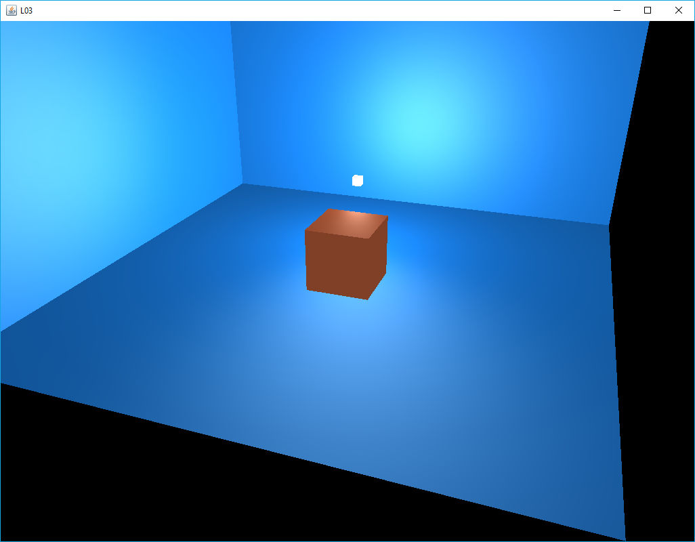

[back](ch6.md) | [main menu](../README.md)
 
## 6.2 Mesh

Program: [L03.java](/ch6_lighting/ch6_mesh)

The result from this section is a scene that contains three planes, a cube and a light, as illustrated in Figure 6.6. The planes are each made out of two triangles. Two of the planes are rotated and translated to make the vertical planes. 

<p align="center">
  <br>
  <strong>Figure 6.6.</strong> Output from L03.java
</p>

In our previous programs, we only had access to a cube and the mesh information was declared in the glEventListener class. Now we introduce a Mesh class to separate out these declarations.

### 6.2.1 A Mesh class

Program Listing 6.9 gives the relevant part of the Mesh class. This can be compared with earlier programs. It stores a list of vertex information and a list of triangles using indices into the vertex list. The other attributes are ones explained in earlier chapters and relate to the filing the buffers when transferring data from CPU to GPU.

Each vertex has an x,y,z local position, an x,y,z normal value and a u,v texture coordinate making a total of 8 floats for each vertex. All this information is in the 1D array vertices. An alternative would have been to create separate arrays for each attribute, i.e. position, normal, texture coordinates.

A Mesh is created by supplying the list of vertices and indices. The Mesh.render method follows a similar approach to previous programs.

By creating the Mesh class, it simplifies the glEventListener class and it can be used in any subsequent program. All that is required is to supply the lists of vertex and index information.


```java
public class Mesh {
  
  private float[] vertices;
  private int[] indices;
  private int vertexStride = 8;
  private int vertexXYZFloats = 3;
  private int vertexNormalFloats = 3;
  private int vertexTexFloats = 2;
  private int[] vertexBufferId = new int[1];
  private int[] vertexArrayId = new int[1];
  private int[] elementBufferId = new int[1];
  
  public Mesh(GL3 gl, float[] vertices, int[] indices) {
    this.vertices = vertices;
    this.indices = indices;
    fillBuffers(gl);
  }
  
  public void render(GL3 gl) {
    gl.glBindVertexArray(vertexArrayId[0]);
    gl.glDrawElements(GL.GL_TRIANGLES, indices.length, GL.GL_UNSIGNED_INT, 0);
    gl.glBindVertexArray(0);
  }

  private void fillBuffers(GL3 gl) {
    \\ ...
  }
  
}
```

**Program Listing 6.9:** The Mesh class

Calls can be made in any program to declare a Mesh:

```java
private Mesh cube;
```

A mesh can be created as follows:

```java
  cube = new Mesh(gl, Cube.vertices.clone(), Cube.indices.clone());
```

Here, a class called Cube is accessed to retrieve a copy of its vertices and indices and send them as parameters to the Mesh constructor.

Finally, a Mesh can be rendered as follows:

```java
  cube.render(gl);
```

---

# 6.2.2 Vertex and index lists

A separate Cube class and Sphere class are created which can be used to supply the vertex and index lists to the Mesh class, as illustrated in Program Listings 6.10 and 6.11. The arrays are stored as public static final attributes so can be easily accessed and cloned, e.g. Cube.vertices.clone();

```java
public final class Cube {
  
  // ***************************************************
  /* THE DATA
   */
  // anticlockwise/counterclockwise ordering
  
   public static final float[] vertices = new float[] {  // x,y,z, nx,ny,nz, s,t
      // ...
   };
     
   public static final int[] indices =  new int[] { // index 1,2,3
      // ...
  };

}
```

**Program Listing 6.10:** A Cube Class

```java
public final class Sphere {
  
  // ***************************************************
  /* THE DATA
   */
  // anticlockwise/counterclockwise ordering
  
   public static final float[] vertices = new float[] {  // x,y,z, nx,ny,nz, s,t
      // ...
   };
     
   public static final int[] indices =  new int[] { // index 1,2,3
      // ...
  };

}
```

**Program Listing 6.11:** A Sphere class

More classes can easily be added in this way, e.g. for a plane made of two triangles or for more complicated objects. An alternative would be to create a function that loaded meshes from file.

---

# 6.2.3 Using the Mesh class

Program Listing 6.12 gives an example that declares two instances of the Mesh class. Here, both a cube and a light object are declared. This gives the possibility of representing the light as any object. Here, a sphere is used.

At the moment, the program is still making use of separate variables to declare the properties of the cube and light. Here a light has been given ambient, diffuse and specular properties to give more control on calculating the lighting value in the fragment shader. Using all these separate variables will suffice whilst we concentrate on using the Mesh class. In a later example, we will introduce a Material class to wrap up some of the attributes of an object.


```java
// ***************************************************
  /* THE SCENE
   * Now define all the methods to handle the scene.
   * This will be added to in later examples.
   */

  private Mesh cube;
  private Mesh light;

  private Vec3 cubeAmbient = new Vec3(1.0f, 0.5f, 0.31f);
  private Vec3 cubeDiffuse = new Vec3(1.0f, 0.5f, 0.31f);
  private Vec3 cubeSpecular = new Vec3(0.5f, 0.5f, 0.5f);
  private float cubeShininess = 32.0f;

  private Vec3 lightPosition = new Vec3(4f,5f,8f);
  private Vec3 lightAmbient = new Vec3(0.2f, 0.2f, 0.2f);
  private Vec3 lightDiffuse = new Vec3(0.9f, 0.9f, 0.9f);
  private Vec3 lightSpecular = new Vec3(0.9f, 0.9f, 0.9f);

  public void initialise(GL3 gl) {
    cube = new Mesh(gl, Cube.vertices, Cube.indices);
    light = new Mesh(gl, Sphere.vertices, Sphere.indices);
   
    shaderCube = new Shader(gl, "assets/shaders/vs_standard.txt", "assets/shaders/fs_standard_0t.txt");
    
    shaderLight = new Shader(gl, "assets/shaders/vs_light_01.txt", "assets/shaders/fs_light_01.txt");
  }
```

**Program Listing 6.12** Making instances of the Mesh class


Rendering is achieved by the render method in Program Listing 6.13. This makes use of two helper classes to render the Cube and Light, respectively. Program Listings 6.14 and 6.15 give these. The cube renderer is similar to previous programs. The light renderer needs a little more explanation.

```java
  public void render(GL3 gl) {
    gl.glClear(GL.GL_COLOR_BUFFER_BIT | GL.GL_DEPTH_BUFFER_BIT);

    lightPosition = getLightPosition();  // changing light position each frame

    Mat4 projectionMatrix = camera.getPerspectiveMatrix();
    Mat4 viewMatrix = camera.getViewMatrix();
    
    renderLight(gl, shaderLight, getLightModelMatrix(), viewMatrix, projectionMatrix);
    renderCube(gl, shaderCube, getCubeModelMatrix(), viewMatrix, projectionMatrix);
  }
```

**Program Listing 6.13:** Using the Mesh class: rendering.


```java
  private void renderCube(GL3 gl, Shader shader, Mat4 modelMatrix, Mat4 viewMatrix, Mat4 projectionMatrix) {
    Mat4 mvpMatrix = Mat4.multiply(projectionMatrix, Mat4.multiply(viewMatrix, modelMatrix));
    
    shader.use(gl);
    shader.setFloatArray(gl, "model", modelMatrix.toFloatArrayForGLSL());
    shader.setFloatArray(gl, "mvpMatrix", mvpMatrix.toFloatArrayForGLSL());
    
    shader.setVec3(gl, "viewPos", camera.getPosition());

    shader.setVec3(gl, "light.position", lightPosition);
    shader.setVec3(gl, "light.ambient", lightAmbient);
    shader.setVec3(gl, "light.diffuse", lightDiffuse);
    shader.setVec3(gl, "light.specular", lightSpecular);

    shader.setVec3(gl, "material.ambient", cubeAmbient);
    shader.setVec3(gl, "material.diffuse", cubeDiffuse);
    shader.setVec3(gl, "material.specular", cubeSpecular);
    shader.setFloat(gl, "material.shininess", cubeShininess);

    cube.render(gl);
  }
```

**Program Listing 6.14:** Rendering the cube.

```java
  private void renderLight(GL3 gl, Shader shader, Mat4 modelMatrix, Mat4 view, Mat4 projection) {
    Mat4 mvpMatrix = Mat4.multiply(projection, Mat4.multiply(view, modelMatrix));
    
    shader.use(gl);
    shader.setFloatArray(gl, "model", modelMatrix.toFloatArrayForGLSL());
    shader.setFloatArray(gl, "mvpMatrix", mvpMatrix.toFloatArrayForGLSL());

    // use diffuse value of light Material as colour appearance of light
    shader.setVec3(gl, "lightColor", lightDiffuse);

    light.render(gl);
  }
```

**Program Listing 6.15:** Rendering the light.

In previous programs, the light was rendered as the colour (1,1,1). i.e. white. In Program Listing 6.15, it is rendered using the value stored in the diffuse property of the light. The shader that is used is updated accordingly, as illustrated in Program Listing 6.16. Thus, by changing the diffuse value of the light, its appearance can also be changed.

```glsl
#version 330 core

uniform vec3 lightColor;  
 
out vec4 fragColor;

void main() {
  fragColor = vec4(lightColor, 1.0);
  // fragColor = vec4(1.0f);
}
```

**Program Listing 6.16:** Fragment shader for the light.

We now have a Mesh class and a light that has more properties to be used in the fragment shader when calculating the rendering of an object. We can also make the light look like it should rather than being bright white all the time. The next section will add texture to the mix.

---

## Exercises

1. 

---

## MCQs (written in collaboration with Google Gemini)

<p>1. What is the primary purpose of creating the Mesh class, as described in the text?</p>
<details>
<summary>a) To store the vertex and index data for all objects in a single, large array.</summary>
<p><b>Incorrect.</b> The Mesh class stores the data for a single object, and its main purpose is to separate the object data from the glEventListener class.</p>
</details>
<details>
<summary>b) To simplify the glEventListener class by encapsulating the vertex and index data and rendering logic for a single object.</summary>
<p><b>Correct.</b> The text states that creating the Mesh class simplifies the glEventListener class and makes the mesh reusable in subsequent programs by separating out the data and rendering functionality.</p>
</details>
<details>
<summary>c) To enable the use of different shaders for each object in the scene.</summary>
<p><b>Incorrect.</b> While the Mesh class helps to organize objects, the use of different shaders is handled separately in the render method, not within the Mesh class itself.</p>
</details>
<details>
<summary>d) To create a new type of lighting effect for the objects.</summary>
<p><b>Incorrect.</b> The Mesh class handles the geometry and attributes of the object. The lighting effects are calculated in the shaders, which are separate from the Mesh class.</p>
</details>

---

<p>2. In the new structure, where are the vertex and index lists for a cube or a sphere now stored?</p>
<details>
<summary>a) They are declared directly within the Mesh class constructor.</summary>
<p><b>Incorrect.</b> The Mesh class constructor receives the vertex and index lists as parameters. The data itself is not declared there.</p>
</details>
<details>
<summary>b) They are loaded from an external file by the Mesh class.</summary>
<p><b>Incorrect.</b> The text mentions that an alternative would be to load meshes from a file, but the current implementation uses separate Cube and Sphere classes to provide the data.</p>
</details>
<details>
<summary>c) They are stored as public static final attributes in separate Cube and Sphere classes.</summary>
<p><b>Correct.</b> Program Listings 6.10 and 6.11 show that the vertices and indices arrays are stored as public static final attributes in their respective Cube and Sphere classes.</p>
</details>
<details>
<summary>d) They are part of the glEventListener class and are passed to the Mesh object.</summary>
<p><b>Incorrect.</b> The whole point of the Mesh class is to move the data out of the glEventListener class. The glEventListener class only creates instances of the Mesh class.</p>
</details>

---

<p>3. How is the light object's appearance changed from a bright white to another color in the new L03.java program?</p>
<details>
<summary>a) The renderLight() method now uses the light's ambient property to set its color.</summary>
<p><b>Incorrect.</b> The text states that the lightColor uniform is set to the value of the lightDiffuse property, not the ambient property.</p>
</details>
<details>
<summary>b) The light's color is changed by modifying the fs_light_01.txt fragment shader to use a new hardcoded value.</summary>
<p><b>Incorrect.</b> The shader is modified to accept a uniform lightColor variable, which is set from the main program, so the color is not hardcoded.</p>
</details>
<details>
<summary>c) The renderLight() method sets the lightColor uniform in the shader to the value of the light's diffuse property, which is then used by the fragment shader.</summary>
<p><b>Correct.</b> The renderLight() method in Program Listing 6.15 shows the line shader.setVec3(gl, lightColor, lightDiffuse);, and the fragment shader in Program Listing 6.16 uses this uniform to set the fragment color.</p>
</details>
<details>
<summary>d) The light's appearance is changed by modifying its normal attributes in the Sphere class.</summary>
<p><b>Incorrect.</b> The light is a simplified mesh that does not require normals. The color of the light is controlled by a uniform passed to its shader, not by its geometry.</p>
</details>

---

[Solution](#exercise-solutions)

## Exercise solutions


[back](ch6.md) | [main menu](../README.md)