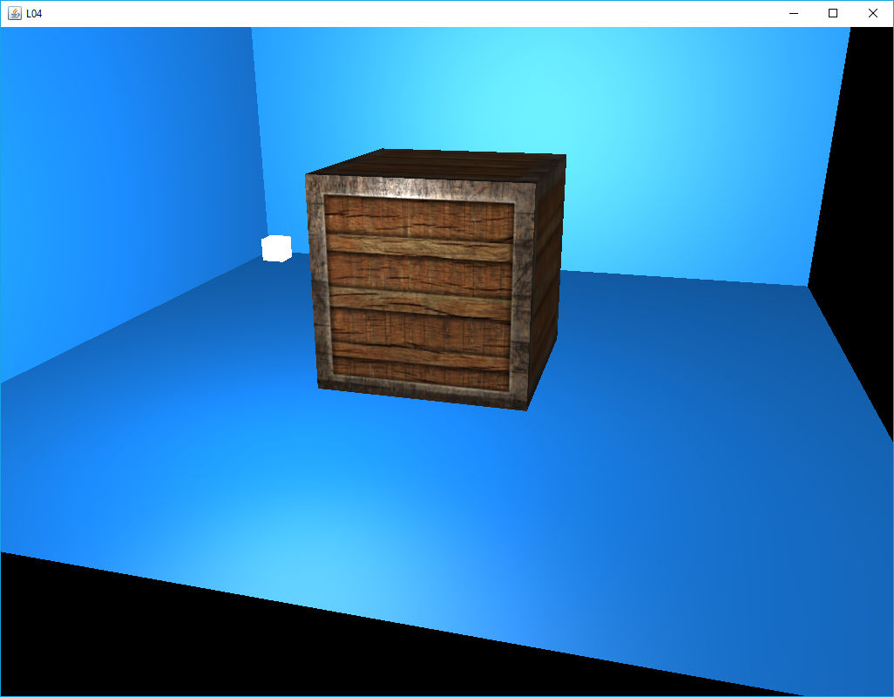

[back](ch6.md) | [main menu](../README.md)
 
## 6.3 Texture

So far, we have used ambient, diffuse, specular and shininess values in calculating a fragment's final colour. Now we will make use of colour bitmaps (textures) to alter the rendering of the objects. Figure 6.x shows an example, where a cube looks like a container made of wood with a pattern of light overlaid on the wood and with shiny metal edges to the container. THis is achieved by the use of a diffuse map, a specular map and an emission map. We'll make use of the TextureLibrary class from Chapter 4.

   
  <strong>Figure 6.x:</strong> Output from L04.java

### 6.3.1 Texture maps

These are stored in bitmap files. .jpg or .png can be used in the programs. These are usually a power of 2 in size in each dimension, e.g. 256x256. Figure 6.x shows the three texture maps used to produce the rendering of the container.

  .. 
  <strong>Figure 6.x:</strong> (a) Diffuse map; (b) Specular map; (c) Emission map.

---

## MCQs (written in collaboration with Google Gemini)

GLSL???

---

## Exercises

1. Something about the maths package?

[back](ch6.md) | [main menu](../README.md)