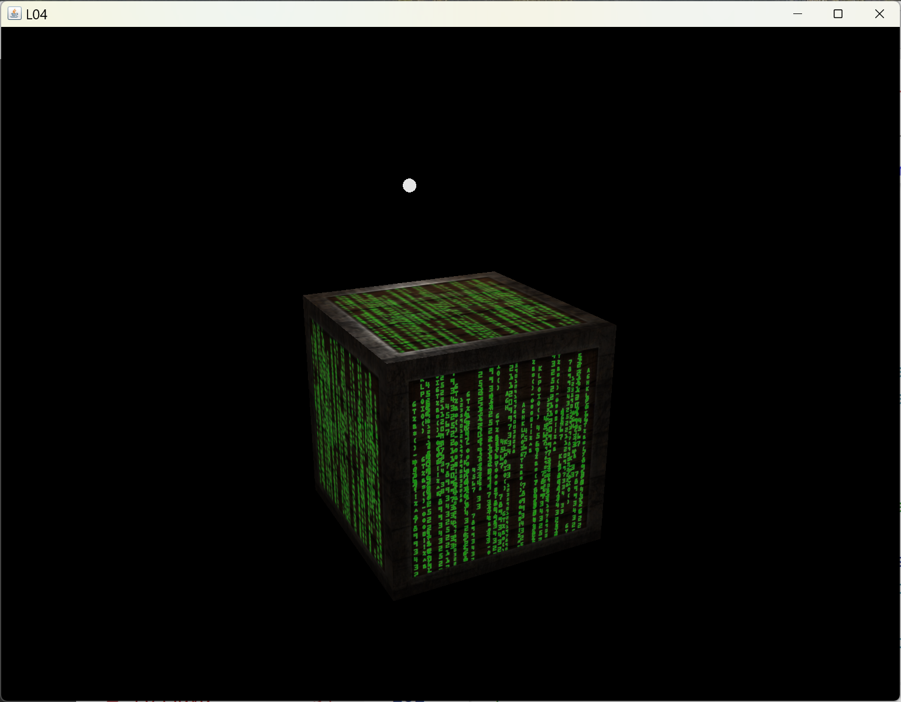
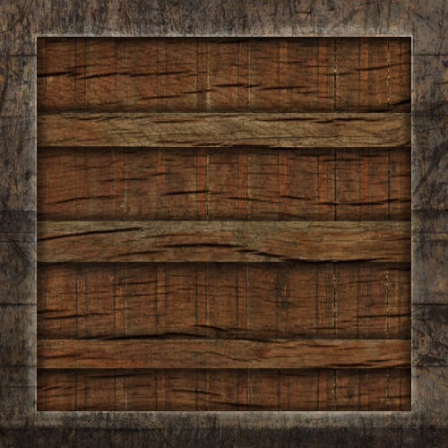
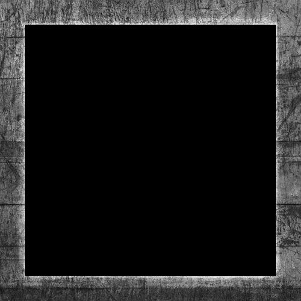
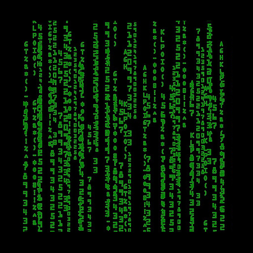
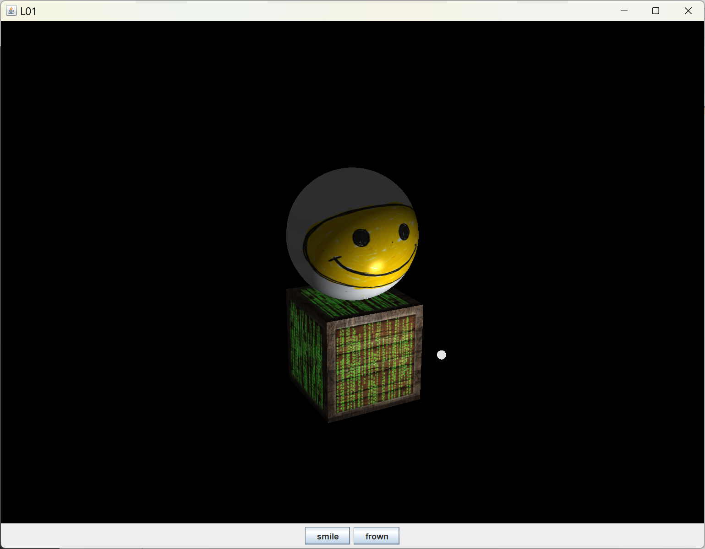
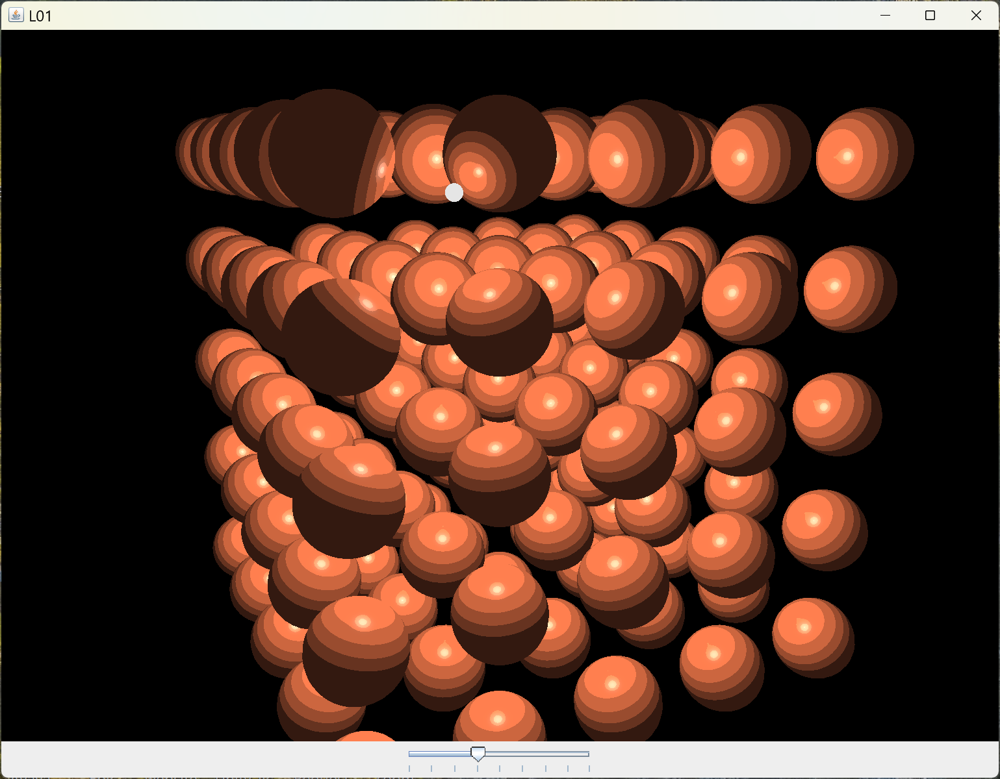

[back](ch6.md) | [main menu](../README.md)
 
## 6.3 Texture

So far, we have used ambient, diffuse, specular and shininess values in calculating a fragment's final colour. Now we will make use of colour bitmaps (textures) to alter the rendering of the objects. Figure 6.x shows an example, where a cube looks like a container made of wood with a pattern of light overlaid on the wood and with shiny metal edges to the container. THis is achieved by the use of a diffuse map, a specular map and an emission map. We'll make use of the TextureLibrary class from Chapter 4.

<p align="center">
  <br>
  <strong>Figure 6.x:</strong> Output from L04.java
</p>

### 6.3.1 Texture maps

These are stored in bitmap files. .jpg or .png can be used in the programs. These are usually a power of 2 in size in each dimension, e.g. 256x256. Figure 6.x shows the three texture maps used to produce the rendering of the container.

<p align="center">
  ..<br>
  <strong>Figure 6.x:</strong> (a) Diffuse map; (b) Specular map; (c) Emission map.
</p>

As with the previous section, a Mesh class is used but all other attributes are stored in glEventListener so as to keep all the relevant code for the example nearby for explanation purposes. These will be moved to Model and Material classes in the next chapter. Program Listing 6.x gives the declarations.

```java
private Mesh cube;
  private Mesh light;

  private Vec3 cubeAmbient = new Vec3(1.0f, 0.5f, 0.31f);
  private Vec3 cubeDiffuse = new Vec3(1.0f, 0.5f, 0.31f);
  private Vec3 cubeSpecular = new Vec3(0.5f, 0.5f, 0.5f);
  private float cubeShininess = 32.0f;

  private Shader cubeShader, lightShader;

  // textures
  private TextureLibrary textures;
  private Texture cubeDiffuseMap;
  private Texture cubeSpecularMap;
  private Texture cubeEmissionMap;

  private Vec3 lightPosition = new Vec3(4f,5f,8f);
  private Vec3 lightAmbient = new Vec3(0.2f, 0.2f, 0.2f);
  private Vec3 lightDiffuse = new Vec3(0.9f, 0.9f, 0.9f);
  private Vec3 lightSpecular = new Vec3(0.9f, 0.9f, 0.9f);
```

Program Listing 6.x: The variables used in L04.

Program Listing 6.x shows the initialise method. A collection of textures is loaded from file. A cube and a light are created. The Shaders are created and the diffuse, specular and emission maps are set up. These are explained in lectures. Note the name of the fragment shader file for the cube. The name indicates what texture maps are required for the shader. Here, "dse" indicates that a diffuse map, a specular map and an emission map must be supplied, as shown in Program Listing 6.x. If you examine the assets\shaders folder, you'll see that a range of other shaders require different combinations of texture maps and basic attributes such as the specular and shininess attributes. It is important that the correct shader is chosen depending on what texture maps you will use. Choosing the wrong shader can lead to unexpected things happening.

```java
public void initialise(GL3 gl) { 
  textures = new TextureLibrary();
  textures.add(gl, "diffuse_container", "assets/textures/container2.jpg");
  textures.add(gl, "specular_container", "assets/textures/container2_specular.jpg");
  textures.add(gl, "chequerboard", "assets/textures/chequerboard.jpg");
  textures.add(gl, "cloud", "assets/textures/cloud.jpg");
  textures.add(gl, "emission", "assets/textures/matrix.jpg");

  cube = new Mesh(gl, Cube.vertices, Cube.indices);
  light = new Mesh(gl, Sphere.vertices, Sphere.indices);

  cubeShader = new Shader(gl, "assets/shaders/vs_standard.txt", "assets/shaders/fs_standard_dse.txt");
  cubeDiffuseMap = textures.get("diffuse_container");
  cubeSpecularMap = textures.get("specular_container");
  cubeEmissionMap = textures.get("emission");

  lightShader = new Shader(gl, "assets/shaders/vs_light_01.txt", "assets/shaders/fs_light_01.txt");
}
```

```glsl
#version 330 core

in vec3 aPos;
in vec3 aNormal;
in vec2 aTexCoord;

out vec4 fragColor;

uniform vec3 viewPos;
uniform sampler2D diffuse_texture;
uniform sampler2D specular_texture;
uniform sampler2D emission_texture;

struct Light {
  vec3 position;
  vec3 ambient;
  vec3 diffuse;
  vec3 specular;
};

uniform Light light;  

struct Material {
  vec3 ambient;
  vec3 diffuse;
  vec3 specular;
  float shininess;
}; 
  
uniform Material material;

void main() {
  // ambient
  vec3 ambient = light.ambient * vec3(texture(diffuse_texture, aTexCoord));

  // diffuse
  vec3 norm = normalize(aNormal);
  vec3 lightDir = normalize(light.position - aPos);  
  float diff = max(dot(norm, lightDir), 0.0);
  vec3 diffuse = light.diffuse * diff * vec3(texture(diffuse_texture, aTexCoord)); 
  
  // specular 
  vec3 viewDir = normalize(viewPos - aPos);
  vec3 reflectDir = reflect(-lightDir, norm);  
  float spec = pow(max(dot(viewDir, reflectDir), 0.0), material.shininess);
  vec3 specular = light.specular * spec * vec3(texture(specular_texture, aTexCoord));

  vec3 emission = vec3(texture(emission_texture, aTexCoord));

  vec3 result = ambient + diffuse + specular + emission;
  fragColor = vec4(result, 1.0);
}
```

Program Listing 6.x: fs_standard_dse.txt

```java
private void renderCube(GL3 gl, Shader shader, Mat4 modelMatrix, Mat4 viewMatrix, Mat4 projectionMatrix) {
  Mat4 mvpMatrix = Mat4.multiply(projectionMatrix, Mat4.multiply(viewMatrix, modelMatrix));
  
  shader.use(gl);

  shader.setFloatArray(gl, "model", modelMatrix.toFloatArrayForGLSL());
  shader.setFloatArray(gl, "mvpMatrix", mvpMatrix.toFloatArrayForGLSL());
  
  shader.setVec3(gl, "viewPos", camera.getPosition());

  shader.setVec3(gl, "light.position", lightPosition);
  shader.setVec3(gl, "light.ambient", lightAmbient);
  shader.setVec3(gl, "light.diffuse", lightDiffuse);
  shader.setVec3(gl, "light.specular", lightSpecular);

  shader.setVec3(gl, "material.ambient", cubeAmbient);
  shader.setVec3(gl, "material.diffuse", cubeDiffuse);
  shader.setVec3(gl, "material.specular", cubeSpecular);
  shader.setFloat(gl, "material.shininess", cubeShininess);

  if (cubeDiffuseMap!=null) {
    shader.setInt(gl, "diffuse_texture", 0);  
    gl.glActiveTexture(GL.GL_TEXTURE0);
    cubeDiffuseMap.bind(gl);
  }
  if (cubeSpecularMap!=null) {
    shader.setInt(gl, "specular_texture", 1);  
    gl.glActiveTexture(GL.GL_TEXTURE1);
    cubeSpecularMap.bind(gl);
  }
  if (cubeEmissionMap!=null) {
    shader.setInt(gl, "emission_texture", 2);  
    gl.glActiveTexture(GL.GL_TEXTURE2);
    cubeEmissionMap.bind(gl);
  }

  cube.render(gl);
}
```

Program Listing 6.x: Rendering the cube with texture maps

The shaders rely on texture units on the GPU. We can see in Program Listing 6.x that rendering the cube makes use of texture units 0, 1 and 2. The basic attributes for ambient, diffuse and specular are first set up in the fragment shader. Then, if any of the texture maps are in use, they are set up accordingly. 

In future programs we wil make use of many more textures but only use textures units 0, 1 and 2. The analogy is real pictures (picture 1, picture 2, picture 3, picture 4, picture n, etc) which can be bound to a set of picture frames (e.g. GL_TEXTURE0, GL_TEXTURE1 and GL_TEXTURE2) as and when needed. The picture in the picture frame can be replaced before use in rendering.

Finally, Program Listing 6.x is the render method that calls renderCube. This is still making use of the glEventListener attribute 'lightPosition'. In a later program, we'll create a separate Light class to encapsulate all the light information. 

```java
public void render(GL3 gl) {
  gl.glClear(GL.GL_COLOR_BUFFER_BIT | GL.GL_DEPTH_BUFFER_BIT);

  lightPosition = getLightPosition();  // changing light position each frame

  Mat4 projectionMatrix = camera.getPerspectiveMatrix();
  Mat4 viewMatrix = camera.getViewMatrix();

  renderLight(gl, lightShader, getLightModelMatrix(), viewMatrix, projectionMatrix);
  renderCube(gl, cubeShader, getCubeModelMatrix(), viewMatrix, projectionMatrix);
}
```

---

### 6.3.2 Switching texture maps

The program L05 makes use of two texture maps that are switched based on a test in the program. When the z coordinate of the moving light is less than 0 one texture map is used, whilst another is used when the z coordinate is greater that or equal to 0. Figure 6.x shows the two alternatives. Program Listing 6.x shows how this is done in the renderSphere method.

<p align="center">
  .<br>
  <strong>Figure 6.x:</strong> (a) Smile; (b) Frown.
</p>

```java
private void renderSphere(GL3 gl, Shader shader, Mat4 modelMatrix, Mat4 viewMatrix, Mat4 projectionMatrix) {
    Mat4 mvpMatrix = Mat4.multiply(projectionMatrix, Mat4.multiply(viewMatrix, modelMatrix));
    
    shader.use(gl);
  
    shader.setFloatArray(gl, "model", modelMatrix.toFloatArrayForGLSL());
    shader.setFloatArray(gl, "mvpMatrix", mvpMatrix.toFloatArrayForGLSL());
    
    shader.setVec3(gl, "viewPos", camera.getPosition());

    shader.setVec3(gl, "light.position", lightPosition);
    shader.setVec3(gl, "light.ambient", lightAmbient);
    shader.setVec3(gl, "light.diffuse", lightDiffuse);
    shader.setVec3(gl, "light.specular", lightSpecular);

    shader.setVec3(gl, "material.ambient", cubeAmbient);
    shader.setVec3(gl, "material.diffuse", cubeDiffuse);
    shader.setVec3(gl, "material.specular", cubeSpecular);
    shader.setFloat(gl, "material.shininess", cubeShininess);

    Texture sphereDiffuseMap = sphereSmileDiffuseMap;
    // if (!smile) {
    //   sphereDiffuseMap = sphereFrownDiffuseMap;
    // }

    // alternative
    if (lightPosition.z > 0) {
      sphereDiffuseMap = sphereSmileDiffuseMap;
    }
    else {
      sphereDiffuseMap = sphereFrownDiffuseMap;
    }

    if (sphereDiffuseMap!=null) {
      shader.setInt(gl, "diffuse_texture", 0);  
      gl.glActiveTexture(GL.GL_TEXTURE0);
      sphereDiffuseMap.bind(gl);
    }
    // no specular or emission map for sphere

    sphere.render(gl);
  }
```

Program Listing 6.x: A switch is made between two diffuse maps based on a simple if test of the light's z position in world space.

---

### 6.3.3

Program L06 produces the output shown in Figure 6.x. A collection of spheres is drawn and a light moves in a circle. The rendering is posterised - the colour space is quantised, i.e. the number of colours is reduced to a limited, distinct set. The shader used to do this is given in Program Listing 6.x. The calculated fragment colour is mapped to a number of levels. This makes use of a uniform in the shader which is set based on the value of a slider in the user interface, which is visible at the bottom of Figure 6.x.

<p align="center">
  <br>
  <strong>Figure 6.x:</strong> Posterisation.
</p>

```java
#version 330 core

in vec3 aPos;
in vec3 aNormal;
in vec2 aTexCoord;

out vec4 fragColor;

uniform vec3 viewPos;

struct Light {
  vec3 position;
  vec3 ambient;
  vec3 diffuse;
  vec3 specular;
};

uniform Light light;  

struct Material {
  vec3 ambient;
  vec3 diffuse;
  vec3 specular;
  float shininess;
}; 
  
uniform Material material;

uniform float levels;

void main() {

  // ambient
  vec3 ambient = light.ambient * material.ambient;
  
  // diffuse
  vec3 norm = normalize(aNormal);
  vec3 lightDir = normalize(light.position - aPos);  
  float diff = max(dot(norm, lightDir), 0.0);
  vec3 diffuse = light.diffuse * diff * material.diffuse;

  // specular 
  vec3 viewDir = normalize(viewPos - aPos);
  vec3 reflectDir = reflect(-lightDir, norm);  
  float spec = pow(max(dot(viewDir, reflectDir), 0.0), material.shininess);
  vec3 specular = light.specular * spec * material.specular;

  vec3 result = ambient + diffuse + specular;
  fragColor = vec4(result, 1.0);

  float greyscale = max(fragColor.r, max(fragColor.g, fragColor.b));
  greyscale = max(greyscale,0.01); // need to avoid division by 0
  float lower     = floor(greyscale * levels) / levels;
  float lowerDiff = abs(greyscale - lower);
  float upper     = ceil(greyscale * levels) / levels;
  float upperDiff = abs(upper - greyscale);  
  float level      = lowerDiff <= upperDiff ? lower : upper;
  float adjustment = level / greyscale;  // need to avoid division by 0
  fragColor = vec4(fragColor.rgb * adjustment, 1.0);
}

// Posterization technique: see lettier.github.io/3d-game-shaders-for-beginners/posterization.html
```

---

### 6.3.4 Resource implications

So far we have not concerned ourselves with running out of resources, e.g. too many textures or too much vertex data. This is because we are unlikely to breach these limits in the examples we are looking at. However, you should be aware that, depending on the specific GPU, there are limits that need to be addressed in commercial systems. As an example, there are shader resource limitations. Another example is the limit for the maximum number of uniforms in a fragment shader: GL_MAX_FRAGMENT_UNIFORM_BLOCKS. Documents say a minimum of 12. If you use a lot of uniforms, you could hit this limit. Uniform buffer objects would then be required. 

There are also limits to the number of texture image units, although we are unlikely to breach these in our programs. (GL_MAX_COMBINED_TEXT_IMAGE_UNITS is the maximum number of texture units allowed and GL_MAX_TEXTURE IMAGE_UNITS is the maximum number of texture units accessible from one fragment shader (further information)[https://feedback.wildfiregames.com/report/opengl/].) A further issue is the number of textures. When the number of textures increases, it would be better to arrange multiple textures into a single texture (a texture atlas). Multiple objects could share the same texture, using different portions of it by using different texture coordinates. Textures issues will not concern us as we are only using up to three of the texture channels (GL_TEXTURE0, GL_TEXTURE1 and GL_TEXTURE2) and binding different textures when we need them.  


---

## MCQs (written in collaboration with Google Gemini)

GLSL???

---

## Exercises

1. Something about the maths package?


[back](ch6.md) | [main menu](../README.md)