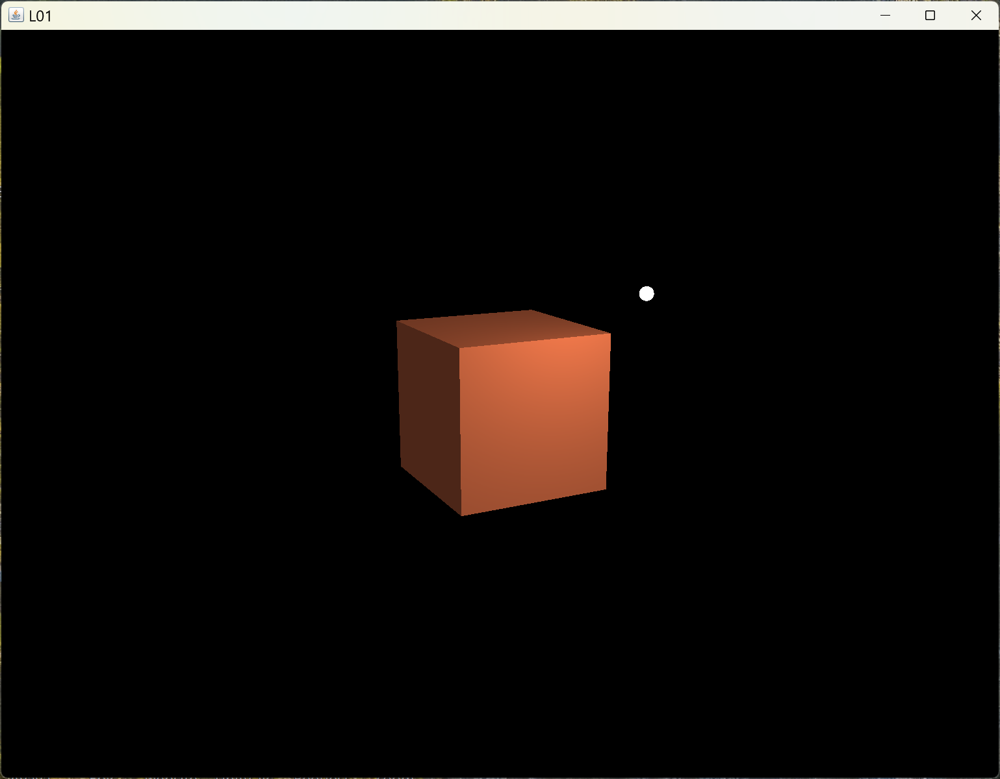
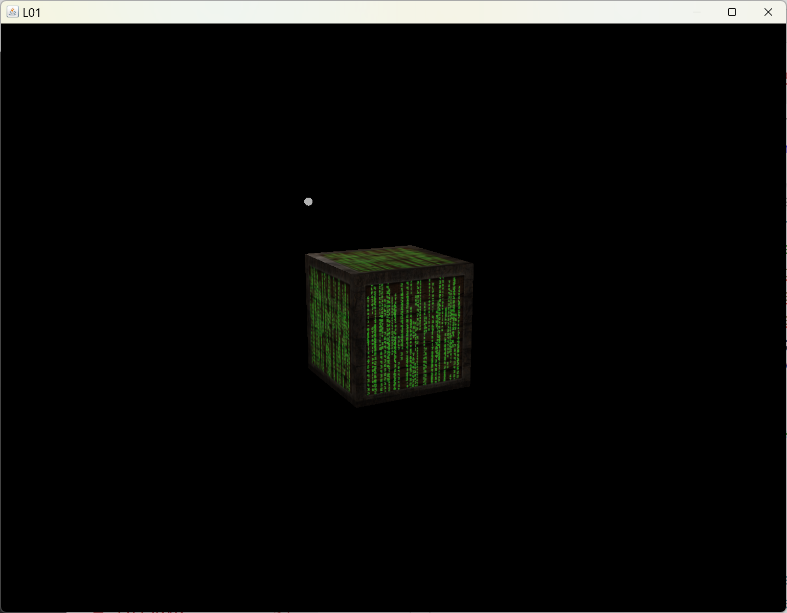

[main menu](../README.md)

# Chapter 7. A set of classes

Figure 7.0 shows the output of the 7 programs used in Sections 7.x to 7.y.

  ...... 
  <strong>Figure 7.0.</strong> Output from programs in this chapter.

[main menu](../README.md)