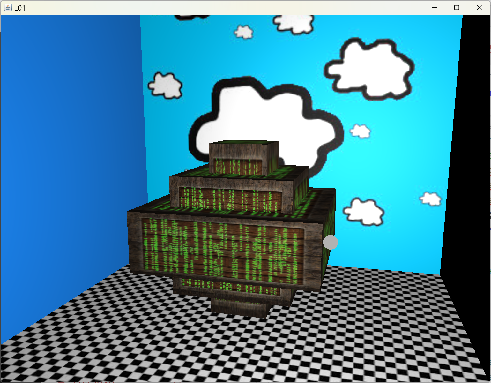
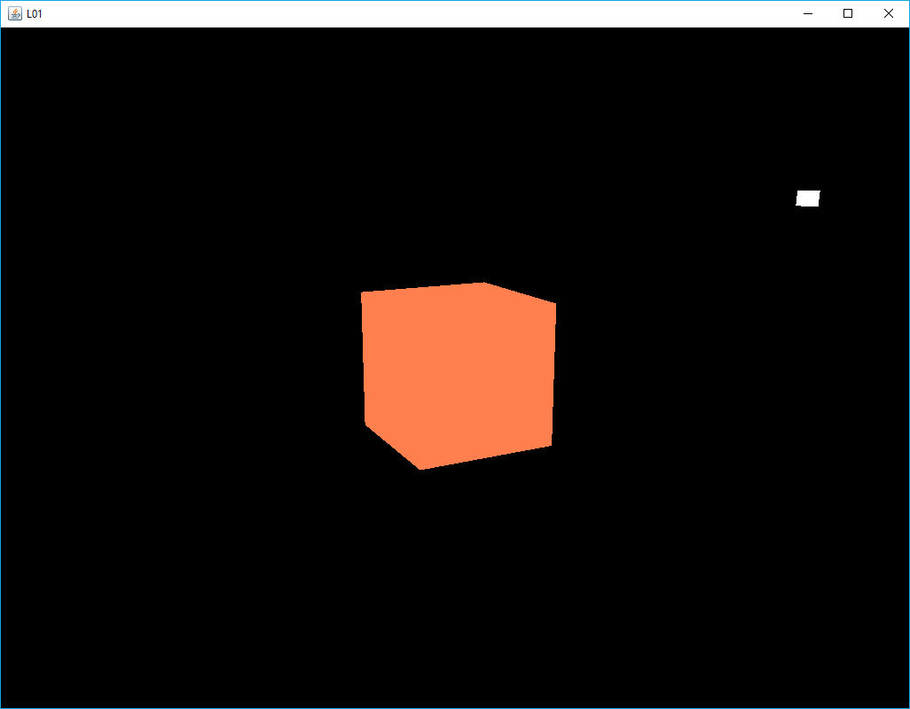
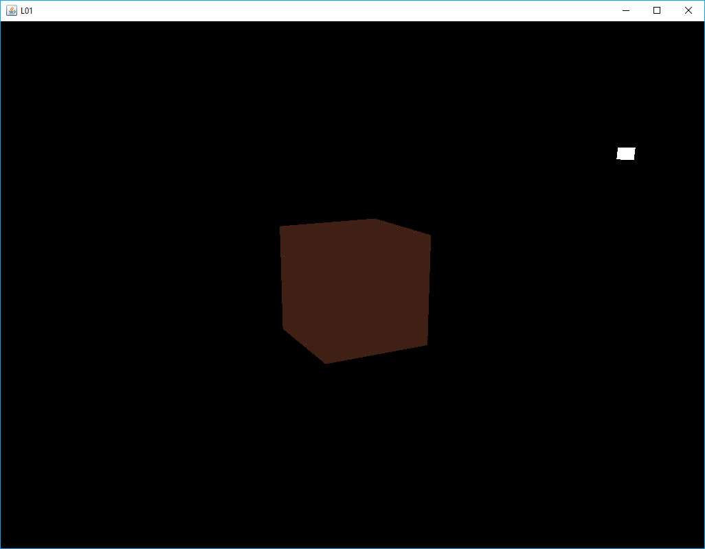
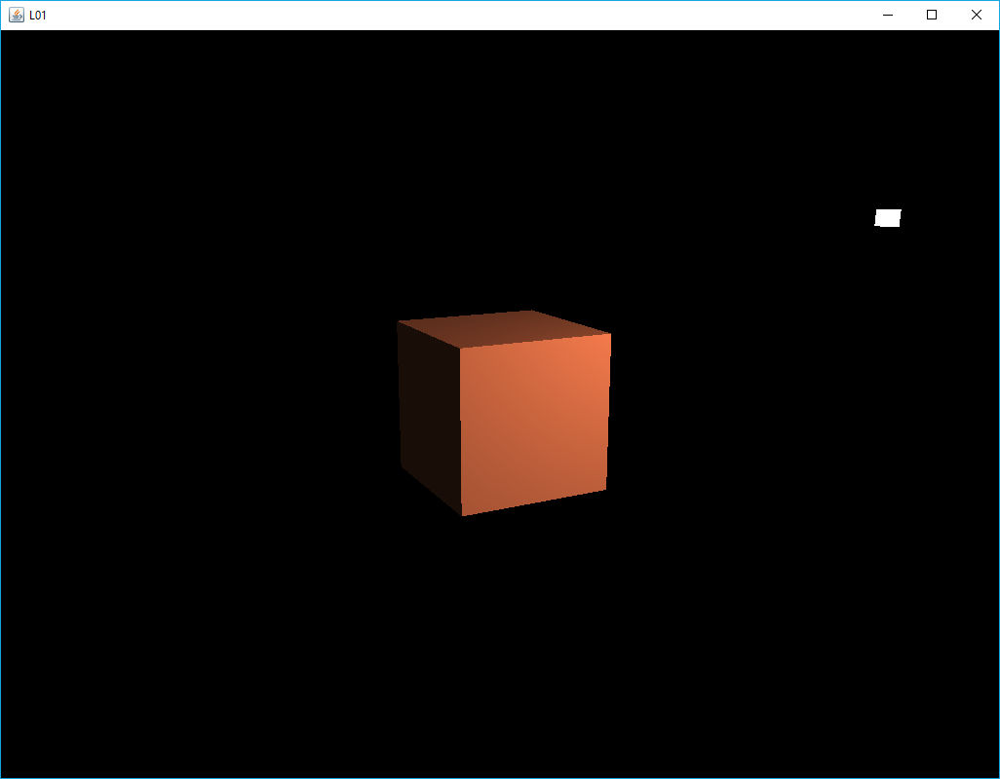

[back](ch7.md) | [main menu](../README.md)
 
## 7.1 Material

The aim is to move all the attributes related to the material properties of an object into a separate Material class. The first example, M01, produces the result in Figure 7.x.  A cube is declared along with an associated cubeMaterial. At this stage no texture maps are used in the program. A light is also declared to be a Mesh with associated lightMaterial. In section 7.2 we'll see these combined into a Model class. For now, we're proceeding a steady pace and slowly increasing the number of classes so the development from previous programs is easier to follow. 

As no texture maps are used in this program, shaderCube is set to use the basic fragment shader fs_standard_0t.txt. The light makes use of a constant to set its material properties. The collection of material constants is defined in a class called MaterialConstants. These are defined as final instances, so a clone is used to create an instance that can subsequently be changed. Program Listing 7.x shows some of the Material class and Program Listing 7.x shows some of the MaterialConstants class.

<p align="center">
  <br>
  <strong>Figure 7.x:</strong> Output from M01, a plain cube.
</p>


```java
private Mesh cube;
private Mesh light;
private Material cubeMaterial;
private Vec3 lightPosition = new Vec3(4f,5f,8f);
private Material lightMaterial;

public void initialise(GL3 gl) {
  cube = new Mesh(gl, Cube.vertices, Cube.indices);
  light = new Mesh(gl, Sphere.vertices, Sphere.indices);

  cubeMaterial = new Material(new Vec3(1.0f, 0.5f, 0.31f), 
                              new Vec3(1.0f, 0.5f, 0.31f), 
                              new Vec3(0.5f, 0.5f, 0.5f), 
                              32.0f);
  shaderCube = new Shader(gl, "assets/shaders/vs_standard.txt", 
                              "assets/shaders/fs_standard_0t.txt");

  lightMaterial = MaterialConstants.dullWhiteLightSource.clone();
  shaderLight = new Shader(gl, "assets/shaders/vs_light_01.txt", 
                                "assets/shaders/fs_light_01.txt");
}
```

Program Listing 7.x: Initialising a cube and a light, which make use of Material for the material properties.

```java
public class Material implements Cloneable {
  
  // Default is a fairly bright white colour with some specular.
  public static final Vec3 DEFAULT_AMBIENT = new Vec3(0.2f, 0.2f, 0.2f);
  public static final Vec3 DEFAULT_DIFFUSE = new Vec3(0.8f, 0.8f, 0.8f);
  public static final Vec3 DEFAULT_SPECULAR = new Vec3(0.5f, 0.5f, 0.5f);
  public static final Vec3 DEFAULT_EMISSION = new Vec3(0.0f, 0.0f, 0.0f);

  public static final float DEFAULT_SHININESS = 32;

  private Vec3 ambient;
  private Vec3 diffuse;
  private Vec3 specular;
  private Vec3 emission;  // not used in any program or shader, but here for completeness
  private float shininess;
  private Texture diffuseMap;
  private Texture specularMap;
  private Texture emissionMap;  // if emission properties are required, use this

  //...series of constructors

  //...series of set and get methods for the attributes

  //...a clone method
}
```

Program Listing 7.x: Material.java

```java
public class MaterialConstants {
  
  // Note: These are final and cannot be changed.

  public static final Material red = new Material(
    new Vec3(0.3f,0,0),new Vec3(1,0,0));
    
  public static final Material green = new Material(
    new Vec3(0,0.3f,0),new Vec3(0,1,0));

  public static final Material blue = new Material(
    new Vec3(0,0,0.3f),new Vec3(0,0,1));

  public static final Material dullWhiteLightSource = new Material(
    new Vec3(0.3f,0.3f,0.3f),new Vec3(0.7f,0.7f,0.7f),
    new Vec3(1,1,1),32);

  public static final Material brightWhiteLightSource = new Material(
    new Vec3(1,1,1),new Vec3(1,1,1),
    new Vec3(1,1,1),new Vec3(0.5f,0.5f,0.5f), 32);

  //...further declarations
}
```

Program Listing 7.x: MaterialConstants.java

Program Listing 7.x shows the render method which makes use of two helper methods to render the cube and the light. We'll focus on renderCube.

```java
public void render(GL3 gl) {
  gl.glClear(GL.GL_COLOR_BUFFER_BIT | GL.GL_DEPTH_BUFFER_BIT);

  lightPosition = getLightPosition();  // changing light position each frame

  Mat4 projectionMatrix = camera.getPerspectiveMatrix();
  Mat4 viewMatrix = camera.getViewMatrix();

  renderLight(gl, shaderLight, getLightModelMatrix(), viewMatrix, projectionMatrix);
  renderCube(gl, shaderCube, getCubeModelMatrix(), viewMatrix, projectionMatrix);
}
```

Program Listing 7.x: Rendering the light and the cube.


```java
private void renderCube(GL3 gl, Shader shader, Mat4 modelMatrix, Mat4 viewMatrix, Mat4 projectionMatrix) {
  Mat4 mvpMatrix = Mat4.multiply(projectionMatrix, Mat4.multiply(viewMatrix, modelMatrix));
  
  shader.use(gl);

  shader.setFloatArray(gl, "model", modelMatrix.toFloatArrayForGLSL());
  shader.setFloatArray(gl, "mvpMatrix", mvpMatrix.toFloatArrayForGLSL());
  
  shader.setVec3(gl, "viewPos", camera.getPosition());

  shader.setVec3(gl, "light.position", lightPosition);
  shader.setVec3(gl, "light.ambient", lightMaterial.getAmbient());
  shader.setVec3(gl, "light.diffuse", lightMaterial.getDiffuse());
  shader.setVec3(gl, "light.specular", lightMaterial.getSpecular());

  shader.setVec3(gl, "material.ambient", cubeMaterial.getAmbient());
  shader.setVec3(gl, "material.diffuse", cubeMaterial.getDiffuse());
  shader.setVec3(gl, "material.specular", cubeMaterial.getSpecular());
  shader.setFloat(gl, "material.shininess", cubeMaterial.getShininess());

  cube.render(gl);
}
```

Program Listing 7.x: Rendering the cube.

Program Listing 7.x shows the method to render a cube which makes use of the Material instances for the cube and the light to set the relevant shader values.

Program Listing 7.x deals with the light. Here, we can see that the colour that will be used to render the light mesh is the diffuse value of the light's material properties.

```java
private void renderLight(GL3 gl, Shader shader, Mat4 modelMatrix, Mat4 view, Mat4 projection) {
  Mat4 mvpMatrix = Mat4.multiply(projection, Mat4.multiply(view, modelMatrix));
  
  shader.use(gl);
  shader.setFloatArray(gl, "model", modelMatrix.toFloatArrayForGLSL());
  shader.setFloatArray(gl, "mvpMatrix", mvpMatrix.toFloatArrayForGLSL());

  shader.setVec3(gl, "lightColor", lightMaterial.getDiffuse());

  light.render(gl);
}
```

Program Listing 7.x: Rendering the light.

---

## 7.2 Model

Program M02 produces the output in Figure 7.x. A container is produced which uses a diffuse map, a specular map and an emission map. This is equivalent to an example in the previous chapter, but the coding is different as it makes use of a Model class.

<p align="center">
  <br>
  <strong>Figure 7.x:</strong> Output from M02, a container.
</p>

Program Listing 7.x gives the part of the glEventListener class that creates the scene and Program Listing 7.x gives the render method. These are clearly much simplified from previous programs. A cubeModel and a light are declared. The light class needs access to the camera in order to render its mesh correctly. The cubeModel is created using a helper method. Rendering consists of using the relevant render method in each class, i.e. Light and Model. Notice that the Light class also encapsulates the light position and provides a method to set this. getLightPosition is a local glEventListener helper method to animate the light position.

```java
private Model cubeModel;
private Light light;

// textures
private TextureLibrary textures;

public void initialise(GL3 gl) {
  createRandomNumbers();

  textures = new TextureLibrary();
  textures.add(gl, "diffuse_container", "assets/textures/container2.jpg");
  textures.add(gl, "specular_container", "assets/textures/container2_specular.jpg");
  textures.add(gl, "chequerboard", "assets/textures/chequerboard.jpg");
  textures.add(gl, "cloud", "assets/textures/cloud.jpg");
  textures.add(gl, "emission", "assets/textures/matrix.jpg");

  light = new Light(gl, camera);
  cubeModel = makeCube(gl);                             
}
```

Program Listing 7.x: Creating the model

```java
public void render(GL3 gl) {
  gl.glClear(GL.GL_COLOR_BUFFER_BIT | GL.GL_DEPTH_BUFFER_BIT);

  light.setPosition(getLightPosition()); // changing light position each frame

  light.render(gl);
  cubeModel.render(gl);
}
```

Program Listing 7.x: Rendering the model

At this high level, all that remains is to define the makeCube helper method. This is given in Program Listing 7.x. A mesh is created by cloning the Cube information. A scale transformation matrix is created> The shader uses the 'dse' fragment shader, indicating that a diffuse map, a specular map and an emission map are required. These are retrieved from the TextureLibrary set up in the initialise method. Next, an instance of the Renderer class is created, which will handle all rendering of the object. Finally, the Model instance is created. This wraps up all the previous classes, as well as links to the light and camera classes.

```java
private Model makeCube(GL3 gl) {
  String name = "cube";
  Mesh mesh = new Mesh(gl, Cube.vertices.clone(), Cube.indices.clone());
  Mat4 modelMatrix = Mat4Transform.scale(4,4,4);
  Shader shader = new Shader(gl, "assets/shaders/vs_standard.txt", 
                                "assets/shaders/fs_standard_dse.txt");
  Material material = MaterialConstants.gold.clone(); 
  //new Material(ambient,diffuse, specular, shininess);
  material.setDiffuseMap(textures.get("diffuse_container"));
  material.setSpecularMap(textures.get("specular_container"));
  material.setEmissionMap(textures.get("emission"));
  Renderer renderer = new Renderer();
  return new Model(name, mesh, modelMatrix, shader, material, renderer, light, camera);
}
```

The Model class is shown in Program Listing 7.x. This contains the attributes to enable a mesh to be transformed and rendered. The render method makes uses of the Renderer instance, passing the required parameters. A second version of render is supplied that can be used to override the transformation stored for the object. This method will be very useful in the next chapter when we introduce scene graphs.

```java
public class Model {
  
  protected String name;
  protected Mesh mesh;
  protected Mat4 modelMatrix;
  protected Shader shader;
  protected Material material;
  protected Camera camera;
  protected Light light;
  protected Renderer renderer;

  //...series of constructors

  //...series of set and get methods for the attributes
  
  public void render(GL3 gl) {
    renderer.render(gl, mesh, modelMatrix, shader, material, light, camera);
  }

  // Second version of render is so that modelMatrix can be overridden with a new parameter.  
  public void render(GL3 gl, Mat4 modelMatrix) {
    if (mesh_null()) {
      System.out.println("Error: null in model render");
      return;
    }
    renderer.render(gl, mesh, modelMatrix, shader, material, light, camera);
  } 
  
  private boolean mesh_null() {
    return (mesh==null);
  }
}
```

Program Listing 7.x: The Model class

Program Listing 7.x gives the Renderer class. Only the render method is shown. Other methods are similar to what has been used in previous programs. These are left as an exercise to read through. The relevant shader (containing links to the vertex and fragment shaders) is set for use. doVertexShaderMatrices passes the model and mvp matrices to the vertex shader. doSingleLight and doBasicMaterial pass the relevant light and object material properties to the fragment shader (even if some of them are not needed, i.e. when texture maps are used). If specific texture maps exist these are then passed to the fragment shader. Finally, the mesh is rendered: inside the Mesh class the relevant vertexArray is bound and the elements are drawn, as per the process described in earlier chapters.

```java
public class Renderer {

  public Renderer() {}

  //...other methods

  public void render(GL3 gl, Mesh mesh, Mat4 modelMatrix,  Shader shader, 
    Material material, Light light, Camera camera) {
    // set shader variables. Be careful that these variables exist in the shader
    shader.use(gl);
    doVertexShaderMatrices(gl, shader, modelMatrix, camera);
    doSingleLight(gl, shader, light);
    doBasicMaterial(gl, shader, material);
    if (material.diffuseMapExists()) {
      Texture dm = material.getDiffuseMap();
      doDiffuseMap(gl, shader, dm);
    }
    if (material.specularMapExists()) {
      Texture sm = material.getSpecularMap();
      doSpecularMap(gl, shader, sm);
    }
    if (material.emissionMapExists()) {
      Texture em = material.getEmissionMap();
      doEmissionMap(gl, shader, em);
    }

    // // then render the mesh
    mesh.render(gl);
  }

}
```

Program Listing 7.x: The Renderer class

We now have a working set of classes that can be used to build more complex scenes containing multiple objects each with different materials.

## 7.3 Scenes

The programs Scene1, Scene2, Scene3, Scene4 and Scene5 produce the outputs shown in Figure 7.x. We'll examine just one of these with the rest left to consider as an exercise.

<p align="center">
  ....<br>
  <strong>Figure 7.x.</strong> Outputs from Scene1, Scene2, Scene3, Scene4 and Scene5.
</p>


Resources: folder 6_1_start

### 6.1.1 A Light

This example makes use of the cube used in previous examples as the object to render. This is composed of 12 triangles and 24 vertices (since each 'corner' vertex is repeated three times, once per surface of the cube, so that each has different normal). Each vertex has an x,y,z position, an x,y,z normal (normalised), and texture coordinates, (s,t). We won't use the texture coordinates in early examples even though we will still transfer them to the GPU as part of the vertex attributes. We'll just ignore them in the shaders - for our early examples, the effects of the light will be clearer on surfaces without texture. Output from L01 is shown in Figure 6.1.

The light is represented as a simplified version of the cube data. We could have added a light to our scene without physically representing the light. However, this makes it difficult to understand where the light is and what effect it should be having on the scene. So, it is represented as an object: a 'simplified cube' is used, which is composed of 12 triangles, but only uses 8 vertices, with x,y,z position attributes. Vertex normals are not required, since we are not shading the light; we are just displaying it. Also, we are not interested in texturing the light, so texture coordinates are not required.

Program L01.java achieves its aim at the expense of some repetitive code, which we'll clear up in later examples. For now, I've again decided to limit the scope of the program code that needs to be focussed on, at the expense of efficiency. Thus two sets of vertex and index data are included in L01_GLEventListener.java, as well as two different fillBuffers() methods.

Separate vertex and fragment shaders are used for the cube object and for the light objects. Program listings 6.1 and 6.2 give the vertex and fragment shaders for the cube object, and Program listings 6.3 and 6.4 give the vertex and fragment shaders for the light object, respectively.

<p align="center">
  <br>
  <strong>Figure 6.1:</strong> Output from 6_1_start\L01.java
</p>

```glsl
#version 330 core
  
layout (location = 0) in vec3 position;
layout (location = 1) in vec3 normal;
layout (location = 2) in vec2 texCoord;

out vec3 aPos;
out vec3 aNormal;

uniform mat4 model;
uniform mat4 view;
uniform mat4 projection;
uniform mat4 mvpMatrix;
uniform mat4 tiModel;

void main() {
  // mat4 mvpMatrix2 = projection * view * model;
  // gl_Position = mvpMatrix2 * vec4(position, 1.0);

  gl_Position = mvpMatrix * vec4(position, 1.0);
  aPos = vec3(model*vec4(position, 1.0f));

  // aNormal = mat3(tiModel) * normal;  

  aNormal = mat3(transpose(inverse(model))) * normal;
}
```
Program listing 6.1: Vertex shader: assets/shaders/vs_cube_01.txt

```glsl
#version 330 core
  
in vec3 aPos;
in vec3 aNormal;

out vec4 fragColor;

uniform vec3 objectColor;
uniform vec3 lightColor;
uniform vec3 lightPos;
uniform vec3 viewPos;

void main() {
  fragColor = vec4(objectColor*lightColor, 1.0f);
}
```

Program listing 6.2: Fragment shader: assets/shaders/fs_cube_01.txt

The vertex shader for the cube (Program listing 6.1) contains a lot of information that we don't need for the first example, but that will be useful in subsequent examples. For example, aPos and aNormal are not used in the fragment shader (Program listing 6.2). Instead, this just computes a colour for the fragment using the uniforms objectColor and lightColor. However, we will update this fragment shader in subsequent examples to make use of aPos and aNormal so as to do shading based on the light's position. For now, every face of the cube will be a single colour. aPos is the position of a fragment in world space (computed by multiplying the vertex position with the model matrix). aNormal is computed by multiplying the vertex normal by the transpose inverse of the model matrix (which is sometimes referred to as the 'normal matrix').

The vertex shader for the light (Program listing 6.3) only needs to calculate the position of a vertex and pass this down the pipeline. The fragment shader (Program listing 6.4) colours the fragment white. Thus the light will appear as a white object. The next example will make changes to the cube's fragment shader.

```glsl
#version 330 core
  
layout (location = 0) in vec3 position;

uniform mat4 mvpMatrix;

void main() {
  gl_Position = mvpMatrix * vec4(position, 1.0);
}
```

Program listing 6.3: Vertex shader: assets/shaders/vs_light_01.txt

```glsl
#version 330 core

out vec4 fragColor;

void main() {
  fragColor = vec4(1.0f);
}
```

Program listing 6.4: Fragment shader: assets/shaders/fs_light_01.txt

---

### 6.1.2 Ambient light

The cube is coloured using ambient light (Figure 6.2). In L01_GLEventListener.initialise(), change the line:

```java
shaderCube = new Shader(gl, "assets/shaders/vs_cube_01.txt", "assets/shaders/fs_cube_01.txt");
```

to

```java
shaderCube = new Shader(gl, "assets/shaders/vs_cube_01.txt", "assets/shaders/fs_cube_01_ambient.txt");
```

The new fragment shader is given in Program listing 6.5. Essentially, all we have done is multiply the result in the fragment shader in Program listing 6.2 by 0.25f.

<p align="center">
  <br>
  <strong>Figure 6.2:</strong> Using the ambient shader
</p>

```glsl
#version 330 core
  
in vec3 aPos;
in vec3 aNormal;

out vec4 fragColor;

uniform vec3 objectColor;
uniform vec3 lightColor;
uniform vec3 lightPos;
uniform vec3 viewPos;

void main() {
  float ambientStrength = 0.25f;
  vec3 ambient = ambientStrength * lightColor;
  vec3 result = ambient * objectColor;
  fragColor = vec4(result, 1.0);
  }
```

Program listing 6.5: Fragment shader: assets/shaders/fs_cube_01_ambient.txt

## Exercise (optional)

1. A uniform could be added to the fragment shader to control the strength of the ambient value. [See below for a solution.]

---

### 6.1.3 Diffuse lighting

In L01_GLEventListener.initialise(), change the line:

```java
shaderCube = new Shader(gl, "assets/shaders/vs_cube_01.txt", "assets/shaders/fs_cube_01.txt");
```

to

```java
shaderCube = new Shader(gl, "assets/shaders/vs_cube_01.txt", "assets/shaders/fs_cube_01_diffuse.txt");
```

The new fragment shader is given in Program listing 6.6. The fragment position in world space (aPos) and the lighting vector between the light's position and the fragment position (lightDir) are used to calculate the diffuse lighting (Figure 6.3).

<p align="center">
  <br>
  <strong>Figure 6.3:</strong> Using the diffuse shader
</p>

```glsl
#version 330 core
  
in vec3 aPos;
in vec3 aNormal;

out vec4 fragColor;

uniform vec3 objectColor;
uniform vec3 lightColor;
uniform vec3 lightPos;
uniform vec3 viewPos;

void main() {
  // ambient
  float ambientStrength = 0.1;
  vec3 ambient = ambientStrength * lightColor;

  // diffuse
  vec3 norm = normalize(aNormal);
  vec3 lightDir = normalize(lightPos - aPos);  
  float diff = max(dot(norm, lightDir), 0.0);
  vec3 diffuse = diff * lightColor;

  vec3 result = (ambient + diffuse) * objectColor;
  fragColor = vec4(result, 1.0);
}
```

Program listing 6.6: Fragment shader: assets/shaders/fs_cube_01_diffuse.txt

## Exercise (optional)

1. A uniform could be added to the fragment shader to control the strength of the diffuse component. [See below for a solution.]

---

### 6.1.4 Specular lighting

In L01_GLEventListener.initialise(), change the line:

```java
shaderCube = new Shader(gl, "assets/shaders/vs_cube_01.txt", "assets/shaders/fs_cube_01.txt");
```

to

```java
shaderCube = new Shader(gl, "assets/shaders/vs_cube_01.txt", "assets/shaders/fs_cube_01_specular.txt");
```

The new fragment shader is given in Program listing 6.7. The vector from the fragment position to the camera view point is calculated. The mirror reflection vector (reflectDir) is calculated from the light direction and the fragment's normal. These terms are then used to calculate the specular term. We have thus calculated all three components of the Phong equation (Figure 6.4) that was covered in lectures.

Figure 6.5 shows the result when the light rotates around the object. The specular highlight appears on top of the cube when the light is on the other side of the cube from the camera position.

<p align="center">
  <br>
  <strong>Figure 6.4:</strong> Using the specular shader with a rotating light source
</p>

```glsl
#version 330 core
  
in vec3 aPos;
in vec3 aNormal;

out vec4 fragColor;

uniform vec3 objectColor;
uniform vec3 lightColor;
uniform vec3 lightPos;
uniform vec3 viewPos;

void main() {
  // ambient
  float ambientStrength = 0.1;
  vec3 ambient = ambientStrength * lightColor;

  // diffuse
  vec3 norm = normalize(aNormal);
  vec3 lightDir = normalize(lightPos - aPos);  
  float diff = max(dot(norm, lightDir), 0.0);
  vec3 diffuse = diff * lightColor;

  // specular
  float specularStrength = 0.5;
  vec3 viewDir = normalize(viewPos - aPos);
  vec3 reflectDir = reflect(-lightDir, norm);  
  float spec = pow(max(dot(viewDir, reflectDir), 0.0), 32);
  vec3 specular = specularStrength * spec * lightColor;  

  vec3 result = (ambient + diffuse + specular) * objectColor;
  fragColor = vec4(result, 1.0);
}
```

Program listing 6.7: Fragment shader: assets/shaders/fs_cube_01_specular.txt

## Exercises

1. Add uniforms to the fragment shader to control the strength of the ambient, diffuse and specular components. [Solution]
2. In Joey's tutorial, he goes on to discuss the Blinn-Phong model in the section on Advanced Lighting. Read through this section of his tutorial and then replace the fragment shader in Program Listing 6.7 with one that uses Blinn-Phong. [Solution] 

---

### 6.1.5 Moving light

Currently the light is static. There is an alternative version of method L01_GLEventListener.getLightModelMatrix() in the file L01_GLEventListener.java which can be used to animate the light's position. Program Listing 6.8 shows this. Uncomment the second version and comment out the first version. Then run L01 again. The output is shown in Figure 6.5. 

<p align="center">
  <br>
  <strong>Figure 6.5:</strong> Rotating the light around the object
</p>

```java
private Vec3 lightPosition = new Vec3(4f,5f,8f);
  
private Mat4 getLightModelMatrix() {
  Mat4 modelMatrix = new Mat4(1);
  modelMatrix = Mat4.multiply(Mat4Transform.scale(0.3f,0.3f,0.3f), modelMatrix);
  modelMatrix = Mat4.multiply(Mat4Transform.translate(lightPosition), modelMatrix);
  return modelMatrix;
}

// Alternative version for moving light
/* private Mat4 getLightModelMatrix() {
  double elapsedTime = getSeconds()-startTime;
  lightPosition.x = 5.0f*(float)(Math.sin(Math.toRadians(elapsedTime*50)));
  lightPosition.y = 3.0f;
  lightPosition.z = 5.0f*(float)(Math.cos(Math.toRadians(elapsedTime*50)));
  Mat4 modelMatrix = new Mat4(1);
  modelMatrix = Mat4.multiply(Mat4Transform.scale(0.3f,0.3f,0.3f), modelMatrix);
  modelMatrix = Mat4.multiply(Mat4Transform.translate(lightPosition), modelMatrix);
  return modelMatrix;
}*/
```

Program listing 6.8: Alternative versions of L01_GLEventListener.getLightModelMatrix() 


## Exercises

1. Alter the light's position by changing the following lines in method L01_GLEventListener.getLightModelMatrix() (where y controls the vertical height of the light and x and z control the circular motion):
```java
lightPosition.x = 5.0f*(float)(Math.sin(Math.toRadians(elapsedTime*50)));
lightPosition.y = 3.0f;
lightPosition.z = 5.0f*(float)(Math.cos(Math.toRadians(elapsedTime*50)));
```

2. Alter the speed of the light by altering the constant used to multiply elapsedTime. [Comments]

---
## 6.1.5 A moving light

Currently the light is static. There is an alternative version of method L01_GLEventListener.getLightModelMatrix() in the file L01_GLEventListener.java which can be used to animate the light's position. Program Listing 6.8 shows this. Uncomment the second version and comment out the first version. Then run L01 again. The output is shown in Figure 6.5. 

<p align="center">
  <br>
  <strong>Figure 6.5:</strong> Rotating the light around the object
</p>

```java
public void render(GL3 gl) {
  gl.glClear(GL.GL_COLOR_BUFFER_BIT | GL.GL_DEPTH_BUFFER_BIT);
  Mat4 projectionMatrix = camera.getPerspectiveMatrix();
  Mat4 viewMatrix = camera.getViewMatrix();
  //Mat4 lightModelMatrix = getLightModelMatrix();  // side effect: changes global light position
  Mat4 lightModelMatrix = getMovingLightModelMatrix(); // side effect: changes global light position
  renderLight(gl, shaderLight, lightModelMatrix, viewMatrix, projectionMatrix);
  // renderCube requires global light position
  renderCube(gl, shaderCube, getCubeModelMatrix(), viewMatrix, projectionMatrix);
}

// ...

private Vec3 lightPosition = new Vec3(4f,5f,8f);
  
private Mat4 getLightModelMatrix() {
  Mat4 modelMatrix = new Mat4(1);
  modelMatrix = Mat4.multiply(Mat4Transform.scale(0.3f,0.3f,0.3f), modelMatrix);
  modelMatrix = Mat4.multiply(Mat4Transform.translate(lightPosition), modelMatrix);
  return modelMatrix;
}

// Alternative version for moving light
private Mat4 getMovingLightModelMatrix() {
  double elapsedTime = getSeconds()-startTime;
  lightPosition.x = 5.0f*(float)(Math.sin(Math.toRadians(elapsedTime*50)));
  lightPosition.y = 3.0f;
  lightPosition.z = 5.0f*(float)(Math.cos(Math.toRadians(elapsedTime*50)));
  Mat4 modelMatrix = new Mat4(1);
  modelMatrix = Mat4.multiply(Mat4Transform.scale(0.3f,0.3f,0.3f), modelMatrix);
  modelMatrix = Mat4.multiply(Mat4Transform.translate(lightPosition), modelMatrix);
  return modelMatrix;
}
```

Program listing 6.8: Alternative versions of L01_GLEventListener.getLightModelMatrix() 


## Exercises

1. Alter the light's position by changing the following lines in method L01_GLEventListener.getLightModelMatrix() (where y controls the vertical height of the light and x and z control the circular motion):
```java
lightPosition.x = 5.0f*(float)(Math.sin(Math.toRadians(elapsedTime*50)));
lightPosition.y = 3.0f;
lightPosition.z = 5.0f*(float)(Math.cos(Math.toRadians(elapsedTime*50)));
```

2. Alter the speed of the light by altering the constant used to multiply elapsedTime. [Comments]

---

### 6.1.6 Light colour

If you examine the above program carefully, you will see that the renderCube method sets a lightColor variable in the fragment shader. This is set to (1,1,1):

```java
shader.setFloat(gl, "lightColor", 1f,1f,1f);
```

In the fragment shader, the final calculation for ambient, diffuse and specular is affected by the light colour and separate variables for ambientStrength, diffuseStrength and specularStrength. An alternative would be to create a Light class and add ambient, diffuse and specular Material values to this, and then use these to affect the strength of the ambient, diffuse and specular calculations in shaders, rather than have separate variables for ambientStrength, diffuseStrength and specularStrength. We'll do this soon. 


---

## MCQs (written in collaboration with Google Gemini)

GLSL???

---

## Exercises

1. Something about the maths package?


[back](ch7.md) | [main menu](../README.md)