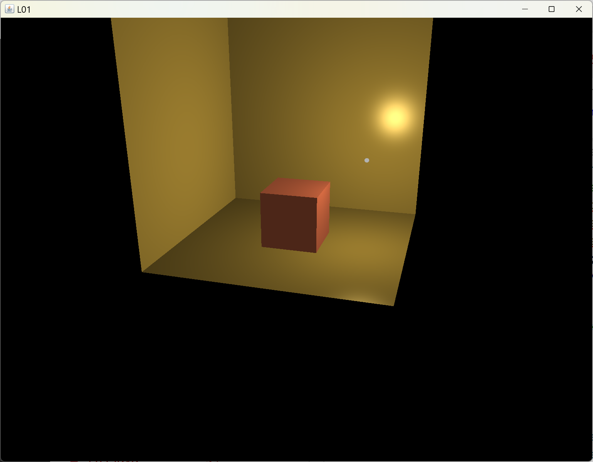
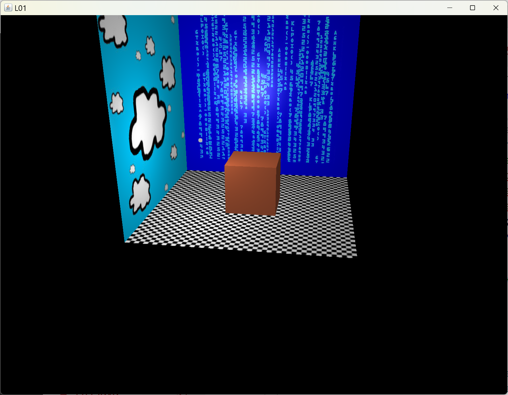
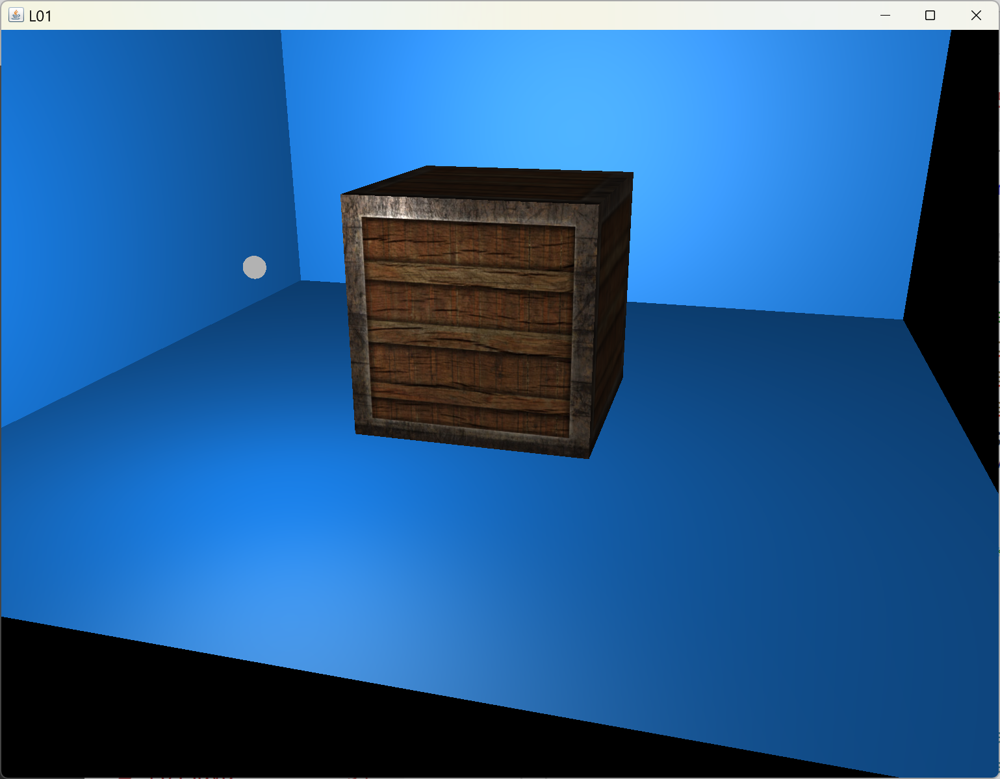
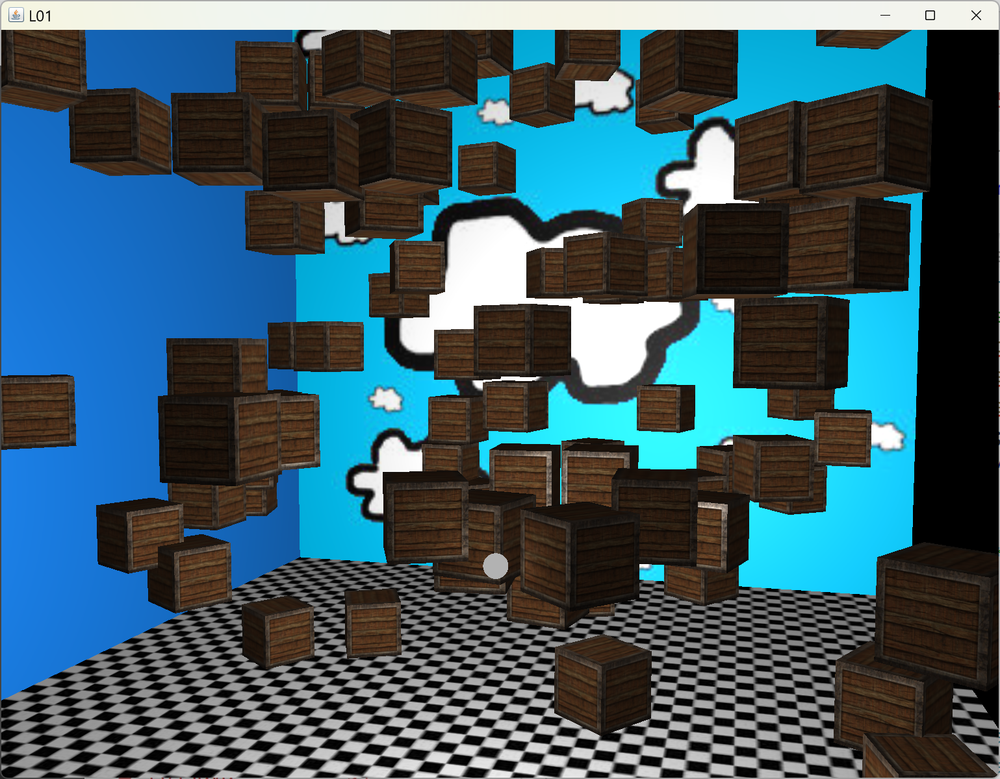
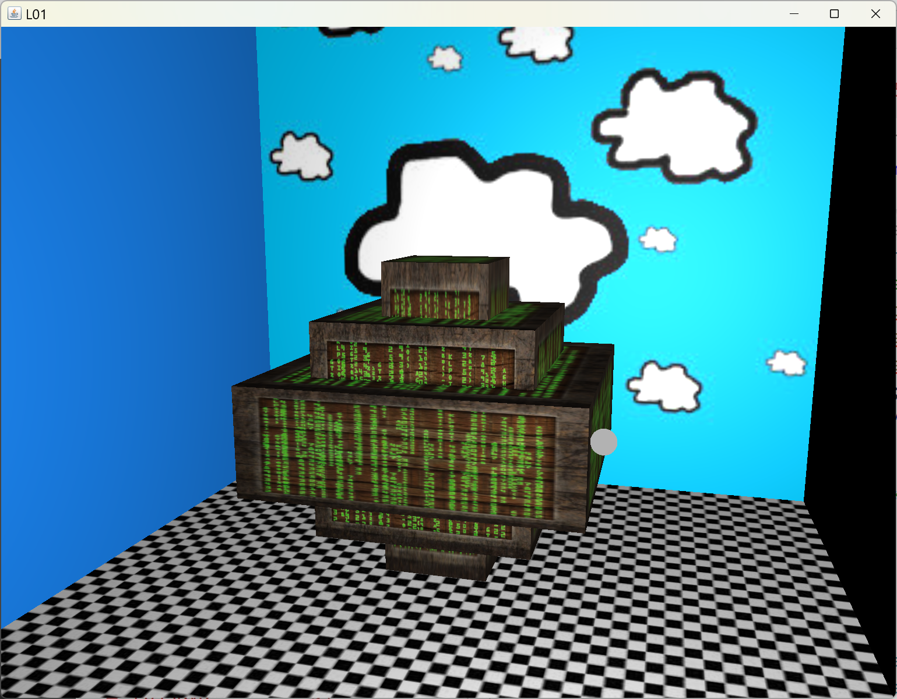

[back](ch7.md) | [main menu](../README.md)
 
## 7.3 Scenes

Program: [Scene1.java](/ch7_classes/ch7_3_scene)

The programs Scene1, Scene2, Scene3, Scene4 and Scene5 produce the outputs shown in Figure 7.4. We'll examine just one of these with the rest left to consider as an exercise.

<p align="center">
  ....<br>
  <strong>Figure 7.4.</strong> Outputs from Scene1, Scene2, Scene3, Scene4 and Scene5.
</p>

A new class, TwoTriangles, is also used. Similar to the earlier Cube and Sphere classes this provides vertex and index information for, as the name suggests, two triangles that form a plane. This is used in the scene examples to create a floor and some walls. We'll take a close look at Scene2. Part of the Scene2_glEventListener is given in Program Listing 7.12.

```java
private Model cube;
private Model[] plane;
private Light light;

// textures
private TextureLibrary textures;

public void initialise(GL3 gl) {
  createRandomNumbers();

  textures = new TextureLibrary();
  textures.add(gl, "diffuse_container", "assets/textures/container2.jpg");
  textures.add(gl, "specular_container", "assets/textures/container2_specular.jpg");
  textures.add(gl, "chequerboard", "assets/textures/chequerboard.jpg");
  textures.add(gl, "cloud", "assets/textures/cloud.jpg");
  textures.add(gl, "matrix", "assets/textures/matrix.jpg");
  textures.add(gl, "black1x1", "assets/textures/black1x1.jpg");
  textures.add(gl, "white1x1", "assets/textures/white1x1.jpg");

  light = new Light(gl, camera);

  plane = new Model[3];

  plane[0] = makePlane(gl, getM1(), "assets/shaders/fs_standard_dse.txt", textures.get("chequerboard"), textures.get("white1x1"), textures.get("black1x1"));
  plane[1] = makePlane(gl, getM2(), "assets/shaders/fs_standard_e.txt", null, null, textures.get("matrix"));
  plane[2] = makePlane(gl, getM3(), "assets/shaders/fs_standard_d.txt", textures.get("cloud"), null, null);

  cube = makeCube(gl);
}

public void render(GL3 gl) {
  gl.glClear(GL.GL_COLOR_BUFFER_BIT | GL.GL_DEPTH_BUFFER_BIT);

  light.setPosition(getLightPosition()); // changing light position each frame

  light.render(gl);

  cube.render(gl);

  plane[0].render(gl);
  plane[1].render(gl);
  plane[2].render(gl);
}
```

**Program Listing 7.12:** Part of the Scene2_glEventListener.

Much of this code should now be familiar from previous examples. A cube and three planes are created. Transformations (in getM1, getM2 and getM3) are used to make a floor and two walls from the planes using the helper method makePlane. 

A new idea introduced here is to use a 1x1 texture map in shading. plane[0], the floor, uses this approach. The standard _dse fragment shader is used, but as 1x1 textures are used for the specular and emission maps, they are applied to every fragment since any u,v lookup will use the same value in the texture map. Thus the specular map attribute is 1 and the emission map attribute is 0. This means the specular calculation in the fragment shader is modulated by 1, i.e. it is light.specular x (R.V)^shininess. This is equivalent to having used (1,1,1) as the material.specular attribute and (0,0,0) as the material.emission attribute. Essentially, the whole of shading, even basic shading, could be done using only texture maps!! Whilst this is possible, we'll stick to using material.ambient, material.diffuse, material.specular and material.shininess for basic shading in future programs and reserve the use of texture maps for when we actually want a detailed texture map effect. One reason for doing this is the use of cache on GPUs. Using basic variables is likely to be more cache friendly on a GPU than using texture maps.

plane[1] uses the basic material attributes in the shader, but also adds an emission map. This forms the back wall of the scene producing a blue wall with a green emission map. plane[2], the left wall, uses a clouds image as a diffuse map and basic attributes for specular properties and no emission properties (which is the default if an emission map is not used).

All the other Scene programs use a similar setup with a few model instances arranged in different ways.

---

## Exercises

1. Program Scene4 creates 100 rotating cubes. The cubes are slowly rotating over time. Examine the method Scene4_GLEventListener.getModelMatrix(). Change elapsedTime*10 to elapsedTime*100 to speed up the rotation.
2. Try adding a different texture to the side wall. [Solution]

---

## MCQs (written in collaboration with Google Gemini)

<p>1. According to the text, what combination of material properties and shaders is used for plane[1], the back wall of the scene?</p>
<details>
<summary>a) It uses a diffuse map and a specular map, but no emission map.</summary>
<p><b>Incorrect.</b> The text states that plane[1] uses the fs_standard_e.txt shader, which, as the _e indicates, uses an emission map. The null values for the diffuse and specular maps in the function call confirm that they are not used.</p>
</details>
<details>
<summary>b) It uses basic material attributes and a diffuse map.</summary>
<p><b>Incorrect.</b> While plane[1] uses basic material attributes, the function call passes null for the diffuse map. The fs_standard_e.txt shader is used, which indicates an emission map is present.</p>
</details>
<details>
<summary>c) It uses basic material attributes in the shader and also an emission map.</summary>
<p><b>Correct.</b> The text states that plane[1] "uses the basic material attributes in the shader, but also adds an emission map. This forms the back wall of the scene producing a blue wall with a green emission map combined into the final result."</p>
</details>
<details>
<summary>d) It uses a cloud texture as a diffuse map and no other texture maps.</summary>
<p><b>Incorrect.</b> The cloud texture is used for plane[2], not plane[1]. plane[1] uses the matrix texture as its emission map.</p>
</details>

[back](ch7.md) | [main menu](../README.md)