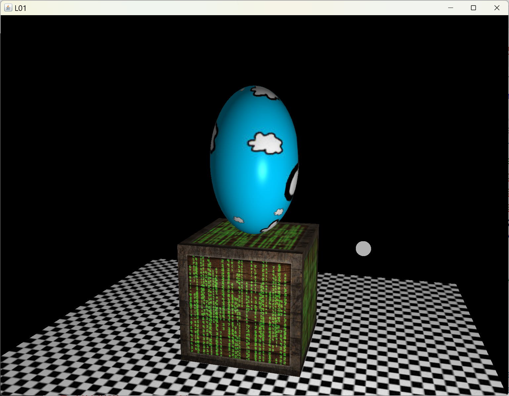
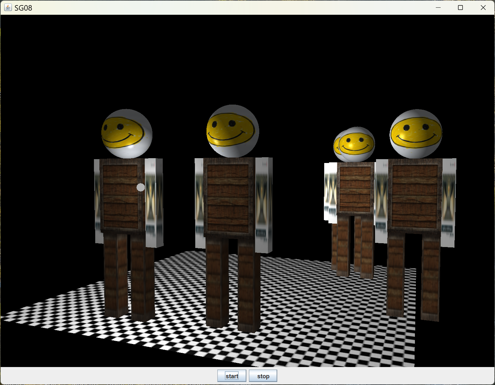

[main menu](../README.md)

# Chapter 8. Scene graphs

Figure 8.0 shows the output of the 7 programs used in Sections 8.x to 8.y.

  ....... 
  <strong>Figure 8.0.</strong> Output from programs in this chapter.

[main menu](../README.md)