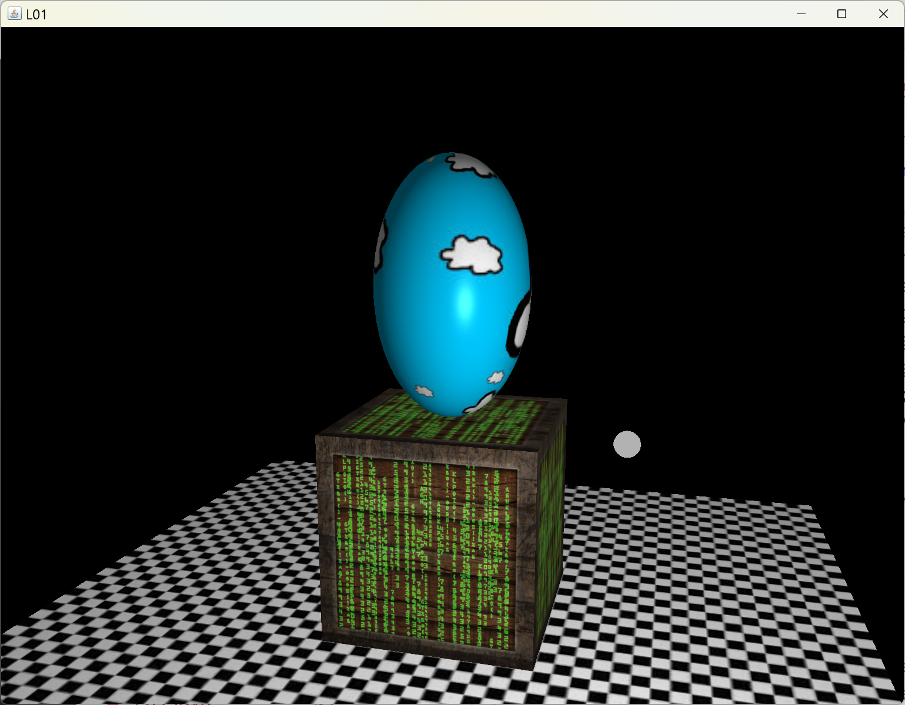

[back](ch8.md) | [main menu](../README.md)
 
## 8.1 A stack without using scene graphs

Program: [SG01no.java](/ch8_sg/ch8_1_stack_no_sg)

This example stacks a sphere on top of a cube without using scene graphs, as shown in Figure 8.1. The next section will show how to produce this simple example using a scene graph, whilst at the same time explaining the benefits of using a scene graph. Subsequent sections will elaborate on this with more complex examples.

<p align="center">
  <br>
  <strong>Figure 8.1.</strong> A stack of two objects.
</p>

Program Listing 8.1 gives the declaration of the pieces, which should be familiar as it follows the same approach as the scene examples from the previous chapter. The key lines to focus on are the creation of the cube and sphere.

A translate and a scale transformation is applied to the cube. The cube is defined with its origin at its centre. Thus, it must be translated by 0.5 in the y axis so that its base sits on the floor. The cube's origin is now at the centre of its base. It is then scaled by 4 in each coordinate axis, giving a cube of size 4x4x4 units sitting on the floor.

The sphere has three transformations. It is lifted by 0.5 in the y axis so its origin is at its base. It is then scaled to a particular size, in this case 3 in the x axis, 5 in the y axis and 3 is the z axis to make an ellipsoid. The origin is still at the base of this ellipsoid. The ellipsoid must then be translate up the y axis so it sits on top of the cube. The cube is 4 units high, so the translation required is 4 in the y axis.

This all seems quite sensible. But, what if we wanted to move the whole structure to a new position on the floor? Do we add the translations to each object? Or could we create a combined object that we could apply the translation to? The next section shows how to do this with a scene graph.

```java
private Model cube;
private Model sphere;
private Model plane;
private Light light;

// textures
private TextureLibrary textures;

public void initialise(GL3 gl) {
  createRandomNumbers();

  textures = new TextureLibrary();
  // add textures

  light = new Light(gl, camera);
  Material m = new Material();
  m.setAmbient(0.3f, 0.3f, 0.3f);
  m.setDiffuse(0.7f, 0.7f, 0.7f);
  m.setSpecular(0.7f, 0.7f, 0.7f);
  light.setMaterial(m);

  plane = makePlane(gl, getM1(), "assets/shaders/fs_standard_d.txt", textures.get("chequerboard"), null, null);
  
  Mat4 mCube = Mat4Transform.translate(0,0.5f,0);
  mCube = Mat4.multiply(Mat4Transform.scale(4,4,4), mCube);
  cube = makeCube(gl, mCube,
                      "assets/shaders/fs_standard_dse.txt", 
                      textures.get("diffuse_container"), textures.get("specular_container"), textures.get("matrix"));

  Mat4 mSphere = Mat4Transform.translate(0,0.5f,0);
  mSphere = Mat4.multiply(Mat4Transform.scale(3,5,3), mSphere);
  mSphere = Mat4.multiply(Mat4Transform.translate(0,4,0), mSphere);
  sphere = makeSphere(gl, mSphere,
                      "assets/shaders/fs_standard_d.txt", 
                      textures.get("cloud"), null, null);
}

public void render(GL3 gl) {
  gl.glClear(GL.GL_COLOR_BUFFER_BIT | GL.GL_DEPTH_BUFFER_BIT);
  light.setPosition(getLightPosition()); // changing light position each frame
  light.render(gl);
  plane.render(gl);
  cube.render(gl);
  sphere.render(gl);
}
```

**Program Listing 8.1:** Making and rendering the pieces

---

## Exercises

1. ???

---

## MCQs (written in collaboration with Google Gemini)

<p>1. The text describes an approach without using a scene graph to create a stack of a cube and a sphere. Based on this approach, if you wanted to move the entire stack to a new location on the floor, what would be required?</p>
<details>
<summary>a) Change the lightPosition and camera attributes for both objects.</summary>
<p><b>Incorrect.</b> The lightPosition and camera attributes control the lighting and viewing perspective, respectively, not the position of the models in the world.</p>
</details>
<details>
<summary>b) Apply a single combined transformation to the cube and sphere models, since they are part of a single structure.</summary>
<p><b>Incorrect.</b> The text explains that this approach does not treat the cube and sphere as a single combined object. The next section on scene graphs shows how to achieve this.</p>
</details>
<details>
<summary>c) Modify the existing Mat4 transformations for both the cube and the sphere by manually adding the new translation to each object's transformation chain.</summary>
<p><b>Correct.</b> The text states that a key problem with this approach is that to move the entire structure, you would have to manually "add the translations to each object," as each object is transformed and rendered independently.</p>
</details>
<details>
<summary>d) Create a new Model class that combines the cube and sphere and then apply a single transformation to it.</summary>
<p><b>Incorrect.</b> This is instead the solution that a scene graph would provide, as mentioned in the text.</p>
</details>

[back](ch8.md) | [main menu](../README.md)