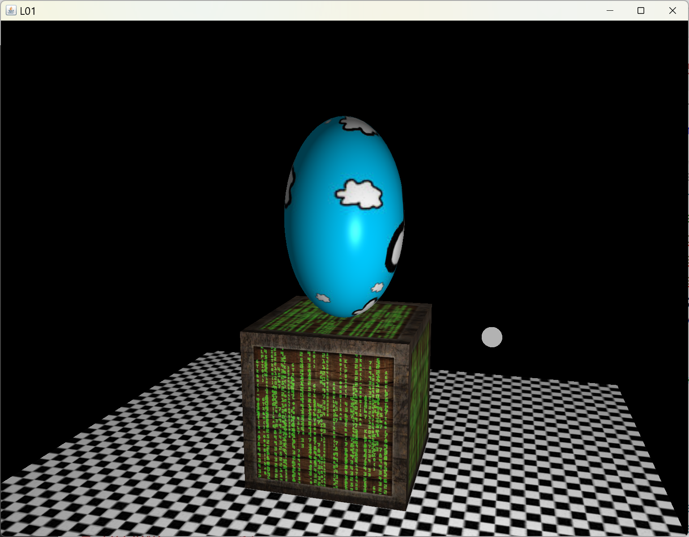
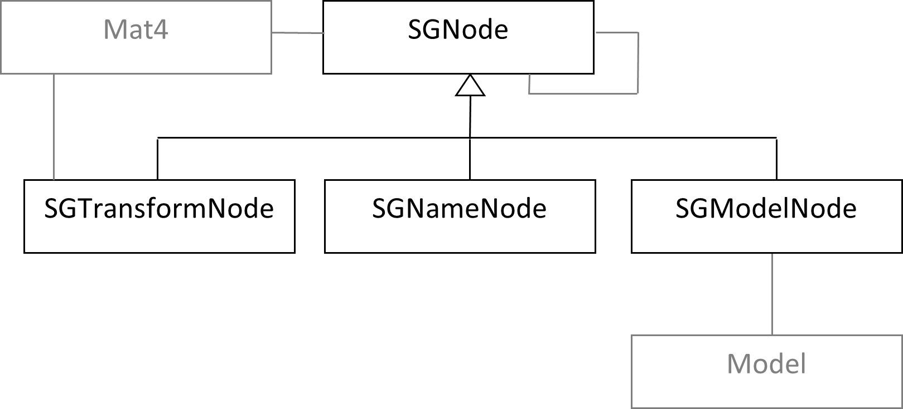

[back](ch8.md) | [main menu](../README.md)
 
## 8.2 A stack using scene graphs

### 8.2.1 A sphere on top of a cube

Program: ch8_2_stack_\SG02.java

This example repeats the example from section 8.1 but uses a scene graph to stack a sphere on top of a cube. The results is the same, as shown in Figure 8.2.

<p align="center">
  <br>
  <strong>Figure 8.2:</strong> A stack of two objects using a scene graph.
</p>

This relies on the use of a collection of classes to represent a scene graph. Figure 8.3 shows these. SGNode is extended by each of SGTransformNode, SGNameNode and SGModelNode. The link from SGNode to itself indicates that this is a recursive structure. In fact, an SGNode contains an ArrayList of child nodes, each of which is an SGNode. SGNode and SGTransformNode make use of the Mat4 class from the gmaths package. SGTransformNode is used to represent a transformation (a Mat4 instance) to be applied to its children in the scene graph. SGModelNode contains a Model instance, which we'll see is used when rendering the contents of the scene graph. SGNameNode is used solely to make the scene graph hierarchy clearer by allowing nodes that contain nothing but a String to represent their name.

<p align="center">
  <br>
  <strong>Figure 8.3:</strong> The scene graph classes
</p>

Let's look at an example that uses the scene graph classes before looking at their internal details. Program Listing 8.2 shows the method to create the stack shown in Figure 8.2. The stack made using a scene graph needs a root node: stackRoot. We then need to make the objects that will be stored in the scene graph. Note how th cube and the sphere use an identity matrix as their transformation when they are created. This is because we are going to use the scene graph to control transformations, so the transformation stored inside the Model class is superfluous.

```java
private Model cube;
private Model sphere;
private Model floor;
private Light light;

// textures
private TextureLibrary textures;

private SGNode stackRoot;  // the root of the stack

public void initialise(GL3 gl) {
  
  // set up the textures

  // set up the light

  floor = makeFloor(gl, getM1(), "assets/shaders/fs_standard_d.txt", textures.get("chequerboard"), null, null);
  
  cube = makeCube(gl, new Mat4(1),
                      "assets/shaders/fs_standard_dse.txt", 
                      textures.get("diffuse_container"), textures.get("specular_container"), textures.get("matrix"));

  sphere = makeSphere(gl, new Mat4(1),
                      "assets/shaders/fs_standard_d.txt", 
                      textures.get("cloud"), null, null);


  Mat4 mCube = Mat4Transform.translate(0,0.5f,0);
  mCube = Mat4.multiply(Mat4Transform.scale(4,4,4), mCube);

  Mat4 mSphere = Mat4Transform.translate(0,0.5f,0);
  mSphere = Mat4.multiply(Mat4Transform.scale(3,5,3), mSphere);
  
  // make the pieces and transform nodes
  SGNameNode lowerPartName = new SGNameNode("lower part");
  SGTransformNode lowerPartTransform = new SGTransformNode("lowerPart", mCube);
  SGModelNode lowerPartShape = new SGModelNode("Cube(0)", cube);

  SGNameNode upperPartName = new SGNameNode("upper part");
  SGTransformNode upperPartTransform = new SGTransformNode("upperPart", mSphere);
  SGModelNode upperPartShape = new SGModelNode("Sphere(0)", sphere);

  // Make the transform that will join the two pieces.
  // A translation to place the sphere on top of the cube.
  // The translation amount matches the height of the cube.
  SGTransformNode translateToTop = new SGTransformNode("upperPart", Mat4Transform.translate(0,4,0));

  // now make the stack of nodes
  stackRoot = new SGNameNode("stack");
  stackRoot.addChild(lowerPartName);
    lowerPartName.addChild(lowerPartTransform);
      lowerPartTransform.addChild(lowerPartShape); 
    lowerPartName.addChild(translateToTop);
      translateToTop.addChild(upperPartName);
        upperPartName.addChild(upperPartTransform);
        upperPartTransform.addChild(upperPartShape);  

  // Updates all the transforms to take account of their parent transforms
  stackRoot.update();  // IMPORTANT – must be done every time any part of the scene graph changes

  // Following two lines can be used to check scene graph construction is correct
  // as long as relevant text has been included in nodes above
  // stackRoot.print(0, false);
  // System.exit(0);
}
```

Program Listing 8.2: ??????????????????

In Program Listing 8.2, we set up the transformations that are required to reproduce the example from section 8.1 and store these in mCube and mSphere. Subsequent lines set up the pieces of the scene graph and link them together.

An SGNameNode, SGTransformNode and SGModelNode are created for each of the cube and sphere. An SGTransformNode is then created which will be used to join the cube and the sphere, i.e. to place the sphere on top of the cube. Here the values are hard-coded literals. Instead, a separate variable could be used to store th height of the cube and then used in scaling the cube and translating the sphere on top of the cube.

The stack of nodes is then created. stackRoot, as its name suggests is the root. Below that is the cube: name, local transform, shape. Below the lowerPartName node, the translateToTop node is added, i.e. translateToTop is a child of lowerPartName. Below translateToTop is the sphere: name, local transform, shape. Figure 8.4 illustrates the hierarchy that is created.

<p align="center">
  <br>
  <strong>Figure 8.4: TO BE UPDATED</strong> The scene graph for a sphere stacked on top of a cube
</p>

The line stackRoot.update() is important. This is called after the scene graph is built. It starts at the root and traverses the scene graph updating the 'world transformation' stored in every node (every SGNode contains a Mat4 instance), combining transformations from TransformNodes as it descends the parent-child hierarchy in the scene graph. When it has completed, every node will store a world transformation that is correct for that node in the scene graph. Thus, a ModelNode will have the correct world transformation stored and ready to be used when rendering the Model. Whenever the scene graph is changed, the SGNode.update() method must be called.

It is worth mentioning the two commented out lines at the end of Program Listing 8.2. If you uncomment these and run the program, the scene graph will be displayed and then the program will quit before displaying any objects. (Rather than System.exit(0), you could also wait for user input and then continue the program.) The SGNode.print() method can be useful in debugging to make sure the scene graph matches what you think you have created.

The key thing to note is that certain transforms are isolated in their own branch of the scene graph. We can change the transforms applied to the cube without affecting the sphere. The sphere is transformed by translateToTop and its own local transformations which are in the branch preceding the shape node. (In some scene graph representations, the local transformation is stored with the object rather than as nodes in a scene graph. This reduces the number of nodes in the scene graph. In these examples, I am using explicit nodes to make what is happening more explicit.)

Program Listing 8.3 renders the objects stored in the scene graph. I’ve called the method draw() to distinguish it from render(), which is used as the method name in the glEventListener and also for a Model. An alternative might have been to call it drawGraph. This method starts at the root of the scene graph and recursively calls draw on the children of a node. When a ModelNode is encountered, the method Model.render(gl, modelMatrix) is used for the Model instance, e.g. model.render(gl, worldTransform). The world transform stored in the ModelNode instance in the scene graph is passed as the model matrix when rendering the Model instance. This is why we have the extra render method in the Model class - we introduced this in section 7.2. This version of the render method replaces whatever transform is stored in the Model instance with the one passed as a parameter, thus giving control over the model transformation from the scene graph.

```java
public void render(GL3 gl) {
  gl.glClear(GL.GL_COLOR_BUFFER_BIT | GL.GL_DEPTH_BUFFER_BIT);
  light.setPosition(getLightPosition()); // changing light position each frame
  light.render(gl);
  floor.render(gl);
  stackRoot.draw(gl);  // called draw rather than render to avoid confusion with model rendering
}
```

Program Listing 8.3: The render method

We now have control over which transforms are applied to which objects in the scene graph. We can add transforms in particular branches of the scene graph and know which transform affects which object. In section 8.1, we posed the question of how to move the whole stack. With a scene graph it is easy. A transformation node (containing a translate) can be added as a child of stackRoot and lowerPartName can be added as a child of the new transformation node. Changing the translation would then affect every branch below it. This is left as an exercise.

---

### 8.2.2 The scene graph classes

Program Listing 8.4 gives the SGNode class. It contains member variables for a name, a list of children and a world transform matrix. Method addChild() adds a node to the list of children. There are two versions of update(). The public update() is used to propagate changes to the world transformation matrix recursively to each of the children. This uses the internal protected update(Mat4) to pass the updated worldTransform matrix down the hierarchy. SGTransformNode overrides this second version of the method and combines in the transformation stored in the SGTransformNode, as shown in Program Listing 8.5. Method print() is used for printing a version of the scene graph, used for debugging purposes. Finally, method draw() recursively calls the draw method for each of the children. The draw() method is overridden in SGModelNode (Program Listing 8.6), so that model.render() is called before then recursively drawing each of its children.

```java
import gmaths.*;
import java.util.ArrayList;
import com.jogamp.opengl.*;

public class SGNode {

  protected String name;
  protected ArrayList<SGNode> children;
  protected Mat4 worldTransform;

  public SGNode(String name) {
    children = new ArrayList<SGNode>();
    this.name = name;
    worldTransform = new Mat4(1);
  }

  public void addChild(SGNode child) {
    children.add(child);
  }
  
  public void update() {
    update(worldTransform);
  }
  
  protected void update(Mat4 t) {
    worldTransform = t;
    for (int i=0; i<children.size(); i++) {
      children.get(i).update(t);
    }
  }

  protected String getIndentString(int indent) {
    String s = ""+indent+" ";
    for (int i=0; i<indent; ++i) {
      s+="  ";
    }
    return s;
  }
  
  public void print(int indent, boolean inFull) {
    System.out.println(getIndentString(indent)+"Name: "+name);
    if (inFull) {
      System.out.println("worldTransform");
      System.out.println(worldTransform);
    }
    for (int i=0; i<children.size(); i++) {
      children.get(i).print(indent+1, inFull);
    }
  }
  
  public void draw(GL3 gl) {
    for (int i=0; i<children.size(); i++) {
      children.get(i).draw(gl);
    }
  }

}
```

Program Listing 8.4: SGNode.java

```java
import gmaths.*;

public class SGTransformNode extends SGNode {

  private Mat4 transform;

  public SGTransformNode(String name, Mat4 t) {
    super(name);
    transform = new Mat4(t);
  }
  
  public void setTransform(Mat4 m) {
    transform = new Mat4(m);
  }
  
  protected void update(Mat4 t) {
    worldTransform = t;
    t = Mat4.multiply(worldTransform, transform);
    for (int i=0; i<children.size(); i++) {
      children.get(i).update(t);
    }   
  }

  public void print(int indent, boolean inFull) {
    System.out.println(getIndentString(indent)+"Name: "+name);
    if (inFull) {
      System.out.println("worldTransform");
      System.out.println(worldTransform);
      System.out.println("transform node:");
      System.out.println(transform);
    }
    for (int i=0; i<children.size(); i++) {
      children.get(i).print(indent+1, inFull);
    }
  }
  
}
```

Program Listing 8.5: SGTransformNode.java

```java
import com.jogamp.opengl.*;

public class SGModelNode extends SGNode {

  protected Model model;

  public SGModelNode(String name, Model m) {
    super(name);
    model = m; 
  }

  public void draw(GL3 gl) {
    model.render(gl, worldTransform);
    for (int i=0; i<children.size(); i++) {
      children.get(i).draw(gl);
    }
  }

}
```

Program Listing 8.6: SGModelNode.java

Class SGNameNode (Program Listing 8.7) does very little. Its sole purpose is for nodes in the scene graph like lowerPartName in Figure 8.x, which help to make the structure of the scene graph clearer. SGNode could have been used instead of NameNode, but I think it helps to make the purpose of the node clearer. One could also argue that SGNode should be an abstract class to make this even clearer.

```java
public class SGNameNode extends SGNode {

  public SGNameNode(String name) {
    super(name);
  }
  
}
```

Program Listing 8.7: SGNameNode.java

---

## MCQs (written in collaboration with Google Gemini)

GLSL???

---

## Exercises

1. ???

[back](ch8.md) | [main menu](../README.md)