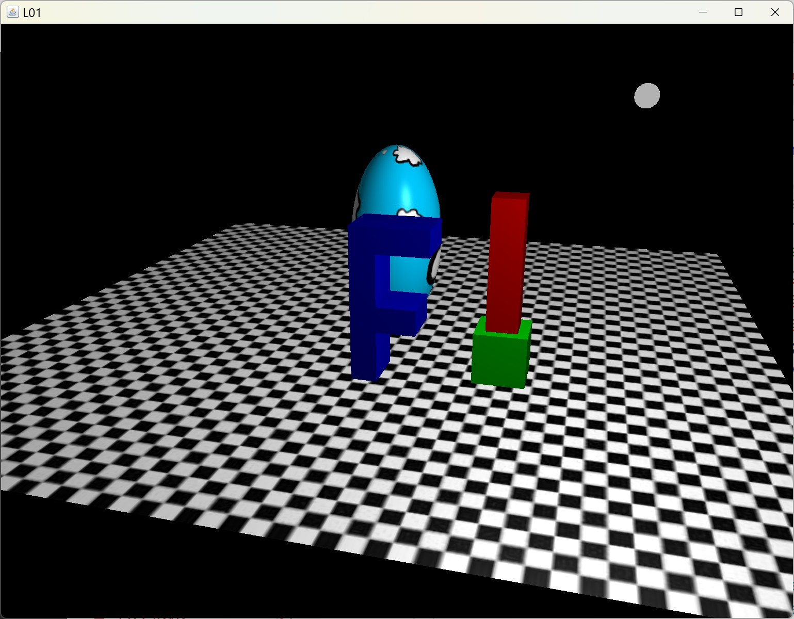
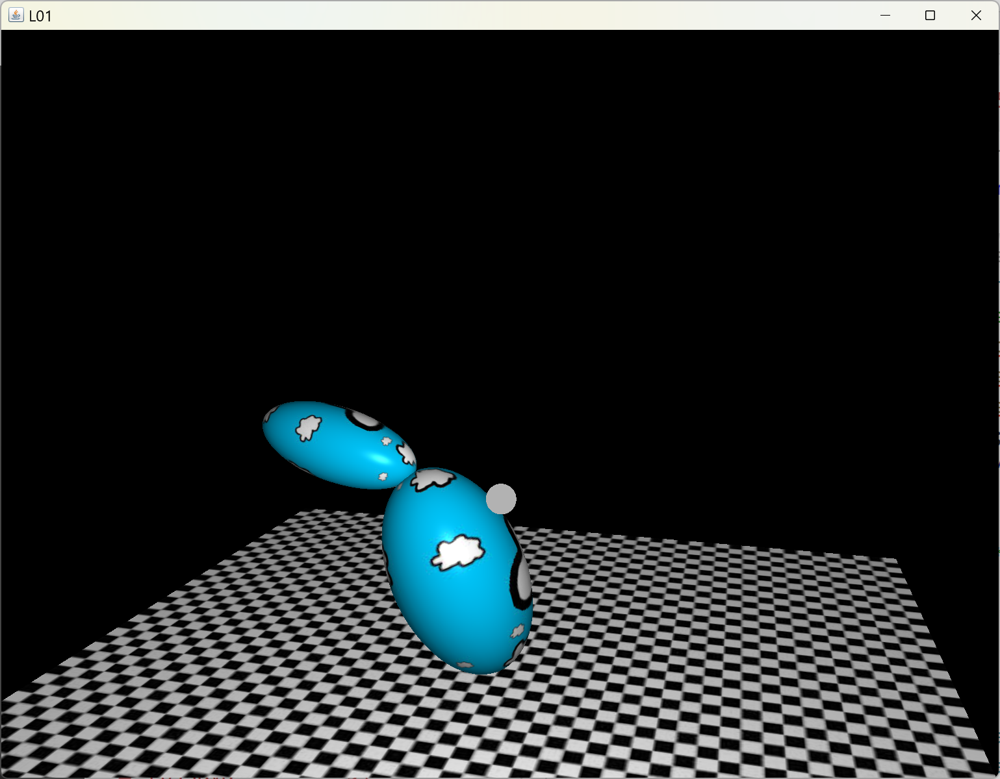
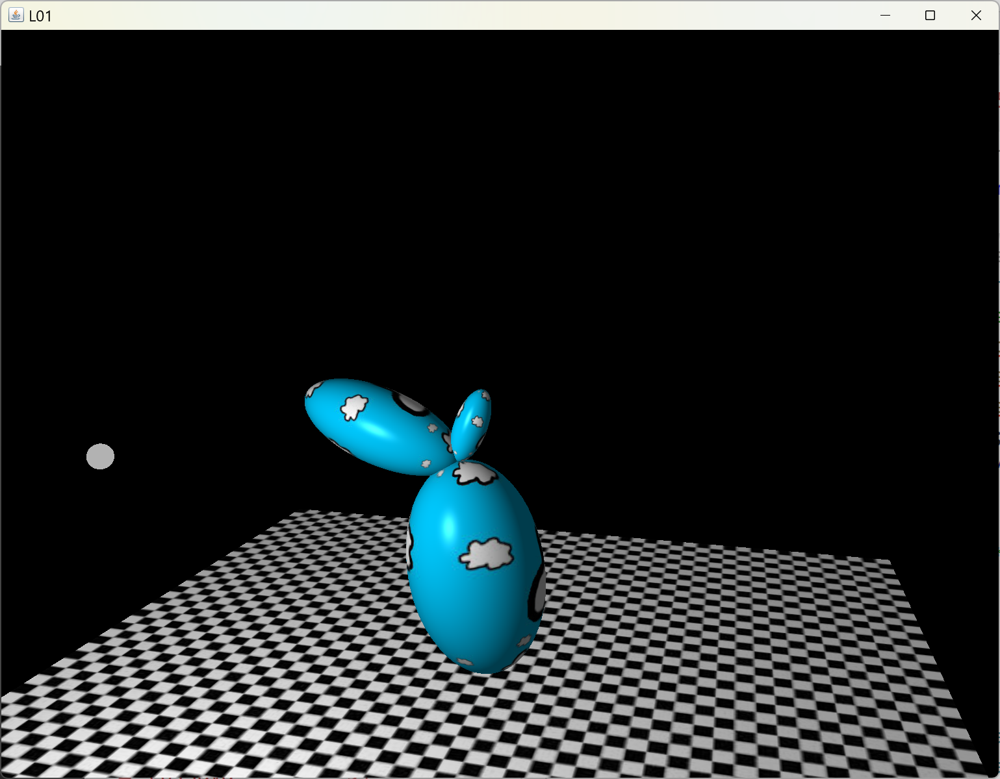

[back](ch8.md) | [main menu](../README.md)
 
## 8.3 More scenes

### 8.3.1 Three objects

Program: [SG03.java](/ch8_sg/ch8_3_F)

This example is a scene of multiple objects, as illustrated in Figure 8.5. The scene graph classes introduced in section 8.2 are used again. A scene graph is used for a stack of two transformed cubes and a scene graph is used to make a F shape out of three transformed cubes.

<p align="center">
  <br>
  <strong>Figure 8.5.</strong> A scene containing an egg, an F, a stack of two cuboids (one red, one green) and a floor.
</p>

Program Listing 8.8 sets up the class attributes for the scene and creates the textures and light and makes the pieces with some helper classes. cubeLower and cubeUpper will be joined together with a scene graph. fStemCube, fTopCube and fMiddleCube will be joined together using another scene graph.

```java
private Model floor, cubeLower, cubeUpper, sphere, fStemCube, fTopCube, fMiddleCube;
private Light light;
private SGNode cuboidsRoot, fShapeRoot;

// textures
private TextureLibrary textures;


public void initialise(GL3 gl) {
  // create textures

  // create light

  floor = makeFloor(gl, getM1(), "assets/shaders/fs_standard_d.txt", textures.get("chequerboard"), null, null);
  
  Material materialCube = MaterialConstants.green.clone();
  cubeLower = makeCube(gl, new Mat4(1), materialCube,
                      "assets/shaders/fs_standard_0t.txt", 
                      null,null,null);

  materialCube = MaterialConstants.red.clone();
  cubeUpper = makeCube(gl, new Mat4(1), materialCube,
                      "assets/shaders/fs_standard_0t.txt", 
                      null,null,null);

  materialCube = MaterialConstants.blue.clone();
  fStemCube = makeCube(gl, new Mat4(1), materialCube,
                      "assets/shaders/fs_standard_0t.txt", 
                      null,null,null);

  fTopCube = makeCube(gl, new Mat4(1), materialCube,
                      "assets/shaders/fs_standard_0t.txt", 
                      null,null,null);

  fMiddleCube = makeCube(gl, new Mat4(1), materialCube,
                      "assets/shaders/fs_standard_0t.txt", 
                      null,null,null);

  Mat4 mSphere = Mat4Transform.translate(0,0.5f,0);
  mSphere = Mat4.multiply(Mat4Transform.scale(2,4,2),mSphere);
  sphere = makeSphere(gl, mSphere,
                      "assets/shaders/fs_standard_d.txt", 
                      textures.get("cloud"), null, null);


  // now do the scene graphs

}
```

**Program Listing 8.8:** Setting up the attributes

Program Listing 8.9 joins two cubes together into a scene graph with root called cuboidsRoot. One cube is stacked on top of the other. Again, certain literals could be replaced by variables to make the program more flexible.

```java
// ...

public void initialise(GL3 gl) {
  // ...

  // cuboids
  cuboidsRoot = new SGNameNode("two-cuboid structure");
  SGTransformNode translateInPlane = new SGTransformNode("translate(1.7,0,1.3)",Mat4Transform.translate(2.7f, 0f, 2.3f));
  SGNameNode lowerCuboid = new SGNameNode("lower cuboid");
  Mat4 m = Mat4Transform.scale(1,1,1);
  m = Mat4.multiply(m, Mat4Transform.translate(0,0.5f,0));
  SGTransformNode lowerCubeTransform = new SGTransformNode("some transforms", m);
  SGModelNode lowerCubeShape = new SGModelNode("cubeLower", cubeLower);
  SGTransformNode translateToTop = new SGTransformNode("translate(0,4,0)",Mat4Transform.translate(0,0,0));
  SGNameNode upperCuboid = new SGNameNode("upper cuboid");
  m = Mat4Transform.scale(0.6f,3.5f,0.6f);
  m = Mat4.multiply(m, Mat4Transform.translate(0,0.5f,0));
  SGTransformNode upperCubeTransform = new SGTransformNode("some transforms", m);
  SGModelNode upperCubeShape = new SGModelNode("cubeUpper", cubeUpper);

  cuboidsRoot.addChild(translateInPlane);
    translateInPlane.addChild(lowerCuboid);
      lowerCuboid.addChild(lowerCubeTransform);
        lowerCubeTransform.addChild(lowerCubeShape);
      lowerCuboid.addChild(translateToTop);
        translateToTop.addChild(upperCuboid);
          upperCuboid.addChild(upperCubeTransform);
            upperCubeTransform.addChild(upperCubeShape);
    cuboidsRoot.update(); 

  // F shape

}
```

**Program Listing 8.9:** Making the scene graph for the stack of two cubes

Program Listing 8.10 joins three cubes together into a scene graph with root called fShapeRoot. Again, certain literals could be replaced by variables to make the program more flexible.

```java
// ...

public void initialise(GL3 gl) {
  // ...
  // cuboids
  // ...
  // F shape
  fShapeRoot = new SGNameNode("f structure");
  SGTransformNode translateFInPlane = new SGTransformNode("translate(0.2,0,1.7)",Mat4Transform.translate(0.2f,0f,2.7f));

  SGNameNode fStem = new SGNameNode("fStem");
  m = Mat4Transform.scale(0.5f,3,1);
  m = Mat4.multiply(m, Mat4Transform.translate(0,0.5f,0));
  SGTransformNode fStemTransform = new SGTransformNode("some transforms", m);
  SGModelNode fStemShape = new SGModelNode("cubeLower", fStemCube);

  SGNameNode fMiddle = new SGNameNode("fMiddle");
  m = Mat4Transform.translate(0.5f,1f,0);
  m = Mat4.multiply(m, Mat4Transform.scale(1,0.5f,1));
  m = Mat4.multiply(m, Mat4Transform.translate(0,0.5f,0));
  SGTransformNode fMiddleTransform = new SGTransformNode("some transforms", m);
  SGModelNode fMiddleShape = new SGModelNode("cubeLower", fMiddleCube);

  SGNameNode fTop = new SGNameNode("fTop");
  m = Mat4Transform.translate(0.5f,2.5f,0);
  m = Mat4.multiply(m, Mat4Transform.scale(1.5f,0.5f,1));
  m = Mat4.multiply(m, Mat4Transform.translate(0,0.5f,0));
  SGTransformNode fTopTransform = new SGTransformNode("some transforms", m);
  SGModelNode fTopShape = new SGModelNode("cubeLower", fTopCube);

  fShapeRoot.addChild(translateFInPlane);
    translateFInPlane.addChild(fStem);
      fStem.addChild(fStemTransform);
        fStemTransform.addChild(fStemShape);
      fStem.addChild(fMiddle);
        fMiddle.addChild(fMiddleTransform);
          fMiddleTransform.addChild(fMiddleShape);
      fStem.addChild(fTop);
        fTop.addChild(fTopTransform);
          fTopTransform.addChild(fTopShape);
  fShapeRoot.update();

}
```

**Program Listing 8.10:** Making the scene graph for the F, which is made of three cubes.

Finally, Program Listing 8.11 renders the scene.

```java
public void render(GL3 gl) {
  gl.glClear(GL.GL_COLOR_BUFFER_BIT | GL.GL_DEPTH_BUFFER_BIT);

  light.setPosition(getLightPosition()); // changing light position each frame

  light.render(gl);

  floor.render(gl);
  sphere.render(gl);
  
  cuboidsRoot.draw(gl);
  fShapeRoot.draw(gl);
}
```

**Program Listing 8.11:** Rendering the scene

---

## Exercises

1. Change the literals in the initialise method into variable names instead.

---

### 8.3.2 Controlling relationships between the three objects

Program: [SG04.java](/ch8_sg/ch8_4_F2)

This example repeats the scene from the previous section, but adds some extra transformations into the two scene graphs to enable the objects to be controlled from the user interface. Figure 8.6 illustrates this. The F shape can be rotated by 180 degrees around the y axis and the bottom cuboid in the stack of cuboids can be independently rotated about the y axis.

<p align="center">
  . <br>
  <strong>Figure 8.6.</strong> Interface controls are introduced to allow parts of the scene to be changed.
</p>

Program Listing 8.12 shows the node that need to be introduced into the previous example for the cuboids stack. A rotateAroundY SGTransformNode is created and added in the branch for controlling the lower cuboid only. It does not affect the upperCuboid. Likewise, Program Listing 8.13 shows the node that need to be introduced into the previous example for the F object. Again, a rotateAroundY node is added. This affects every child below it, i.e. all the cubes that are its children, thus the whole F rotates. The two rotateAroundY nodes are actually in different methods in the reformulated program which is why they are called the same name here. You should take some time to study the differences between this program and the previous one to increase your understanding of how scene graphs work.


```java
cuboidsRoot.addChild(translateInPlane);
  translateInPlane.addChild(lowerCuboid);
    lowerCuboid.addChild(rotateAroundY);           // added
      rotateAroundY.addChild(lowerCubeTransform);  // added
      lowerCubeTransform.addChild(lowerCubeShape);
    lowerCuboid.addChild(translateToTop);
      translateToTop.addChild(upperCuboid);
        upperCuboid.addChild(upperCubeTransform);
          upperCubeTransform.addChild(upperCubeShape);
cuboidsRoot.update(); 
```

**Program Listing 8.12:** Adding a rotation node into the scene graph for the two cubes

```java
fShapeRoot.addChild(translateFInPlane);
  translateFInPlane.addChild(rotateAroundY);  // added
  rotateAroundY.addChild(fStem);              // added
    fStem.addChild(fStemTransform);
      fStemTransform.addChild(fStemShape);
    fStem.addChild(fMiddle);
      fMiddle.addChild(fMiddleTransform);
        fMiddleTransform.addChild(fMiddleShape);
    fStem.addChild(fTop);
      fTop.addChild(fTopTransform);
        fTopTransform.addChild(fTopShape);
fShapeRoot.update();
```

**Program Listing 8.13:** Adding a rotation node into the scene graph for the F shape

Further work could be done to create a scene graph that contains all the objects on the floor in Figure 8.5. Then, all the objects could be easily moved as a group. A scene graph could also be created that includes all the objects and the floor. This is left as an optional exercise.

---

## Exercises

1. Add a transformation into the scene graph so that the F shape could be moved to a different place on the floor under user control. [Solution](#exercise-solutions)

---

### 8.3.3 Branches that articulate with respect to one another

Program: [SG05.java](/ch8_sg/ch8_5_branches)

Figure 8.7 shows the results of this program. It features a lower branch that rotates about the point that touches the floor and an upper branch that rotates about its attachment point with the lower branch. 

<p align="center">
  <br>
  <strong>Figure 8.7.</strong> Articulating branches.
</p>

Program Listing 8.14 gives the relevant code. Three SGTransformNodes are declared at the class level, so are then accessible anywhere in the class. Some extra attributes are also declared to keep track of certain values. xPosition stores the current world x position of the base of the two-branch structure. The variables storing rotations are used to rotate either the whole two-branch structure or to rotate the upper branch about its connection to the lower branch. (The lectures will consider this example in detail.)


```java
private Model sphere;
private Model floor;
private Light light;
private SGNode twoBranchRoot;

private SGTransformNode translateX, rotateAll, rotateUpper;
private float xPosition = 0;
private float rotateAllAngleStart = 25, rotateAllAngle = rotateAllAngleStart;
private float rotateUpperAngleStart = -60, rotateUpperAngle = rotateUpperAngleStart;

public void initialise(GL3 gl) {
  createRandomNumbers();

  textures = new TextureLibrary();
  textures.add(gl, "diffuse_container", "assets/textures/container2.jpg");
  textures.add(gl, "specular_container", "assets/textures/container2_specular.jpg");
  textures.add(gl, "chequerboard", "assets/textures/chequerboard.jpg");
  textures.add(gl, "cloud", "assets/textures/cloud.jpg");
  textures.add(gl, "matrix", "assets/textures/matrix.jpg");
  textures.add(gl, "black1x1", "assets/textures/black1x1.jpg");
  textures.add(gl, "white1x1", "assets/textures/white1x1.jpg");

  light = new Light(gl, camera);
  Material m = new Material();
  m.setAmbient(0.3f, 0.3f, 0.3f);
  m.setDiffuse(0.7f, 0.7f, 0.7f);
  m.setSpecular(0.7f, 0.7f, 0.7f);
  light.setMaterial(m);

  floor = makeFloor(gl, "assets/shaders/fs_standard_d.txt", textures.get("chequerboard"), null, null);
  
  sphere = makeSphere(gl, new Mat4(1),
                      "assets/shaders/fs_standard_d.txt", 
                      textures.get("cloud"), null, null);

  twoBranchRoot = new SGNameNode("two-branch structure");

  float lowerBranchHeight = 4f;
  SGNode lowerBranch = makeLowerBranch(sphere, lowerBranchHeight);
  SGNode upperBranch = makeUpperBranch(sphere);
  
  // 1. draw just the lowerBranch
  // twoBranchRoot.addChild(lowerBranch);
  // twoBranchRoot.update();  // IMPORTANT – must be done every time any part of the scene graph changes

  // 2. draw just the upperBranch
  // twoBranchRoot.addChild(upperBranch);
  // twoBranchRoot.update();  // IMPORTANT – must be done every time any part of the scene graph changes

  // 3. draw both branches without any extra transforms to join them
  // result will be only one can be seen as they are both drawn at the origin,
  // so one is inside the other.
  // twoBranchRoot.addChild(lowerBranch);
  //   lowerBranch.addChild(upperBranch);
  // twoBranchRoot.update();  // IMPORTANT – must be done every time any part of the scene graph changes

  // 4. Now join them together with a transform
  // TransformNode translateToTop = new TransformNode("translate(0,4,0)",Mat4Transform.translate(0,4,0));
  // twoBranchRoot.addChild(lowerBranch);
  //   lowerBranch.addChild(translateToTop);
  //     translateToTop.addChild(upperBranch);
  // twoBranchRoot.update();  // IMPORTANT – must be done every time any part of the scene graph changes

  // 5. Now for some animation
  SGTransformNode translateToTop = new SGTransformNode("translate(0,"+lowerBranchHeight+",0)",
                                                    Mat4Transform.translate(0,lowerBranchHeight,0));
  // The next are global variables so they can be updated in other methods
  translateX = new SGTransformNode("translate("+xPosition+",0,0)", Mat4Transform.translate(xPosition,0,0));  
  rotateAll = new SGTransformNode("rotateAroundZ("+rotateAllAngle+")", Mat4Transform.rotateAroundZ(rotateAllAngle));
  rotateUpper = new SGTransformNode("rotateAroundZ("+rotateUpperAngle+")",Mat4Transform.rotateAroundZ(rotateUpperAngle));
  
  twoBranchRoot.addChild(translateX);
    translateX.addChild(rotateAll);
      rotateAll.addChild(lowerBranch);
        lowerBranch.addChild(translateToTop);
          translateToTop.addChild(rotateUpper);
            rotateUpper.addChild(upperBranch);
  twoBranchRoot.update();  // IMPORTANT – must be done every time any part of the scene graph changes
  // end of 5. 

}
```

**Program Listing 8.14:** Making the scene graph for the two-branch structure

Program Listing 8.14 relies on a number of helper methods to make the pieces that are used in the scene graph. The details of these are not shown here. The indentation in the scene graph construction at the end of the method indicates the different levels in the scene graph, with one child per parent.

One aspect to note in Program Listing 8.14 is that there are five numbered parts, four of which are commented out. The fifth part is what currently runs. Each of the numbered parts can be individually uncommented with the others commented to show the different stages of creating the scene. This can be quite a useful way to debug complex scene graphs.

Program Listing 8.15 gives the render method. The method updateBranches() is called before the scene graph, twoBranchRoot, is drawn. Method updateBranches() uses the elapsed system time to create new values for rotateAllAngle and rotateUpperAngle. The relevant TransformNodes in the scene graph are then updated accordingly. (Note: if options 1-4 are being investigated in Program Listing 8.14, then this line of code will need to be commented out, as it only applies for option 5.)

This example illustrates the power of the scene graph in action. By storing references to specific TransformNodes in the scene graph, we can change the transforms stored in them. We then update the scene graph (twoBranchRoot.update()) to update all the world transformations stored in each dependent node, and then the scene graph can be redrawn using the new values.

```java
public void render(GL3 gl) {
  gl.glClear(GL.GL_COLOR_BUFFER_BIT | GL.GL_DEPTH_BUFFER_BIT);
  light.setPosition(getLightPosition()); // changing light position each frame
  light.render(gl);
  floor.render(gl);
  
// 5. animation. Comment out the following line for 1-4.
  updateBranches();

  twoBranchRoot.draw(gl);
}

private void updateBranches() {
  double elapsedTime = getSeconds()-startTime;
  rotateAllAngle = rotateAllAngleStart*(float)Math.sin(elapsedTime);
  rotateUpperAngle = rotateUpperAngleStart*(float)Math.sin(elapsedTime*0.7f);
  rotateAll.setTransform(Mat4Transform.rotateAroundZ(rotateAllAngle));
  rotateUpper.setTransform(Mat4Transform.rotateAroundZ(rotateUpperAngle));
  twoBranchRoot.update(); // IMPORTANT – the scene graph has changed
}
```

**Program Listing 8.15:** Rendering and animating the two-branch structure

## Exercises

1. One of the attributes in the class in Program Listing 8.14 is xPosition, which is used in translateX. Add two extra buttons to the main program (SG05.java) to increment and decrement the xPosition value by a certain amount. This will entail adding extra methods to SG05_GLEventListener.java to carry out these actions and redraw the scene. [Solution](#exercise-solutions)

---

### 8.3.4 Multiple upper branches

Program: [SG06.java](/ch8_sg/ch8_6_more_branches)

This example introduces a second upper branch to the previous example. The second upper branch also rotates about its attachment point with the lower branch. Figure 8.8 shows the result.

<p align="center">
   <br>
  <strong>Figure 8.8.</strong> Another articulating branch.
</p>

The main difference is shown in Program Listing 8.16. Where the previous example added only a single upper branch to the lower branch, this scene graph hierarchy adds two children to lowerBranch. You should study the rest of this program to make sure you understand the rest of the changes required to control the different branches.

```java
twoBranchRoot.addChild(translateX);
  translateX.addChild(rotateAll);
    rotateAll.addChild(lowerBranch);
      lowerBranch.addChild(translateToTop1);
        translateToTop1.addChild(rotateUpper1);
          rotateUpper1.addChild(upperBranch1);
      lowerBranch.addChild(translateToTop2);     // translateToTop1 could be used here as this is not an animated value
        translateToTop2.addChild(rotateUpper2);  // and here
          rotateUpper2.addChild(upperBranch2);
twoBranchRoot.update();  // IMPORTANT – must be done every time any part of the scene graph changes
```

**Program Listing 8.16:** Adding another branch

---

## MCQs (written in collaboration with Google Gemini)

<p>1. In Program Listing 8.8, what is the significance of the fact that cubeLower and cubeUpper are created with an identity matrix as their transformation?</p>
<details>
<summary>a) It is a placeholder, and the actual transformations will be applied in the render method.</summary>
<p><b>Incorrect.</b> The transformations are applied by the scene graph itself, not directly in the render method, which simply draws the models using the transformations from the scene graph.</p>
</details>
<details>
<summary>b) It indicates that these objects will not have any transformations and will be rendered at the world origin.</summary>
<p><b>Incorrect.</b> The objects are given transformations by the scene graph hierarchy, which overrides the identity matrix and places them in the correct position relative to the other objects.</p>
</details>
<details>
<summary>c) It is a consequence of using a scene graph, where transformations are handled by SGTransformNode instances rather than being stored in the Model itself.</summary>
<p><b>Correct.</b> The text explains that the transformations are controlled by the scene graph, making the transformation stored in the Model superfluous. The SGTransformNode instances in the hierarchy apply the transformations to the models below them.</p>
</details>
<details>
<summary>d) It is a debugging technique used to ensure the models are loaded correctly before any transformations are applied.</summary>
<p><b>Incorrect.</b> While this can be a debugging step, in this program, it is part of the final implementation and a fundamental aspect of using a scene graph to manage transformations.</p>
</details>

---

<p>2. Based on Program Listings 8.12 and 8.13, which statement accurately describes the effect of adding the rotateAroundY node to the scene graphs?</p>
<details>
<summary>a) For the cuboids stack, the rotation affects both the lower and upper cubes simultaneously, as they are both children of lowerCuboid.</summary>
<p><b>Incorrect.</b> Program Listing 8.12 shows that rotateAroundY is a child of lowerCuboid and a parent of lowerCubeTransform. The translateToTop node, which connects the lower and upper parts, is also a child of lowerCuboid but is on a separate branch from rotateAroundY. Therefore, the rotation only affects the lower cuboid.</p>
</details>
<details>
<summary>b) For the F shape, the rotation affects only the stem, as the rotateAroundY node is a child of translateFInPlane and a parent of fStem.</summary>
<p><b>Incorrect.</b> In Program Listing 8.13, fStem, fMiddle, and fTop are all children of the rotateAroundY node, so the rotation affects the entire F shape, as stated in the text.</p>
</details>
<details>
<summary>c) For the cuboids stack, the rotation affects only the lower cuboid, because the rotateAroundY node is placed in its specific branch of the scene graph hierarchy.</summary>
<p><b>Correct.</b> As shown in Program Listing 8.12, the rotateAroundY node is inserted into the branch that leads to the lower cuboid's shape, while the upper cuboid is on a separate branch that is not a child of this rotation node. This allows for independent control.</p>
</details>
<details>
<summary>d) For both scene graphs, the rotation affects all models equally, as they are all part of the same root node.</summary>
<p><b>Incorrect.</b> This is the problem with the non-scene graph approach. The key benefit of the scene graph is that transformations can be applied to specific branches to control only the objects within that branch.</p>
</details>

---

<p>3. In Program Listing 8.15, the updateBranches() method is called before the twoBranchRoot is drawn. What is the purpose of the twoBranchRoot.update() call inside updateBranches()?</p>
<details>
<summary>a) It is a debugging method used to print the scene graph hierarchy to the console.</summary>
<p><b>Incorrect.</b> The print() method is used for debugging. The update() method is used for recalculating transformations.</p>
</details>
<details>
<summary>b) It sets the new rotation angles for the rotateAll and rotateUpper nodes, based on the elapsed time.</summary>
<p><b>Incorrect.</b> The setTransform() method sets the new angles. The update() method then uses these new values to recalculate the world transformations for all dependent nodes.</p>
</details>
<details>
<summary>c) It recalculates the world transformations for every node in the scene graph to reflect the new rotation angles of the rotateAll and rotateUpper nodes.</summary>
<p><b>Correct.</b> The text explains that "the scene graph has changed," and the twoBranchRoot.update() call is "IMPORTANT" because it must be called "every time any part of the scene graph changes" to propagate the new transformations from the rotateAll and rotateUpper nodes down the hierarchy.</p>
</details>
<details>
<summary>d) It is not necessary, as the render() method will automatically use the new rotation values when it draws the scene.</summary>
<p><b>Incorrect.</b> The text explicitly states that the update() method must be called to propagate changes to the world transformation matrices before drawing, which is what the render() method relies on.</p>
</details>

---

<p>4. Which of the following best describes the primary advantage of using a scene graph for organizing objects in a 3D scene?</p>

<details>
<summary>a) It guarantees that all objects are rendered in a specific, predefined order regardless of their position.</summary>
<p><b>Incorrect.</b> While a scene graph can control rendering order, its primary benefit is not about a static rendering sequence but about managing the relationships and transformations between objects.</p>
</details>

<details>
<summary>b) It allows a single transformation to be applied to a group of objects by applying the transformation to their shared parent node.</summary>
<p><b>Correct.</b> This is the main benefit of a scene graph's hierarchical structure. A transformation on a parent node, such as a translation or rotation, is inherited by all of its children, allowing you to easily move or rotate entire structures as a single unit.</p>
</details>

<details>
<summary>c) It reduces the total number of polygons in the scene, which improves rendering performance.</summary>
<p><b>Incorrect.</b> A scene graph is a data structure for organizing objects and their transformations; it does not reduce the geometric complexity of the models themselves.</p>
</details>

<details>
<summary>d) It simplifies the process of changing the color and material properties of individual objects.</summary>
<p><b>Incorrect.</b> Changing material properties is typically handled by a material system and does not directly relate to the hierarchical structure or transformation management of a scene graph.</p>
</details>

---

<p>5. In a typical scene graph hierarchy, what is the role of a "transform node"?</p>

<details>
<summary>a) To serve as the root of the entire scene graph.</summary>
<p><b>Incorrect.</b> While a transform node can be a top-level node in a sub-graph, the root of the entire scene is typically a generic parent node that contains all other nodes.</p>
</details>

<details>
<summary>b) To hold a geometry model (e.g., a cube or sphere) and its associated material.</summary>
<p><b>Incorrect.</b> This is the role of a model node or geometry node, which is a leaf node in the hierarchy that contains the actual object data.</p>
</details>

<details>
<summary>c) To define a transformation matrix that is applied to all of its child nodes and their children.</summary>
<p><b>Correct.</b> A transform node is a key intermediate node in the hierarchy. It stores a transformation (like translation, rotation, or scale) that is combined with its parent's transformations and then passed down to all of its children.</p>
</details>

<details>
<summary>d) To apply a transformation directly to a single object without affecting any other objects in the scene.</summary>
<p><b>Incorrect.</b> The transformation from a parent node is inherited by all of its children. To transform a single object without affecting its children, the transform node would need to be a direct parent of only that object.</p>
</details>

---

## Exercise solutions

1. Add a transformation into the scene graph so that the F shape could be moved to a different place on the floor under user control.

---

1. One of the attributes in the class in Program Listing 8.14 is xPosition, which is used in translateX. Add two extra buttons to the main program (SG05.java) to increment and decrement the xPosition value by a certain amount. This will entail adding extra methods to SG05_GLEventListener.java to carry out these actions and redraw the scene.

[back](ch8.md) | [main menu](../README.md)