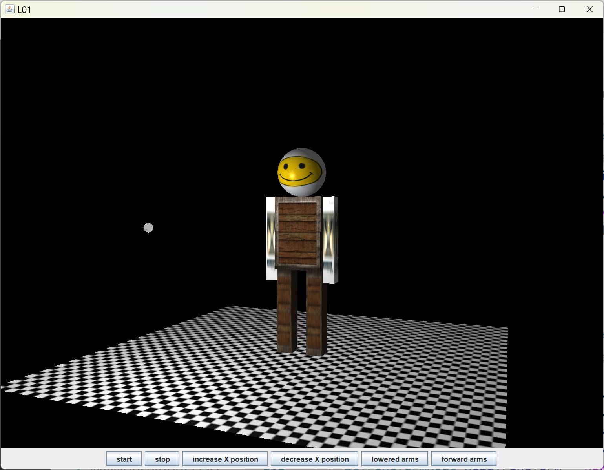
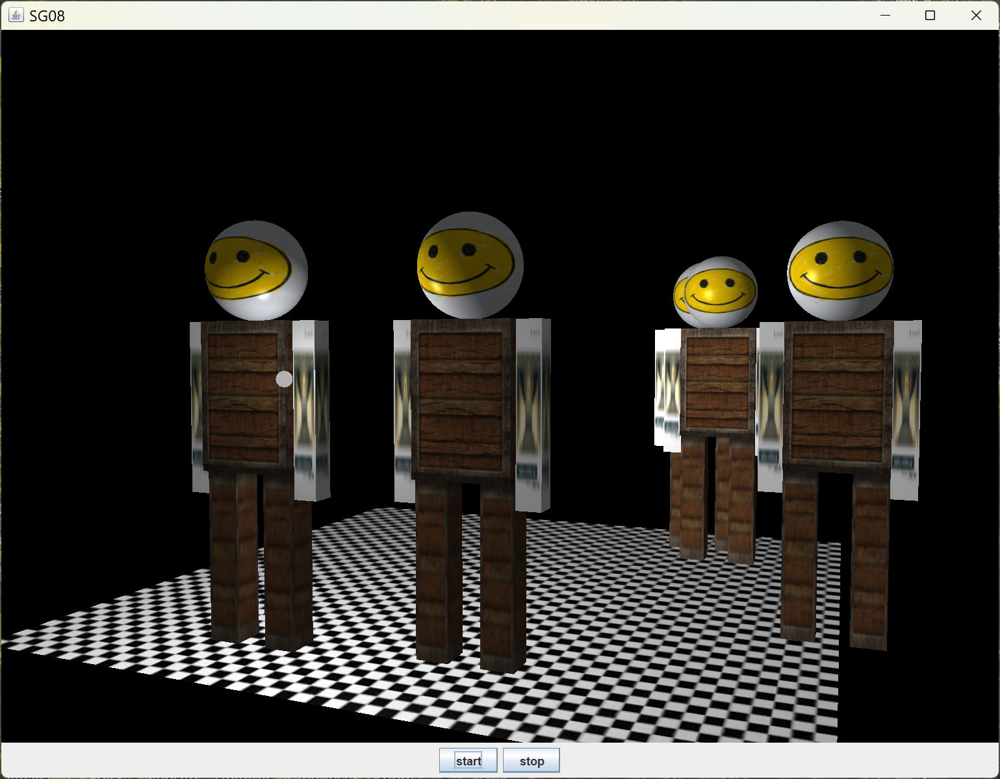

[back](ch8.md) | [main menu](../README.md)
 
## 8.4 Robots

### 8.4.1 A robot

Program: [SG07.java](/ch8_sg/ch8_7_robot)

Figure 8.9 shows the results from this program. Interface controls are also available to manipulate the arms. 

<p align="center">
  <br>
  <strong>Figure 8.9.</strong> A robot.
</p>

As your programs become longer, you should consider the use of separate classes for different objects, e.g. a class for the robot and a class for the room (which in this case is just a floor), and perhaps even a class to handle animation data and control. For this example, a separate class is used for the Robot. This will be useful in the next example we look at.

---

## Exercises

1. Draw a scene graph for the robot in Figure 8.9. Then, compare your scene graph with the one created in the program. 

---

### 8.4.2 Many robots

Program: [SG08.java](/ch8_sg/ch8_8_robot_many)

Figure 8.10 shows the results from this program. Interface controls are available to start and stop the animation. In this example, the robot class has been extended to store its current position. Methods are also available to update teh position and check for collision with the (invisible) walls of the room - in this case, when the edge of the floor is reached, the robot changes direction. 

Multiple instances of the robot class are created and given random movement directions. Program Listing 8.17 gives the code to produce a random movement direction when an instance of the Robot class is created. Program Listing 8.18 is the method in the Robot class that is used to update the position and check for reaching the edge of the floor space. If this happens the movement direction is reflected. 

This extra code was added to the Robot class which already contained methods to update arm angles and x position using other methods. This demonstrates the problems of feature creep by adding to a previous example. This could be organised much better if we had listed the functionality of the robot model in advance of creating it. One option might be to separate out control and update into a separate class, where collisions and collision response could be handled too. I'll leave this to future work.

<p align="center">
  <br>
  <strong>Figure 8.10.</strong> Many animating robots.
</p>

```java
private Vec3 position = new Vec3(0, 0, 0);
private Vec3 updateDelta = new Vec3((float)(Math.random()*0.1), 0, (float)(Math.random()*0.1));
```

**Program Listing 8.17:** Creating a random variable for use in updating the robot's position


```java
public void updatePosition(float min, float max) {
  position = Vec3.add(position, updateDelta);
  if (position.x > max || position.x < min) {
    updateDelta.x = -updateDelta.x;
  }
  if (position.z > max || position.z < min) {
    updateDelta.z = -updateDelta.z;
  }
  robotMoveTranslate.setTransform(Mat4Transform.translate(position));
  robotMoveTranslate.update();
}
```

**Program Listing 8.18:** Updating the robot's position

---

## Exercises

1. Alter the program so that the robots move faster. [Solution](#exercise-solutions)

---

## 8.5 Some comments on animation

Program SG07 uses an update-render process in the main render loop. In a real-time situation, the simulation update step may be decoupled from the render step so they can run at different speeds if necessary in order to maintain a smooth visual appearance while maintaining accurate game logic. However, this is further complicated by physics simulations, since they may require a consistent time step to give more predictable game behaviour. The approach we have used in SG07 could thus be much improved for a real-time game. 

Program SG07 is using an animation process that depends on some simple rules, a rule-based process for behavioural control. This relies on storing the current state of the robot and adjusting this in each update step based on a direction vector. As noted above the only collision detection is with the invisible walls of the room. The robots do not collide with each other. Robot collision with a wall is a simple if test using the centre 2D coordinate of the robot against the floor dimensions rather than using any of its 3D extremities. In practice, a bounding box might be used to test against extremities, or the actual pieces of the robot might be tested. The latter would be time consuming if the robot was intricately modelled - the trade-off between complexity and performance would need to be considered.

An alternative is scripted motion (or procedural motion which is what the light is doing as it rotates around the scene). This might be a scripted animation curve or a set or curves, with one for each changing parameter, or an equation (as is used for the light's animation). In this approach, the robot would follow a scripted path from A to B in a set period of time, as defined by an animator. If all paths are scripted, then the animator is responsible for making sure nothing collides with anything else. Effectively, a storyboarded animation sequence is being produced of the kind that might be done for an animated film (and for which the simulation and rendering steps can take seconds, minutes, hours or longer). This manual (explicit control) approach contrasts with the approach above (an automatic or reactive control approach), where the result is unknown, since collisions can change an object's motion path. The explicit animator control is predictable and is likely to produce plausible rather than accurate simulation of physical laws. Unscripted motion, in contrast, is reactive, attempts to enforce reality (based on whatever laws are encoded) and is potentially unpredictable.

In practice, a mixture of the two might be used. Some scripted motions may be used but these might be overridden with reactions to other events, either in-game or based on user input. Horses for courses, depending on the specific application, e.g. a real-time game or a cartoon film sequence.

---

## MCQs (written in collaboration with Google Gemini)

<p>1. Based on the SG07_GLEventListener code, which of the following is responsible for animating the light's position?</p>

<details>
<summary>a) The updateAnimation() method of the robot class.</summary>
<p><b>Incorrect.</b> The robot.updateAnimation() method is called for the robot, not the light. The light's position is updated by a different method.</p>
</details>

<details>
<summary>b) The getLightPosition() method, which calculates the position based on the elapsed time.</summary>
<p><b>Correct.</b> The code shows that the render() method calls light.setPosition(getLightPosition()), and the getLightPosition() method uses a trigonometric function of elapsedTime to calculate a new position for each frame, creating a circular motion.</p>
</details>

<details>
<summary>c) The light.render() method, which contains the animation logic.</summary>
<p><b>Incorrect.</b> The light.render() method is called to draw the light object, but the position is passed to it from the render() method. The animation logic is separate from the rendering itself.</p>
</details>

<details>
<summary>d) The render() method's if (animation) block.</summary>
<p><b>Incorrect.</b> The if (animation) block controls the robot's animation, not the light's. The light's position is updated every frame regardless of whether the animation flag is true.</p>
</details>

---

<p>2. What is the role of the textures member variable and the TextureLibrary class in the SG07_GLEventListener? </p>

<details>
<summary>a) They are used to load textures from files and store them for later use by the models.</summary>
<p><b>Correct.</b> In the initialise method, a new TextureLibrary is created, and the add() method is called multiple times to load different textures (e.g., "chequerboard.jpg," "smile.png") from the file system and store them with a name.</p>
</details>

<details>
<summary>b) They are used to apply a specific texture to a model when it is being rendered.</summary>
<p><b>Incorrect.</b> The TextureLibrary only stores the textures. Applying them to a model is done by setting the texture maps on the Material object, as seen in the Floor class constructor.</p>
</details>

<details>
<summary>c) They store the material properties for all the objects in the scene.</summary>
<p><b>Incorrect.</b> The Material class stores material properties. The TextureLibrary is specifically for managing textures.</p>
</details>

<details>
<summary>d) They are used to create the light and its associated material.</summary>
<p><b>Incorrect.</b> The Light class is responsible for the light source. The Material class handles its properties. The TextureLibrary is not directly involved in setting up the light.</p>
</details>

---

<p>3. In the Floor class constructor, which shader is used to render the floor, and what does this imply about its material properties?</p>

<details>
<summary>a) The fs_standard_d.txt shader is used, implying that it relies on a diffuse texture map and basic lighting properties, but not a specular or emission map.</summary>
<p><b>Correct.</b> The constructor creates a new Shader with the fragment shader fs_standard_d.txt. It then calls material.setDiffuseMap(diffuse) and sets the specular and emission maps to null, which aligns with the shader's purpose of handling a diffuse texture and basic lighting but nothing more.</p>
</details>

<details>
<summary>b) The fs_standard_d.txt shader is used, implying that the floor will have both a diffuse texture and a specular texture.</summary>
<p><b>Incorrect.</b> The _d in the shader name stands only for diffuse. A shader that handles both diffuse and specular maps would likely be named fs_standard_ds.txt.</p>
</details>

<details>
<summary>c) The vs_standard.txt shader is used, which means the floor will be rendered with no texture maps at all.</summary>
<p><b>Incorrect.</b> vs_standard.txt is the vertex shader, which handles geometry transformations. The fragment shader, fs_standard_d.txt, handles the material properties and texturing.</p>
</details>

<details>
<summary>d) No shader is used because the floor's color is set directly by the material's ambient, diffuse, and specular properties.</summary>
<p><b>Incorrect.</b> All objects in the scene require a shader to be rendered. The material properties and texture maps are passed to the shader, which then performs the lighting calculations to determine the final color of each fragment.</p>
</details>

---

## Exercise solutions

1. Alter the program so that the robots move faster. 

This just involves altering the literal in updateRobot in SG05_GLEventListener:

```java
private boolean updateRobot() {
  double elapsedTime = getSeconds()-robotStartTime;
  if (elapsedTime > 0.1) {
    robotStartTime = getSeconds();
    return true;
  } 
  else {
    return false;
  }
}
```

Of course, there is no point in setting it to be smaller than the render timestep since the render method isn't called any faster that 60fps.

```java
public void render(GL3 gl) {
  gl.glClear(GL.GL_COLOR_BUFFER_BIT | GL.GL_DEPTH_BUFFER_BIT);

  light.setPosition(getLightPosition()); // changing light position each frame
  light.render(gl);

  floor.render(gl);
  if (animation && updateRobot()) {
    for (Robot r : robot) {
      r.updatePosition(Floor.FLOOR_MIN, Floor.FLOOR_MAX);
    }
  }
  for (Robot r : robot) {
    r.render(gl);
  }
}
```

The test in the render method `if (animation && updateRobot()) {` hides a number of things. It is trying to respond both to a user interface button that can stop the animation, whilst also updating the robot position if a certain amount of time has elapsed. The methods to respond to starting and stopping the animation thus have to record how much time has elapsed since the last robot position update:

```java
private boolean animation = false;
   
public void startAnimation() {
  animation = true;
  robotStartTime = getSeconds()-robotPauseTime;
}
  
public void stopAnimation() {
  animation = false;
  robotPauseTime = getSeconds()-robotStartTime;
}
```

Starting and stopping the animation wouldn't be required in most situations, so the above is unnecessarily complicated. For clarity, the render method should also be changed to do all the updates for scene before all the renders.

[back](ch8.md) | [main menu](../README.md)