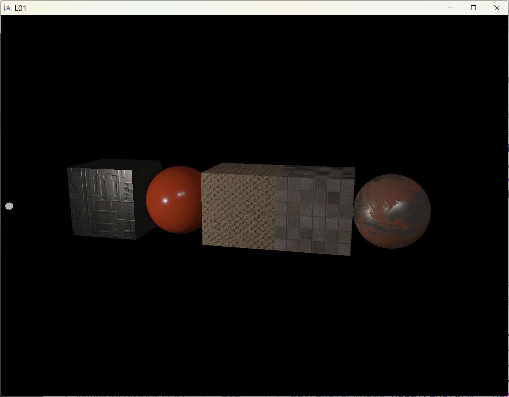
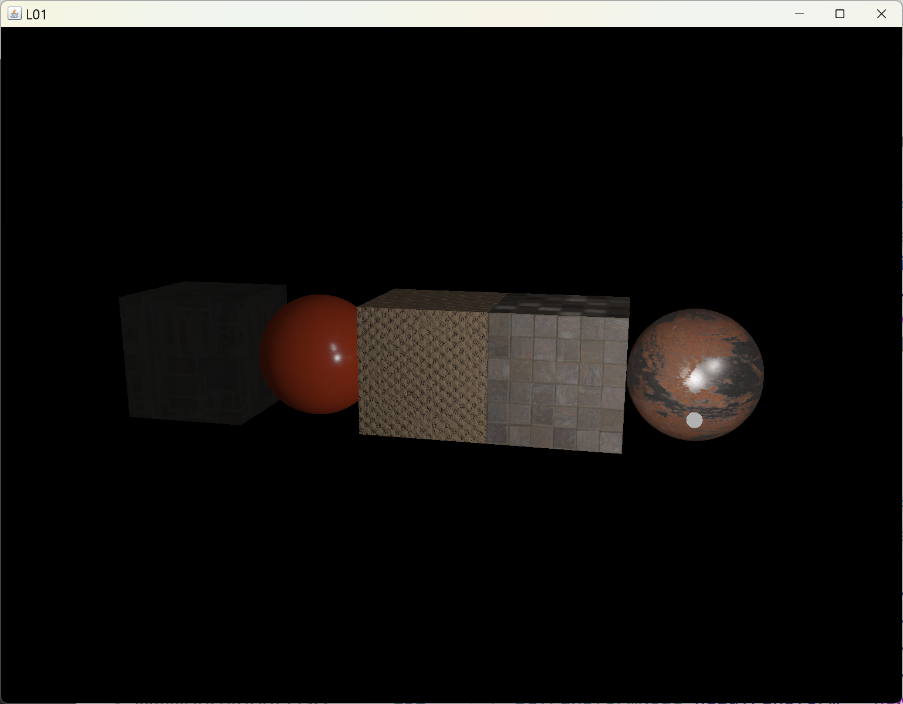

[main menu](../README.md)

# Chapter 9. Extras

This chapter considers a few advanced ideas to extend earlier work. Bespoke additions are made to produce one-off programs.

The Chapter is divided into three main sections:

1. [Multiple lights](ch9_1.md)
2. [Physically-based rendering](ch9_2.md)
3. [Packages](ch9_3.md)

Figure 9.0 shows the output of the 2 programs used in Sections 9.1 to 9.2.

  .. 
  <strong>Figure 9.0.</strong> Output from programs in this chapter.

[main menu](../README.md)
