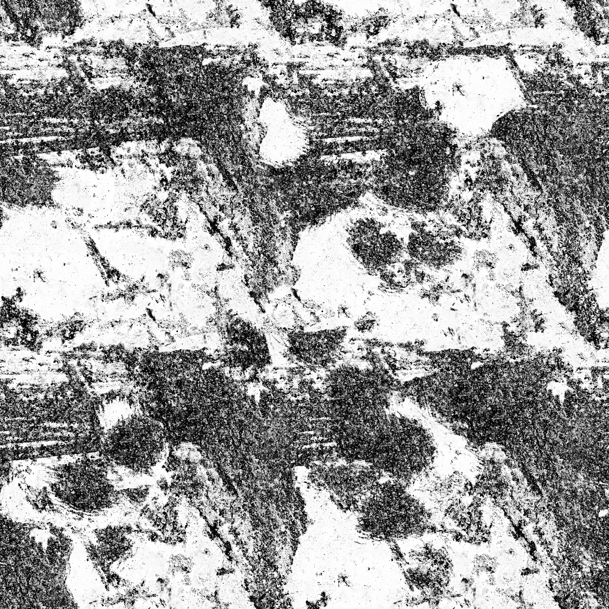

[back](ch9.md) | [main menu](../README.md)
 
## 9.3 Packages

Program: [P01.java](/ch9_extras/ch9_3_packages)

The main folder in the previous programs is becoming clogged up with many classes. In Java, packages can be used to tidy all this up. This involves moving some of the classes into a subfolder called `name` (the named package) and then using the text `package name` as the first line of each of the classes in this subfolder. For example, we can move the classes for the scene graph into a package called `gscenegraph`, the mesh classes into a package called `gmesh` and all the remaining classes that form the core of the model, material, texture and rendering classes into a package called `gcommon`. This produces a folder structure illustrated in Figure 9/x.

```
- main folder
  - assets
  - gcommon
    - Camera.java
    - Light.java
    - Material.java
    - MaterialConstants.java
    - Model.java
    - Renderer.java
    - Shader.java
    - TextureLibrary.java
  - gmaths
    - Vec2.java
    - Vec3.java
    - Vec4.java
    - Mat4.java
    - Mat4Transform.java
  - gmesh
    - Cube.java
    - Mesh.java
    - Sphere.java
    - TwoTriangles.java
  - gscenegraph
    - SGModelNode.java
    - SGNameNode.java
    - SGNode.java
    - SGTransformNode.java
  - P01.java
  - P01_GLEventListener.java
```


<p align="center">
  .<br>
  <strong>Figure 9.2.</strong> Two screenshots of a light rotating around a set of five objects rendered using PBR effects.
</p>

The PBR approach relies on a lot more textures. Figure 9.3 shows the textures used for the rusty sphere example in Figure 9.2

<p align="center">

<kbd>  | <kbd>  | <kbd>  | <kbd>  | <kbd> 
-|-|-|-|-

  <strong>Figure 9.3.</strong> The five textures needed for the PBR effect: (a) albedo; (b) normal; (c) metallic; (d) roughness; (e) ao (ambient occlusion, which in this case is mostly white with a few small marks - click on the image to see this in detail).
</p>

The main changes to the programs developed in previous chapters are:

1. More textures need to be loaded into the TextureLibrary instance;
2. Material needs to be changed to include the five new texture maps (which are declared in a similar way to the previous diffuseMap, specularMap and emissionMap). The constructors also need to be updated and set and get methods need to be supplied.
3. Rather than work with the existing Model.render method, I introduced a new Model.renderPBR method. This allowed me to leave the existing rendering process for non PBR objects untouched.
4. Renderer has a new renderPBR method that makes use of the new textures. One further extra that was required was to introduce a new variable here that sets the light colour to (150,150,150). The existing light values in the range 0..1 are not consistent with the way that PBR works (see Joey's tutorial on this for details). This value is hard-coded into the renderPBR method and a matching variable is required in the relevant shader, here fs_pbr_5t.txt.
5. The shader used needs to be updated. The details for this are taken from Joey's tutorial.

---

## MCQs (written in collaboration with Google Gemini)

<p>1. According to the text, what is a key change required to the Material class to support the new PBR rendering process?</p>

<details>
<summary>a) It needs a new method to set the light color to a hard-coded value of (150,150,150).</summary>
<p><b>Incorrect.</b> The text states that this hard-coded light color is set within the Renderer.renderPBR method, not the Material class.</p>
</details>

<details>
<summary>b) It must be updated to include five new texture maps, such as albedo, normal, metallic, roughness, and ambient occlusion.</summary>
<p><b>Correct.</b> The text explicitly states that the "Material needs to be changed to include the five new texture maps" which are declared in a similar way to the previous maps.</p>
</details>

<details>
<summary>c) It needs to be removed entirely and replaced with a new PBRMaterial class to avoid touching the existing rendering process.</summary>
<p><b>Incorrect.</b> The text describes changes to the existing Material class and the introduction of a new Model.renderPBR method, but not a new PBRMaterial class.</p>
</details>

<details>
<summary>d) It must be updated to store and manage multiple lights in an array.</summary>
<p><b>Incorrect.</b> The previous chapter's example (ML01.java) addressed the handling of multiple lights. This text focuses on changes needed for PBR.</p>
</details>

[back](ch9.md) | [main menu](../README.md)